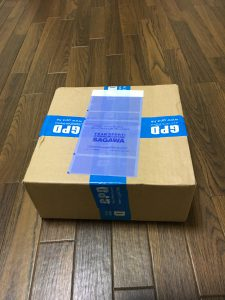
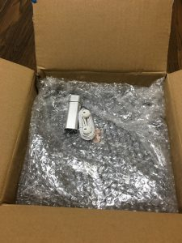
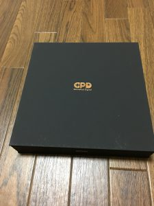
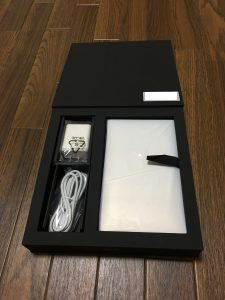
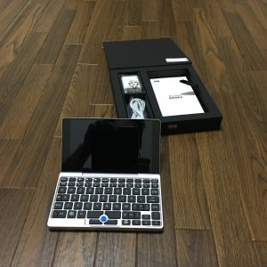
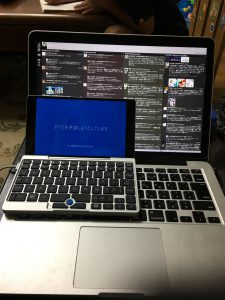

## GPD Pocket　開封写真

　GPD Pocketが届いたお祝いに写真を取ったので上げておきます。

### 佐川からの荷物

 　こんな感じで届きました。

### 佐川の箱を開けたら

 　佐川の箱を開けたら、GPD Pocketの箱の前に梱包材の上にイヤホンとUSBハブが放り込んでありました。ハブは注文したものですがイヤホンはおまけでしょうか？

### GPD Pocketの箱

 　こんなかんじの小奇麗な箱です。中華製なのでもっと酷いのを予想していましたがなかなか良い感じです。

### GPD Pocketの箱の中

 　箱の中はこんな感じです。Macと違って、箱を開けたら黒い紙で覆われていていきなり製品とご対面、ではありませんでした。写真は覆う紙を外したものです。

### GPD Pocket本体

 　本体はこんな感じです。おもったより小さくて軽いのが衝撃的でした。これでフルで動くWindows10機なんですもんね……。

### MacBookProRetina13インチとの比較

 　普段使いのMacBookProRetina13インチ（Early2015）と重ねて大きさを比較しました。 　横が2/3、縦は半分ですね。

## これから使っていくので

　GPD Pocketは使う予定があって買ったものなので、これからバンバン使ってレビューを上げて行きたいと思います。 　しばらくブログ内容がGPD Pocketばかりになると思いますが、よろしくお願いしますね！
