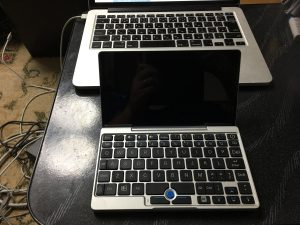
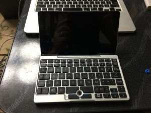
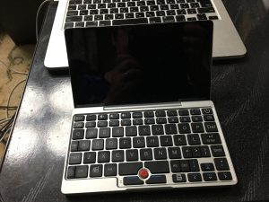

昨日の記事で「GPD Pocket付属の青いトラックポイントは可もなく不可もなく」と書いていましたが、今日注文していましたThinkPad用のロープロファイルトラックポイントが到着したので装着してみました。

 　標準搭載の青いトラックポイント

 　トラックポイントを引っこ抜いた状態。別に力もいらず普通に外れます

 　ThinkPadのロープロファイルトラックポイントを装着した状態

　トラックポイントを変えてみて、明らかに操作性が向上しました。思ったところに思ったようにポイントできます。 　青が「可もなく不可もなく」であれば、赤は「非常に便利。手に馴染む」という感じです。 　なければ困るというたぐいのものではないですが、マウス無しで持ち運んで使う予定ならば入れ替えておいた方が色々捗ると思います。

　個人的にはそこまで違いはないだろう、金の無駄遣いでは、と思っていたのですが、これは買って良かったです。かなり使い勝手が向上するのでGPD Pocketの価値も上がるというものです。お薦めですよ。
