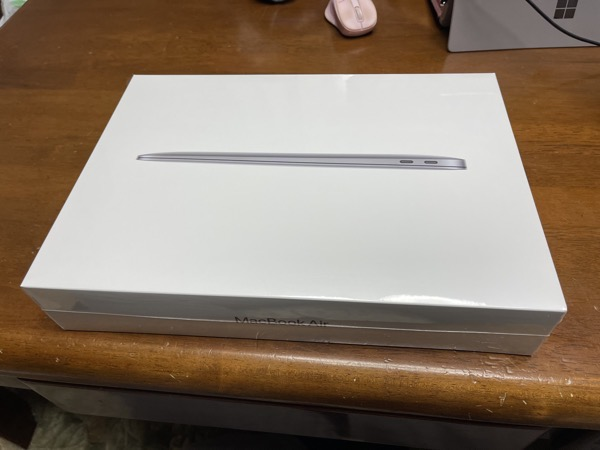
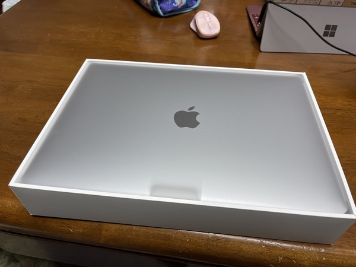
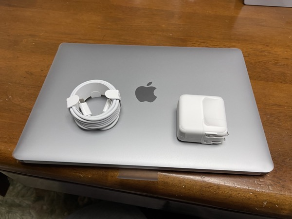
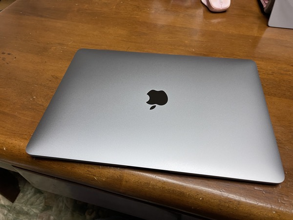
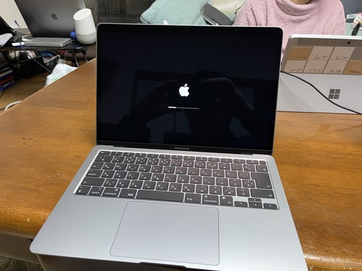
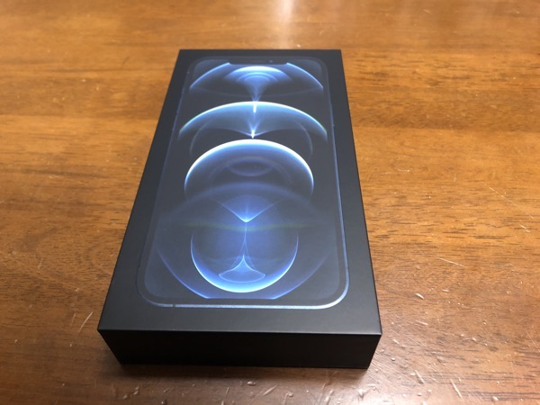
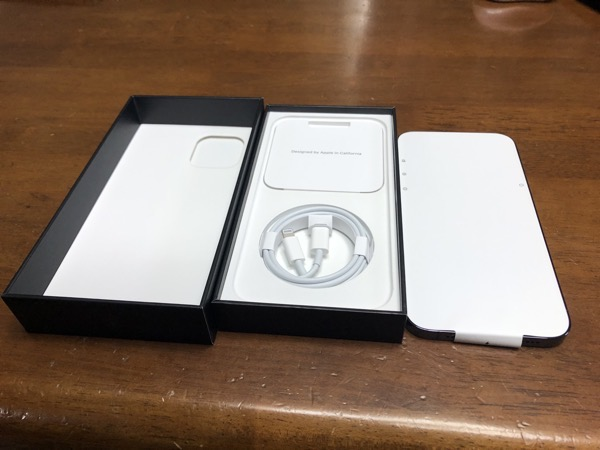
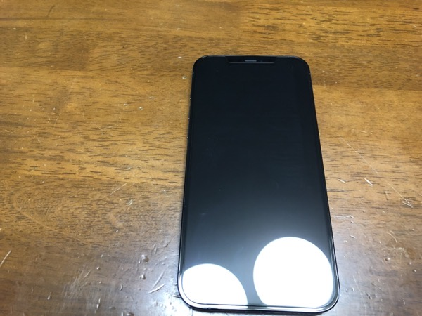

どうもこんにちは、昨日の夜の時点でiPhone12ProMaxが大阪から動いていなかったので今日入手するのは難しいと判断してMacBookAirだけを楽しみにしていたんですが、いざ届いたら1時間差で両方とも届いたのでテンションがブチ上がってしまいどこに着地させるかで若干悩んでいる如月翔也（[@showya\_kiss](http://twitter.com/showya_kiss)）です。  
  
　今日はM1搭載MacBookAirとiPhone12ProMaxを入手したのでアンボクシングとファーストインプレッションをお届けしたいと思います。  

## M1搭載MacBookAirとは

　M1搭載MacBookAirとは、Appleの新たに発表したApple SiliconというCPUの種別である第一弾のCPUのM1チップを搭載したMacBookAirを指します。  
　実質最先端のマシンで、M1チップを搭載する事でとんでもない馬力を発揮する形になっており、ベンチマークでも実稼働でも非常に高い評価を得ています。  
　私は10年ぶりとなったAppleのCPU乗り換えに狂喜乱舞して嫁さんに土下座に近い交渉を持ちかけた結果無事入手できる運びとなり、今日の昼間に到着したのです。  

## M1搭載MacBookAirアンボクシング（写真あり）

　というわけでアンボクシングをお送りします。  
  
  
　ビニールを剥がす前の箱です。箱自体は普通というか、外観含めて何も変わっていないので2020年度のMacBookAirと同じ外見です。  
  
  
　ビニールを開けて箱を開けるとスペースグレイの天面がご挨拶してきます。いつもながらシンプルで美しい対面印象です。  
  
  
　箱の中身はたったこれだけです。説明書とシールの入った紙類がありますがハードウェアはこれだけです。ACアダプタ小さい！  
  
  
　本体はこんな感じです。私が持っているMacBookAir11インチ（2014年モデル）とほぼ変わらない大きさです。サイズとしてはかなりコンパクトです。  
  
  
　起動画面はこんな感じです。懐かしい起動音の「ジャーン」は低く聞こえました。  
　これで私もApple Silicon搭載、M1搭載MacBookAirユーザーです。テンションがぶち上がりますね。  

## M1搭載MacBookAirのファーストインプレッション

　というわけでテンションがぶち上がっているのですがファーストインプレッションをお話したいと思います。  
　第一印象としては、何も変わらないMacBookAirだな、と思いました。しかし起動してからは圧巻でした。ベンチマークを最初に取ったのですが今持っているMacBookPro15インチ（2018年モデル）よりも高いベンチスコアを叩き出しましたし、互換性についても色々なソフトを入れたんですがほぼ問題なかったです。これはBIG SURの問題じゃないかと思うんですがサウンド関係で内部音声をキャプチャするアプリ（SoundFlower・Movavi Screen Recorder）なんかは機能拡張をインストール出来ないので使えなかったんですが、それ以外は互換性の問題で使えないアプリは（私の使っている範囲では）まったくなかったです。  
　速度的には互換モード（いわゆるROSETTA2動作）でも全然問題なかったですし、ネイティブのコードが提供されているものは爆速ですし、ユニバーサルバイナリ提供のアプリも結構多くて満足でした。  
　MacでiPhone・iPadのアプリを使えるというのも面白かったですし（まあまだキラーアプリというアプリは見当たらないですが、LumaFusionとか可能性ありますよね）、全体的に見て面白いと思います。  
　評価としては結構平たく言うと「ものすごい高性能」で「ものすごい互換性」なので、1台目のMacにするにはもうちょっとだけ様子を見た方がいいんですがセカンドパソコンに使うなら最適です。コスパでいうとWindowsでもMacでも20万円〜30万円するスコープの性能なので、これが104800円税抜で買えるのはものすごいインパクトだと思います。  
　正直この性能のパソコンをサブユースで使えるのはラッキーだなと思っていて、私はこのMacBookAir16GB/256GBモデルはサブユース目的のお試しで買ったんですが、必殺技級の控えを持てる結果になったので非常に満足しています。  
　まあ今持っている50万のMacBookProがいらないか、と言われれば仮想環境で使うし愛着もあるし手放したくはないんですが、性能だけで言ったらほぼ同じスペックの13インチを入手できてしまったので嬉しいを通り越して困惑すらしています。  
　とにかく素晴らしい性能のパソコンなので、誰にでもとは言いませんが非常におすすめです。  

## iPhone12ProMaxとは

　そして今日MacBookAirが届いて喜んでいたら1時間後にまた配達がありまして、何かなと思ったらiPhone12ProMaxだったのです。  
　iPhone12ProMaxは2020年のiPhoneラインナップの中で最大最高性能のモデルで、搭載されているチップはA14チップで他のラインナップと差別化はされていないんですが、カメラ性能が秀でている点と、これから搭載される予定のApple Pro RAWに対応するので写真性能と動画撮影性能に特化したモデルで、メモリーにもストレージにも余裕があるのでかなり使い勝手の良い製品なのです。  
　今回ハンズオンするのに使っているのがiPhone12ProMaxの写真はiPhone X、MacBookAirの写真はiPhone12ProMaxを使っています。  

## iPhone12ProMaxアンボクシング（写真あり）

　というわけでiPhone12ProMaxもアンボクシングしていきます。  
  
  
　外箱はこんな感じです。充電器が同梱されなくなったためか箱が小さくなったので（厚さが薄くなった）非常にコンパクトに見えます。  
  
　箱を開けて中身を出しました。充電ケーブルだけ入って充電器が入っていないのと、あとiPhone本体には紙が被せられているのがわかると思います。  
　本体のしまい方が変わったせいか上箱にカメラのくり抜きがあったりします。  
  
  
　本体はこんな感じです。表面がガラスなので電気が写り込んでいるのと、あと僕の顔も写り込んでいると思うので失礼しました。  
　iPhone史上最強に大きいので、画面サイズが威圧感すらあるんですが、画面の端っこまで映像が映るので非常に満足度が高いです。  

## iPhone12ProMaxのファーストインプレッション

　というわけでiPhone12ProMaxも勢い余ってアンボクシングしたんですが、ファーストインプレッションいうと「大きい！」というのが一番です。  
　本体サイズも大きいですし、画面サイズも大きいですし、あとバッテリーが大きいです。  
　性能もすごくヌルサクなんですが、正直普段遣いのアプリを使っている範囲ではiPhone Xでも十分速いので、「速いな！」という実感よりも、画面が大きい、表示が大きい、という方に意識が行きます。  
　画面が大きいと老眼の私には見やすく、操作もしやすく、非常に使いやすいので多少の無理をしてでもiPhone12ProMaxにして良かったと思います。  
　あと地味にバッテリーが非常に大きくて、私普段iPhone Xでけものフレンズ3とアズールレーンのデイリーを処理するんですが、iPhone Xだと両方処理して40パーセントくらいバッテリーが減ってたんですが、今iPhone12ProMaxで処理すると8パーセントくらいで済んでいるのでものすごいバッテリー持ちだと思います。  
　製品の評価としてはiPhone11を持っている人には必要ないでしょうが、XSとかXの人が乗り換えると驚くほど性能が上がっているので満足度が高いと思うので、2年目以降の買い替えに非常におすすめだと思います。  
　私は多少無理してでもiPhone12ProMaxの512GBモデルを用意しましたが、現時点で満足しかありません。  

## まとめ

　という訳で、M1搭載MacBookAirとiPhone12ProMaxのアンボックスとファーストレビューでした。  
　これからガンガン使っていくので、気づいた事はどんどん共有しようと思います。
