どうもこんにちは、如月翔也（[@showya\_kiss](http://twitter.com/showya_kiss)）です。  
　今日はParallels Desktop16.5を使ってM1搭載MacにARM版Windowsをインストールする方法について共有しようと思います。  
　Parallels Desktopはトライアル版を使っていますが、使っているとすぐにライセンス認証を求められるので購入しましょう。  

## まず最初にARM版WindowsのVHDXを入手しましょう

　まず最初にインストールされるOSであるところのARM版WindowsのVHDXを入手しましょう。  
　マイクロソフトアカウントにログインして、テクニカルプレビューへの参加を済ませた状態で[https://www.microsoft.com/en-us/software-download/windowsinsiderpreviewARM64?wa=wsignin1.0](https://www.microsoft.com/en-us/software-download/windowsinsiderpreviewARM64?wa=wsignin1.0)にアクセスすると下の画面が表示されます。  
[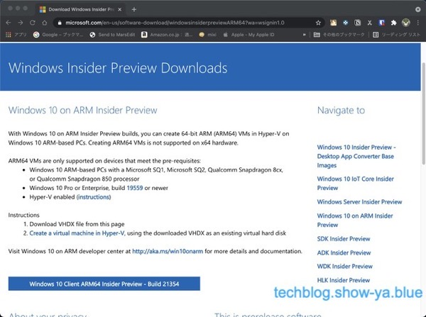](https://techblog.show-ya.blue/wp-content/uploads/0000-1.jpg)  

　画面下の「Windows 10 Client ARM64 Insider Preview」と書かれたリンクをクリックするとVHDXがダウンロードされます。  

## 次にParallels Desktopを入手しインストールしましょう

　次にParallels Desktop16.5を入手しインストールしましょう。  
　[https://www.parallels.com/jp/](https://www.parallels.com/jp/)にアクセスすると以下の画面になります。  
[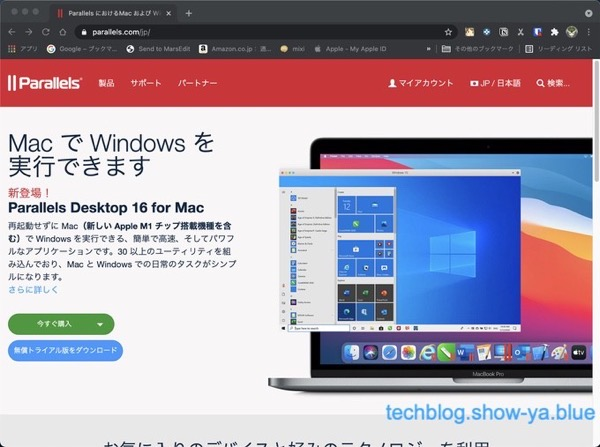](https://techblog.show-ya.blue/wp-content/uploads/0001.jpg)  
　画面やや下、水色の背景の「無償トライアル版をダウンロード」をクリックするとトライアルのダウンロード画面が表示されます。  
[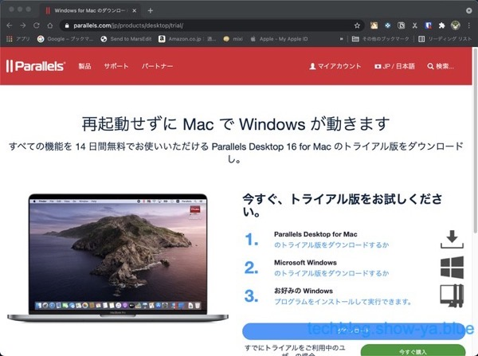](https://techblog.show-ya.blue/wp-content/uploads/0002.jpg)  
　画面下の水色の背景、「ダウンロード」を選ぶとParallels Desktopのトライアル版がダウンロードされます。 [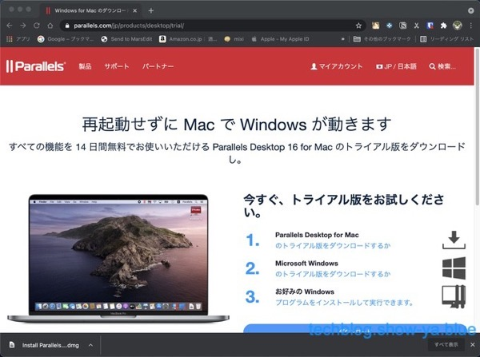](https://techblog.show-ya.blue/wp-content/uploads/0003.jpg)  
　画面一番下、黒い背景に「Install Parallels.dmg」とファイル名が出るのでダブルクリックして起動します。  
  
　そうするとインストール画面が表示されます。「インストール.app」というのが表示されるのでアイコンをダブルクリックします。  
[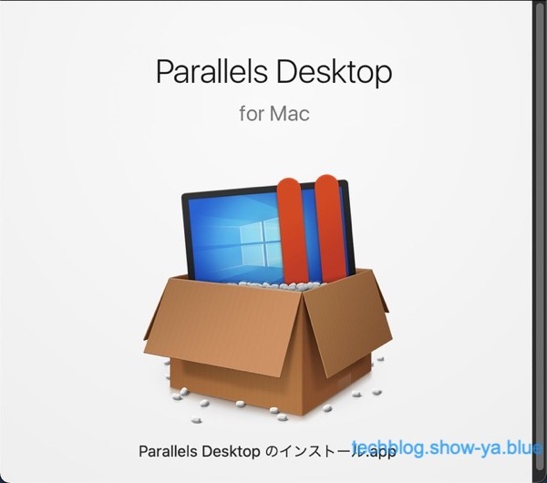](https://techblog.show-ya.blue/wp-content/uploads/0004.jpg)  
　Parallels Desktopのトライアル版はインターネットからダウンロードしたものなので警告が出ます。「開く」をクリックします。  
[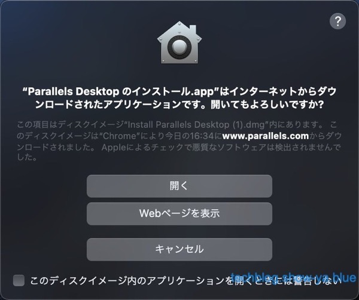](https://techblog.show-ya.blue/wp-content/uploads/0005.jpg)  
　Parallels Desktopは「ダウンロードフォルダ」からISOを探そうとするので警告が出ます。「OK」をクリックします。  
[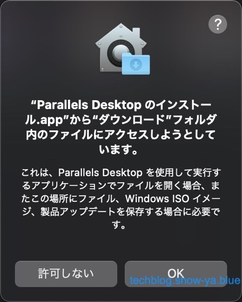](https://techblog.show-ya.blue/wp-content/uploads/0006.jpg)  
　無事Parallels Desktopのインストールが終わって、今度はParallels Desktopを使ってARM版Windowsをインストールする手番になります。  

## ARM版Windows10のインストールについて

　「M1チップ搭載のMacについて」という画面が表示されるので「続行」をクリックします。  
[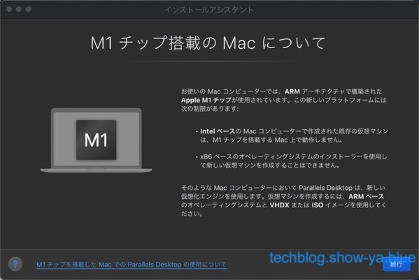](https://techblog.show-ya.blue/wp-content/uploads/0007.jpg)  
　新規作成画面になります。ここからLinuxなんかをインストールできるんですが今回はARM版Windows10を入れる話なので無視して「続行」をクリックします。  
[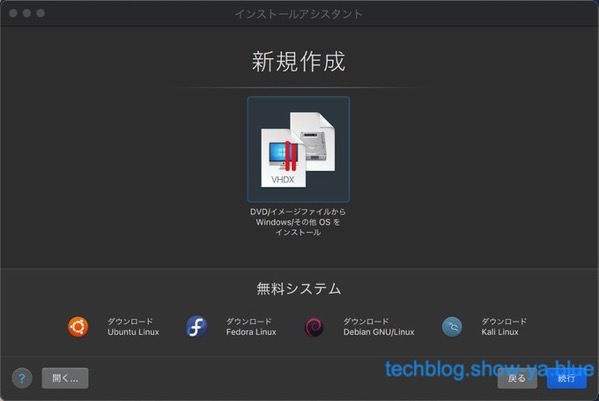](https://techblog.show-ya.blue/wp-content/uploads/0008.jpg)  
　新規作成画面が進んでVHDXを選ぶ画面が表示されます。ダウンロードフォルダに最初にダウンロードしたVHDXがあればすでに「Windows 10」という項目にファイルが表示されていますのでそのまま「続行」を押します。ダウンロードフォルダ以外にある場合「手動で選択する」でファイルを選んであげればオーケーです。  
[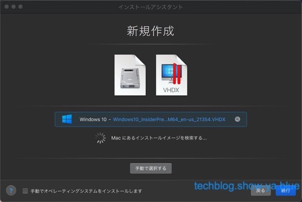](https://techblog.show-ya.blue/wp-content/uploads/0009.jpg)  
　Windowsの主な用途について聞かれます。「業務用ツール」だと軽めの、「ゲームのみ」だと重めの構成がされるのでお好みで選んでください。  
　現実的にはゲームには使えないので業務用ツールでいいんですが、割り当て性能低いと困る場合は「ゲームのみ」にすると良いでしょう。  
[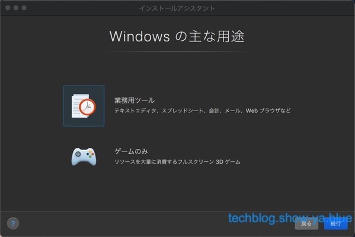](https://techblog.show-ya.blue/wp-content/uploads/0010.jpg)  
　「名前と場所」という項目になります。そのまま「続行」で構いませんが、ファイルの名称を変えたい・ファイルの置き場を変えたい場合ここから編集できます。  
[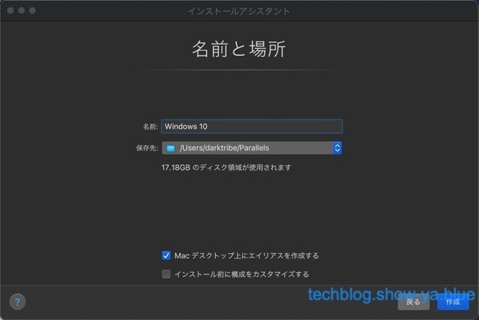](https://techblog.show-ya.blue/wp-content/uploads/0011.jpg)  
　インストールが始まります。しばらく待ちます。  
[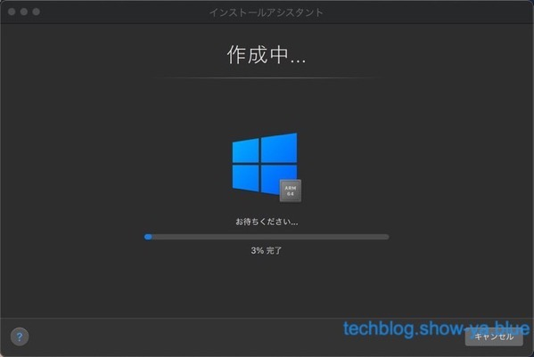](https://techblog.show-ya.blue/wp-content/uploads/0012.jpg)  
　Windowsのインストールが進んでいきます。しばらく待ちます。  
[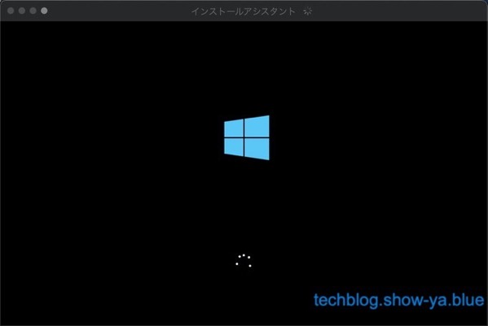](https://techblog.show-ya.blue/wp-content/uploads/0013.jpg)  
　インストールが完了しました、の画面が出ます。これでもうARM版Windowsが動いている状態です。  
[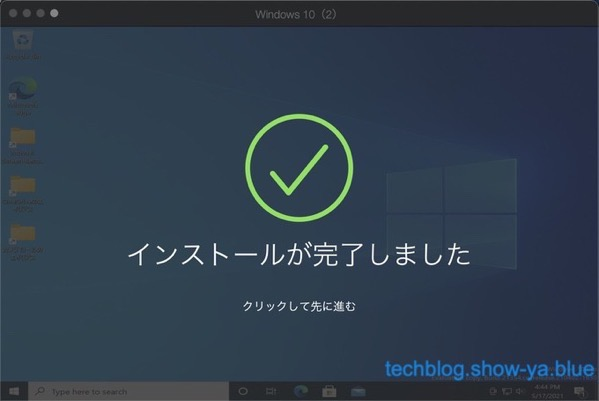](https://techblog.show-ya.blue/wp-content/uploads/0014.jpg)

## インストールが完了しました

　という訳でParallels Desktopを使ってARM版Windows10のインストールが完了しました。  
　注意して欲しいんですが、このParallels Desktopは正式版ですが、インストールされているARM版Windowsはプレビュー版で、正式版は販売されていないので、あくまでも「評価目的」でインストールしている、という部分です。  
　ARM版Windows10の正式版が出たら買わなければなりませんし（やめてもいいですけどね）、プレビュー版を中止する・撤退するという話になったときにはもう使えなくなるものなので、その点だけ注意して使ってください。  

## ARM版Windows10でできる事

　ARM版Windows10でできる事は、ほとんどのWindowsでできる事ができます。  
　x86互換の32ビット・64ビットのソフトが動きますし、ARM版のプログラムも動くので互換性としてはかなり高く仕上がっておりこのまま販売しても文句は出ないんじゃないかというくらいによくできているのですが、しかしインテルCPU版ではないので厳密な互換性が100パーセントかというとそうでもなく、動かないアプリはそれなりにありますし、キーボードのキーを認識しなかったりGoogle日本語入力が有効にならなかったりするので完全に依存できる環境かというとそうでもないんですが、まあ勉強するには向いているOSだと思います。  
　個人的に試してみた範囲ではAVIUTILを使おうとしたら動かなくて調べてみたらフォルダとファイルが文字化けしていたのでロケールから日本語ロケールを選択してあげたら文字化けが解消して問題なく動くようになったりしていて、要するにこれ英語版OSなので日本語対応がまだまだなのと（設定してあげれば問題なく使えますけどね）IMEあたりが置いていかれているのでそのあたりは自分で処理できないとキツいですね。  
　IMEもGoogle日本語入力が使えないのでMicrosoftIMEを使おうとすると半角/全角キーがないので自分で設定を変えなければならないですし、そしてMacのキーボードの「英数」と「かな」は設定できるんですが認識しないので日本語変換を「英数」と「かな」キーに設定すると変換ができなくて困るので、Control+Spaceあたりをバインドしてあげると良いと思います。  

## ARM版Windows10のインストールをするのがお薦めな人

　とりあえず今M1搭載Macをすでに持っている人で、その上でどうしてもWindows10の環境がないとだめだ、という人にはお薦めです。  
　M1搭載Mac以外にインテルMacを持っている人であればそっちでParallels DesktopとWindows10のライセンスを買って正式に仮想化して使う方が楽ですし安全なのでそちらがお薦めなんですが、M1搭載Macしかない、でもWindows10の環境が必要、という人にはこれしか選択肢がないのでこれを使って頑張るしかないと思います。  

## まとめ

　という訳でM1搭載Macを使ってParallels DesktopでARM版Windows10をインストールする手順についてでした。  
　基本的にインストールは難しくないので怯えないでいいですし、思ったより色々できるのでお薦めですよ。
