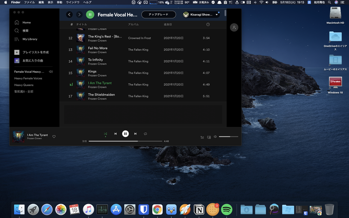
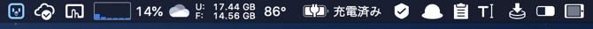

どうもこんにちは、如月翔也（[@showya\_kiss](http://twitter.com/showya_kiss)）です。  
　今日は私の使っているインテルMacBookProのMenu Barに何のアプリが登録されているかをご紹介します。M1搭載MacBookAirも全く同じものを常駐させていますのでご参考になれば幸いです。  

## 私のデスクトップ

　お恥ずかしながら、私が普段使っているデスクトップはこんな感じです。モザイク無しで御覧ください。  

　いろいろなものが表示されていて画面の情報量が多いんですが、バレて困る情報は載っていないと思いますので見ていただけたら幸いです。  
　今回Menu Barに登録されているアプリという事なので拡大してこの部分が大事です。  

　左から順に、「Tweetbot 3 for Twitter」「OneDrive」「Better Touch Tool」「iStat Menus」「カスペルスキーインターネットセキュリティ」「Alfred」「Clipy」「Paste Plain Text」「Yoink」「PopClip」の順でアプリが並んでいます。  
　各アプリについてざっと説明しますね。  

## Tweetbot 3 for Twitter

　Tweetbot 3 for TwittweはTwitter用の専用のクライアントソフトです。有料で買い切り1220円です。  
　常駐してTweetを見張ってくれる他、クライアントとして複数カラムで複数のTLをかっちり未読管理しながら読む事ができ、タイムラインのツイートを全部読みたいニーズの人には超お薦めなアプリです。  
　このアプリのためにMacを選んでも損はないくらいに使い勝手の良いアプリで、一度これを使うと他のアプリには行けないくらいの良アプリです。  

## OneDrive

　OneDriveはマイクロソフトのクラウドドライブです。  
　私はOffice目的でMicrosoft365を契約しているので、契約のおまけにOneDriveが1TBついてくるので大事に使わせて貰っています。  
　クラウドドライブとしては容量が1TBで少なめなんですが他の点では他社のクラウドドライブには負けておらず、結構使い勝手は良いです。  
　なによりOffice契約のおまけに付いてくるので実質無料みたいな部分があってお得感があるので私はこれを使っています。  

## Better Touch Tool

　Better Touch Toolは入力デバイスのカスタマイズに使うアプリです。生涯ライセンスが20.5ドルで売っています。  
　入力デバイス、特にトラックパッドをカスタマイズすると非常に便利になるのでお薦めです。  
　Better Touch Toolを導入するとジェスチャ動作が可能になりマウスなりトラックパッドなりの使い勝手が何倍も良くなるのに加え、自分でよく使う機能をバインドできるのでMacを自分向けにカスタマイズできるというのは非常に魅力的で、私は最近Better Touch Toolでトラックパッドを色々いじっています。  
　便利な上に楽しいので素晴らしいアプリです。  

## iStat Menus

　メモリゲージから「充電済み」というところまではiStat Menusというアプリのアイコンです。買い切り13.19ドルです。  
　コンピューターの周辺情報を表示してくれるアプリで、私の場合CPUの使用状況・パーセンテージ、メモリの状況、CPU温度、バッテリーの状態を表示しています。  
　全部の数字を管理しておく必要はないんですが、CPUの温度やメモリのプレッシャーはパソコンの動作に関わる部分なので知っておくと便利で、あまりにも負荷が高ければやり方を変えるような方法もあるのでポイントだけ押さえておくと良いのではないかと思います。  

## カスペルスキーインターネットセキュリティ

　ウィルス対策ソフトとしてカスペルスキーインターネットセキュリティを使っています。  
　使っている理由は消極的なもので、家に10台以上のパソコンがあるので1台1台ウィルス対策ソフトを買っている余裕がなく、「使い放題」プランのあるウィルス対策ソフトを探した時にカスペルスキーとMcAfeeしかなかったのです。この2択で考えるとカスペルスキーの方が評判が良かったのでカスペルスキーにしました。  
　まあ今までウィルスを踏んだ事はないので効果がどれだけあるのかわからないですが、ウィルス対策ソフトがあるからと慢心しないようにしようと思います。  

## Alfred

　Alfredはランチャアプリです。無料アプリとしても使えますがPowerPackが29ユーロでアンロックできます。  
　ランチャとしてキーボードで使うだけでなく検索したりPowerPackのWorkFlowで色々なアプリを操作したりスニペットを使ったりクリップボード履歴をいじったりと様々な事ができるので物凄くお薦めです。  
　サラッと書いていますが多分Macのアプリの中で1〜2を争うくらいに使いでのある素晴らしいアプリなので試してみる事をお薦めします。  

## Clipy

　Clipyはクリップボードの拡張アプリです。  
　過去のクリップボード履歴を残していて後で再利用できるアプリで、まあAlfredでもいいんですが気軽に使えるのでClipyを入れています。Alfredの場合有料プランでしかクリップボード履歴は使えないのでAlfredを未課金の人はClipyがお薦めです。  

## Paste Plain Text

　Paste Plain Textはクリップボード履歴の改変アプリで、文字列をコピーした時に装飾情報を取り除いてプレーンなテキストでクリップボードに格納してくれるアプリです。  
　Webから文字列を拾ったりWord文章から文字列をひろうとリッチテキストで保存されてしまい貼り付ける時に面倒なパターンがあるんですが、このアプリを有効にしておけば常にプレーンテキストで保存してくれるので非常に便利です。  

## Yoink

　Yoinkはシェルフアプリで、ファイルや文字列・画像をドラッグした時に仮置き場を表示してくれるアプリです。この仮置き場はアプリを最大化した画面でも最前面に表示されるので、画像を引っ張っておいてエディタを最大化し仮置き場から画像をドラッグ、という使い方ができるので非常に便利です。  
　また複数ファイルを入れておけるので「なんのファイルを」と選んで仮置き場においてから「どうする」というのを選べるので非常に便利に使えます。  
　このYoinkはMac使いの中ではかなり有名なアプリで、誰でも便利に使えるのでお薦めです。App Storeで980円です。  

## PopClip

　PopClipはマウスカーソルの拡張アプリで、文字列を選択した時にPopClipで設定したメニューが自動で展開されるアプリです。App Storeで1600円です。  
　文字列選択からワンクリックで検索できたり他のアプリに文字列を渡したりできるので非常に便利でメニューもカスタマイズできるので使うアプリをどんどん入れて文字列選択からワンクリックで色々できるので非常に便利です。  
　このPopClipもMac使いの中ではかなり有名なアプリで、YoinkやAlfredとも連携するのでとてもお薦めなアプリです。  

## まとめ

　という訳で、私のMenu Barに登録されているアプリをご紹介いたしました。  
　使い勝手の良いアプリを適当に使っている感じなんですが、おすすめ度の高いアプリが揃っているので参考にして頂ければ幸いです。
