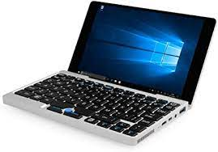

どうもこんにちは、如月翔也（[@showya\_kiss](http://twitter.com/showya_kiss)）です。  
　今日は私が持っているガジェット・デバイスの棚卸しをしていこうと思います。  

## インテルMacBookPro15インチ（2018年モデル）

　まずメインのマシンはインテルMacであるMacBookPro15インチ（2018年モデル）です。  
  
　2019年前半当時物凄く良いパソコンが欲しかったので、その時点で出ていたMacBookPro15インチ（2018年モデル）のCTOモデルをリファービッシュで探していて、ストレージ以外特盛でCPUが本来クアッドコアのCore i7であるところをヘキサコアのCore i9に変更、メモリが16GBのところを32GBに変更、ストレージが512GBにところを1TBに変更、グラフィックボードもRadeon Pro Vega20を積んだものを見つけて、Apple Careを込みで50万円くらいで購入したものです。もちろん一括では払えなかったのでローンを組んで、先月まで払っていました。  
　インテルモデルのMacとしては相当に極まったモデルなので性能も非常に良く、爆熱を発するんですが単体性能が非常に高いので個人的には満足していて、私の使い方でいうとテキストメイン、音楽や動画も視聴しなくはないんですがそれよりも仮想化環境で色々いじるほうが多い、みたいな使い方でも全く問題なく動きますし機械的な故障以外で遅くなった事がないので（何度か遅くなった経験はあるんですが全部機械的な故障でした）パソコンとしては非常にできが良いと思います。  
　難を言えば購入してからまだ3年なんですが4回以上故障していて引取修理を何度も受けているので機械的に弱いのかな、と思っていて、今はまだApple Careが効いているのでいいんですがApple Careの期間が過ぎた後に壊れると怖いな、と思っています。  

## M1搭載MacBookAir（2020年モデル）

　次にサブのマシンはApple SiliconであるM1チップ搭載のMacBookAir（2020年モデル）です。  
  
　2020年11月、Appleの発表会でついにApple Silicon搭載のMacBookAirが発表されまして、それまでApple Siliconの話題を聞いてワクワクしていた私はiPhone12ProMaxと同じタイミングだったので予算が完全に枯渇していながらも嫁さんに土下座交渉を持ちかけて購入する事にしたのです。  
　予算がなかったので吊るしのモデルを検討したんですが、どうしてもメモリだけは積んでおかないと嫌だったのでストレージは256GBのままで（GPU7コアモデル）メモリを16GBに積み増して購入したのです。135000円でした。  
　M1チップについては当初色々懸念されていましたが蓋を開けたらほぼ完璧なものが出来上がっていて、私が購入したモデルはメインパソコンであるMacBookPro15インチ（2018年モデル）を凌ぐベンチマークスコアを叩き出すマシンで、実際に浸かってみても体感で差がないので素晴らしいコストパフォーマンスなのです。値段4倍のパソコンに引けを取らないって素晴らしいコスパですよね。  
　今はメインパソコンに対してサブという位置づけで使っていますがこっちをメインにしてもいいくらいで、仮想化環境でAndroidができないのでメインはMacBookPro15インチ（2018年モデル）に譲っていますが仮想化環境周りが整備されたらダブルメインで使ってもいいと思っています。  
　M1でこれだけの性能なので、M1XまたはM2チップはどれだけの性能を出すんでしょうね。  

## インテルMacBookAir11インチ（2014年モデル）

　サブのサブと言うか、今余しているパソコンとしてMacBookAir11インチ（2014年モデル）があります。  
  
　2019年の10月に買ったもので、もともとサブのM1搭載MacBookAirを購入する前はメインパソコンに対するサブパソコンの立ち位置で使っていたんですが、スペックが弱くブログを書いたりマイクラをしたりする程度にしか使えなかったので（まあそれが目的で中古で買ったので良いんですが）M1搭載MacBookAirが家に来たら余った子になってしまいました。  
　しかし未だにBIG SURアップデート対象機ですし、画面もRetinaではないもののそれなりに綺麗で、テキストやブログだけなら全然普通にこなせるので捨てるのも惜しく、今ジャンク入れの近くで静かにしています。  
　WindowsをいれたりLinuxを入れたりして遊ぼうか、という気もするんですが、WindowsもLinuxも飽きているのは否めないのでどうしようかと思っている状態です。  

## GPD Pocket

　これもサブのサブと言うか、今やっぱり余っているパソコンとしてGPD Pocketがあります。  
  
　2017年にクラウドファンディングで発売されたUMPCで、当時は結構色々遊んだんですが、4年も立つとWindows10の動きももっさりしてきて、UMPCなので持ち運びに便利なんですが別にMacBookAirを持ち歩けばいいんじゃないか、みたいな部分があり、気づけば余っていた感じです。  
　今Windowsが怪しいのでLinux（Ubuntu20.04LTS）を入れて遊んでいるんですがLinuxも飽きてきた感じなのでジャンク入れの近くに転がっている感じになります。  
　サイズと言い性能といい面白い線はついているのでなにか他にできないか考えたいところではあります。  

## iPhone12ProMax

　スマホとしてはメインスマホにiPhone12ProMaxを用意しています。  
  
　2020年11月に18万円出して購入したスマホで、iPhoneとしては最大最優秀性能のスマホなんですが、私は容量も妥協せずに512GBを選びました。  
　メインスマホでは「なんでもやる」ので性能が一番大事で、カメラも妥協しないですしA14チップの超高性能でサクサクのヌルヌルで動くので不満はないですし、毎日使っていて買って良かったなといつも思うので非常に満足しています。  
　カメラ性能と動画性能が良いのでこれを使って何かできないかな、と思っているんですが、撮影場所になる家が汚いのでしばらくは何にも使えないな、と思います。  

## Redmi note 9s

　サブのスマホにはシャオミのRedmi note 9sを用意しています。  
  
　2021年2月に購入したばかりのスマホなんですが、楽天回線を契約する時にサブスマホが必要になったのでその時OCNモバイルONEで1円スマホをやっていたのでそれで購入したものです。  
　基本的には全てメインスマホでするんですけど、メインスマホでけものフレンズ3をやっている最中にアズールレーンを周回するのに使ったり、ニュースを見るのに使ったりしています。  
　値段が安い割にはちゃんとしたミッドレンジのスマホなのでもっと活用できる部分があるな、と思うので使い方を考えて行きたいと思います。  

## iPad Pro10.5インチ

　タブレットにはiPad Pro10.5インチを使っています、  
  
　2017年10月に購入したものですが、4年使ってバッテリーも交換して大事に使っているタブレットで、電子書籍を読んだり動画を見たりするのに使っています。  
　512GBのを買ったのでクリエイティブな用途に使うべきなんですが、絵心がなく写真にも興味がないので活かしきれていないのでなんとか使っていきたい所です。  

## まとめ

　というわけで、私が持っているガジェット・デバイスについてでした。  
　これからも入れ替えたり増えたりして変わっていくと思うんですが、1個1個大事にしていこうと思います。
