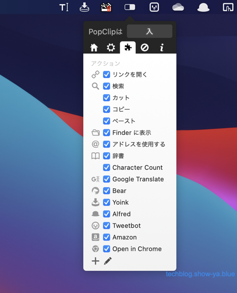
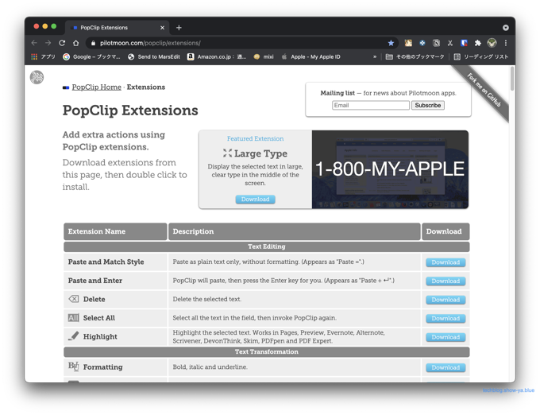

どうもこんにちは、如月翔也（[@showya\_kiss](http://twitter.com/showya_kiss)）です。  
　今日は便利な有料アプリ、PopClipについて使い方を説明していきたいと思います。  

## PopClipとは

　PopClipとはPilotmoon Softwareの制作・販売するMac用のシェアウェアで、マウスカーソルの機能拡張として動くアプリです。  
　インストールした状態で文字列を選択するとマウスカーソルの上にPopClip用のメニューが展開し、ワンクリックでPopClipで設定した動作を行う事ができます。  
　指定した文字列をGoogleで検索するのも、本来文字列選択→右クリック→「Googleで検索」という手順で検索しなかったものが文字列選択→「検索マークをクリック」で検索できるので手間が省け、Google検索だとそんなに手間が省けないイメージですがDeepl翻訳なんかだと「文字列選択」→コピー→Deepl表示→Deeplのメニューに貼り付け→検索ボタン、という手間が文字列選択→Deepl翻訳のワンクリックで片付くので、特定の動作をよくする人には物凄く使い勝手の良いアプリです。  
　PopClipのメニューもカスタマイズ可能で色々な動作を割り当てられますしとにかく動作が軽快で使いやすいのでMacを使う人全てにお薦めできる良アプリなのです。  

## App Storeから1600円で購入できます

　PopClipはApp Storeで販売しており、1600円で購入する事ができます。  
　たかがユーティリティに1600円と思うかもしれませんがこれから1回検索するたびに5秒の予定が2秒に短縮され、それが一生分です。  
　検索1回に付き1円と考えても1年も使えば1600円のもとは取れると思いますのでできるだけ早く購入して一瞬でも長く使う事がポイントだと思います。  

## PopClipの使い方

　PopClipをインストールした状態で文字列を選択すると、以下のようなメニューが表示されます。  
（すでにPopClipをカスタマイズしているのでインストールしたばかりのメニューとは違います）  
 　例の場合、今選択されている虫眼鏡アイコンがGoogle検索、文字列をコピー、文字数のカウント、Google翻訳、Bearに貼り付け、Yoinkに引用、Alfredに文字列を入力、Tweetbot for Twitter3に文字を入力、Amazon.co.jpで検索というのが登録されています。  
　これらについては文字列選択からメニュー選択の2ステップだけで該当アプリが起動して文字列がコピー、あるいは検索された状態で画面が出てくるので非常に手間が省けて便利です。  
　私は文字列選択の後間違ってメニューを消してしまう事があるので、AlfredのPowerPackのWorkFlowを使って「Optionキー2回押し」でPopClipのメニューが表示されるようにカスタマイズしており、Optionキー2回押しで設定しておくとキーボードで矢印キーを使って文字列選択、OptionキーでPopClipを呼び出してエンターキーで選択という風にできるので非常に便利なのでお薦めです。  

## PopClipのメニューのカスタマイズ

　PopClipのメニューをカスタマイズするには一番簡単な方法はメニューバーに表示されているPopClipのアイコンをクリックするとPopClipのグランドメニューが開くので設定マークをクリックしるとメニューのカスタマイズ画面が表示されます。  
  
　画面左下の＋ボタンをクリックするとメニューを追加でき（削除は鉛筆ボタンを押してからチェックボックスがXになるのでそれを押す）、追加するにはPopClipのExtentionsのページからExtentionsをダウンロードしてクリックすればオーケーです。  
  
　使いたい拡張機能を探して右にある「Download」をクリックし、ダウンロードされるExtentionsをクリックすればPopClipのメニューに機能が追加されます。  

## 基本的な使い方は

　PopClipは基本的にメニューに拡張機能を追加して、その拡張機能を文字列選択した時に呼び出すだけの簡単な機能なんですが、機能が単純という事はそれだけ応用の余地があり、様々な拡張機能が登録されています。  
　何でもすべてメニューに登録するとメニューが複雑化して使いづらくなってしまうので、本当に使うものだけを設定して使うのがお薦めですが、Google検索やAmazon検索（Amazon.co.jp指定でできます）、YoinkやAlfredの連携なんかは本当に便利なので優先して設定してあげたいですね。  

## おすすめExtentionsは

　PopClipのExtentionsについては色々ありますが、私のお薦めとしては「Google検索」「Google翻訳」（またはDeepL翻訳）、Alfred、Yoink、Tweetbot 3 for Twitter、Spotify連携なんかがお薦めです。  
　色々なサービスが登録されているので自分の使っているサービスがあればそれを優先して登録してあげれば使い勝手が良いですし、登録されているサービスを優先して使う事で利便性が高い状態を継続できるので良いのではないでしょうか。  

## ユーティリティ系のアプリは

　Alfred・Yoinkもそうなんですが、PopClipのようなユーティリティ系のアプリは評価されづらい部分があるんですが、今例に上げたAlfred・Yoink・PopClipについてはMacを使っている人の中でも物凄く知られているアプリで、これらのアプリがあるとないとではMacの使い勝手が大きく変わるアプリで、むしろこれらのアプリを使いたいからMacを選ぶという人がいるくらいのアプリなので、仮に今「どうなんだろう」と思っていらっしゃるのだとしたら、騙されたと思って試してみて欲しいと思います。  
　1600円ならスタバでコーヒー3回飲んだと思えば出る価格ですし、もしも使い勝手が良いアプリだとわかったとしたら1検索につき1円で元をとっていけばあっという間に元が取れる計算ですし、それ以降はただで便利に使えているという事なので非常に良い事だと思います。  
  
　もしPopClipを使ってみて「良いアプリだな」と思ったとしたら、他にAlfredというアプリとYoinkというアプリがあり、それらもMacユーザーから熱狂的に支持されているアプリなのでそれらも試してみる事をおすすめします。またMacBookを使っているのであればトラックパッドがあると思いますのでBetter Touch Toolというアプリもお勧めします。  
　Macはシェアウェアが強く、物凄く認知度が高くて使われているアプリが数多くありますので、ちょっとお金を用意して周辺環境を整えると非常に便利に使えるので色々試してみると良いんじゃないかと思います。  

## まとめ

　という訳で、Macのシェアウェアの中でもかなり有名なアプリ、PopClipについて使い方を説明させて頂きました。  
　単純なアプリなんですがその分使い勝手がよく使い方によっては非常に化けるので色々な事に使うのがお薦めで、アプリ連携も含めて色々やってみると非常に良い結果につながるのでお薦めです。  
　1600円ですがその分の価値がありますのでぜひお試しください。
