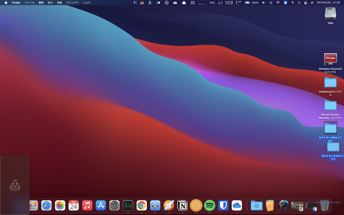
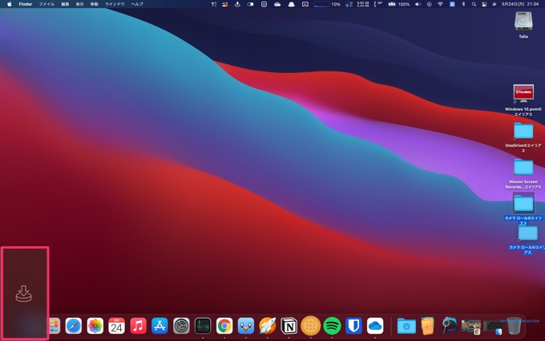
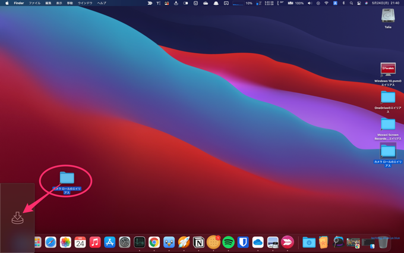
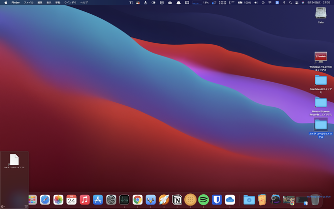
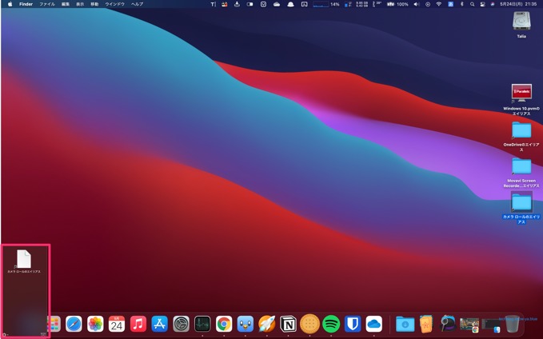
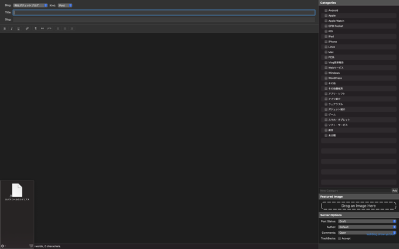
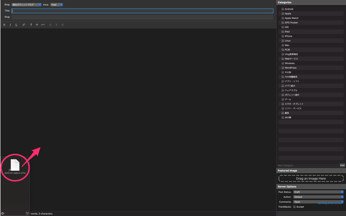
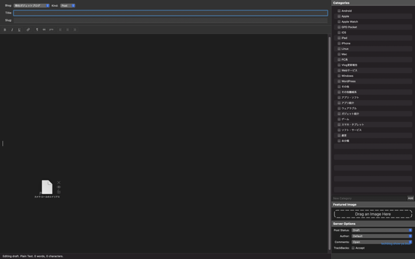
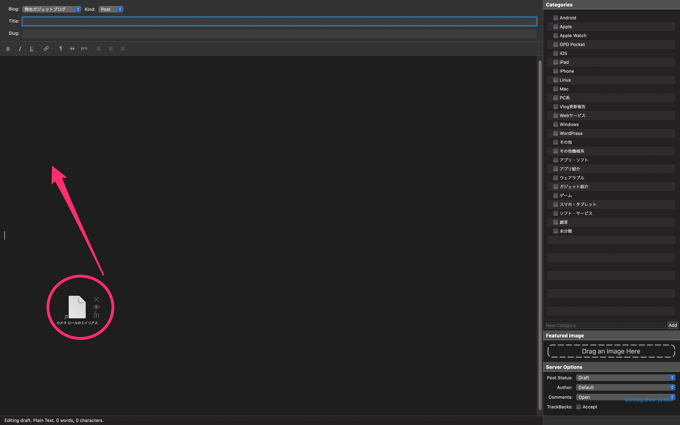

どうもこんにちは、如月翔也（[@showya\_kiss](http://twitter.com/showya_kiss)）です。  
　今日はMac向けの有料アプリ、いわゆるシェルフアプリであるYoinkの使い方について写真付きで解説していこうと思います。  

## Yoinkとは

　YoinkとはMatthias Gansrigler氏の開発・販売するMac用のアプリで（iOS用も別途売っています）、いわゆるシェルフアプリです。  
　ファイルをドラッグした時に画面の片隅に（設定でどこの隅にするのか設定可能・設定で出しっぱなしにもできます）ファイルの仮置き場を表示してくれるアプリで、この仮置き場には画像やテキスト・URLなんかを格納しておく事ができ、仮置き場からドラッグする事で取り出して貼り付けする事ができるので、ファイルや画像を移動したり貼り付けたりする時に非常に便利です。  

## どんな事ができるのか

　Yoinkでどんな事ができるのかというと画像・テキスト・ファイルのドラッグアンドドロップができるだけなんですが、表示される仮置き場が他のアプリを最大化した状態でも最前面に表示してくれるので、普通最大化したアプリにファイルをドラッグしたい場合一度最大化を解除してドラッグしてからまた最大化する、という手順が必要なんですが、Yoinkを使えばデスクトップ画面でファイルをYoinkにドラッグし、最大化したアプリ画面に移動してYoinkからドラッグすればアプリ画面にドラッグできるので手間を省いて作業をする事ができます。  

## 操作の実例

　分かりづらいと思うので操作の実例をあげますね。  
　例として、デスクトップにある「カメラロールのエイリアス」のファイルを最大化したMarsEdit4の投稿画面にドラッグする作業を撮影しました。  

### ファイルをドラッグすると指定した位置（今回は左下）にYoinkのシェルフができます

　Yoinkを起動した状態でファイルをドラッグすると（出しっぱなしにも指定できます）画面の左下（場所は設定で変えられます）にYoinkのシェルフができます。  
  
　マーカーで印をつけたところがYoinkのシェルフです。  
 　ファイルを離すとシェルフが消えますが、またドラッグすればシェルフが表示されます。  

### Yoinkのシェルフにファイルをドロップします

　Yoinkのシェルフにファイルをドロップします。  
  
　ドラッグしたファイルをそのままYoinkのシェルフにドラッグしてドロップして下さい。  

### Yoinkのシェルフにファイルが保持されます

　ドラッグしたファイルがYoinkのシェルフに保持されます。今回の場合単一ファイルですが複数ファイルを一気に入れたり、入れた後に他のファイルを追加したりもできます。どんどんYoinkのシェルフに放り込んで大丈夫です。  
  
　マーカーで印をつけた位置にドラッグしたファイルが表示されています。これでファイルが保持されています。  
  

### Yoinkのシェルフは他のアプリを最大化した画面でも最前面に出ます

　Yoinkのシェルフにファイルを保持した場合シェルフが表示されっぱなしになって、他のアプリを最大化した状態でもシェルフが画面最前面に出ている状態になります。  
　この例ではMarsEdit4のブログエディット画面を表示していますが、左下にシェルフが表示されています。  
  

### Yoinkのシェルフからファイルをアプリ画面にドラッグします

　Yoinkのシェルフから、貼り付けたい位置にファイルをドラッグします。  
  
　Yoinkのシェルフからファイルがアプリ画面の上に移動します。  
  

### アプリ画面にファイルがドラッグされた事になります

　このまま手を離せばアプリ画面にファイルがドラッグされた事になります。」  
  
　使うアプリによって画面が書き換わったりダイヤログが出たりしますのでそれに従って操作して下さい。  

## ファイルを複数置く事もできるのでいちいち画面を行ったり来たりしなくて良いです

　単体のファイルを動かすだけなら手の操作でやってもいいんですが、複数ファイルをドラッグアンドドロップするのであればYoinkの出番です。  
　ファイルを複数放り込むのは簡単にできますし（一括選択してドラッグしても個別にドラッグしても良いです）、貼り付けるときも一括で貼り付けたりシェルフを展開して単一ファイルごとに貼り付けたりもできます。  
　今書いているこの記事は記事用の写真を一括でYoinkにドラッグしたあと、シェルフを展開して一枚一枚貼り付けて使っています。  
  
　1〜2枚の写真ならアプリ最大化解除・ドラッグアンドドロップ・最大化しなおし、でもいいんですが、複数枚の写真を貼り付けながら記事を書く、ような作業では貼り付ける手間が記事を書く手を止める原因になるので一気に処理できるのは非常にありがたいです。  

## ファイルを置いてからフォルダを掘ったりできるので「何を」どうするかの順で考えられます

　またYoinkの作業の場合、まずファイルを複数選んで格納してからフォルダを掘って格納する、ようにまず「何のファイルを」選んでからどうする、という動線でできるので頭をシンプルに使えるので非常に楽です。  

## Web画面から画像をそのままドラッグもできるので使い勝手が良いです

　Yoinkを使うとWeb画面から画像をそのままドラッグする事も可能なので、右クリック「名前を付けて保存」をするよりも画面から引っ張ってYoinkに放り込んでまとまってきたらフォルダを掘って保存、という感じで操作できるのでただのユーティリティといても非常に優れているのでお薦めです。  

## 使用例：Web画像をYoink経由でNotionに保存する

　私が使っている使用例の実例としては、Web画像のコレクションをする時に、私ファイルを持ちたくないのでNotionというデータベースのアプリを使ってデータをWebの向こうに格納するんですが、一度ダウンロードしてからアップしても良いんですが手間なので、気に入った画像があった場合はブラウザから画像をドラッグしてYoinkに落とし、Webページひとまとまりで画像をさらったらNotionを起動してYoinkに落としたファイルを全部貼り付けて保存しています。  
　この使い方ならローカルにデータを落とさないでいいですし、Notionでデータベース化しながらWeb画像を漁れるので非常に使いやすいです。  

## 使用例：写真をPhotoBulkで一括処理した後MarsEdit4にアップしてブログを仕上げる

　これは今まさにやっているんですが、ブログを書く段階でブログにアップしたい写真を一通り撮ってしまい、それをPhotoBulkで一括処理した後PhotoBulkえ吐き出したPNG/JPGを一括でYoinkに落とし、MarsEdit4でブログ記事を書きながら適切な場所に画像ファイルを貼り付ける作業をしています。  
　MarsEdit4のシンプルなエディタで作業しながら画像を貼り付けてサブディスプレイでプレビューを表示しながらブログを書くのは非常に捗りますのでお薦めです。  

## App Storeで980円なので気軽にお買い求め下さい

　YoinkはApp Storeで980円で売っているので、コーヒーを2杯飲んだ気持ちで気軽に課金すると非常に良いと思います。  
　1000円以下のアプリでこの利便性はなかなかない事なのでぜひ使ってみて下さい。  

## まとめ

　という訳で、Mac用のシェルフアプリ、Yoinkの使い方についての解説でした。  
　物凄く使い勝手が良いアプリなので本当におすすめですので、ぜひ使ってみて下さい。
