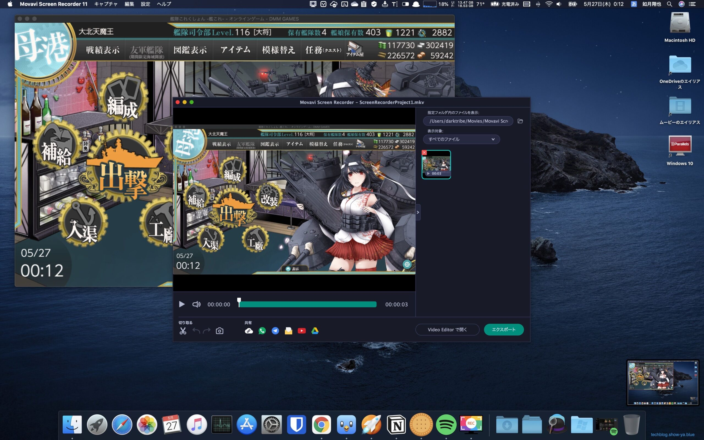

どうもこんにちは、如月翔也（[@showya\_kiss](http://twitter.com/showya_kiss)）です。  
　今日は艦これのイベントを攻略し終わった記念に艦これイベントの出撃を録画しているのに使っているMovavi Screen Recorderの使い方について解説しようと思います。  
　なお艦これイベントは宗谷がまだ取れていないのでイベント攻略自体は終わりましたがドロップ目的で周回を続ける予定です。  

## Movavi Screen Recorderとは

　Movavi Screen RecorderとはMovavi Software Incの開発・販売するMac用のアプリで（Windows用もあります）、App Storeでも販売していますがバージョンが古いので公式サイトから購入する事をお薦めします。  
　いわゆるスクリーンレコーダーのアプリで、パソコン画面を録画するのに使います。スクリーンレコーダーとしてはMacにはQuickTimePlayerという超強力なアプリがあるのでわざわざ有料のアプリを買う必要はないのでは、と思うかも知れませんが、QuickTimePlayerでは細かい設定ができないのでそういう設定が必要な人にはスクリーンレコーダーアプリが必要なのです。そしてMovabi Screen Recorderはスクリーンレコーダーアプリとしては非常によくできているので使いやすく私は重宝して使っているのです。  

## Movavi Screen Recorderの特徴

　Movabi Screen Recorderの特徴としては「全画面・範囲の矩形指定・ウィンドウ指定」で録画ができる事と、録画するフレームレートを60FPSで固定できる事、パソコン内に流れる音声をキャプチャして録画に収める事ができる事、マウスカーソルを録画しない設定ができる事、RetinaディスプレイのMacで画面録画すると画面サイズが2x2で4倍大きくなるんですがそれを4分の1に縮小しながら録画する設定ができる事、が挙げられます。  
　ぶっちゃけ艦これの録画をする際にウィンドウ指定できないと画面サイズが毎回変わるので嫌だ、フレームレートがガタつくと画面が綺麗に録画されない、パソコン内の音声をキャプチャできないとプレイ動画の意味がない、マウスカーソルが邪魔で集中力が途切れる、画面サイズが巨大になってファイルサイズも無駄になる、という問題があって、それを全部解消してくれるアプリなのです。  
　現状M1搭載MacBookAirで10分以上録画すると音声の出力に問題が出るのがピーガー音が出るんですが録音録画は正常にできているのでとりあえず問題ないなと思って今使っており、今回の2021年春イベントも全部の出撃を録画したのです。  

## Movavi Screen Recorderの使い方

　では、Movavi Screen Recorderの使い方を説明します。  

### 起動前の画面

　まず起動前の画面です。艦これのウィンドウが表示されています。  
  

### 起動するとこうなります

　Movavi Screen Recorderを起動すると画面隅にMovavi Screen Recorderのランチャが表示されます（画面右隅に表示されています）  
  

### ウィンドウ指定録画はこう操作します

　ランチャの動画カメラマークをクリックすると録画の指定範囲の画面になるので、指定範囲を選択します。  
　ドラッグすると矩形選択、シングルクリックだとそのウィンドウを指定した事になります。  
 　今回は扶桑姉さまをシングルクリックしたので艦これのウィンドウが指定されました。  

### カウントダウンが行われます

　範囲を指定後録画マークである赤丸（画面右下）をクリックすると録画するためのカウントダウンが行われます。  
  
　3……2……1……とカウントダウンされます。  

### カウントダウンが終わると録画が開始されます

　カウントダウンが終わると録画が開始されます。  
  
　指定範囲がオレンジの線で装飾されているのがわかります。画面右下には録画時間が表示されます。  

### 四角ボタンを押して録画を完了します

　録画したい部分を取り終えたら画面右下の四角ボタンを押して録画を終了します。バツボタンだとファイルが消えるので駄目です。四角ボタンを押します。  
　そうすると、次の動画編集画面が自動的に立ち上がってきます。  

### 録画画面の編集画面が表示されます。ここから動画を簡単に編集できます

　立ち上がってきた録画編集画面がこちらです。簡単なカット編集がここでできますので、不必要なものが写った際などはここから削除します。  
  

### 録画ファイルを書き出します

　この時点でMKVファイルが指定フォルダに作成されているのですが、MP4ファイルが必要な場合はこの画面から「エクスポート」で書き出す事ができます。  
  
　私の場合MP4ファイルはMKVファイルからHandBrakeを使って書き出したいニーズがあるのでこの画面からエクスポートはせず、指定フォルダに有るMKVファイルをそのままHandBrakeで指定してエンコードしています。  
　という訳で、一連の作業が確認できました。  

## どれくらい重いアプリなのか

　Movavi Screen Recorderは高機能なスクリーンレコーダーアプリですがそんなに重くなく、MacBookPro15インチ（2018年モデル）またはM1搭載MacBookAirを使って録画するとCPU割合が100％に届く感じのアプリです。6コア12スレッド・8コア8スレッドのうち1つが100パーセントになる程度なのでPCの動作に大きな影響を与えるほどの負荷はかからないです。  
　ただHandBrakeで他のコアを全部使いながらMovavi Screen Recorderを動かすとMacBookのファンが爆音で鳴る程度には負荷があるので（まあHandBrakeで他のコアを全部使っているのが原因ですが）録画しっぱなしにしながらエンコードを並走させて更に画像ソフト、みたいな使い方をすると流石に厳しいです。  
　ただデュアルコア以上のCPUであれば1コアが張り付く程度の重さなのでそんなに厳しい重さではなく、まあゲームをプレイしながら録画する、ブラウザで配信している動画をフルサイズ画面で録画する、程度の使い方ならまず問題にはならないです。  

## 私の場合こだわりが強いので専用アプリを要したんですが

　私の場合艦これを録画するためになら課金も辞さない、ウィンドウ指定で60FPSででマウスを写さずRetina画面の4倍を縮小して録画したいというニーズだったので当時3000円くらいだったMovavi Screen Recorderを導入したんですが（今は5000円くらいするみたいです）、一度使うと使いやすくて他のツールが使えないくらいに便利ですし、地味に録画と同時にスクショも撮れる機能があるので画面を撮影したい時に使ったり録画しながらスクショを撮る事もできるのでゲームをプレイしながら要所要所で写真を撮れるので良いです。まあ写真については高画質で録画できるので録画ファイルを遡って一時停止してスクショでもいいんですが一体感があるのは録画しながらスクショを撮る方なので、好きな使い方をすると良いと思います。  

## まとめ

　という訳で、Movavi Screen Recorderの使い方について簡単に説明しました。  
　使い勝手の良いソフトなので課金が許せる人にはお薦めなソフトです。
