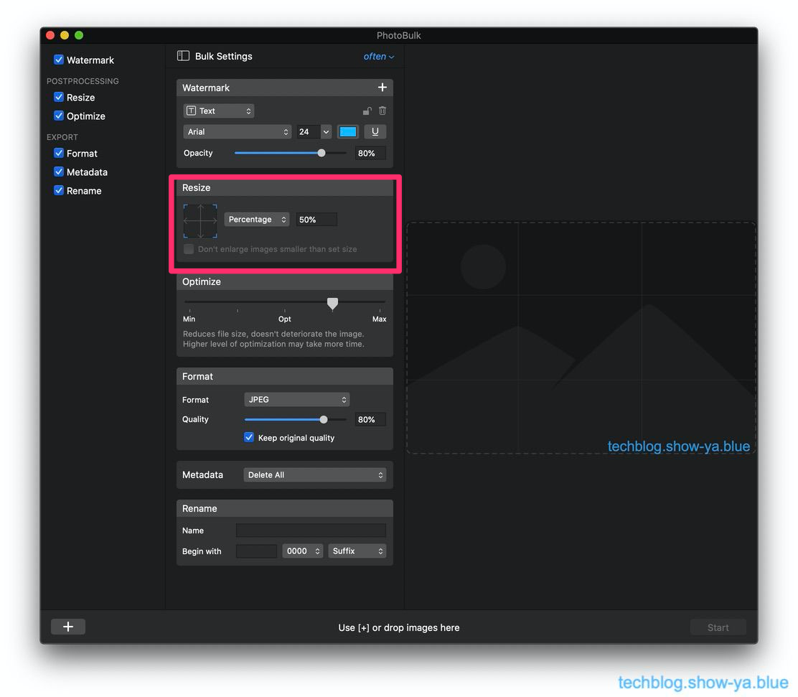

どうもこんにちは、如月翔也（[@showya\_kiss](http://twitter.com/showya_kiss)）です。  
　今日は最近この「翔也ガジェットブログ」に写真を取り込むようにし始めたんですが、その画像処理に使っているPhotoBulkという有料アプリについて紹介したいと思います。  

## PhotoBulkとは

　PhotoBulkとはEltima LLCの開発・販売する画像処理アプリです。  
　Macで撮った写真はそのまま使ってもいいんですが転載防止のためにウォーターマークを入れたりサイズをブログ用に調整したり画像をリファインしたりフォーマットを変えたりメタデータを削除したりリネームしたりすると便利なんですが、それらの処理を一括で行ってくれるソフトウェアです。  
　私は気づいていなかったんですが、Macの純正機能で画面をキャプチャするとRetina画面で画面サイズが2x2倍の4倍大きくなる事や、そのままで撮れるPNG画像はサイズが大きいのでウェブ掲載には適しておらず、そういう事をいちいち調整するのは面倒なのでプリセットを作ってドラッグアンドドロップで処理したい、というニーズの時には適したアプリです。  
　App Storeで1220円のアプリなんですがかなり使い勝手が良いアプリなのでお薦めです。

## 購入するに至った経緯

　私がPhotoBulkを購入するに立った経緯については、前々から文字だけのブログには限界があると感じていてブログに写真を取り込みたいと考えていたんですが、撮ったスクショをいちいちリサイズしてフォーマットを変えて、としているとテンションが下がって記事を書かなくなるので「ブログ用の写真を取る」から「ブログ用の文章を書く」までの間を極力短縮したく、できる限り自動化したかったので、というのが大きな理由です。  
　「この記事を書こう」「ならこの写真が必要だ」「（シャッター音）」「よし書こう」の流れでブログを書くためには撮った写真を加工する時間はどこにもなく、そこで時間を取られると熱量が下がるので記事を書ききれない結果になるので撮った写真をドラッグアンドドロップで一括変換できるPhotoBulkは私の執筆環境には適したアプリだったのです。  

## 何を期待して選んだのか

　という訳で何を期待して選んだのかというと、「一括ドラッグアンドドロップで」「ウォーターマークを入れ」「サイズを縮小し」「JPEGで」「メタデータを削除して」「連番でリネームして」くれる環境を期待していて、そして実際期待通りに動いてくれるのです。  
　一度使った時はJPGにせずにPNGでしかも縮小しないで処理したのでM1搭載MacBookAirでも反応が激重い結果になったんですがそれは使い方が悪かったのであって、保存形式をJPGにしたら一瞬で処理してくれるようになりました。PNGはブログではニーズがないのでいらないですし、縮小しない大サイズもニーズがないので「サイズ縮小」「JPEGで保存」はデフォルトで良いと思います。  

## 実際に購入してみてどうだったか

　実際に購入してみてどうだったかというと期待通りの動きをしてくれるので、写真を撮ってからテンションを下げる事なく前処理を終わらせて記事そのものに取り掛かる事ができており非常に満足しています。  
　設定項目が少なく全部の設定を一覧して見られるアプリなので今何の作業をさせているのかが瞬時にわかりますし、処理自体サクサクであっという間に処理を終わらせてくれるので使い勝手は非常に良いと思います。  

## 使い方

　ではPhotoBulkの実際の使い方を説明します。  
　最大化というか項目を全部表示した状態のPhotoBulkはこういう表示になっています。  
  
　画面を半分に分けて左半分が設定画面、右半分がプレビューとファイルをドラッグしてくる場所になっています。  
　各設定について説明します。  

### ウォーターマークの設定

　画像にウォーターマークという透かしを入れる設定がこちらの項目になります。  
  
　テキストの透かし、画像の透かしを設定する事ができ、テキストなら色と文字、画像なら透過度を設定する事ができます。  
　翔也ガジェットブログで使っている画像には「techblog.show-ya.blue」のテキストを透かしとして入れています。  

### リサイズの設定

　画像サイズのリサイズをするのがこの項目になります。  
  
　画像サイズをドット指定またはパーセンテージ指定でリサイズする事ができます。  
　Widthを600に設定すれば幅600になるようにリサイズしてくれますし、パーセンテージで設定すれば縦横パーセンテージを設定できます。  
　このブログの画像はMacの純正機能で撮影した写真をパーセンテージ指定で50%にしたものを使っています。縦横50パーセントずつで面積は25パーセントになっています。  

### 画面最適化の設定

　画像最適化の設定がこの項目になります。  
  
　設定数値を上げれば上げるほど画面が詳細に高精度になりますが、その分ファイルサイズが大きくなるので要注意です。  
　私は特に設定をいじらず、デフォルト設定のままにしています。  

### フォーマットの設定

　フォーマットの設定はこの項目になります。出力されるファイルの規格を選択します。  
  
　設定には「フォーマットを変えない（入力したファイルと同じフォーマットにする）」「JPEG」「PNG」「GIF」「BMP」「TIFF」が選べます。  
　基本的にはJPEGを選んでおけば問題ないでしょう。  

### メタデータの設定

　写真ファイルのメタデータの設定はここになります。  
  
　主にGPSデータ、カメラのインフォ、著作権表示などをどうするかを決められます。  
　私は写真データが元で身バレするのは極力避けたいのですべて消す設定を行っています。  

### リネームの設定

　ファイルのリネームについての設定がここにになります。  
  
　出力するファイル名の規則をここで決める事ができます。  

### 実行

　設定ができたら処理したいファイルをドラッグアンドドロップで引っ張ってきて、画面右下にできる「Start」ボタンを押します。  
　そうするとどこのフォルダに保存するか尋ねるダイヤログが出ますので場所を指定してあげれば自動処理されてファイルが出力されます。  
　設定だけプリセットで行っておけば後は写真を撮ってドラッグアンドドロップだけで処理できるので非常に楽です。  

## 購入してメリットであると感じた事

　PhotoBulkを購入してメリットであると感じたのは、撮影環境が安定しているのであれば（例えば私のようにMacの純正機能でしか撮影しない、など）出力のための細かい設定は全部共通してまとめられるのでPhotoBulkのプリセットにしてしまえば非常に楽な点、また複数の環境がある場合はプリセットに名前をつけて保存できるので環境ごとにプリセットを作ればいいだけというのは非常に楽です。  
　PhotoBulkがなければいちいちリサイズ・フォーマット変更・メタデータの削除を別アプリでしなければなりませんが、PhotoBulkがあればそれ1本で全部の処理ができます。  
　画面への書き込みだけ他のアプリを使えば後は「前処理」という意味で全部まとめてできるので非常に楽で、他の方法は必要ないと思うくらいです。  

## 購入してデメリットであると感じた事

　購入してのデメリットは有料ソフトなのでお金がかかる、事くらいです。  
　気軽に画面写真をバシャバシャ撮って片っ端から書き込みしてPhotoBulkで一括処理、というのを覚えると他の方法は考えたくない感じで、1220円なんて安い範囲なので気軽にお金を出してしまえばいいと思います。  
　ただ、Retina画面を縮小しないで撮ったPNGをPhotoBulkでPNGに出力するとかなり時間がかかって使い物にならないので、そこだけ要注意です。  

## 個人的な評価は

　PhotoBulkの個人的な評価は「かなり使いやすい。買いのアプリだ」という感じです。  
　定番なソフトなんですが使い勝手が良く使いやすいので定番になるだけの価値はあるな、と思います。  

## まとめ

　という訳で、画像処理ソフトのPhotoBulkについてのアプリ紹介でした。  
　かなり便利なアプリなのでお薦めですよ。
