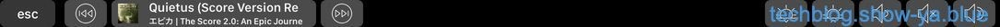
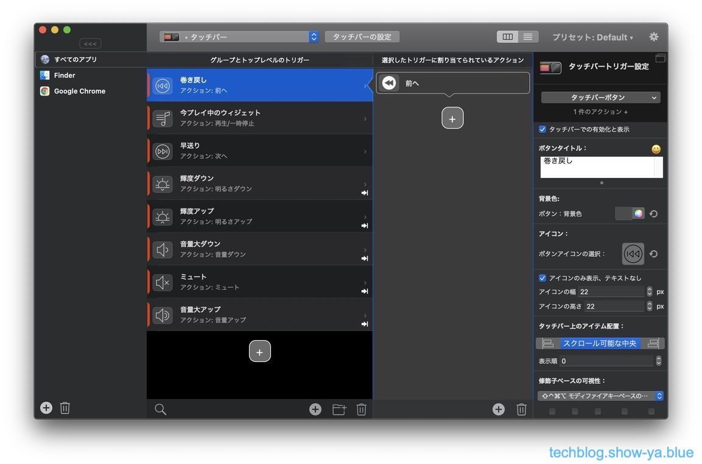
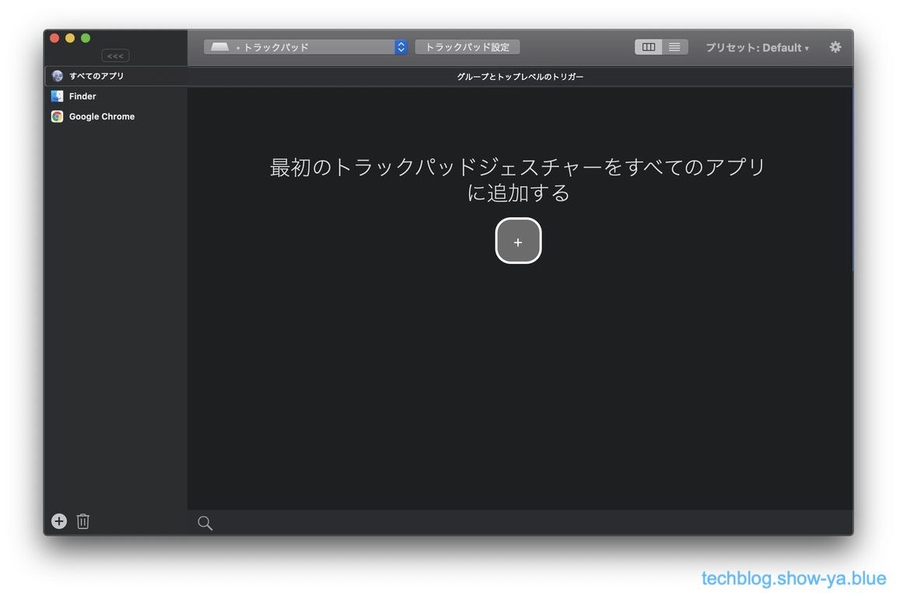
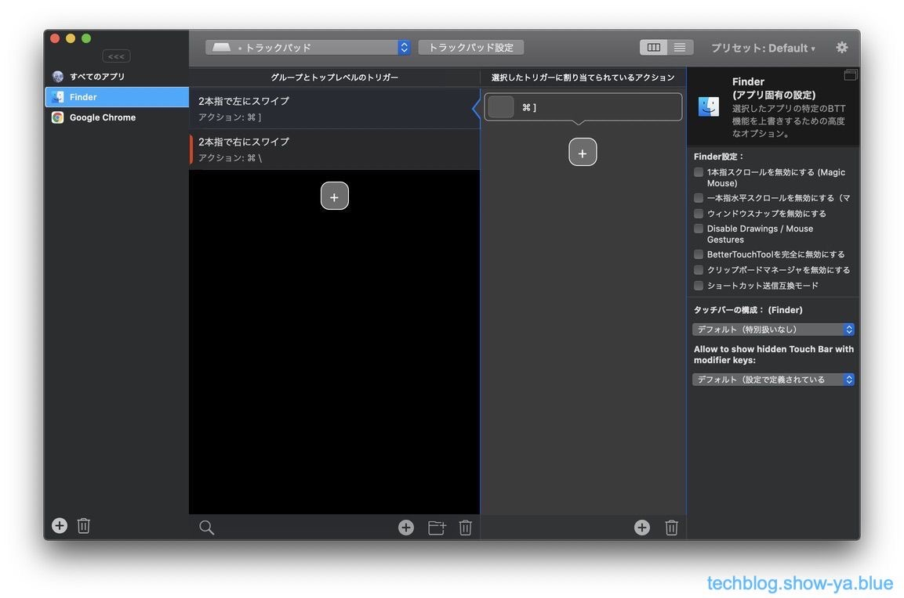
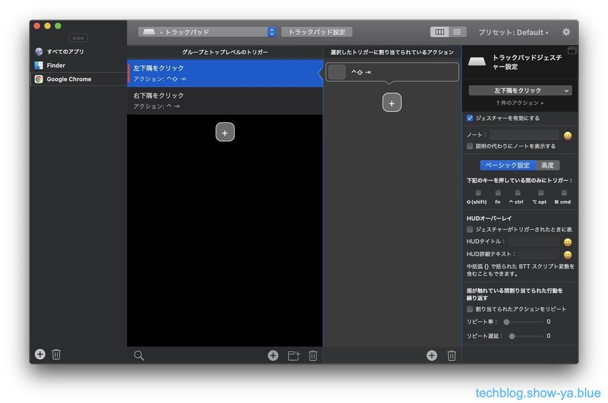
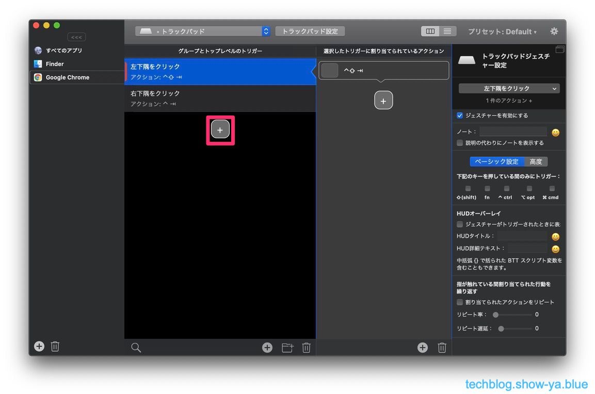
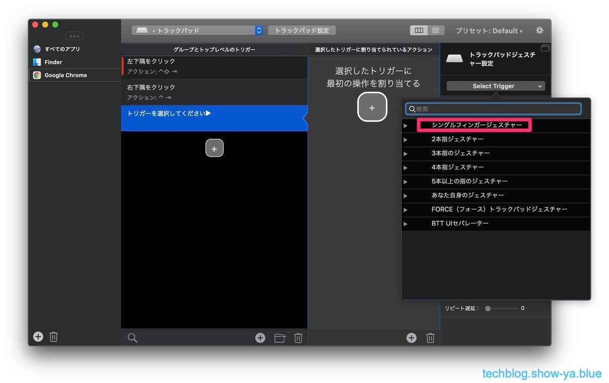
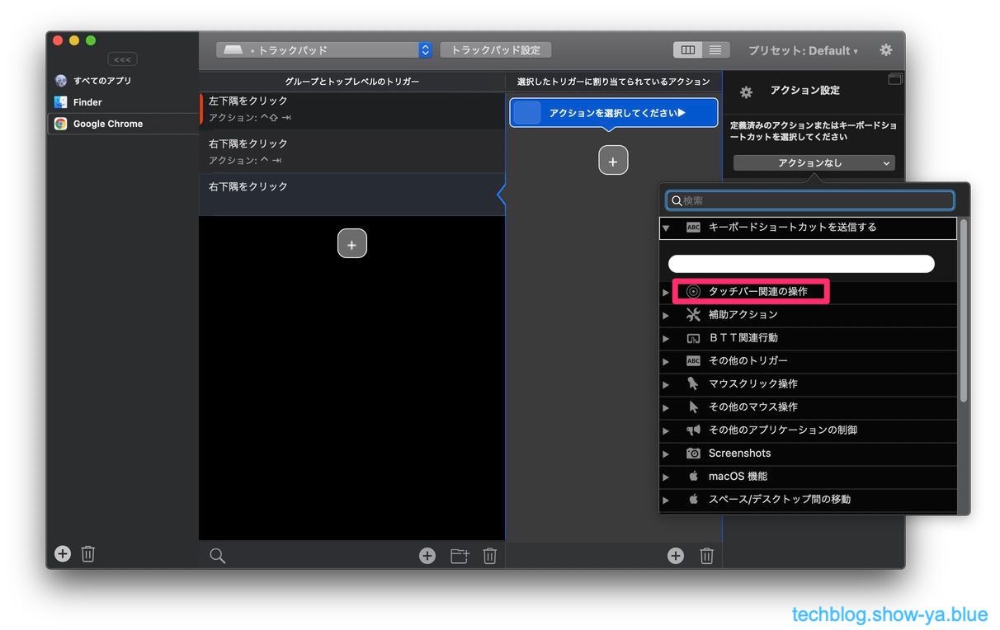

どうもこんにちは、如月翔也（[@showya\_kiss](http://twitter.com/showya_kiss)）です。  
　今日は先日アプリ紹介で紹介したトラックパッドのカスタマイズツールである（他にTouchBarをカスタマイズしたり色々できますが）Better Touch Toolの使い方について説明したいと思います。  
　有料アプリなんですがちょっと設定するだけでトラックパッドが神がかって使いやすくなる、TouchBarをバリバリにカスタマイズできるアプリなので超お薦めです。  

## Better Touch Toolとは

　Better Touch Toolとはfolivora.AI GmbHの開発・販売するMac用のカスタマイズアプリで、App Storeでは売っていないので公式ストアから購入する必要があります。  
　2年間で8.5ドルのライセンスか一生涯で20.5ドルのライセンスか、あるいはMacのApp StoreでBetter Snap Toolを370円で買ってフリーライセンスを入手するかの方法があり、まずお試しに使うならフリーライセンスで試すのが良いでしょう。  
　Better Touch ToolではTouchBar、マジックマウス、トラックパッド、普通のマウスなんかをカスタマイズする事ができ、カスタマイズの仕方によっては物凄く便利になるので非常にお薦めのアプリです。便利さを提供してくれるアプリなので「使えなかった」人は工夫が足りなかった感じで、ちゃんと使えば誰だって便利に使えるアプリなのです。  

## 私はTouchBarのカスタマイズに使っていたんですが

　私はBetter Touch ToolはTouchBarのカスタマイズに使っていました。  
　こんな感じでカスタマイズしています。  
  
　TouchBar内にミニ音楽プレイヤーを実装して、輝度の上下と音量の上下・ミュートを表示しています。  
　私は常に音楽を聞きながらMacBookProを使いたいニーズなのでミニ音楽プレイヤーがTouchBarに表示されていると便利なのでこういうカスタマイズで使っています。  

## トラックパッドをカスタマイズすると凄く使いやすいです

　その他、というかアプリ的にはこちらのほうが本領なんですが、Better Touch Toolではトラックパッドにジェスチャを割り振るカスタマイズができ、これをするとトラックパッドが魔法のように便利になるのです。  
　私はそんなに魔改造している方ではないんですが、2〜3設定をいじるだけで今まで使っていたマウスやトラックボールがお払い箱になるくらいトラックパッドが便利になったので、本当に心からお薦めします。  

## Better Touch Toolの使い方

　では、Better Touch Toolの使い方について簡単に説明します。

### 基本画面

　まずBetter Touch Toolの基本画面について説明します。  
　小難しい感じがするのでとっつきが悪いんですが、一回ポイントを抑えたら楽勝なので気軽に眺めて下さい。  

### TouchBarのカスタマイズ画面

　まずTouchBarのカスタマイズ画面です。  
　左上のメニューが「タッチバー」になっているのがわかると思います。  
　TouchBarについては結構色々設定しているので設定項目が多く表示されていますが、1項目につきボタン1個なので大した量ではありません。  
  

### トラックパッドのカスタマイズ画面

　続いてトラックパッドのカスタマイズ画面です。  
　トラックパッドについては「全てのアプリ」については私は設定をしていないので設定がなく「最初に設定をする」画面が表示されています。  
　全部が全部設定しなければならないものでもないので、こういう画面があっても気にしなくてオーケーです。  
  

### トラックパッドのカスタマイズ画面（Finder）

　トラックパッドについて、「Finder」を使う時の設定画面がこちらです。画面左項目が「Finder」画面左上が「トラックパッド」になっています。  
  
　トラックパッドのFinderについては2種類カスタマイズをしています。後で説明しますが「進む」「戻る」ジェスチャを指定しています。  

### トラックパッドのカスタマイズ画面（Google Chrome）

　トラックパッドについて、「Google Chrome」を使う時の設定画面がこちらです。  
  
　トラックパッドのGoogle Chromeについては後で説明しますが「タブを右に移動」と「タブを左に移動」ジェスチャを指定しています。  

### 設定の作成方法

　では、実際にBetter Touch Toolでジェスチャの設定をするにはどうすればいいのか、方法を説明します。  
　設定項目が物凄く多いんですが、基本的に「自分で変えようと思った部分以外はデフォルトで」設定すれば大丈夫です。  
　詳細な設定項目全てを把握しようとすると躓く原因になるので、まずしたい事をする、だけに特化して考えると良いです。  

#### グループとトップレベルのトリガーをクリック

　まずジェスチャを指定するために「グループとトップレベルのトリガー」をクリックします。  
  
　ピンク色で指定してある部分にプラスボタンがあるのでクリックします。  

#### ジャスチャーを指定

　次に指定するジェスチャを指定します。ドロップメニューからジェスチャを選ぶだけです。  
  
　二本指で右にスワイプだとか三本指を上に上げるとか色々ありますが、使いたいジェスチャを指定するだけなので難しくありません。  
　普通のトラックパッドで指定されている操作を上書きすると脳が混乱するので普段使っているジェスチャ以外を指定しましょう。  

#### アクションを指定

　最後にジェスチャ指定で行われるアクションを指定します。キーボードからショートカットを入力するとか、現在のアプリを停止などのアクションが選べます。  
  
　キーボードショートカットで「両手を使うもの」をシングルジェスチャに指定しておくと便利で、片手でできるショートカットはキーボードで入力すればいいんですが、両手が必要なショートカットキーは面倒くさいのでジェスチャを指定しておくとめちゃくちゃ便利です。  

#### 難しく考える必要はありません

　これだけで設定完了です。難しく考える必要はありません。  
　「何のジェスチャをしたら」「なんのアクションを取る」かを指定するだけなので子供に作業を教えるくらいのブレイクダウンで指定ができます。  

## 私のカスタマイズ例：TouchBar

　それだけで投げっぱなしだと不親切なので私のカスタマイズ例を上げておきます。  
　TouchBarの項目はこういう順で指定しています。  
・「音楽の巻き戻しボタン」：タッチバーボタン→「キーボードから入力：戻る」  
・「音楽プレイヤー」：今プレイ中のウィジェット→「キーボードから入力：再生・停止」  
・「音楽の早送りボタン：タッチバーボタン→「キーボードから入力：次へ」  
・「輝度アップ」：タッチバーボタン→「キーボードから入力：明るさアップ」  
・「輝度ダウン」：タッチバーボタン→「キーボードから入力：明るさダウン」  
・「音声アップ」：タッチバーボタン→「キーボードから入力：音量アップ」  
・「音声ミュート」：タッチバーボタン→「キーボードから入力：ミュート」  
・「輝度ダウン」：タッチバーボタン→「キーボードから入力：音量ダウン」  
  
　基本的にキーボード入力をそのままボタンにしています。  

## 私のカスタマイズ例：トラックパッド：Finder

　トラックパッドの「Finder」については次のカスタマイズをしています。  
・「二本指を左にスワイプ」→「キーボード入力：Command+\[」：Finderで「戻る」を実装  
・「二本指を右にスワイプ」→「キーボード入力：Command+\]」：Finderで「進む」を実装  
　Finderで進む、戻る機能が欲しかったので実装しました。  

## 私のカスタマイズ例：トラックパッド：Google Chrome

　トラックパッドの「Google Chrome」については次のカスタマイズをしています。  
・「画面左下隅をクリック→「キーボード入力：Control+Shift+Tab」：Google Chromeで「左のタブへ」を実装  
・「画面右下隅をクリック→「キーボード入力：Control+Tab」：Google Chromeで「右のタブへ」を実装  
　Google Chromeを使う時にタブの移動をしょっちゅうするんですがキーボードショートカットが不便すぎるので実装しました。  
　クリックにしているのは当初タップにしていたんですがキーボードを触っていると手のひらがあたって誤爆するのでクリック指定にしました。  

## こんな感じで使っていけばどんどん便利になります

　という感じです。  
　こんな感じで「この作業面倒くさい」と思ったらジェスチャを指定してアクションを指定して、という感じで面倒くさいものをどんどんジェスチャ化していくと非常に便利です。  
　使えば使っただけ楽になるのでどんどん設定するといいと思います。  

## まとめ

　という訳で、超便利アプリであるBetter Touch Toolについての説明でした。  
　これを機に導入を検討されてみてはいかがでしょうか。
