どうもこんにちは、如月翔也（[@showya\_kiss](http://twitter.com/showya_kiss)）です。  
　今日は注文していたXiaomiのRedmi note 10が届きましたのでアンボクシングとファーストインプレッションをお送りしようと思います  

## Redmi note 10とは

　Redmi note 10とは中国Xiaomi社の開発・販売するAndroidスマホで、2019年発売なんですが当時はハイスペックな機械だったので2年経過した今もミッドレンジとしては十分に通用する機種です。  
　私は今回このRedmi note 10を今持っているRedmi note 9sに乗り換えて、Redmi note 9sを次男に譲る目的で中国テックサイトのBanggoodで2万円で入手しました。  
　というのも次男のGoogle Pixel3が壊れ、見積もりに出したら25000円と言われたので、Pixel3は21500円で買った機種なので直すのに25000円も出していられないと思って修理をキャンセルしたんですが、なぜかキャンセルした結果直った本体が帰ってきてしまいPixel3が復活したので私のRedmi note 9sを押し出してあげる必要がなく、現時点でRedmi note 10が宙に浮いてしまっているんですが、これはタイミングと運が悪かったので仕方がありません。  
　Redmi note 10とRedmi note 9sを比べるとRedmi note 9sの方が優れているのでRedmi note 10の出番はないな、と思っており、まあ何か考えようと思います。  

## 開封の儀

　と、まあとりあえず前途多難なRedmi note 10ですが開封の儀を執り行います。  
　まず届いた荷物がこちら。  
[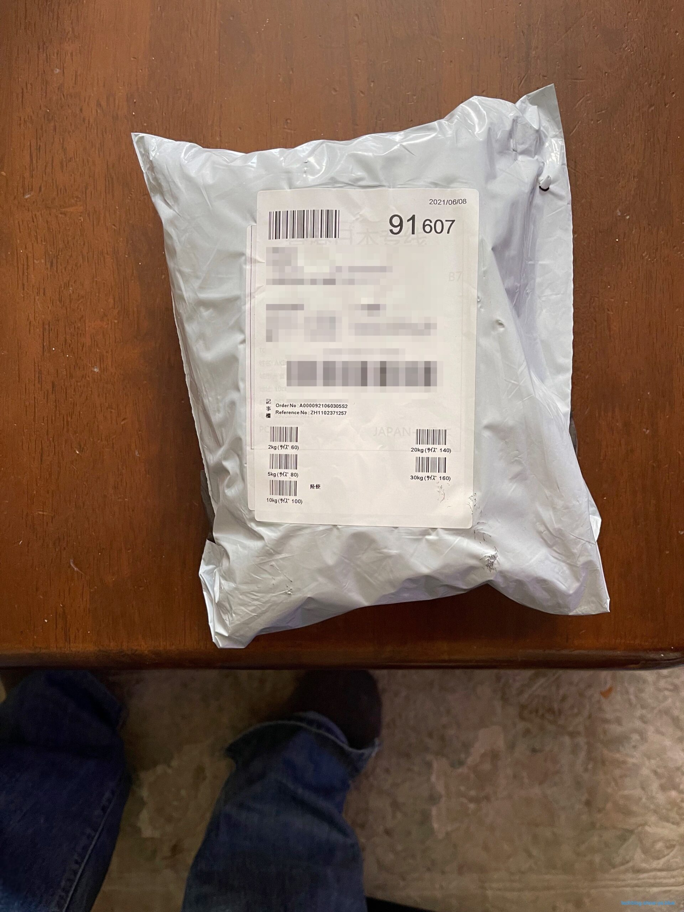](https://techblog.show-ya.blue/wp-content/uploads/0000-6-scaled.jpg)  
　中国Banggoodからの荷物です。表面に住所なんかがモロに書いてあるのでモザイクをかけました。  
　この荷物というかでかい封筒、開けるとこうなっています。  
[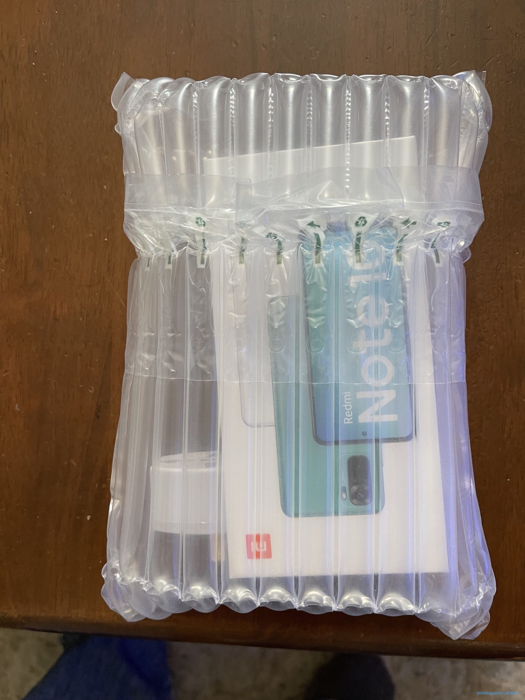](https://techblog.show-ya.blue/wp-content/uploads/0001-3-scaled.jpg)  
　エアバッグの中にスマホの箱がねじ込まれています。これなら多少の衝撃は大丈夫でしょう。  
　あと充電器を日本形式に変換するプラグが雑に突っ込まれています。  
  
　開けてみたのがこちら。製品の箱です。  
　エアバッグがしっかりしていたので箱にも傷がありません。  
[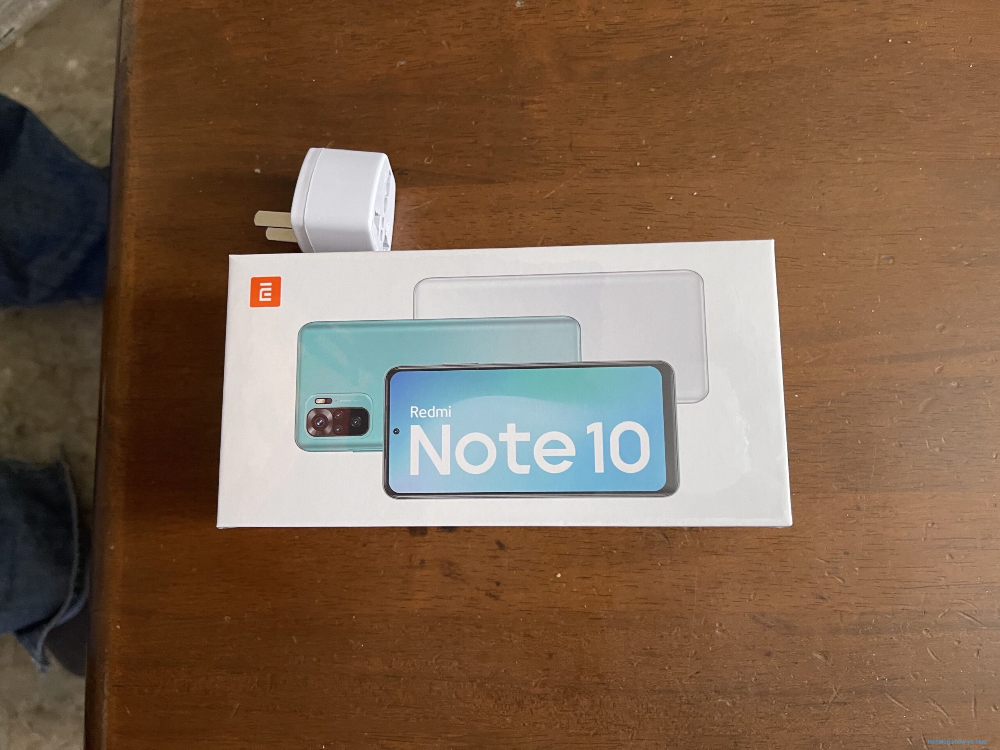](https://techblog.show-ya.blue/wp-content/uploads/0002-3-scaled.jpg)  
  
　箱を開けたのがこちら。本体が包装に包まれています。  
[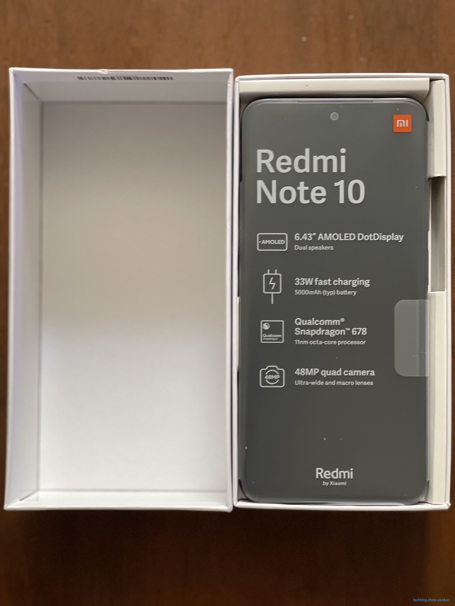](https://techblog.show-ya.blue/wp-content/uploads/0003-3-scaled.jpg)  
　取り出して包装をはがしたのがこちら。  
　グレアなので天井のシーリングが完璧に写り込んでいます。物凄く映り込みます。 [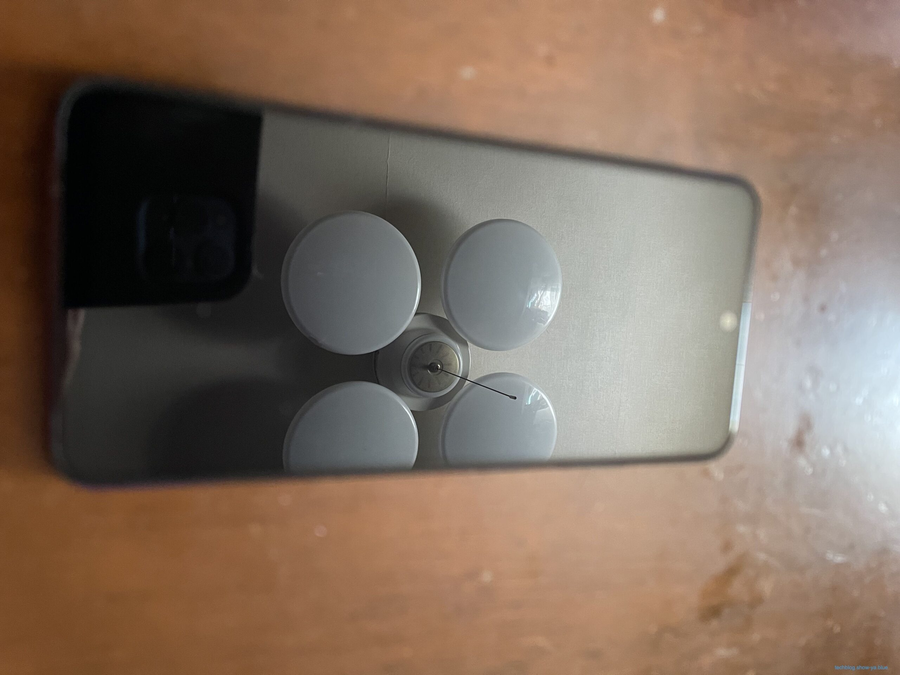](https://techblog.show-ya.blue/wp-content/uploads/0004-3-scaled.jpg)  
　裏面はこちら。  
　裏面もつるつるした感じで天井のシーリングが写り込んでいます。  
[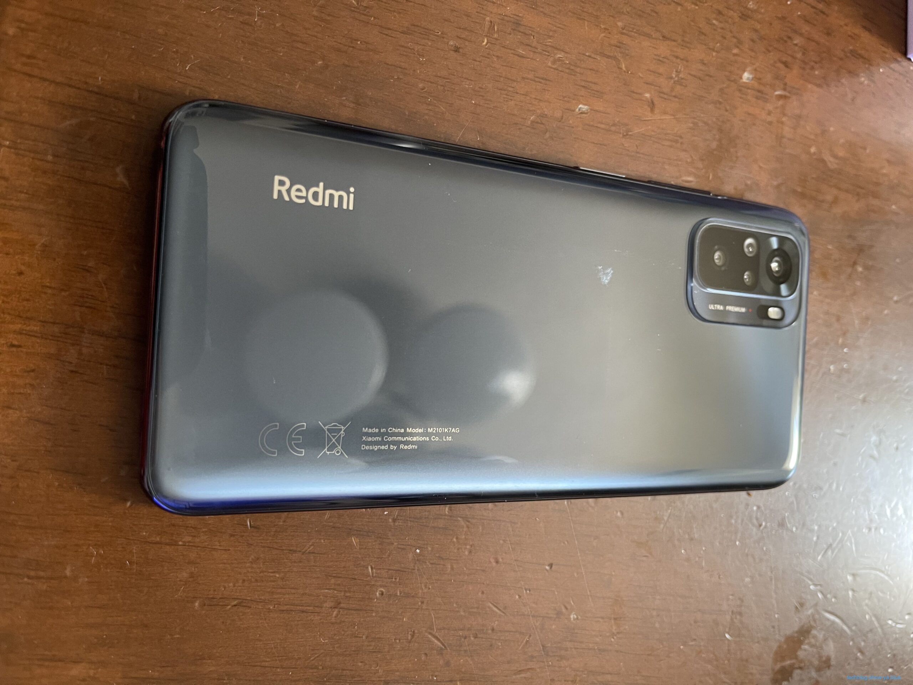](https://techblog.show-ya.blue/wp-content/uploads/0005-3-scaled.jpg)  
　そして化粧箱の中身がこちら。  
　USB-C充電器とUSB-CtoCケーブルが入っています。充電器は国外仕様なのでそのままでは使えませんが、エアバッグの中に同封されている変換コネクタで使う事ができます。 [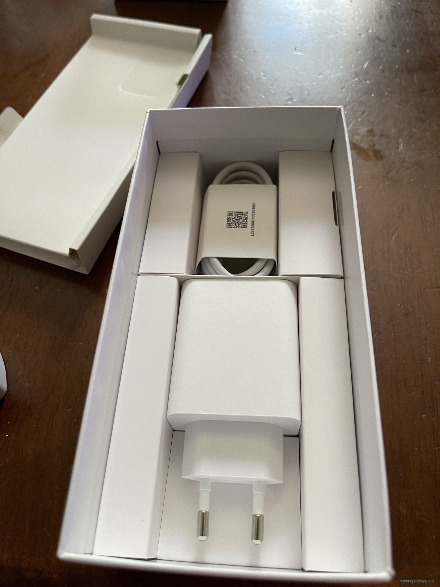](https://techblog.show-ya.blue/wp-content/uploads/0006-2-scaled.jpg)  
　以上、アンボクシングでした。  
　高級感があるという感じではないですが使いやすいスマホなんだろうな、という事を感じさせる質感で、大きさもそれなりに大きいのでiPhoneのMaxサイズが欲しければこのサイズで間違っていないと思います。  

## ベンチマーク（GeekBench5）

　では、Redmi note 10はRedmi note 9sに劣るといいますが、どれくらい劣るのでしょうか。  
　GeekBench5で比べてみましょう。左がRedmi note 10、右がRedmi note 9sです。  
[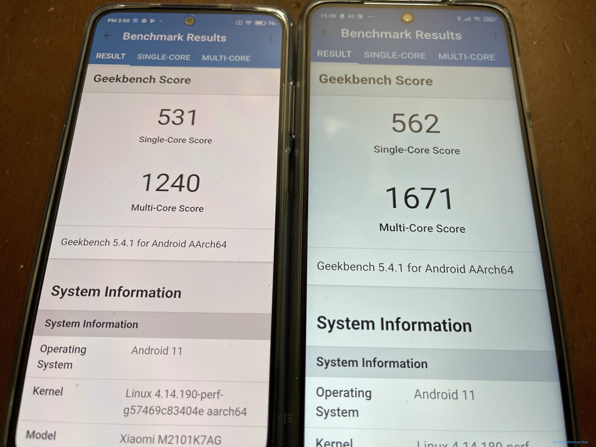](https://techblog.show-ya.blue/wp-content/uploads/0007-2-scaled.jpg)  
（シングルで30くらい、マルチで400くらい差があります） [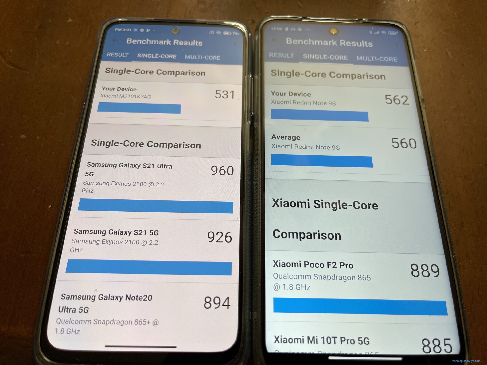](https://techblog.show-ya.blue/wp-content/uploads/0008-3-scaled.jpg)  
[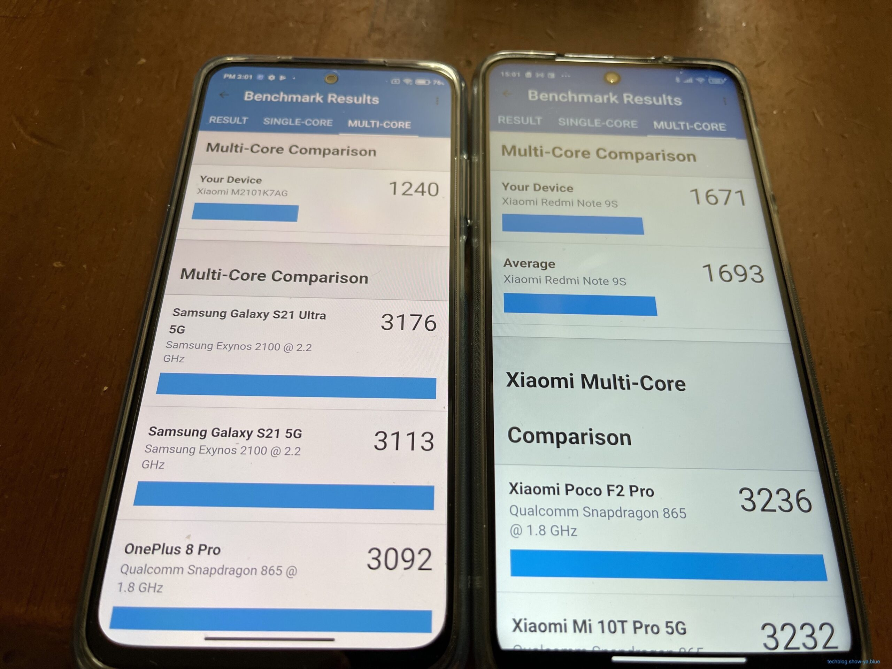](https://techblog.show-ya.blue/wp-content/uploads/0009-2-scaled.jpg)  
[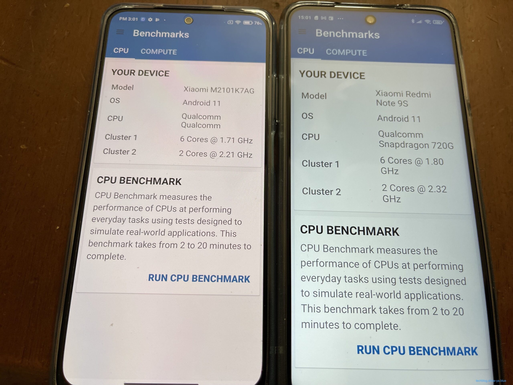](https://techblog.show-ya.blue/wp-content/uploads/0010-2-scaled.jpg)  
  
　ベンチマークでは表示されていませんが、CPUはRedmi note 10がSnapDragon678、Redmi note 9sはSnapDragon720Gです。  
　CPUの性能がもろに出ている結果で、シングルではそんなに差がないんですがマルチで結構差が出ます。  
　とはいえ数字に出ているだけでは体感がどれくらい違うかはわからないので、実際に使ってみる事にします。  

## 実際使ってみて

　私がサブのスマホに最低限求める性能は「アズールレーンのオート周回が可能である」レベルです。  
　メイン機にはもっと厳しい制限がありますが、メイン機をもりもりで買うのでサブ機は本当にサブレベルで良く、24時を超えて一番にメインスマホでけものフレンズ3の周回をする時同時にサブスマホでアズールレーンの周回をするのでメインの用途はそれだけ（後はまあニュース見るくらい）なので、そこだけこなしてくれればいいです。  
　でもアズールレーンって2Dゲームの中では結構重い方なんですよね。周回の「厳しい」レベルだと弾幕で画面が覆い尽くされるので処理落ちは避けられない部分があったりするんです。  
　では、Redmi note 10を実際使ってみてどうか、という点でいうと、合格です。アズールレーンが問題なく動きますしニュースやYouTubeを見るには十分なスペックです。  
　このスペックのスマホがセールでもなんでもなく2万円で買えるのであればかなりの価値があると思っていて、まあ私はRedmi note 9sを1円で入手しているのでどうしても比べてしまうんですがクリアな目で判断すると2万は安いし買いだと思うのです。  
　30W対応の充電器が入っていますしクリアケースもついてくるのでおまけ装備は十分ですし、設定に変な癖もなく使いやすいので、下手に日本製のキャリアに紐付いたスマホを買って独自アプリがゴリゴリに入っているよりは使いやすいんじゃないかと思います。  

## 今回はBanggoodで買いましたが

　私は今中国のテックサイトを2つ使っていまして、1つはGeekBuying、もう1つはBanggoodなんですが、Banggoodは今回初めて使いましたが申し込んだ翌日には発送されていて、国際郵便なのに11日かっきりで届けてくれたので素晴らしいと思っています。  
　こういうサイトは怪しいのはとことん怪しいんですが、私は買い手保証のあるPayPalを使っているサイトなら最悪のことがあっても大丈夫だと思っているのでこれ系サイトはPayPalが決済方法にあるものだけを選んでいます。  
　中国系サイトは怪しくて安いものが多いので色々試して遊ぶには良いサイトだと思いますので、まあ怪我しない程度に冒険して楽しめればいいのかな、と思います。  

## ファーストインプレッション

　Redmi note 10については届いた時点でもう不要である事が確定していたのでテンションが高くない状態でお迎えしたんですが、箱を開けてみると結構格好良い外見で、手に持ってみると結構しっくり来るサイズで、電源を入れるまでに結構テンションが上りました。  
　液晶のコンディションがいいのか、写真でもわかると思うんですがRedmi note 9sに比べると画面が明るい気がしていて、黒い文字はしっかり黒いのでメリハリが効いていて見やすい画面だと思います。  
　カタログスペックでいうとRedmi note 9sに負けますし。ベンチマークでもそれは数字で出ているんですが、実際に使ってみると大差ないというか、「こっちの方が速い！」という感じはなかったです。  
　もし予定通りにRedmi note 9sを次男に押し出してRedmi note 10を自分で使ったとしても問題なく使えていただろうな、と思いまして、色々なサイトを見ておSDカードが使えるかどうかが不明だったんですがSIMスロットを開けたらSDカードを入れる場所があり128GBまで対応っぽいのでSDカードを買ってこようと思います。  
　結論から言うとこのクラスのスマホとしては安くて整っているのでかなりおすすめ度が高いと思います。  

## まとめ

　という訳で、Redmi note 10のアンボックスとファーストインプレッションをお送りしました。  
　良い買い物だったと思うので皆さんも是非。
