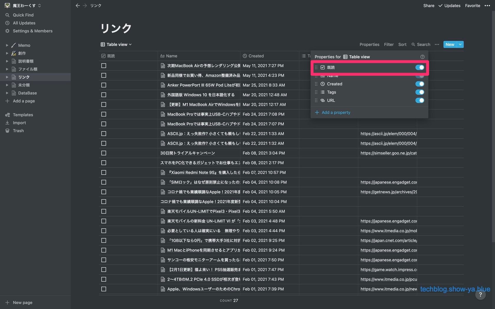

どうもこんにちは、如月翔也（[@showya\_kiss](http://twitter.com/showya_kiss)）です。  
　今日は私が心からオススメするオールインワークスペースアプリであるNotionについて、使い方の詳細をお伝えしたいと思います。  
　もちろんNotionは奥が深いので今回の説明では全ての機能どころかごく一部の機能しか紹介できないのですが、その範囲でも便利だと思います。  
　Notionは基本無料で1ファイル5MB以下の制限あり、有料は月5ドルか年48ドルでファイル制限なしになります。私は課金して使っていますが超便利ですよ。  

## Notionとは

　NotionとはNotion Labの開発・提供するオールインワークスペースサービスです。基本がWebベースでのソフトなのでアプリと言うよりかはサービスなんですが、専用アプリがWindows/MacOS/Linux/iOS/Androidにあるのでクライアントアプリとしても幅が広く使いやすいです。私はアプリで使っています。  

## Notionでメモをとる方法

　Notionはオールインワークスペースアプリなのでクラウドメモを取る事ができます。  

### 起動する

　Notionを起動します。初回表示ページが開くのでメモを取りたい場所に移動します。  
　今回は「ネタ」の項目にメモを取りたいので「ネタ」をクリックします。  

### ページが開く

　クリックしたページが開きます。すでにいくつかネタが書き込まれていますが一番下に追加します。  
　このページは使ったネタを消せるようにチェック項目としてテキストを作成していますが、もちろんチェックなしの項目も作れます。  
  
　枠で囲ったところをクリックすればチェック項目を作成できます。  

### メモを書き込みます

　クリックして位置を指定したら好きにメモを書き込みます。書き込むのと同時にデータがクラウドで送られるので他のデバイスのメモも書き換わっていきます。  
  
　保存とかは特に必要ないので書き込んで他のページへ行ったり閉じたりしてしまって構いません。  

## データベースにファイルをしまう

　持っているデジタルデータをデータベースに格納する事ができます。  
　格納したデータは検索・並べ替え・フィルタが可能で、ページ内に表示する事ができるので、FinderでローカルにしまってあるデータはNotionにアップしてしまうとローカルのデータを少なく済ませる事ができます。  

### データベースのページを開く

　データを格納するデータベースのページを開きます。  
　ページがなければ普通に作ってしまってオーケーです。今回は私の「DataBase」という名前のページに移動します。   
　画面左側のナビゲーションバーから「DataBase」を選ぶと画面右側にページが表示されるので、動画を追加したい「艦これ動画」のページをクリックします。  

### ページを開く

　「艦これ動画」のページは階層構造になっているのでもう2段下がります。まず「艦これ2021年イベント」をクリックします。   

## ページを開く・2

　今回アップしたい動画は「2021年春イベント」の出撃記録なので「2021年春」のページをクリックして開きます。   

### 開いたデータベースにデータを登録する

　データベースのページが開いたのでページの最後に新しい動画を追加します。  
　そのためにはまずページを下まで下げる必要があります。  
  
　スクロールして一番下まで行きます。

### データベースの一番下にフォーカスを合わせる

　この位置にデータを置きたい、という場所を確認します。私の場合このピンクの枠の位置に置きたいと思いました。  
  

### データを他の場所からドラッグしてくる

　登録するデータファイルを他の位置から持ってきます。  
　今回の場合Finderでローカルに持っていた艦これの録画ファイルを13個登録したいので、ファイルを選択して矢印の位置にドラッグします。  
  

### ドラッグしています

　ドラッグしたファイルをデータを挿入した位置にドロップします。まだドラッグ中です。  
  

## ドロップする位置を決めてドロップします

　ファイルをドラッグすると緑色のラインが現れ、そこに挿入される事が予告されます。ファイルに隠れていますが緑の線がみえるでしょうか。  
  
　緑の線の位置で良ければファイルをドロップします。  

### ファイルがアップされます

　ドラッグアンドドロップするとファイルが自動的にデータベースに追加され、各ページでファイルがアップされます。  
  
　新しい項目が追加されているのがわかるでしょうか。

### アップされたファイルを確認しましょう

　アップされたデータがちゃんと反映しているか確認しましょう。みたいファイルにカーソルを合わせると「OPEN」という文字が表示されるのでクリックすればページが開きます。  
  
　ページが表示できたらファイルが反映されてるか確認します。  

### ファイルを確認します

　アップされたファイルを確認しましょう。今回の場合艦これの攻略動画なのでこういう表示になります。  
  
　画像をドラッグして大きさを変えたり、「View Original」でブラウザで本当のサイズを見たりできます。  
　しまっておくだけでなくいつでも見返せてダウンロードもできるので持っているファイルはどんどんアップすると良いと思います。

## リンクをうまく使う

　Notionには「リンク」という項目があり、共有メニューからリンクに投げる事でWebクリップにしたり「後で読む」につかったりできるんですが、気にせずどんどん放り込んでいくと情報がカオスになって使いづらい部分があります。  
　大事なのは「読んでいないのがどれか」がわかり、読んだものは後で検索できれば良いという事です。  
　これはリンクのプロパティに既読フラグを入れて、表示にフィルタをかけて既読じゃないものを表示させる方法で達成できます。  

### プロパティに「既読」のチェック項目を作る

　ビューを開いている時に画面右上に表示されるメニューから「Properties」をクリックします。   

### ＋ADDから「既読」のチェック項目を追加する

　＋ADD a Propertyを押すと追加するプロパティが表示されるので、枠に「既読」と入れ、「Property Type」を「CheckBox」にします。  
  

### プロパティを動かして既読を一番前に持ってきます

　しなくてもいいんですがチェック項目が一晩前に成っていると見やすいので「既読」のチェック項目をプロパティの一番上に移動します。  
  
　点が6つ並んでいる部分がクリックで掴めるので掴んで移動して離せばオーケーです。

### 次にフィルタをかけて「既読」にチェックが入っている記事を見た目上非表示にします

　フィルタをかけて「既読」じゃないものだけ表示させます。  
　画面右上に「Filter」という項目があるのでそれをクリックするとこの画面が開きますので、＋ADD a Filterをクリックします。   

## フィルタを設定する

　フィルタの内容は「既読」「 is」「空欄」です。これで既読チェックボックスにチェックが入っていないものが表示されるようになります。  
  
　ただのフィルタなので、既読にした記事は見えなくなっているだけで検索したり操作したりは可能なので安心して使って下さい。

## という訳で

　というわけで、私がNotionをどう使っているのか、それにはどう操作するのか、というのをお話させて頂きました。  
　ここに書いているのは基本中の基本ですし、私も駆け出しNotionユーザーなので全部ができるようになる記事ではないですが、色々試すきっかけになってくれれば嬉しいです。
