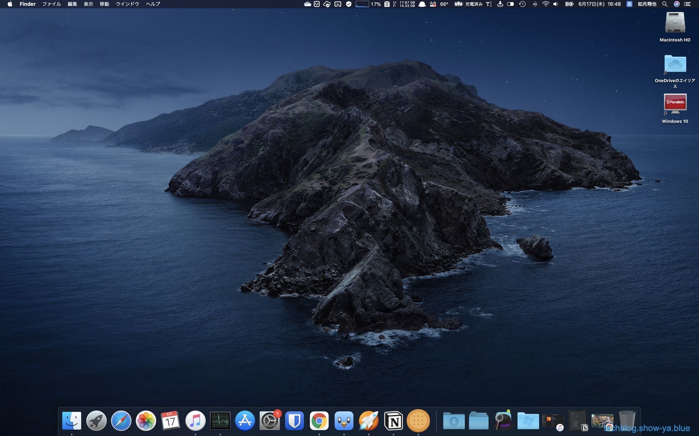
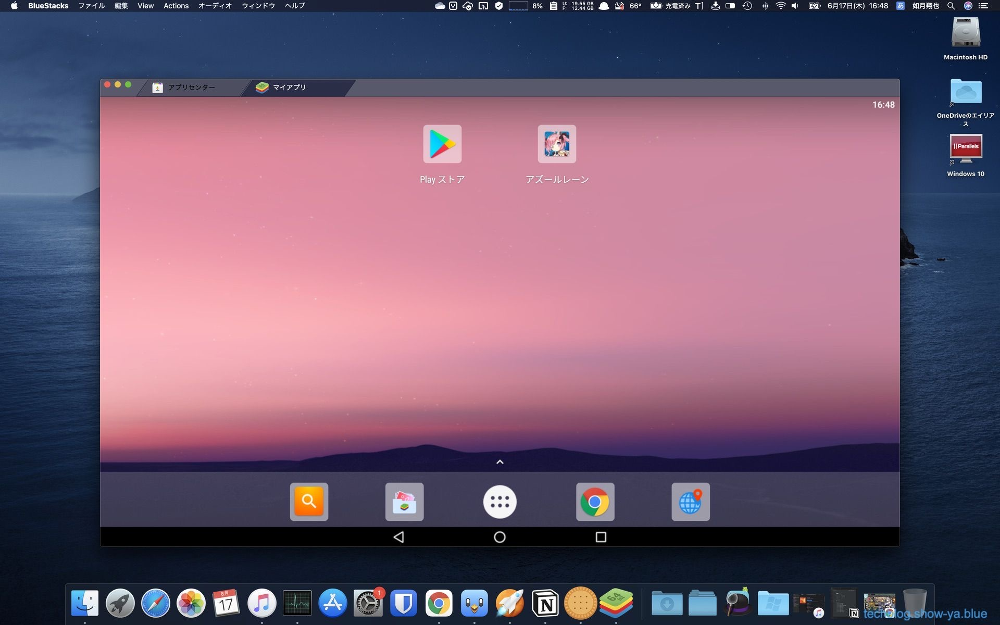
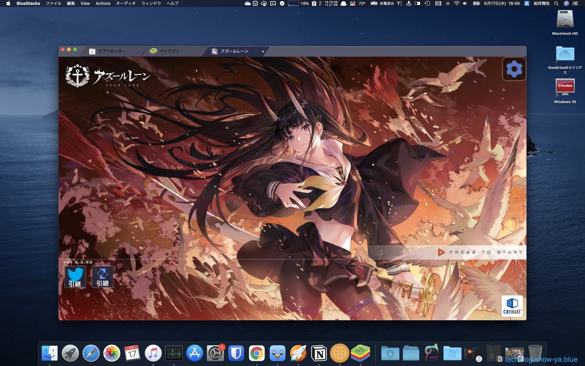
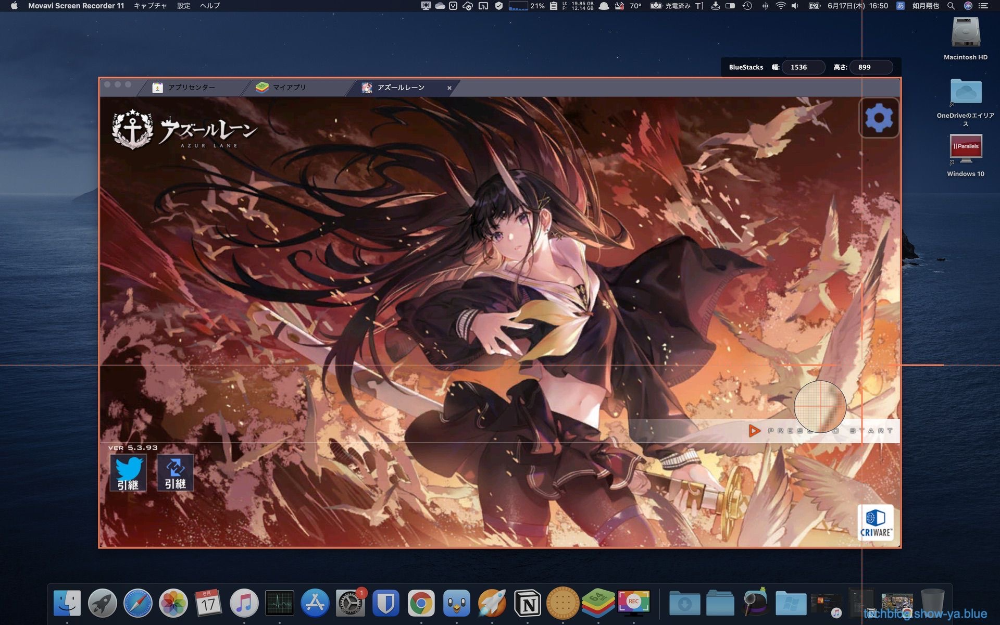
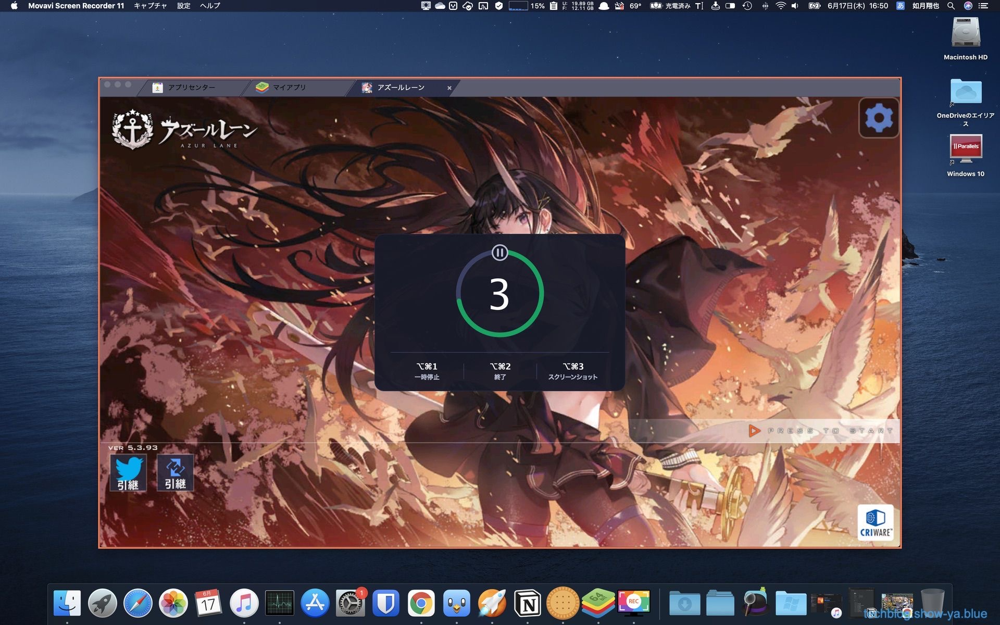
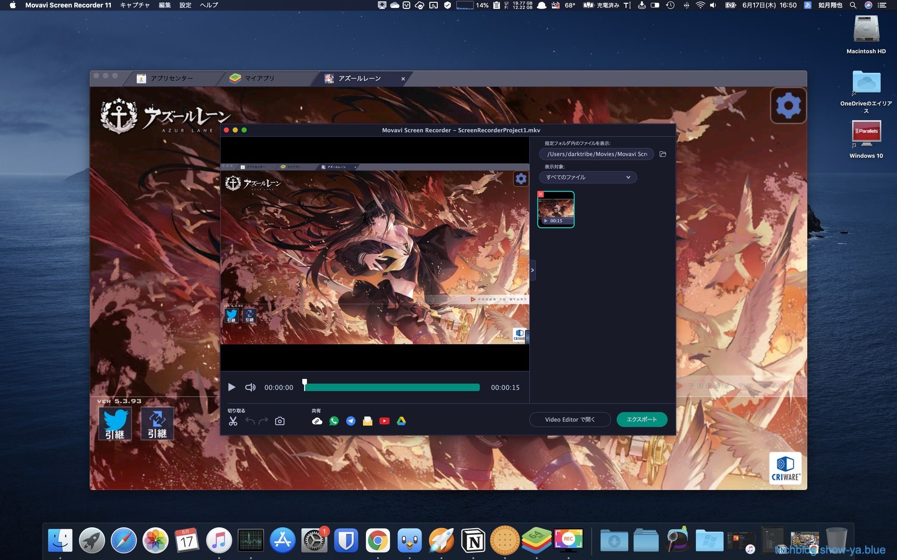

どうもこんにちは、如月翔也（[@showya\_kiss](http://twitter.com/showya_kiss)）です。  
　今日はインテルMac用のAndroid仮想化アプリであるBlueStacksと、Mac用のスクリーンレコーダーであるMovavi Screen Recorderを使って、Androidのゲーム画面を録画する方法について共有したいと思います。  

## Androidって単体で満足できる録画を撮る事ができないんですよね

　イメージで言うとAndroidって自由のイメージが強く、Androidなら大抵の事がなんとかできる・方法があるというイメージがあるんですが、実は現状AndroidではAndroid自身でプレイしているゲームの録画をうまく行う事ができません。  
　画面に録画マークが入ってしまったり、ゲームの内部音が録音できなかったりするのです。  
　パソコンと繋いで画面をパソコンに出力してキャプチャすれば、という結論に行きそうなものなんですが、それも駄目で、Android側からパソコンに繋いで画面キャストまではなんとかできるんですが、音声がとれないんですよね。  
　そういうわけで、Andoridって単体で満足できる録画を撮る環境がないんです。  

## でもゲーム画面を録画したいニーズがあったりするので大変です

　しかしゲームの全てがiOS向けにあるわけではないですし、年齢区分の問題からiOSでは決してできないゲームなんかもあるのでAndroidのゲームをプレイしたいニーズは存在しますし、そしてプレイしたいニーズが有るのであれば記録したいニーズも発生する訳で、手段はないんですがニーズが確実に存在するのです。  

## そこでインテルMac用のAndroid仮想化アプリBlueStacksを使ってMacで録画を取ろうと思います

　しかし、インテルMacならこの問題解決できます。  
　インテルMacにはAndroidを仮想化するBlueStacksという無料アプリがあり、これを使ってMac上でAndroidを仮想化してプレイする事で、その画面をMac側から録画する方法があるのです。  
　今回はBlueStacksと遊ぶゲームはインストール済み、録画にはMovavi Screen Recorderを使う形で方法をご紹介しようと思います。  
　BlueStacksのインストールは難しくないですし（ただしインテルMacである必要があります）、画面録画方法はMovavi Screen Recorderじゃなくても録画はできるので必要に応じて読み替えて下さい。  

## 録画方法は次のとおりです

　さきにざっと流れを説明すると、「BlueStacks起動」「ゲームを起動」「Movavi Screen Recorderを起動」「Movavi Screen Recorderで録画」「終了」の流れです。  
　何も難しい事はしていないので安心して使って下さい。

### まず何も起動していない画面です

　まず何も起動していない画面です。Catalinaなので背景があれですがインテルMacならBIG SURでも大丈夫です。  
  
　アプリケーションから「BlueStacks」を選択して起動します。  

### BlueStacksが起動しました

　BlueStacksが起動してきました。ちょっと大きめな画面なんですが、私の趣味というか、大きくないと字が読めないので仕方なくです。  
  
　真ん中右に「アズールレーン（任意のゲーム）」のアイコンがあるのでこれをクリックし、「アズールレーン」を起動します。  

### アズールレーンが起動しました

　アズールレーンが起動しました。このゲームを録画するのでそのまま録画したい場面まで進めて下さい。録画する時はカウントダウンがあるので余裕を持って準備して下さい。  
  
　この状態で「Movavi Screen Recorder」を起動します。アプリケーションから「Movavi Screen Recorder」を選択して起動します。  

### Movavi Screen Recorderが起動しました

　画面右端にMovavi Screen Recorderが起動しました。  
  
　録画をするので項目の真ん中、ビデオカメラのアイコンをクリックして録画モードにします。  

### どこを録画するかを選択します

　ピンクの枠が表示され、どこを録画するかを選択できます。画面クリックでクリックされたウィンドウを録画、ドラッグでその範囲を録画の選択ができます。  
  
　今回はアズールレーンのウィンドウを録画したいのでアズールレーンのウィンドウをクリックして選択しています。  

### 範囲選択したら録画ボタンを押します

　範囲選択ができたら録画を開始するのに録画ボタンを押します。アズールレーンのウィンドウの右下に赤丸の録画ボタンがあるのでそれを押します。  
  
　録画ボタンを押してからカウントダウンがあるので余裕を持って準備して下さい。  

### カウントダウンが始まります

　画面にカウントダウンが表示されます。1の次に録画スタートです。  
  
　ここから実際に録画が走るのでスーパープレイをしましょう。  

### 録画中です

　録画中です。写真には写っていないのですが、アズールレーンのウィンドウ右下に一時停止・停止・削除ボタンが表示されており、それらを押すまでは延々録画され続けます。  
  
　取りたい動画が取れたら停止マークを押して動画撮影を終了しましょう。すぐに動画ファイルが出力されます。  

### 動画ファイルが出力されます

　停止を押して録画を終了したらすぐに動画ファイルが出力されます。MKVファイルなので後でMP4にエンコードするといいでしょう。  
  
　この画面では動画を確認して簡単な編集をして、それをMP4にエンコードするところまでができます。  
　私は大体の場合この画面で編集はせず、後でHandBrakeを使って一気にMP4ファイルにしてしまっています。  

## という訳で録画ができました

　という訳で、AndroidのゲームをBlueStacksを使う事でMac上でAndroidを仮想化し、仮想化したAndroidでアズールレーンをプレイして、そのアズールレーンをMacのMovavi Screen Recorderを使って録画する、という作業の方法についてでした。  
　ゲームはアズールレーンに限らないですし、例えばDMM GAMESで出ているゲームで画面サイズが定まらないものについてはAndroid版があるのであればそれを使って最大画面で録画すれば録画環境が安定しているので良いと思います。  
　もちろん艦これなんかはAndroidを使うよりGoogle Chromeと艦これウィジェットを使って画面を切り出してその画面をキャプチャした方が早くて綺麗なんですが、録画環境については色々兼ね合いもあるので自分にとって一番良いものを選ぶのが大事なので、方法として「Androidを仮想化してMacでキャプチャする」という方法があるんだよ、という事自体は覚えておくと良いと思います。  

## 録画についてはQuickTimePlayer＋Blackholeでも行けると思いますが

　録画についてはMovavi Screen Recorderは有料アプリなので有料は勘弁、という人も多いと思うんですが、多分なんですけどQuickTimePlayerとBlackholeで行けると思います。  
　QuickTimePlayerはMac付属の純正アプリ、Blackholeは無料のオーディオインターフェースです。Blackholeを使って「自分のパソコンの音を自分のパソコンでキャプチャする」設定をしてあげて、その状態でQuickTimePlayerを使って録画すれば音声の入った動画ファイルが生成されるはずです。ただ画面が異常に大きくなるのと、なにより設定が難しいのであまりお薦めはしないです。  

## まとめ

　という訳で、Androidのゲームを録画するのにBlueStacksとMovavi Screen Recorderを使って寝技で録画、という方法があるよ、というお話でした。  
　BlueStacksがインテルMac専用なのでM1搭載Macでは使えないテクニックなんですが、いずれBlueStacksがM1チップに対応したらまた使えると思うので「そういう方法があるよ」という事だけ記憶の隅に残して頂ければ幸いです。
