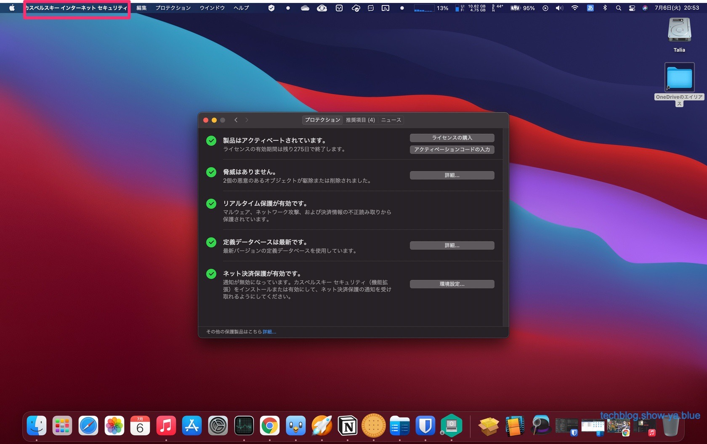
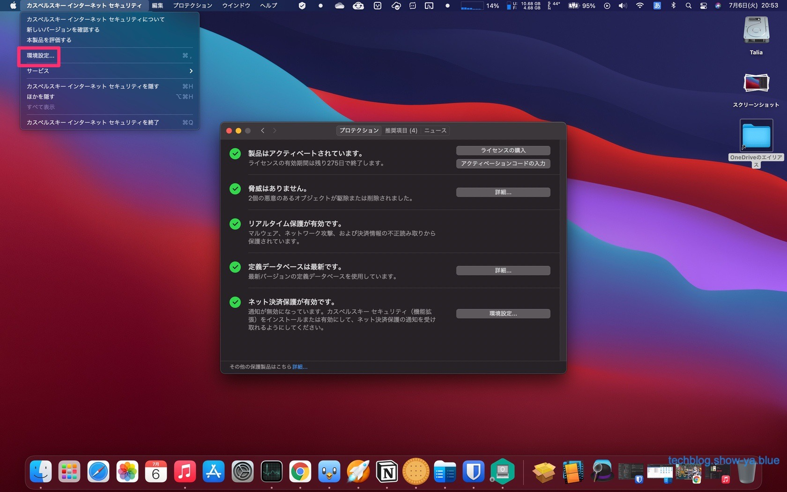
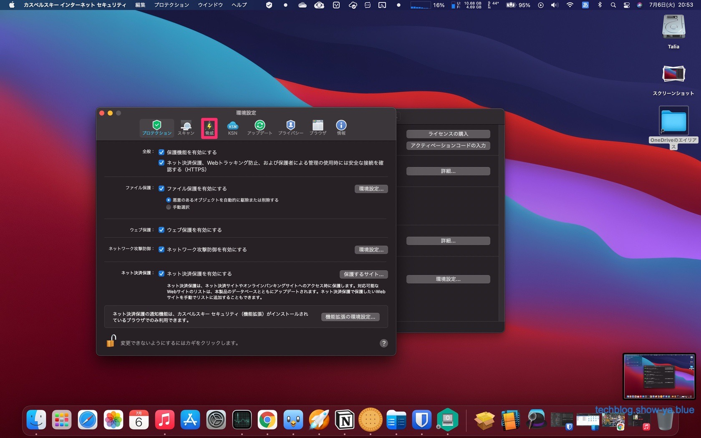
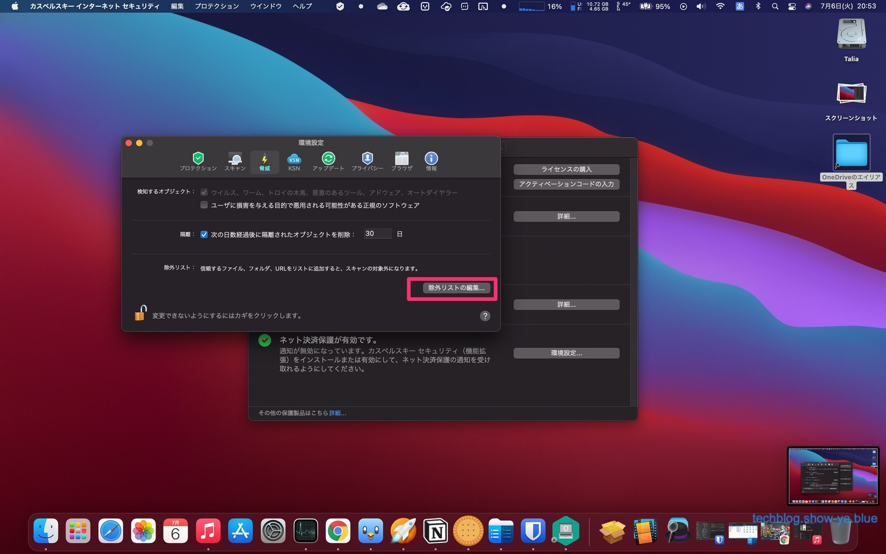
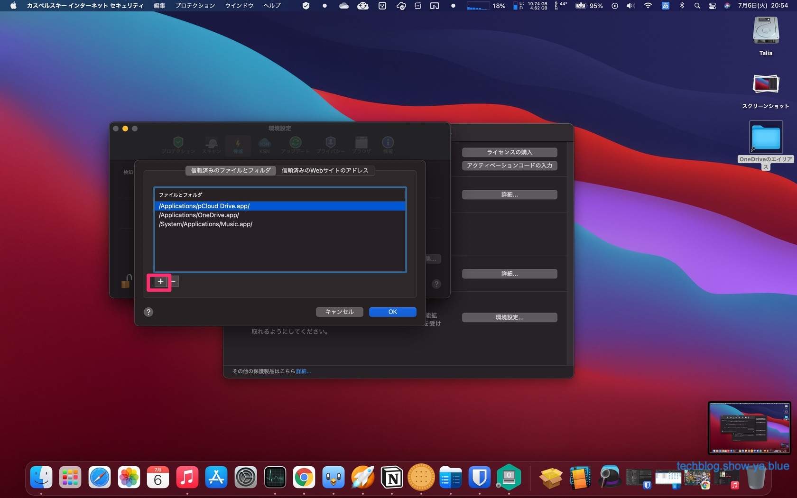
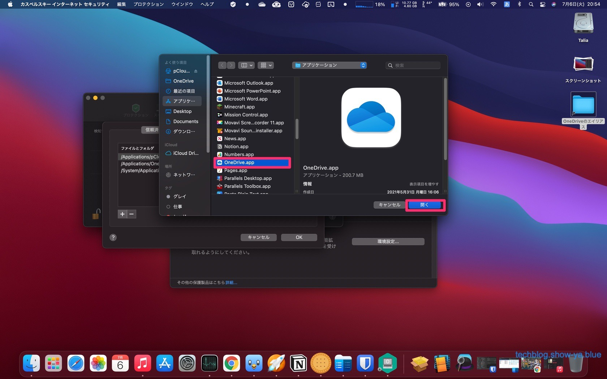

どうもこんにちは、如月翔也（[@showya\_kiss](http://twitter.com/showya_kiss)）です。  
　今日はpCloudの同期があまりにも遅いので使っているウィルス対策ソフトのカスペルスキーの監視を外して同期速度を倍くらいに上げた、というお話しをしたいと思います。なんとなく察しはつくと思うんですがハウツー記事に見せかけた戯言編成です。ついでにタッチタイピング練習中なので速度が出ずに調子が悪いです。  

## pCloudとは

　pCloudとはスイスのpCloud社が提供するクラウドストレージサービスで、他のサービスに比べると1割くらい安くてセキュアなサービスで、しかもそれ以上に独特なサービスとして「ストレージの買い切り」というサービスを提供しているのです。  
　pCloudは日本ではサービス展開していないので日本では知名度がまったくないので知らない人は知らないんですが、英語圏では結構有名どころらしく、英語の記事を拾うと結構名前が出てきます。  
　またCommander Oneというファイラーアプリでも連携先クラウドとして名前が出てきますし、同期に使うだけでなく仮想ドライブとしてマウントしたり一方的なバックアップを行ったり出来て使い勝手も悪くない感じなのでクラウドの選択肢としてはアリなんじゃないかと思います。  

## 2TBに350ドル課金したんですが

　pCloudの買い切りは500GBと2TBがあるんですが、今回私は2TBを350ドルで契約しました。  
　2TBのクラウドサービスって相場としては月額1200円・年額12000円なので、pCloudの買い切りはクラウドサービス3年分の前払いに相当する感じです。  
　まあソースネクストなんかを活用すればDropBoxは3年3万円で契約できるのですが、pCloudの場合買い切りなので3年以上使えればその分だけ得をした事になるので、まあ3年以上使えるように念じておきます。  

## ファイルの同期がとにかく遅く実測1MBpsくらいなのです

　早速契約して使っているんですが、アメリカサーバー相手ではファイル同期がとにかく遅く、実測値で転送速度が1MBpsくらいの結果なのです。  
　まあ他に使っているOneDriveもそんなに早いとは言えないストレージなんですが、転送が1MBpsだと1時間に3GBしか転送できないので2TBのスペックとしては弱いのです。概ねこういう系統のクラウドはマックス容量を転送して6日くらいが妥当だと思うので、500GBを転送するのに3日とかかけていられないと思うのです。  

## 速度制限はかかっていないアプリのはずなのでもうちょっと速度が出ても良いと思うのです

　pCloudは速度制限がかかっていないアプリのはずなのでアプリ側で転送速度を絞っている話ではないと思いますし、いくらサーバーがアメリカだったとしても1MBpsは多少なめていると言われても仕方がない速度なのです。  

## しかし何度やっても最初は5Mbpsくらいなんですがすぐに128kbpsとかになるので

　ですが設定のどこをいじっても速度は出ないですし、最初は5MBpsとか出るんですがすぐに速度が落ちて128kbpsとかになるので使っていてしんどく、一回同期さえとってしまえば後は差分なので回線スペックには依存しないで使えるとは言っても、その初回同期が延々終わらないと面倒を通り越して怒りが湧いてくるのでなんとかしないといけないな、と思っていました。  

## 我慢できないのでカスペルスキーインターネットセキュリティの監視を外しました

　そこで、速度が我慢出来ないので、pCloudは大丈夫なアプリだと判断した上でカスペルスキーインターネットセキュリティの監視を止める事にしました。  
　pCloudでやり取りするファイルは基本安全なものだけですし、やり取りするファイルの方でセキュリティを担保しているのでまあいいか、という判断です。  
　この監視を外すと速度が倍くらい出るので、pCloudでもそうだと良いな、と思って設定しました。  
　設定方法は以下です。  

## カスペルスキーインターネットセキュリティを立ち上げる

  
　まず設定するためにカスペルスキーインターネットセキュリティを立ち上げます。  
　普段から起動しているんですが、メニューを出すためにセキュリティセンターを立ち上げます。  

## 環境設定を開く

 　「カスペルスキーインターネットセキュリティ」から「環境設定」を開きます。  

## 脅威タブを開く

 　環境設定が立ち上がってくるので「脅威」タブを開きます。  

## 除外リストの編集を押す

 　カスペルスキーインターネットセキュリティの監視からアプリを除外したいので、除外するリストを編集します。  
　「除外リストの編集」をクリックします。  

## 信頼済みのファイルとフォルダから「＋」ボタンをクリックする

 　除外リストそのものが表示されますので信頼済みのファイルとフォルダから「＋」ボタンをクリックします。  

## 監視を外したいアプリを選んで「開く」を押す

 　アプリケーションフォルダを指定したファイル指定画面が出るので、監視を外したいアプリを選んで「開く」を押します。  
　信頼済みのファイルとフォルダにアプリが表示されたのを確認したら作業はお終いです。  

## 除外したいアプリ分だけ作業を繰り返せばいいです

　この作業を、監視から除外したいアプリ分だけ繰り返して行えばよいです。  
　ただ、ウィルス対策ソフトの監視を除外する作業なので、なんでもかんでも指定すれば良いというものではありません。  
　本当に信頼できるアプリと、監視を外さないと上手く動作しないアプリだけを登録して下さい。  
　この設定によってセキュリティが低下しても、その結果何が起こっても私は責任をとれませんのであしからず。  

## 私は「ミュージック」と「OneDrive」と「pCloud」だけ除外しています

　私の場合、監視を外さないとクラウド経由で音楽が聞けなくなる（突然切れるようになる）ので「ミュージック」アプリと、あとクラウドストレージはローカル側でセキュリティを通しているのでとりあえず大丈夫、という観点から「OneDrive」と「pCloud」だけ監視を外しています。  

## 監視から除外したら平均速度が倍くらいになったので

　pCloudについては監視から除外したらベース速度が倍くらいに上がったのでとりあえず実用圏内の速度に落ち着いたので安心しています。  
　多分なんですけど今日一晩放置したら全てのデータがクラウドに上がって同期が万全な状態になると思いますので様子を見たいと思います。  

## まとめ

　という訳でpCloudの同期速度があまりにも遅いので最終手段としてカスペルスキーインターネットセキュリティの監視を外す手段に出て、それなりに速度が改善したよ、というお話しでした。  
　一回目の同期が終わってしまえば後は差分更新なのでそんなに帯域を食わない・速度はそんなに気にならないと言う話になるんですが、初回のデータ同期が500GB以上あるので結構イライラさせられますし、使い始めの時期は設定の微調整をしたかったりちゃんと動くか確認したいニーズが結構あってソワソワするのは正直あるので、慣れてさえしまえばなんともない事なんですが今の時期は色々気になって仕方がないですよね。  
　とりあえず様子を見ていこうと思います。
