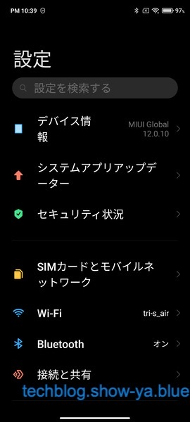
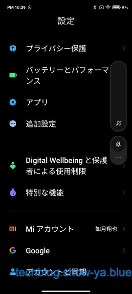
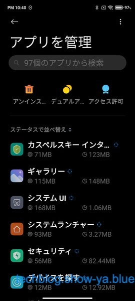
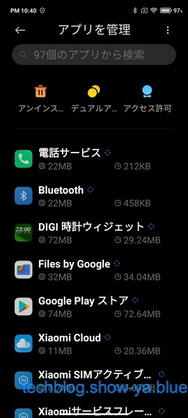
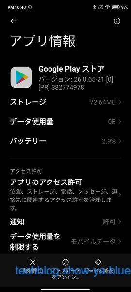
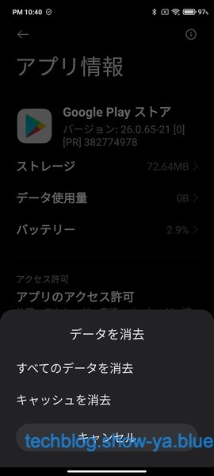
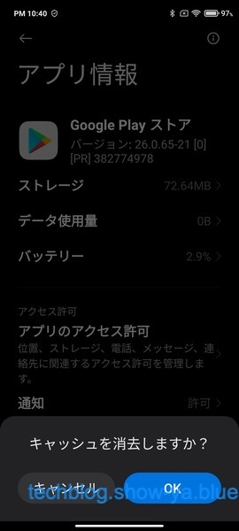
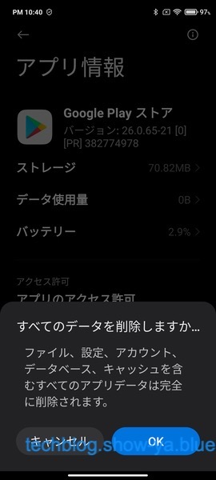
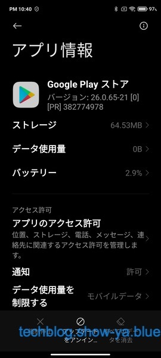

どうもこんにちは、如月翔也（[@showya\_kiss](http://twitter.com/showya_kiss)）です。  
　今日はXiaomiのRedmi note 9s（あるいはRedmi note 10）を使っていて、Google Playのアプリ購入が「すでに所有しています」のエラーでダウンロードできない場合の対応についてお話します。ネタとしてはAndroid全般の話なんですがRedmi noteの操作方法に特化して書きますね。  

## Google Playですでに購入しているアプリが「インストール」表示ではなく金額表示で、買おうとした時に「すでに所有しています」エラーが出る場合

　Google Playですでに購入しているアプリを再ダウンロードする場合ってあると思うんですが、時々本来は「インストール」という表示がされていてそこからダウンロードできるはずなんですが、金額表示になっている場合があります。  
　この場合買い直すつもりで金額表示をタップして購入処理を行っても「すでに所有しています」というエラーが出て購入できない場合があります。  
　もちろん購入済みのアイテムが「インストール」表示になっていない時点でGoogleの問題なので買い直す必要はなく、トラブルシュートすればいいだけの話です。  

## この問題、原因はGoogle Playのキャッシュの問題です。キャッシュをクリアすれば治ります。

　端的に言うと、この問題はGoogle Play ストアのキャッシュの問題で、キャッシュをクリアした状態でGoogle Play ストアにアクセスすれば正しい情報が読み込まれて「インストール」表示になります。そしてそこからアプリを再インストール出来ます。  
　分かる人はこの情報だけで問題解決まで行けるんですが、もうちょっと詳しい情報が欲しい場合Androidの機種によって細かい作業方法が違います。  
　私は今持っているAndroidはXiaomiのRedmi note 9sとRedmi note10だけなのですが、この両機種はMIIUIで作業方法が一緒だったので詳しく説明しますね。  
　Redmi note以外をお使いの方は「アプリ」の設定から「Google Play ストア」を選び、「キャッシュのクリア」を行えば問題ないです。  

## まず「設定」アプリを開きます

  
　こういう画面が表示されると思います。  
　この画面を下の方までスクロールしていくと「アプリ」の項目が見つかります。  

## アプリの項目を見つけます

  
　「アプリ」の項目が見つかりました。この「アプリ」の項目を開きます。  
　「アプリ」の項目が開いたら「アプリを管理」を選びます。  

## 「アプリを管理」が開きます。

  
　「アプリを管理」の項目が開きます。色々なアプリ名が表示されているので下までスクロールして「Google Play ストア」を探します。  

## 「Google Play ストア」を開きます。

  
　「Goole Play ストア」の項目が見つかったらその項目をタップして「Google Play ストア」を開きます。  

## 「データを消去」をタップします。

  
　キャッシュをクリアするために「データを消去」をタップします。画面一番下です。  
　ちょうどウォーターマークがかぶさっていて見づらいんですが、四角を斜めにしたアイコンの下が「データを消去」です。これをタップします。  

## 「キャッシュを消去」をタップします。

  
　キャッシュを削除するために「キャッシュを消去」をタップします。  

## 「キャッシュを消去しますか」にOKと答えます。

  
　「キャッシュを削除しますか？」と聞かれるので「OK」をタップします。  
　これでGoogle Play ストアのキャッシュがクリアされるのでアプリの表示が「インストール」になるはずです。  

## ついでに全てのデータを消しておきます。

  
　ついでに全てのデータを消しておきます。もう一度「データを消去」を選ぶと今度は問答無用で「すべてのデータを削除しますか」の確認がでるのでOKを押しておきます。  
　これでGoogle Play ストアの問題は全て解決しているはずなのでGoogle Play ストアからアプリの再インストールを試してみて下さい。  

## 完了したら「設定」アプリは閉じてしまって構いません

  
　キャッシュと全てのデータを消したら「設定」アプリは閉じてしまって構いません。  
　これでアプリの再インストールが普通にできるようになっているはずです。  

## 私は今回PowerAmpを課金しようとしてRedmi note 9sは大丈夫だったんですがRedmi note 10が駄目ったんですよね

　今回のトラブルシュート、私はPowerAmpという音楽用アプリのPro課金をしようとしていて、Redmi note 9sでは問題なく購入できてPro展開出来たんですが、続いてRedmi note 10でPro展開しようとしたら金額表示になってしまって、まあ250円ならいいか、と思って課金ボタンを押したんですが「すでに所有しています」のエラーで課金もダウンロードも出来なかったんですよね。  
　ざっと調べて「Google Play ストア」のキャッシュの問題だとあたりはついたんですが、いざRedmi note 10でキャッシュをクリアしようと思ったらRedmi noteはMIIUIなのでプレーンなAndroidと違ってメニュー構造が違ったので結構手間取ったのです。  
　なので今回はRedmi note 9sとRedmi note 10用の記事として起こしたんですが、誰かの役に立てれば幸いです。  

## 普段Androidをあんまり触らないので今回は結構手間取りましたがこれからAndroidも勉強していこうと思います

　私、基本はApple信者なのでAndroidは普段あんまり触らないんですが、そのせいで今回結構手間取った部分があるので、これからは意識してAndroidも触っていこうと思います。  
　メイン使用ではないんですがサブスマホとしてはこれからもAndroidを選んでいくつもりですし、AndroidにはAndroidにしかできない事があるので（まあiPhoneにもiPhoneにしかできない事が大量にあるんですが）勉強にもなりますし触っていて楽しいのは正直あるので色々触ってどんどんトラブルシュートしていければいいんじゃないかと思います。

## まとめ

　という訳で、Google Play ストアで以前購入したアプリをダウンロードしようとしたら「インストール」表示ではなく金額表示になっている状態で、金額から購入を選択しても「すでに所有しています」というエラーで購入もダウンロードも出来ない場合、Google Play ストアのキャッシュの問題が考えられるので設定アプリからアプリの設定を開き、Google Play ストアのキャッシュをクリアすれば問題が解決してインストールできるようになりますよ、というお話しでした。  
　もしかしたらAndroid使いの人には常識なのかも知れませんが、少なくとも私は初対面の問題でしたし解決に手間取ったので問題の根っこと解決方法について共有しておきます。  
　このブログではApple製品を扱う事が多くてAndroidの話はあんまり出ないんですが、時折こんな感じでスポットで扱うので気にかけていただけると幸いです。
