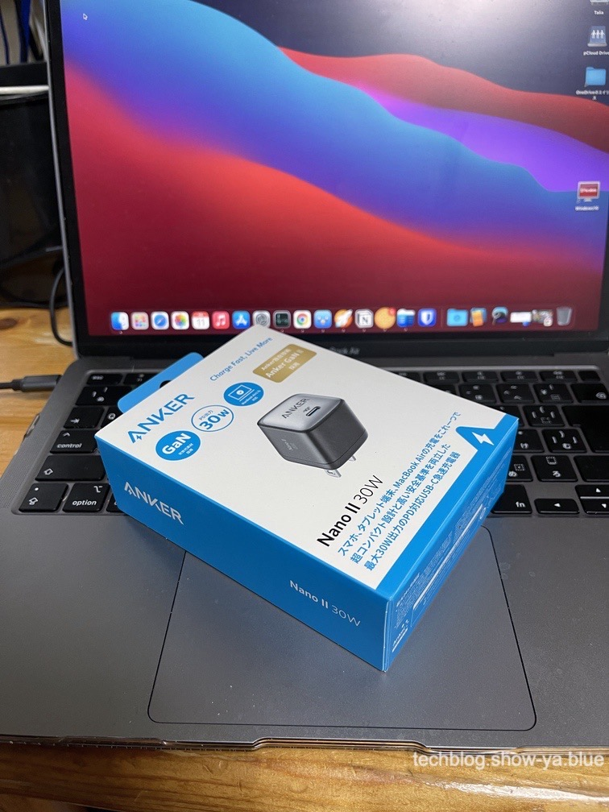
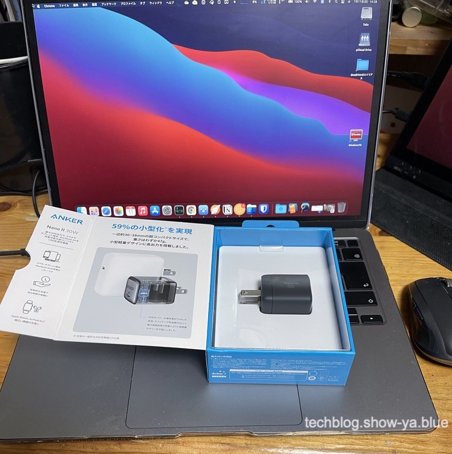
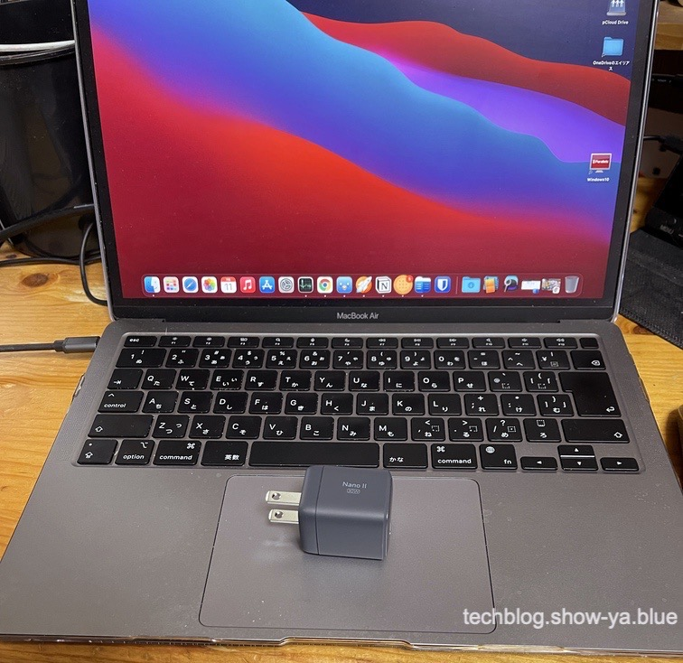

どうもこんにちは、如月翔也（[@showya\_kiss](http://twitter.com/showya_kiss)）です。  
　今日はAnkerのGaNIIの30W充電器を購入した、というお話しを中心に戯言編成でお送りしたいと思います。  

## AnkerのGaNIIの30W充電器とは

　AnkerのGaNIIの30W充電器とは、Anker社が製造・販売する窒化ガリウムを使った新しい設計の30W出力の充電器を指します。  
　ついこないだまで45WのGaNII充電器だけが出回っていたんですが、ついに満を持して30Wの充電器が発売されたのです。  
　60Wも追って発売されるので興味を持っている人もいるんじゃないでしょうか。  

## 基本的にはただの30Wの充電器なのですが新技術で物凄く小さく出来ているのです

　GaNIIの30W充電器は要するにただの充電器なのですが、窒化ガリウムを使って更に新設計で体積を大きく減らしており、ぶっちゃけ物凄く小さいのです。  
　どれくらい小さいかと言うと昔のiPhoneについてきた5Wの充電器を一回り二回り大きくしたくらいのサイズで、Apple純正の20W充電器と比べると遥かに小さいサイズに収まっています。  
　口で言ってもサイズ感は伝わらないと思いますので、アンボクシングしてサイズをお見せしますね。  

## アンボクシングをお送りします

　という訳でAnkerのGaNIIの30W充電器のアンボクシングをお送りします。  
　とは言っても箱、箱を開けたら、中身、くらいの簡単な写真だけです。  

### アンボクシング：外箱

  
　外箱のサイズです。本体サイズは物凄く小さいんですが箱が無駄に大きく、「もしかして中身も相当大きいんじゃ？」と誤解するくらいです。  

### アンボクシング：箱を開けたら

 　外箱は開く仕様になっているので開いたらこんな感じでした。  
　なかにちょこんと本体がはいっており、後は空気です。  

### アンボクシング：中身

 　中身は充電器1個ですが、非常に小さいです。  
　私はAnkerのGaNを使った20Wの充電器を愛しており4つくらい持っているんですが、それを一回りだけ大きくした感じです。  
　手に握り込めるサイズなので取り回しは楽だと思うので、結構良いサイズ感です。  

## 従来のAppleのACアダプタと比べると4分の1サイズなのです

　AnkerのGanIIの30WW充電器については、本体サイズで言うとAppleの純正ACアダプタに比べると4分の1くらいのサイズです。  
　ほぼスマホ用の充電器と変わらないサイズなのにM1搭載MacBookAirをフルスペックで充電できるので素晴らしい性能ですし、素晴らしいサイズ感です。  
　難を言えばコンセントの差し込み部分を収納する機能がついていないのでMacBook本体と一緒にかばんに放り込んだらMac本体に傷がつく恐れがあるんですが、充電器をポーチにいれるだとかMacBookにカバーを付けておくだとかで対処できるので各々で対処すれば良いと思います。  

## このサイズなら持ち運びも楽なので

　このサイズ感だと持ち運びが楽で、例えば旅行に行く時にMacBookAirを持っていきたい時、ACアダプタはかなり邪魔になるんですが、AnkerのGaNIIの30Wの充電器なら邪魔にはならないでしょうし、これにUSB-CtoCケーブルを持ち歩けばいつでも充電可能なので荷物としてはかなり便利な部類に入ると思います。  
　このサイズで30Wの給電が可能だというのはにわかには信じられないんですがそれだけ出力がある製品だと言うので非常に良いと思います。  

## お値段も3000円くらいと非常に買いやすいですし

　AnkerのGaNIIの30W充電器は大きさが素晴らしいだけでなく、お値段もすばらしくて、これだけの性能がある充電器なのにAmazonで3000円しないのです。  

リンク

  
　Appleの純正の20W充電器が2000円である事を考えれば充電能力が1.5倍で値段も1.5倍なので素晴らしいコスパだと言えて、こういうのは性能が1.5倍なら値段は倍というのが常識なので、物凄く安いと言っていいと思います。  
　Appleの純正の30Wのアダプタが5280円なのでACアダプタが壊れたらこっちを買う方が安いくらいなので、値段としてもかなり頑張っている価格だと思います。  

## M1対応MacBookAirを持っている人はみんな買っても良いんじゃないでしょうか

　正直M1搭載MacBookAirを持っている人はサブの電源としてみんな買っても良いんじゃないでしょうか、と思います。  
　軽くて小さくて持ち運びに便利でフルスペックで充電できて値段が安くて信頼できるメーカーの製品なので文句のつけようがなく、ACアダプタが死んでから買うと届くまでの間MacBookAirが使えなくなるのでACアダプタが死ぬ前に買っておく事をお勧めします。  
　なんと言っても3000円しないですからね、保険としてはかなり安い部類だと思います。  

## 良い買い物でした

　という訳で、今回は良い買い物が出来たと思います。  
　まあ実際に使ってみて触れないほど爆熱を発するとかだと困るんですが、Ankerなので流石にそんな事もなかろうと思いますし、近々旅行の予定があるのでその時にテストがてらに持っていこうかな、と思っています。  
　そもそもMacBookAirがバッテリーおばけなのでそんなに充電器が必要なシチュエーションはあまりないんですが、1日1回くらいは充電しないと辛いですし、出先では充電場所が確保できたらそのタイミングで充電しておくのが鉄則なので、いつもMacBookAirと一緒に持ち歩こうと思います。  
　二度言いますがいい買い物でした。  

## 戯言：この写真Pixelmator Proを使って補正してPhoto Bulkで処理しているんですが

　尺が余ったので別のお話をしたいと思います。  
　今回ブログに使っている写真、iPhone12ProMaxで写真を撮ってPixelmator Proで切り取りとマシンラーニング補正を行い、最後にPhoto Bulkを使ってリサイズとメタデータの削除、ウォーターマーク入れとリネームを行っているんですが、どうでしょうか。  
　この前dポイントと楽天ポイントを錬金してiTunesカードのポイントに変換したのでアプリを色々買って試しているのですが、撮って出しに比べると写真のクオリティが相当違う気がします。  
　まあ気のせいかもしれないんですが、Pixelmatorでマシンラーニング補正をかけた時は目に見えて色味が変わりましたし、Photo Bulkでの処理は手作業ですると物凄く面倒臭い作業で、作業をパスするか写真を載せないか、というくらいに面倒なのが自動化出来ているので非常に助かっています。  
　個人的にはPixelmator Proの処理もPhoto Bulkの処理も相当気に入っていて、これらがあれば自分でも写真を撮って載せようというモチベーションに繋がるのでこれからもどんどん使っていきたいですし、とりあえずブツ撮りをするのを癖にしていきたいな、と思うので気楽にやっていきたいと思います。  

## まとめ

　という訳で、AnkerのGaNIIの30W充電器を買ったよ、というお話しでした。  
　想像以上に小さくて軽いので使い勝手は良いだろうなと思っており、次の旅行で活躍して貰おうと思います。
