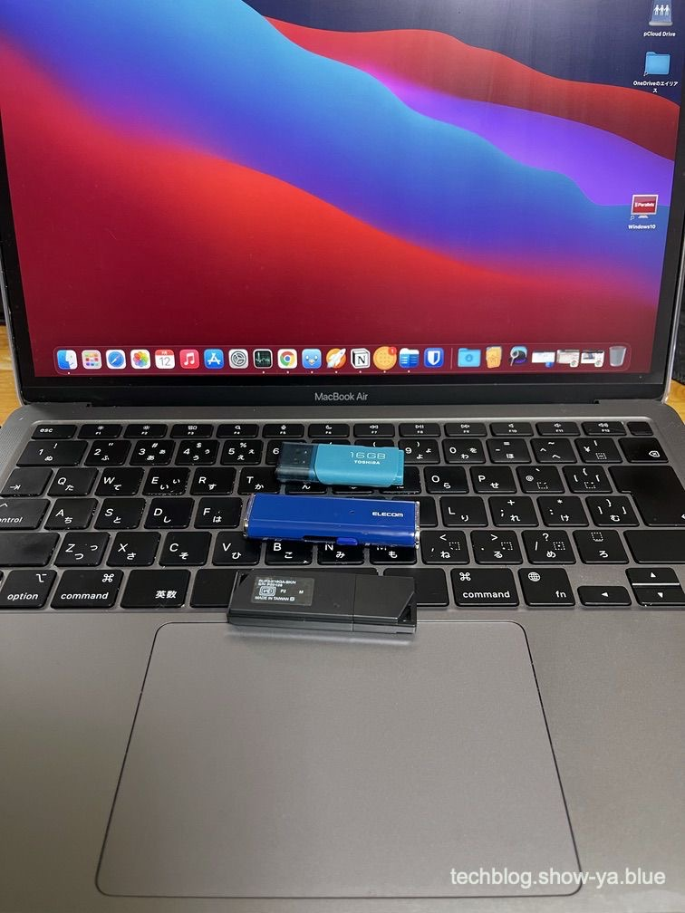
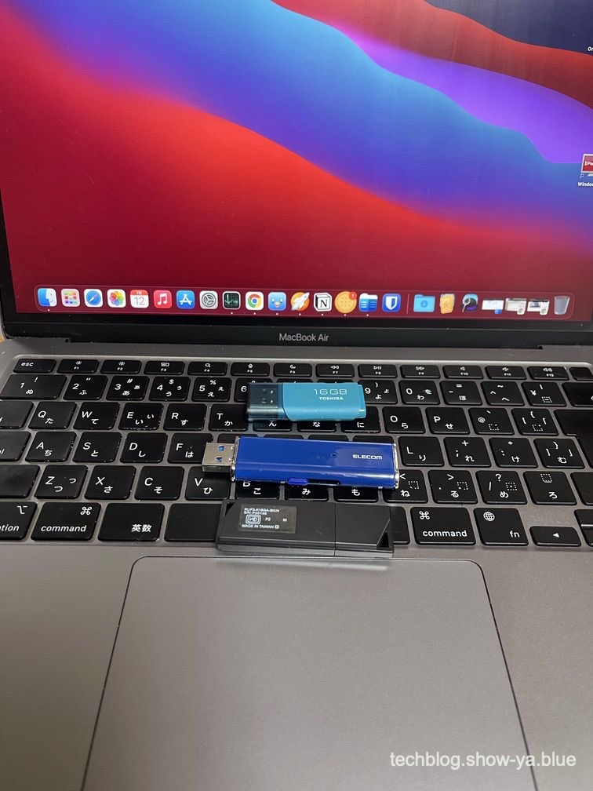
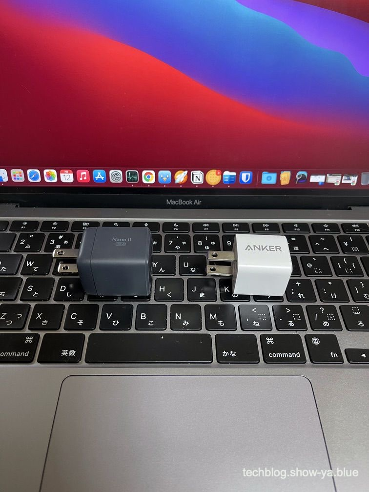
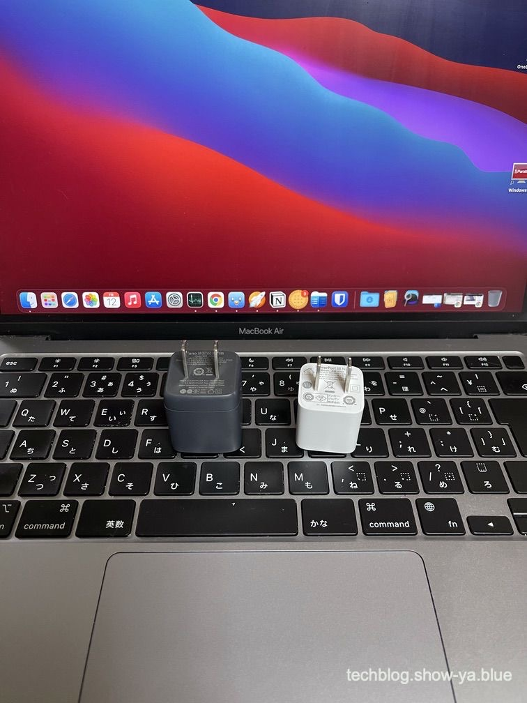

どうもこんにちは、如月翔也（[@showya\_kiss](http://twitter.com/showya_kiss)）です。  
　今日は「ガジェットは小さい方が良い」と言うタイトルで、私の持っているエレコムの1TBのSSD・ESD-EMN1000GBUとAnkerのGaNIIの30W充電器・Anker Nano II 30Wについてレビューをお送りします。レビューの体裁ですが戯言編成です。  

## ガジェットは小さい方が良い

　概ねのガジェットに言える事なんですが、ガジェットは小さい方がより良いものだと言えるのです。Bigger is BetterではなくSmall is Smartなのです。  
　大きいガジェットは取り回しに苦労しますし置く場所を決めるだけで一苦労ですが、小さいガジェットはそういうことはなく小さくてなくす恐れはあるんですがそれを除けば取り回しについてはパーフェクトに近く、安い値段で小さく利便性の高いガジェットというのがある意味理想なガジェットなのです。  

## 取り回し・持ち運びが楽なので

　小さいガジェットは取り回し・持ち運びが楽なので使い勝手が良く、特に普段から依存度の高いストレージや充電器なんかは小さくまとまっている方が普段からの持ち運びに便利ですし、小さい方が気軽に持って歩けるので必要な時にかばんなりポケットに入っている確率が高くいざという時に手元にあって助かるのは小さいガジェットなので、ガジェットは選択の余地があるなら小さい方を選んでおくのが鉄則なのです。  

## 私は1TBのポータブルSSDとAnkerのGaNIIの30W充電器を持っていますが非常に小さいです

　私は1TBのSSDとしてエレコムのポータブルSSDのESD-EMN1000GBUと、30Wの充電器としてAnkerのGaNIIの30W充電器Anker Nano II 30Wを持っていますがどちらも非常に小さくて取り回しが楽で、非常に助かっています。  
　私の使っているM1搭載MacBookAirはストレージが256GBしかないので大きなデータは置いておける余裕がなくクラウドドライブも使うんですが速度的にSSDの方が早いですしポータブルSSDを使うんですが、いつもポケットに入れて持ち歩けるサイズなので非常に助かっています。  
　AnkerのGaNIIの30Wの充電器Anker Nano II 30WもApple純正のACアダプタに比べると4分の1以下のサイズなので持ち運びに便利で、旅行なんかに行くときは純正アダプタではなくこちらを持っていこうと思っています。  
　では実際のサイズ感を見ていきましょう。

## エレコムのポータブルSSD：ESD-EMN1000GBU

　エレコムのポータブルSSD；ESD-EMN1000GBUは手のひらサイズ・普通のUSBメモリと変わらないサイズで1TBのSSDです。  
　価格も1万円をちょっと超える程度で買いやすく、転送速度も非常に高いですし動作も安定しているのでお薦めです。  

リンク

　これです。  

### 大きさはこんな感じです

　ESD-EMN1000GBUのサイズ感はこんな感じです。   
　上下に比較対象のUSBメモリを置いてありますが、下のUSBメモリとサイズがほぼ違わない事がわかるでしょうか。  
　上のUSBメモリは小型タイプなのでそれには叶いませんが、通常サイズのUSBメモリとほぼ変わらないサイズである事がわかると思います。  

### 収納してあるUSB-Aプラグを出してもこんな感じです

　ESD-EMN1000GBUはUSB-Aプラグを本体内に収納するタイプのポータブルSSDなので、使う時はUSB-Aプラグを出す必要があります。  
　出した状態でこのサイズ感です。  
  
　キャップを外すタイプのUSBメモリに比べれば大きくなってしまいますが、それでも十分小さいのがわかって貰えると思います。  
　このサイズで転送速度が350MBpsくらい出るSSDなので、普段から持って歩いて色々なパソコンに繋げて使う運用が可能です。  

### ポータブルSSDとして非常に使いやすいです

　このサイズ感もあり、ESD-EMN1000GBUはポータブルSSDとしては非常に使いやすいです。  
　私はメインパソコンのデータをこのポータブルSSDに全部入れ、サブパソコンを使うときやサブ以下のパソコンを使う時にデータを参照するのに使っています。  
　またメインパソコンのデータが全て入っているのでバックアップの一部としても活用していて、いざという時はここからデータ復旧をしようと思っています。  

## Anker Nano II 30W

　Anker Nano II 30Wは手のひらに握り込めるサイズのGaNIIを使った30Wの充電器です。  
　30Wという事はM1搭載MacBookAirを普通に充電できるスペックなのですが、信じられない事にAnkerの20Wの充電器をほんの1周り大きくしただけのサイズなのです。  
　価格もAmazonでは3000円を切る価格で販売されており、このスペックの充電器が3000円という値段は破格なのです。  

リンク

　これです。  

### 大きさはこんな感じです

　Anker Nano II 30Wのサイズ感はこんな感じです。  
  
　比較対象としてAnkerの20Wの充電器を並べてありますが、ほんの1回りしか大きくないのがわかると思います。  
　比較対象のAnkerの20W充電器が小さすぎるので（コンセントに何個指しても干渉しないサイズなので）大きく見えるかも知れませんが、Anker Nano II 30W自体物凄く小さな充電器です。  

### 差込口部分のサイズはほぼ20Wと変わりません

　立てるとわかるんですが、差込口部分のサイズは20Wの充電器とほぼ変わりません。  
  
　本体がちょっと大きいのでコンセントに2個並べようとすると干渉するサイズではあるんですが、Apple純正の30WACアダプタを挿すのに比べればかなり小さいですし、重さも殆どないので荷物として持ち運ぶ時には非常に助かるサイズだと思います。  

### 30W充電器として非常に使いやすいです

　Anker Nano II 30Wは本体は小さいんですが充電器としてスペックで劣っている部分はなく、小さくて運びやすいサイズなので持ち運んで使う時に大きなアドバンテージがあり、またAppleの純正の30Wの充電器は5280円なので価格的にも半分くらいですし、何かあった時のために1個持っておくというのは良い考えだと思います。  
　ものとしてよく出来ていますし、信頼のAnker製なので安心して使えると思います。  

## 小さいということはそれだけで役割を持っているので

　ガジェットについては「小さい」という事はそれだけで持ち歩きが楽、動かして使えるという事を表しているので小さいというだけで一定の役割を持てているという事なので大きな意味があり、まあ小さくなる事で耐久に難が出るようではいけないんですがそうでもない限りは小さいほどスマート、使い勝手が良くなっていると言う事なので小さい方を選ぶのは良い考えです。  
　まあ物理キーボード搭載機だと小さくしたらキーボード配列が変則になって使いづらい場合があるのでキーボード搭載機は「小さいほど良い」とは言いづらいんですが、それ以外はだいたい小さい方が良いので小さい方を選ぶ癖をつけておくといいかもしれません。  

## まとめ

　という訳で、ガジェットは小さい方が良い、というお話しでした。  
　最近技術革新が進んで同じ性能でも物凄く小さく作れるガジェットが増えたので楽しいですよね。
