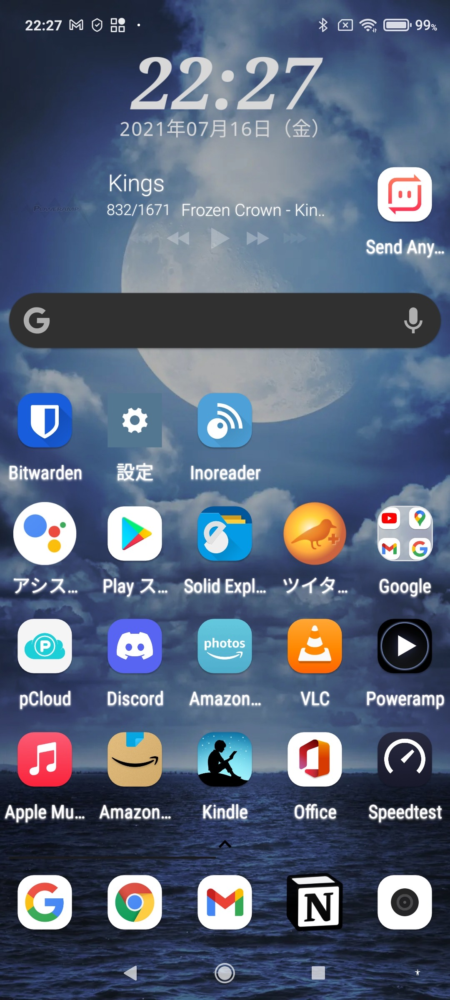

どうもこんにちは、如月翔也（[@showya\_kiss](http://twitter.com/showya_kiss)）です。  
　今日は私のサブスマホ環境であるRedmi note 10で使っているものについてお話ししようと思います。アプリ紹介の体裁をとった戯言です。  

## 私のRedmi note 10のホーム画面

　私の使っているRedmi note 10のホーム画面はこんな感じです。  
  
　本来のサブ環境であるRedmi note 9sのテスト環境なので、右上にアイコン2個分の欠損がありますが、ここは楽天LINKと楽天モバイルアプリが入る場所です。  
　色々な変更をRedmi note 10で試して、問題なさそう・便利そうなものをRedmi note 9sに展開しているので、色々試すのはRedmi note 10の役割です。  
　では、Redmi note 10（Redmi note 9sも）で使っているアプリについてご紹介します。

## Nova Launcher

　ホーム画面のカスタマイズのためにNova Launcherを使用しています。  
　便利なので課金していて、唯一の不満点はRedmi noteシリーズだとNova Launcherとジェスチャ操作が両立しない事なんですが、まあボタン操作でも困らないのでまあ良いか、と思っています。  
　見ての通りアイコン数を5x7にしてあり、時計ウィジェット、PowerAmpウィジェット、Google検索バーを配置しています。  

## Notion

　ドックメニューにはNotionをねじ込んであります。  
　オールインワンワークスペースアプリでクラウドメモを取りながら写真管理・動画管理・タスク管理・データベース管理しつつWiki並みにページを作れてMARKDOWNもどきも使える神アプリで、Windows/MacOS/Linux/iOS/Android全部にクライアントアプリがあるので全部に入れています。  
　スマホだとクラウドメモ程度にしか使いませんがたまにデータベースを覗いたりして楽しめるのでお薦めです。  

## Send Anywhere

　PowerAmpウィジェットの横にあるアプリがSend Anywhereのアプリです。  
　Windows/MacOS/Linux/iOS/Android全てにアプリがあるファイル送信アプリで、MacとiPhone間はAirDropでファイルを送れるんですがそれ以外の組み合わせだとAirDropが使えないのでSend Anywhereを使っています。  
　広告が若干うざいんですがまあ使い勝手は悪くないので良いんじゃないかと思います。  

## Bitwarden

　Bitwardenはパスワード管理アプリです。  
　オープンライセンスでWindows\_MacOS/Linux/iOS/Android全てにアプリがあり、各種のWebパスワードを強固でランダムなものを覚えておくのは不可能なので、Bitwardenを使って管理して、自分はBitwardenの強固なパスワードを1個だけ覚えておいて後はBitwardenにまかせておく、というのが比較的やりやすいのでAndroidにも導入しています。  

## Inoreader

　InoreaderはRSSリーダーです。  
　私は気に入ったサイトのRSSを大量に受け取っているので専用のクライアントが必要で、MacでBiscuitを使ってInoreaderでRSSを処理しているのでクライアントを合わせる意味でInorederを使っています。BiscuitでWindows/MacOS/Androidを網羅し、iOSとAndroidには専用アプリがあるのでOS全体をキャッチアップできています。  

## Solid Exploler

　Solid Explolerはファイラーアプリです。私は課金しました。  
　使いやすいファイラーで自身をFTPサーバにしてファイル転送を受ける機能があるのでフォルダ単位でファイルを移動する時はFTPサーバとして立たせると便利です。  

## ツイタマ＋

　ツイタマ＋はTwitterのクライアントアプリです。  
　複数カラムをスワイプして閲覧、ランドスケープモードで複数カラムを表示できるので採用しました。有料アプリです。  
　腰を据えてTwitterをする時に便利で、結構手放せない感じになっています。  

## pCloud

　pCloudはクラウドドライブです。  
　日本では無名なんですが、2TBのストレージを350ドルで買い切れるので一生2TBを使えるので凄く便利です。  
　PC用OSのアプリとしては同期・バックアップ・クラウドドライブという機能があるんですが、Androidアプリとしてはクラウドドライブの機能だけです。  
　しかしバックアップ・同期をとっているファイルにAndroidから直接アクセスできるので素晴らしい機能であり、私は外せないと思っています。  

## Discord

　Discordはゲーマー向けのチャット・ボイスチャットアプリです。  
　私はまれにオンラインゲームをするのと、あとオンセで遊んでいる息子にチャットを投げるのに使うのでインストールしています。  

## Amazon Photos

　Amazon PhotosはAmazonのサービスで、プライム会員ならRAW画像含めて画像ファイル全てを無制限でバックアップできるアプリです。  
　カメラが付いたデバイスには全部入れておくと撮った写真が全てバックアップされるので便利です。  

## VLC

　VLCはオープンソースの動画視聴アプリです。  
　pCloud内にある艦これの録画を見たりするのに使うのでインストールしてあります。  

## PowerAmp

　PowerAmpは音楽再生アプリです。私は課金しました。  
　音が良くイコライザの機能もあるので採用したんですが、Apple Musicがデバイス内の音楽再生が出来ないっぽいのでメインで使用しています。  
　棲み分けとしてはファイルとして持っている曲はPowerAmpです。  

## Apple Music

　Apple Musicに契約しているのでアプリをインストールしています。  
　持っていない曲をクラウド経由でストリーミング再生する時に使っています。  
　主に女声メタルのプレイリストを永遠に流しています。  

## Amazonショッピング

　Amazonでの買い物を良くするのでAmazonショッピングのアプリを入れてあります。  
　これで検索することは多いんですが、結局パソコンから買う事が多い気がします。  

## Kindle

　電子書籍を読むのにKindkeを入れてあります。  
　メインはiPad Pro10.5インチで読むんですが、記事を参考にして何かをする時なんかはAndroidから使う事があるのでインストールしてあります。  

## Office

　Officeは読んで名のごとくOfficeのアプリです。  
　ローカル・クラウドにあるExcelファイルやWordファイルを読むのに使います。  
　Microsoft365を契約しているので使わないのがもったいないので入れてあります。  

## Speedtest

　Speedtestはネット回線の速度測定を行うアプリです。  
　使っているWi-FiのスペックやSIMの速度を計測するのに使うアプリで、私は課金しました。  
　時々速度が気になるのでわりと使うアプリです。

## まとめ

　という訳で、サブのサブであるスマホ環境のRedmi note 10のホーム画面晒しとアプリ紹介でした。  
　Redmi note 9sの方は楽天Linkと楽天モバイルアプリがプラスされるだけで後は同じ環境です。  
　環境はかなり整ったので、これからガンガンに使っていければと思います。
