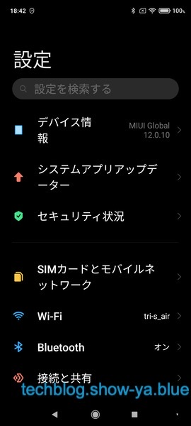
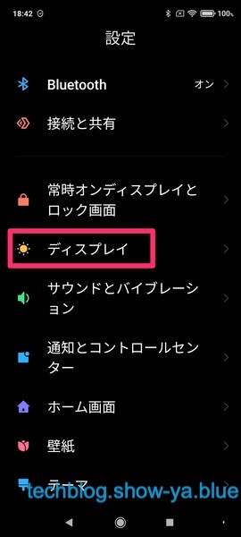
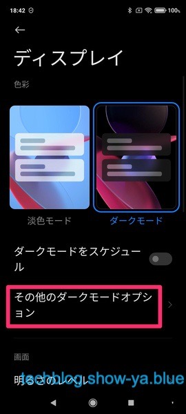
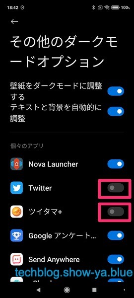
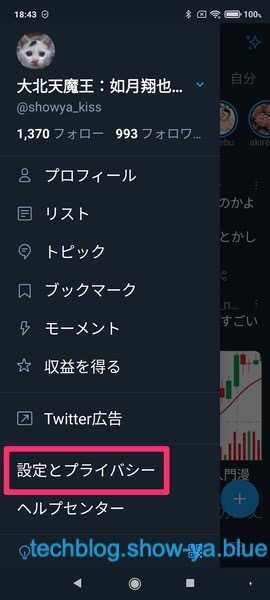
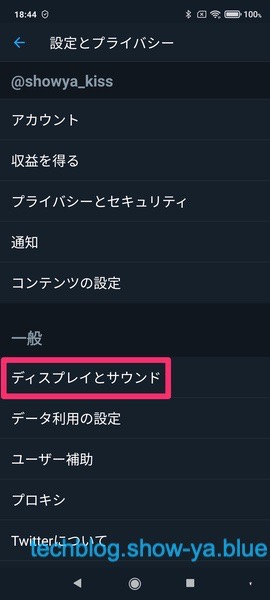
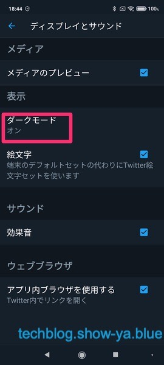
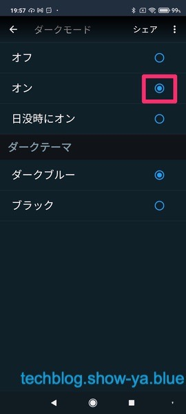
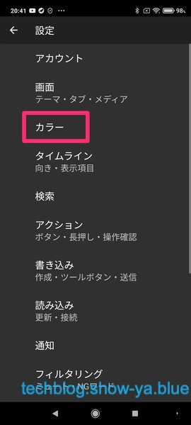
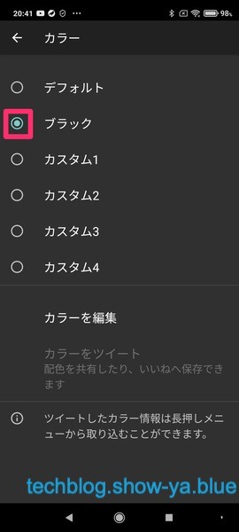

どうもこんにちは、如月翔也（[@showya\_kiss](http://twitter.com/showya_kiss)）です。  
　今日はAndroidのTwitterアプリ・ツイタマ＋アプリで白黒の画像が白黒反転してしまっている場合の直し方についてご紹介します。  
　持っているAndroidがRedmi note 9sとRedmi note 10なのでその場合でお話しします。  
　それ以外の方は「原因」の項目を見てご自身でチェックしてみて下さい。  

## Twitter・ツイタマ＋で白黒画像が反転するんです

　これRedmi note9sとRedmi note 10を買ってダークテーマを適用したときから起きている問題なのですが、タイムラインに流れている画像でカラーものは問題ないのに白黒画像だけ白黒反転して表示されてしまうのです。  
　Twitter・ツイタマ＋のアプリからダークテーマをオン・オフしても問題が解消しないですし、せっかくタイムラインに流れている素敵な絵がちゃんと見られないのはもったいなく、どうやって直せばいいのか考えていたのです。  

## 原因

　結果から言うと、原因はAndroidのシステムでダークモードがオンになっていて、その上で「個々のアプリ」のダークモードがオンになっている事です。  
　対処としてはAndroidのシステム自体のダークモードはオンのままでいいですが「個々のアプリ」ではオフにして、Twitterのアプリとツイタマ＋のアプリでダークテーマをオンにすれば、テーマは全部ダークのままでタイムラインの画像を白黒正しい色で表示する事ができます。  
　詳しいやり方について説明しますね。  

## まず設定アプリを開きます

  
　まず設定アプリを開きます。開いた画面では目に入りませんが下にスクロールすると「ディスプレイ」の項目があります。  

## 「ディスプレイ」を開きます

  
　画面を下にスクロールすると「ディスプレイ」の項目があるので「ディスプレイ」をタップします。  

## 「その他のダークモードオプション」を開きます

  
　開いた画面すぐ下に「その他のダークモードオプション」があるのでそれをタップします。  

## 「個々のアプリ」からTwitterアプリ・ツイタマ＋アプリをオフにします

  
　Twitterとツイタマ＋についてはシステムでダークモードにすると問題が起きるので、システムではダークモードをオフにし、単体のアプリ側でダークモードをオンにする必要があります。  
　なので、「個々のアプリ」からTwitterアプリとツイタマ＋アプリをオフにします。  
　これで問題が解消しました。  

## Twittierでアプリ側のダークモードをオンにする方法

  
　Twitterのアプリ側でダークモードをオンにする方法を共有します。  
　まずTwitterのアプリを開き、ハンバーガーメニューから「設定とプライバシー」をタップします。  

## 「ディスプレイとサウンド」をタップします

  
　開いたメニューから「ディスプレイとサウンド」をタップします。  

## 「ダークモード」をタップします

  
　ダークモードをオンにするために「ダークモード」の項目をタップします。  

## 「オン」にチェックを入れます

  
　ダークモードをオンにするために「オン」にチェックを入れます。  
　これでTwitterのダークモードがオンになりました。  

## ツイタマ＋でダークテーマをオンにする方法

  
　ツイタマ＋のアプリ側でダークモードをオンにする方法を共有します。  
　まずツイタマ＋のアプリを開き、三点メニューから歯車マークの設定をタップして設定を表示します。  
　出てきた設定メニューから「カラー」を選んでタップします。  

## 「ブラック」を選択します

  
　開いたメニューから「ブラック」を選択します。  
　これでツイタマ＋もダークモードになりました。  

## Androidはよくわからないです

　今回の件もそうなんですが、「システム」のダークモードと「個別アプリ」のダークモードで挙動が違い、「システム」の「個々のアプリ」でダークモードを設定しているとタイムラインの絵が白黒反転するなんていう事は全く予想がつかなかったので問題特定に非常に時間がかかりました。  
　一度システムのダークモードをオフにしたら問題が解消したんですがでもダークモードは使いたいですし、一回ダークモードをオンにしなおした時に挙動がやはりおかしかったので今度は個別のアプリでダークモードをオフにして試してそれでも駄目で、システムのダークモード自体が駄目なのか、と思って設定を深堀りしていったところ「個々のアプリ」という項目がありそのチェックを外すと問題が解消したのですが、全くわからないです。  
　iPhoneだとこのあたりシステムでダークモードにしたら後は自動で全部調整してくれますし、絵を反転するとか意味わからないので本当に勘弁して欲しいです。  
　しかしまあこうやってAndroidの設定をちょこちょこいじって色々知っていくのは大事なことだと思いますし、逆に言えばこういう細かい挙動までカスタマイズできるんだという事なので一つ一つしっかり覚えていこうと思います。  

## 尺が余ったので雑談でも

　という訳でタイムラインの絵が白黒反転する、というネタだけでは3000文字の尺を埋められなかったので雑談をしたいと思います。  
　今Androidを使っているという事で色々アプリを買っているんですが、予算があまり潤沢にあるとはいい難いのでなんとか課金ポイントを入手できないか、という事で今注目しているのがGoogleアンケートモニターです。  
　朝5時くらいにアンケートが届き、それに答えると10ポイントくらいからのGoogleのお金が貰えます。貯めてGoogle課金に変換できるGoogleポイントではなく、ダイレクトにGoogleウォレットに追加されるマネーです。  
　1アンケート10円くらいか、と思って適当に回答しているんですが（ちゃんとアンケートには答えてますよ）この前ハゲというか髪の毛のアンケートに答えたら83円もらえまして、これって真面目に毎回アンケートに答えていたら月100円とか200円とかになるんじゃないでしょうか。  
　Androidだとセールで100円200円になるアプリって結構ありますし、元の金額が100円200円のアプリも結構あるのでアンケートに真面目に答えていればそれなりにアプリ課金ができるので素敵だと思います。  
　私の場合毎月Microsoft365を契約して909円で9ポイント、アズールレーンの貿易証を980円で買って9ポイントついて月18ポイントGoogleポイントが貯まるんですが、この前300ポイントあったので300円に変換してアプリを買ったんですが、Androidはカジュアル課金で使えるアプリがあるのは非常に良いですよね。  
　私はNova Launcher、PowerAmp、Solid Explorerを課金したんですが結構使いやすくていいですし、今回のネタで使ったツイタマ＋もAndroid用のTwitterクライアントアプリとしては非常に良く出来ていて、これで1000円いかないのでかなりのお得感があっていいですね。  
　まああんまりカジュアルに課金していると感覚が狂うのと小銭でもお金なので首がしまっていく結果になるのであんまりやりすぎない程度にアプリを買って使っていければと思います。 　という雑談でしたー。
