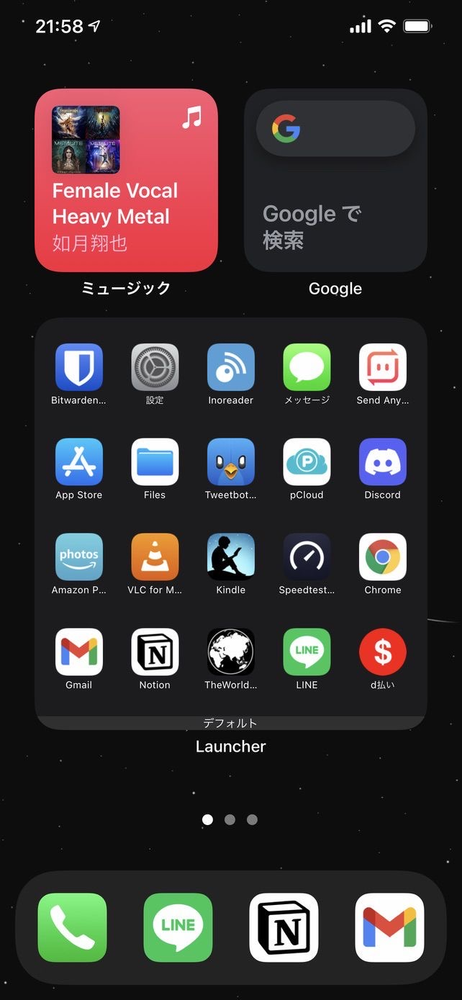

どうもこんにちは、如月翔也（[@showya\_kiss](http://twitter.com/showya_kiss)）です。  
　今日はiPhone用のウィジェットカスタマイズアプリ、Launcherを導入してホーム画面をカスタマイズしました、というお話しをしたいと思います。  
　載せているウィジェット・アプリなんかについてもお話できれば良いと思います。  

## Launcherとは

　LauncherとはCromulent Labsの開発・販売するウィジェットのカスタマイズアプリで、フリーミアムである程度の性能は無料で試せますし、全機能をアンロックするのであれば980円の課金が必要になります。  
　ホーム画面に大きなウィジェットを配置してウィジェット内に色々なアプリを並べる事で擬似的にホーム画面を拡張する事ができ、画面内に多くのアイコンを配置したのであれば良い選択肢です。  

## Launcherの実際の画面

　では実際のカスタマイズしたホーム画面を御覧下さい。  
  
　Apple Musicのウィジェット、Google検索のウィジェットを上に配置して下にLauncherのウィジェットを表示しています。  
　Launchetのウィジェットの中に5x4で20個のアイコンが並んでいると思いますが、これもっとアイコンを小さくしたりアイコン名を消したりしてもっとアイコンを詰め込む事ができます。  
　アイコンサイズの変更は有料機能なんですが、画面内にアイコンを詰め込むのであれば必要な機能なので私は課金しました。  
　では各アプリについて説明します。  

## Bitwarden

　Bitwardenはパスワード管理ツールです。  
　BitWarden自体を強固なパスワードで管理すればBitwardenで他のサイトの強固なパスワードを管理できるので非常に使いやすく、私は持っている全てのデバイスにNitwardenをインストールしています。  
　Androidにもアプリがあるので揃えて使えるので良いです。  

## 設定

　設定アプリはiPhoneの設定を行うためのアプリです。  
　色々調べて設定をいじるのが好きなのでホーム画面に設定アプリを置いています。

## Inoreader

　InoreaderはRSS処理アプリです。  
　MacでBiscuitを使ってソーシャルアプリを管理しているんですがBiscuitでInoreaderを使っているのでiPhoneでもInoreaderを使っています。  
　Androidにもアプリがあるので揃えて使えるので良いです。  

## メッセージ

　メッセージは純正のメッセージアプリです。  
　d払いを使うたびにメッセージにメッセージが届くので処理するためにホームに入れています。  

## Send Anywhere

　Send AnywhereはOSは関係なくファイルを送受信するアプリです。  
　Mac・iPhone・iPad間はAirDropでファイル転送できますがWindows/Linux/Androidでは送受信できないのでそれらとやり取りするためのアプリです。  
　Launcherでアプリ指定すると上手く動かないんですが、カスタムアプリからURLに「sendanywhere:」を指定してあげれば動きます。  
　URLスキームでの指定は面倒臭いように見えますが簡単なので恐れずに設定して下さい。  
　アイコンもアプリから持ってこれます。  

## App Store

　App StoreはiPhone・iPad用のアプリストアです。  
　私は色々調べながらアプリをインストールするのが好きなのでホーム画面に載せてあります。  

## Files

　FilesはiPhone・iPad向けのファイラーアプリです。  
　そんなに凄く使うわけでもないんですがOneDriveの中を見に行きたい時などに使っています。  

## Tweetbot

　Tweetbot 5 for TwitterはTwitterのクライアントアプリです。  
　MacのTweetbot 3 for Twitterと未読位置の共有ができるので便利なので使っています。  

## pCloud

　pCloudはクラウドドライブアプリです。  
　日本では知名度がないんですが2TBのクラウドドライブを350ドルで買い取れるので非常にコスパがよく、私は課金して使っています。  
　同期したドライブの中身を見に行けるので便利です。  

## Discord

　Discordはゲーマー向けのチャット・ボイスチャットアプリです。  
　チャットツールとしてもボイチャツールとしても優れているので導入しています。  

## Amazon Photos

　Amazon Photosは写真同期アプリです。  
　プライム会員なら写真を無制限に同期できるので便利ですし、写真を保存しておく目的でインストールしています。  

## VLC

　VLCはオープンソースのビデオ閲覧ソフトです。  
　録画した艦これの動画を閲覧するのに使います。  

## Kindle

　Kindleは電子書籍アプリです。基本的にはiPadで読むんですがiPadの設定を触る時なんかはiPhoneを使うので入れておきます。  

## Speedtest

　Speedtestはネットの回線速度測定アプリです。環境によって速度が違うので確認するために導入しています。  

## Google Chrome

　Google Chromeはブラウザです。私はブラウザはChrome押しなのでChromeをインストールしてあります。  

## Gmail

　GmailはGoogleのメールサービスです。  
　私はGmailを5種類使い分けているのでGmailは必須アプリです。  

## Notion

　Notionはオールインワンワークスペースアプリです。クラウドメモを取りつつ無限ストレージに画像と動画と音楽を押し込んでスケジュールとタスクを管理しながらデータベースを使うのに使います。  
　今一番依存しているアプリで、全てのOS・全てのデバイスにインストールしています。  

## The World

　The Worldはツイッター用クライアントアプリです。  
　クライアントはTweetbotがあるんですがこっちも便利なのでどちらを活かそうか悩んでいるのでホームにも入っています。  

## LINE

　LINEはおなじみのアプリです。私は連絡のメインがLINEなのでDockだけでなくホームにも置いています。

## d払い

　d払いは後払い型のバーコード支払いアプリです。私の家はdポイントを貯めているのでd払いで払えるものはd払いで払います。  
　Launcherにはアイコンが追加できないので（アプリが見つからない）カスタムアプリからURLに「dpayment:」を指定してあげれば動きます。  
　URLスキームでの指定は面倒臭いように見えますが簡単なので恐れずに設定して下さい。  
　アイコンは見つからないのでLauncherで用意されているアイコンから拝借しました。  

## まとめ

　という訳で、iPhoneのアプリ・Launcherを使ってホーム画面をカスタマイズしたよ、というお話しです。  
　厳密にはホーム画面はカスタマイズしておらず大型のウィジェットを載せてウィジェットをカスタマイズしているんですが、非常に使いやすいので良いです。  
　ただアイコンは載せられるのですがフォルダが載らないのでその点だけ注意が必要です。しかしアイコン数を増やして表示できる機能は非常に大きいので私は喜んで課金しました。良いアプリです。
