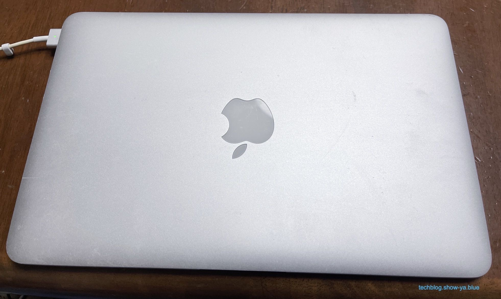
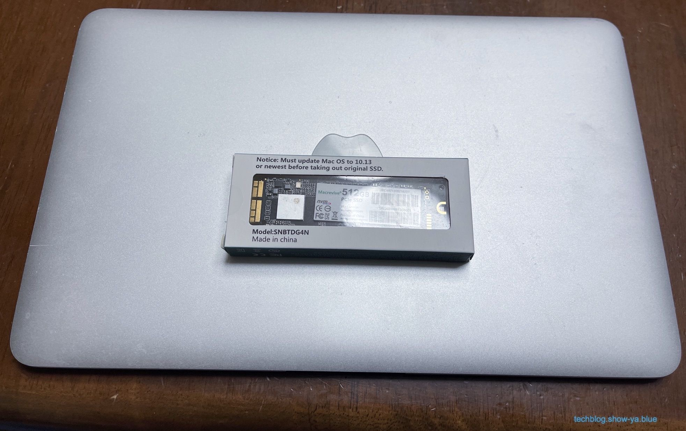
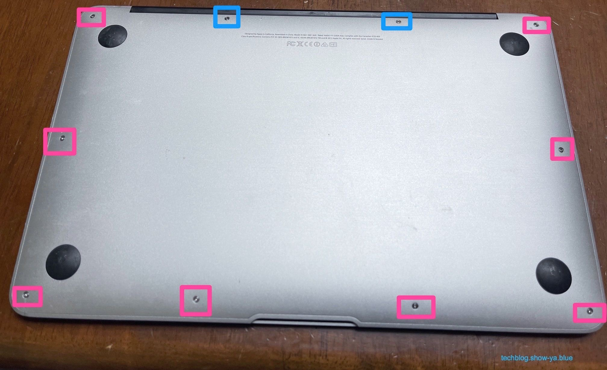
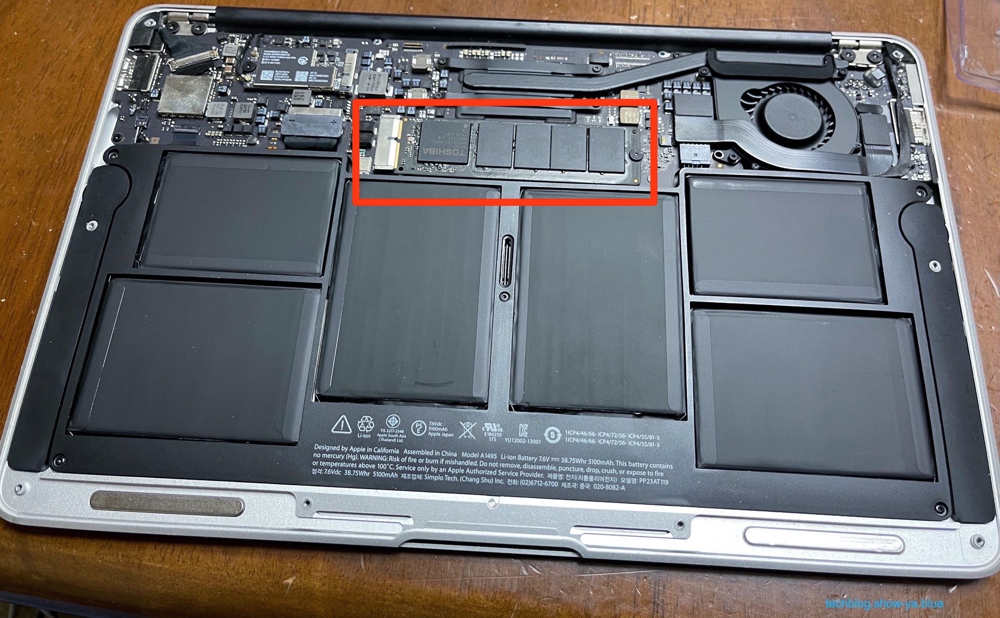
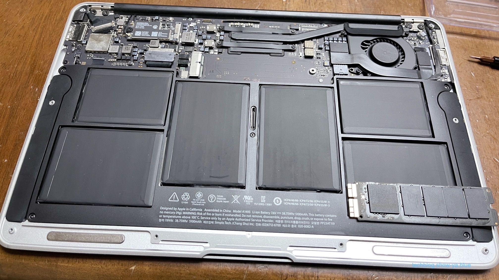
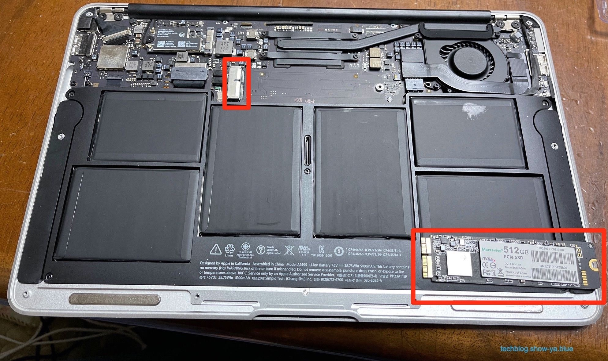
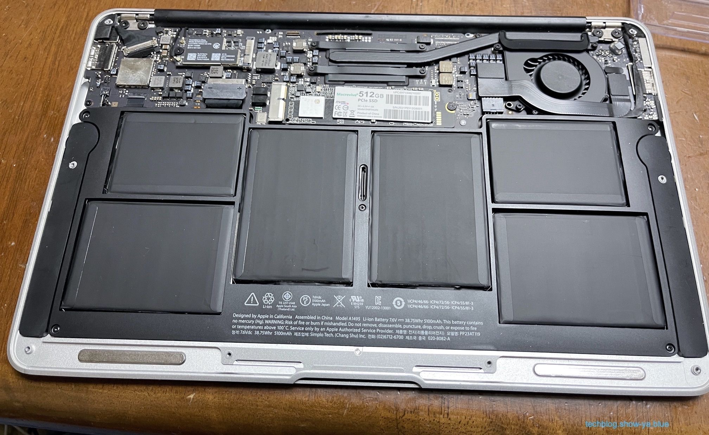

どうもこんにちは、如月翔也（[@showya\_kiss](http://twitter.com/showya_kiss)）です。  
　今日は手狭になったインテルMacBookAir11インチ（2014年モデル）のSSDを交換した、というお話しをしたいと思います。  

## そもそもBootCampで使っていたんですが

　今回SSDを交換する事にしたインテルMacBookAir11インチ（2014年モデル）は以前サブパソコンとして使っていたんですがサブ用にM1搭載MacBookAirを購入したら起動しなくなってしまい、サブのサブの立ち位置では使う事もなくジャンク入れに置いてあったんですが、Windows10でPop'n Music Livelyをプレイしたくて、最小構成を見たらインテルMacBookAir11インチ（2014年モデル）でも行ける感じだったのでBootCampでWindows10をインストールしてゲーム用パソコンとして使っていたのです。  

## 合計の容量128GBではどうしても足りなかったんですよね

　しかしWindows10専用にするにせよ128GBのSSD中70GBをMojaveが持っていくのでWindows10自体には50GB程度しか割り当てられず、しかもPop'n Music Livelyは20GBあるゲームなのでWindowsも空き容量がカツカツで、せっかくWindowsの実環境があるのだから色々やろう、と思っても容量の問題でできない、という状況だったのです。  

## SSDの容量不足はどうにもできないので

　Mojaveが70GB持っていくのはどうにもならず、Pop'n Music Livelyが20GB持っていくのも仕方がない事なので（それを遊ぶためのWindows10なので）SSDの容量については「開ける」方法がなく、SSDの容量を増やすしか「Windows10の領域を増やす」方法はなかったのです。  

## SSDを交換する事にしたのです

　そこで、今AmazonでインテルMacBookAir11インチ（2014年モデル）対応の512GBのSSDが11000円をちょっと割る金額で出ているので、それを購入してSSDを交換して使おう、という結論になったのです。  
　1TBモデルで3万円のSSDもあったのですが、そこまで容量はいらないのと、値段が高いと首がしまるので11000円くらいが妥当な金額でちょうど良い容量なのでそのモデルを購入してSSDを交換する事にしました。  

リンク

　交換に使ったSSDはこれです。1回木曜日に届いたのですがそっちは初期不良で認識しなかったので返品し、同じ製品を買い直して使っています。  

## SSD交換手順

　SSDの交換手順についてです。  
　丁寧にやるのであればバッテリーのコネクタを抜いて指してをすべきなんですが、面倒だったのでバッテリーのコネクタはそのままでやってしまいました。  
　作業前に交換前のSSDをTimeMachineで環境のバックアップをとっておくと交換後の作業がスムーズなのでお勧めします。  

### 交換前の天板です

  
　SSDを交換する前の天板です。  
　今回天板はまったく触らないので結果も変わらないんですが、結構綺麗な天板でしょう？  
　これ中古で購入したものなんですが、購入時点で状態が良かった個体なんですよね。  

### 用意したSSDがこちらです

  
　今回用意したSSDがこちらです。512GBのモデルですが非常に小さなパッケージです。  
　緩衝材無しで放り込まれていたので不安がありましたがちゃんと動きました。  

### 裏面のビスを外します

  
　裏面を外してロジックボードにアクセスするために裏面のビスを外します。  
　ピンク枠が短いネジ、青枠は長いネジです。  
　どちらも星型のネジなので専用ドライバーセットがないと開けられません。  

### 裏蓋を外しました

 　裏蓋を外しました。中も綺麗です。  
　赤枠の部分がSSDで、これを引き抜いて交換するのが今回の目的です。  
　右側にあるビスを五角形ドライバーで外して引き抜きます。  
　持ち上げ気味に外すんですが持ち上げすぎるとヤバいですし持ち上げないと他の場所にぶつかるので程々の力で持ち上げます。  

### 既設のSSDを取り外しました

  
　既設のSSDを取り外しました。右下に置いてあります。  
　外した後に別に用意したSSDを差し込めばオーケーです。  

### 新しいSSDをコネクタに差し込みます

  
　新しいSSD（画面右下）を赤枠で囲ったコネクタに差し込みます。  
　結構簡単に刺さるんですがしっかり押し込まないと認識してくれません。私は1回認識しなくて蓋を開け直して指し直したら認識しました。  

### 作業完了です

  
　新しいSSDを差し込んでビスをはめて作業は完了です。  
　後は裏蓋を取り付けて起動を確認し、OSをリカバリしてTimeMachineでとったバックアップから環境を復元します。  
　そこからBootCampでWindows10を入れるほうが時間がかかります。  

## SSDの交換自体は非常に楽だったので

　という訳で、SSDの交換自体は非常に簡単で迷う部分がないんですが、TimeMachineで環境をバックアップしていなかった場合は環境復旧に手間取りますし、BootCampでWindows10を起動する場合ここからBootCampのセッティングがありますので面倒臭いです。  

## これからBootCampを入れてWindows10を入れようと思います

　今SSDの交換が終わり、MacOS BIG SURのインストールを終えてBIG SURでの設定を行い、設定が終わったのでWindows10のインストールを行っている状態です。  
　MacOSには255GB割り振ってWindows10には256GB割り振ってあるのでどちらもサブパソコンであるM1搭載MacBookAirと同じだけの容量がありますので、環境もM1搭載MacBookAirに準ずる形にセッティングしようと思っており、M1搭載MacBookAirは音楽や同期データを入れても120GBくらい空いているのでインテルMacBookAirのBIG SURもWindows10も120GBずつくらい開くと思っており、それくらい空きがあれば色々試すのにインストールする余裕がありますし、まあおもちゃとしては合格点の容量になるんじゃないかと思います。  
　インストールしている時一瞬Ubuntuも入れてトリプルブートにしようか考えたんですが、凄く難しいのと、Ubuntuには実環境があるのでこっちに入れる必要はないな、と思い直したので深い沼に足を取られる事なく済んだので良かったと思います。  

## まとめ

　という訳で、インテルMacBookAir11インチ（2014年モデル）についてはBootCampでデュアルブートしているもののSSD容量が圧倒的に足りなかったのでSSDの容量を512GBに増やすために512GBのSSDを新しく買って交換した、というお話しでした。  
　交換自体は簡単だったんですがその後のOSセットアップ、環境復元、環境構築というあたりで非常に手間がかかって面倒臭いので大変だったので、まあ今回1回だけ手間をかければ環境は安定するので手間とお金をかけて良かったな、と思います。  
　今のMacBookはSSDが交換できないのでこういう遊び方ができないので、古い型式ではありますがMacBookAir11インチ（2014年モデル）を持っていてよかったと思います。
