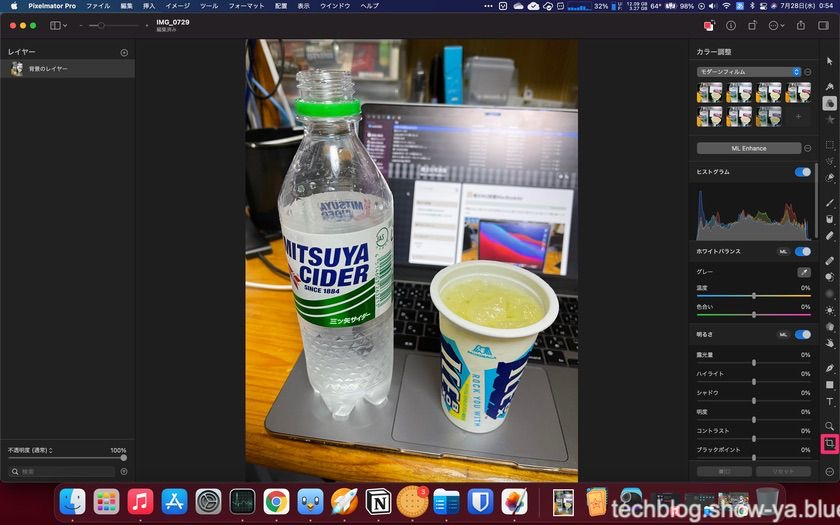
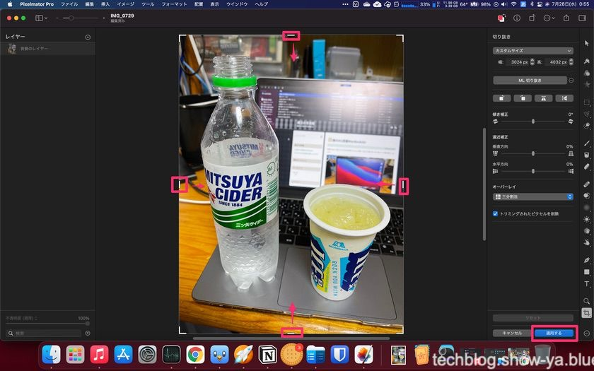
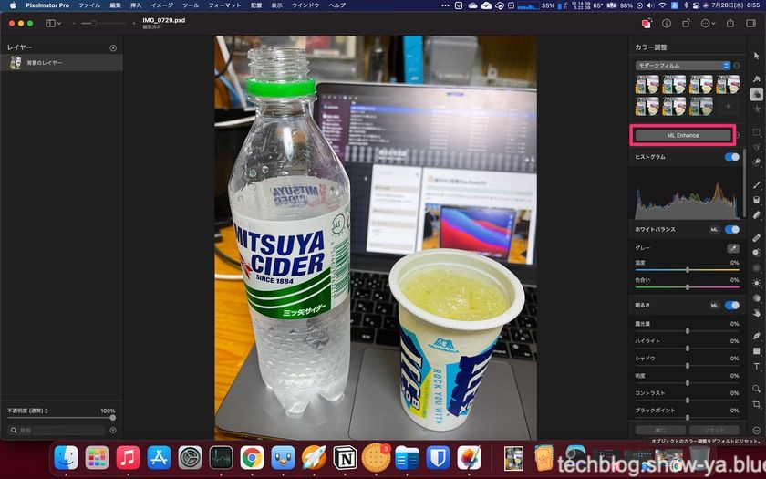
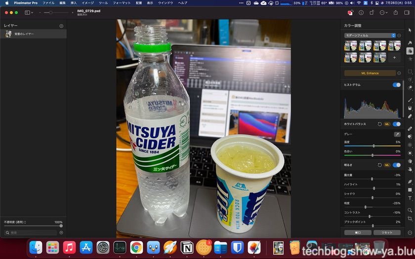
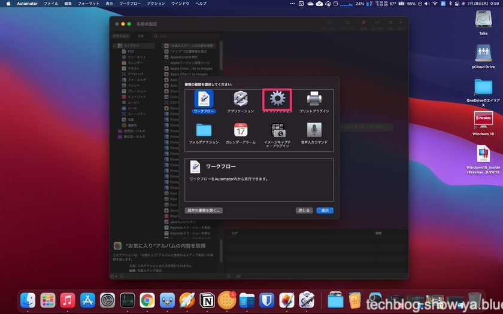
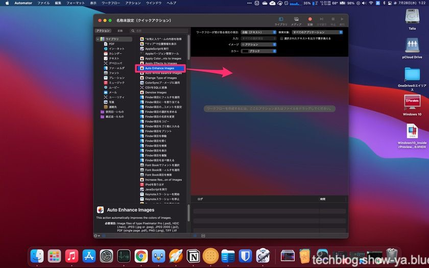
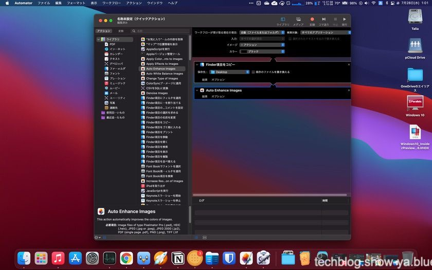
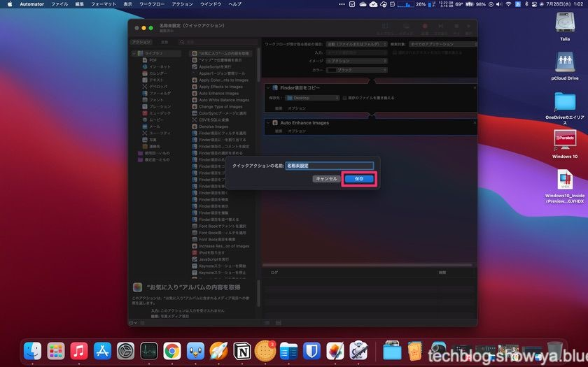

どうもこんにちは、如月翔也（[@showya\_kiss](http://twitter.com/showya_kiss)）です。  
　今日はMac向けの超便利な画像アプリ、Pixelmator Proについてのご紹介です。有料ソフトですが価格以上の使い勝手があります。  
　今回は写真を撮って、写真のトリミングからMLエンハンス処理までと、MLエンハンス処理をオートメーターで自動化するところまでご紹介しようと思います。  

## Pixelmator Proとは

　Pixelmator ProとはPixelmator Teamの開発・販売する画像アプリです。  
　1からCGを起こす事もできますし、写真を取り込んでトリミング・画像修正や加工を行う事ができ、買い切りで使えるアプリなので非常に使い勝手が良いです。  
　私はCGを書く技術がないので写真を加工修正するのに使っているんですが（写真の腕があるとは言っていない）、撮った写真を思った方向に修正する事が簡単なアプリなので非常に良いと思います。  
　今回はPixelmator Proで取り込んだ写真をトリミングしてマシンラーニングで補正をかけるまでを説明するのと、あとこのアプリマシンラーニング補正をオートメーターを使ってクイックアクションに登録してFinderで選択した画像を一気に画像処理できるので、オートメーターの設定方法についても説明したいと思います。  

## 画像を開きトリミングボタンを押します

  
　まずPixelmator Proを開き、「Mac内の画像を閲覧」からトリミングしたい写真を選択してPixelmator Proの画面を開きます。  
　トリミングのボタンは画面右下、ピンクの囲いのアイコンがトリミングのボタンです。  
　まずこのボタンを押します。  

## 画面に枠が出るのでトリミングしたい範囲に枠を合わせます

  
　そうすると画面にトリミング枠が出るので、トリミングしたい範囲まで枠をドラッグします。  
　上下左右、斜めにも枠があるので枠をドラッグしてちょうどよくトリミングできるように枠を合わせます。  
　指定が終わったら画面右下の「適用する」ボタンを押せば画像がトリミングされます。  
　次の画面を見ていただくと左右と上を微調整、下をバッサリカットしたのがわかると思います。  
　トリミングはこれでオーケーです。  

## ML Enhanceボタンを押します

  
　次は写真をマシンラーニングで補正します。  
　マシンラーニング補正は画面の「ML Enhance」ボタンを押すだけで完了です。  
　気に入らなければCommand+Zで戻して自分で指定することもできます。「ML Enhance」ボタンの上にいくつかアイコンがありますがどの風合いがいいかを選ぶ事で自分で指定して補正が可能です。他にももっと機能があるんですが割愛します。  

## ML Enhanceされた画像がこちらです

  
　ML Enhanceされた画像がこちらです。見比べていただくとML Enhanceする前とした後では三ツ矢サイダーのペットボトル越しの風景の色が変わっているのがわかりやすいと思います。あと画面が全体的に濃い目になっていますよね。  
　ICEBOXに三ツ矢サイダーを入れた物が被写体なんですが、冷たさ・涼しさが伝わってくる写真に補正されたと思います。  
　これだけの手順でトリミングからマシンラーニング補正までが終了しました。  

## オートメーターを起動し、クイックアクションを選択します

  
　では次に自動処理させるために右クリックの「クイックアクション」にML Enhanceを登録して、Finderから写真を複数選択して右クリックからクイックアクションでML Enhanceを指定できるようにする方法をお伝えします。  
　この設定をやっておくと、数十枚・数百枚単位の写真を一気にマシンラーニング補正をかける事ができるのでいちいちPixelmator Proを開く必要がなくなり非常に効率的になります。  
　まず、オートメーターを起動して「クイックアクション」を選択します。  

## 「Auto Enhance images」をドラッグアンドドロップで右側に移動します

  
　切り替わった画面に「Auto Enhance images」という項目があるので、これをドラッグアンドドロップで右側に移動します。  

## 保存したいフォルダを選びます

  
　切り替わった画面でフォルダを指定する場所があるので、そのフォルダが処理した写真の保存場所になるので好きなフォルダを指定して下さい。  
　初めてオートメーターを起動した場合こういう画面にならない可能性があるんですが、その場合一回Command+Sキーで保存して適当な名前をつけて保存し、もう一回同じ作業をすればこの画面になるはずです。適当に作ったクイックアクションは後で消せるので気にしないで作って下さい。  

## Command＋Sキーで名前をつけて保存します

  
　保存フォルダを指定したらCommand+Sキーを押して名前をつけて保存します。クイックアクションに表示される名前になるのでわかりやすくて恥ずかしくない名前をつけて下さい。  
　保存が終わったらテストにCGを2〜3枚Finderで指定して、右クリックからクイックアクションを経由して自分の付けた名前のクイックアクションを実行してみて下さい。指定フォルダに処理されたCGファイルが保存されるはずです。  
　動作を確認したらもういつでも動くので後は自由に使って下さい。  

## Pixelmator Proは非常に高性能な画像エディターなので

　今回は簡単に写真をトリミングして自動補正する方法と、自動補正をアプリを起動せずに自動で行う方法をご説明しましたが、Pixelmator Proは非常に高性能な画像エディターなのでできる事が色々あり、例えば写真に写り込んでしまったゴミを取り除く機能などもありますし、レイヤーも多数使えてCGを起こすのにも向いているアプリなので、Macで画像ファイルを扱う人であれば全てお薦めだと思います。  
　私は割とラフに写真を取る方なので写真にゴミが写り込んでいるのは結構ある事ですし、それで取り直しをするのも面倒ですしそもそも取り直せない写真（腹に収まってしまうものとか瞬間を記録するものなど）についてはアプリで編集するしかないので、ちゃんと編集するのであれば約5000円と安くはないんですが決して高い金額だとは思わないので（まあ私はセールで2500円で買ったんですが）Macの買い切り画像エディターとしては非常に強い選択肢だと思います。  

## まとめ

　という訳で、Mac専用の画像エディターアプリであるPixelmator Proについて、写真を取り込んでのトリミングの方法と、マシンラーニングによる自動補正の方法、そして自動補正をわざわざアプリを起動しないでも複数の写真に対して（単体に対してももちろん出来ますよ）一気に行うオートメーターでのクイックアクションの作り方についてご紹介しました。  
　Pixelmator ProはMacの公式な文章に名前が出てくるので（Adobe Photoshopと並べられて名前が出ています）かなり有名でAppleの信頼を勝ち得ているアプリだと言えると思いますので、他の安い画像アプリを複数渡り歩くくらいなら決め打ちでPixelmator Proを選んでしまうのも手だと思いますので、ぜひ購入をご検討下さい。  
　かなり良いアプリですよ。
