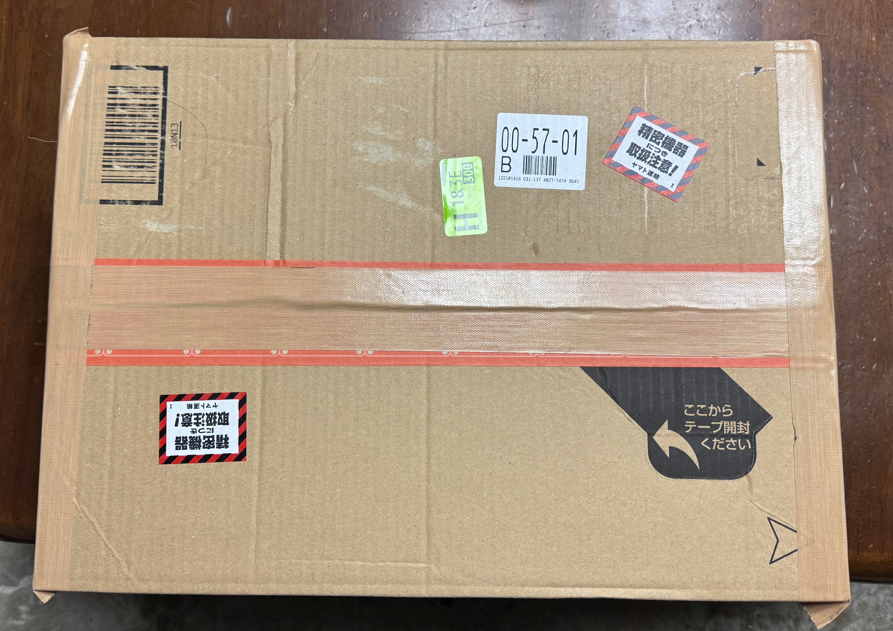

　どうもこんにちは、如月翔也（[@showya_kiss](https://twitter.com/showya_kiss)）です。
　今日は突然思い立って矢も盾もたまらず、しかし現在極めて入手困難なものを無理やり入手して今まさにそれを使っているので、それについてファーストインプレッションをお送りします。
　わりとギリギリのラインを攻めていると言うか、自分の中で「プレ値では決して買わない」という前提を置いた上で、「これは転売とどう違うんだ？」という部分を攻めて手に入れたものなので、使ったサービス、方法、入手した店舗なんかも含めてお話したいと思います。
　製品は何かというと、PFUさんの「HHKB Studio日本語配列/墨」です。
　読み進めて貰うとわかるのですが、この製品、今入手が非常に困難で定価44000円のところを66000円くらいのプレ値でしか入手できませんが、通販なしで店売りで言うと昨日の時点で定価44000円で在庫が存在しました。もしかしたら僕が買ったのが最後かもしれませんが、昨日の時点では確実に在庫があった製品です。
　この記事を読んで定価で欲しいと思い、かつ店舗に直接赴ける方は、店舗は電話番号非公開なのでメールで確認して在庫があるようなら行ける範囲なら行ってみても損はないかも知れません。

## HHKB Studio日本語配列/墨とは
　HHKB Studio日本語配列/墨とは、[株式会社PFU](https://www.pfu.ricoh.com/)さんの販売しているかなりギーク向けのキーボードであるHappy Hacking KeyBoardの最新版と言うか新機軸なので新しいバリエーションです。
　詳しくは[HHKB Studio](https://happyhackingkb.com/jp/products/studio/)のページを見て貰うとわかりやすいんですが、本来GUIじゃなくてCUIでパソコンを使う人・プログラムや文章をバリバリ書く人向けの「最小限の手の動きで最大限にタイピングができる超高級キーボード」の新機軸、スイッチをメカニカルにして、ポインティングデバイスを投入し、マウスボタンと側面・底面にスライダーを4機入れたGUIを意識した新機軸で、日経の記事によると発売1ヶ月半で当初の想定の半年分売れて今在庫切れな状態なのです。
　僕は昔からキーボードが好きで、HHKBには憧れを持っていたんですが、HHKBの英語版は矢印キーがなく、結構矢印キーを使う僕としてはHHKBの選択肢はないな、と思って今KeychronのK8を使っていたのですが、この前なんとなくHHKBを調べたところHHKB Studioの日本語配列の場合矢印キーがあると知って断然興味が湧き、そしてレビューなんかを見てどうしても欲しくなってしまい、たまらなくなってとにかく今入手できる方法がないか徹底的に調べたんですが、ネット経由で入手する方法はプレ値のものを買うしかなく、そして「もう絶版でプレ値の中古でしか手に入らない場合を除き」僕はプレ値では絶対に買わない縛りなので（そうしないとあっという間に破滅するので）、今は買えないな、1月10日にPFUサイトで再販するのでそれ待ちだなと思っていたのです。

## しかしb8taの有楽町ショップで店頭在庫があったのです
　しかしなんとかHHKB Studioを入手できないかと散々調べているうちに、1店だけ、在庫表示があるショップを見つけたのです。
　それが「[b8ta](https://b8ta.jp/)」さんの有楽町店です。
　店頭在庫ありの表示だったんですが、b8taさんはショップの電話番号の表示がなく、仕方なくショップにメールでどうしても入手したいので通販はできないか、を聞いたんですが、残念ながら通販はしていないという回答を頂いて、一旦諦めたのです。
　しかし、メールの返信では「在庫がない」という表現はありませんでしたし。そしてWeb表記で在庫ありなのでその時点で在庫があるのは確定だな、と感じたのです。

## よろしいならば代行だ
　在庫があって入手する方法もありますが、僕は北海道に住んでいるので有楽町まで最安値で移動するとして方法は車移動、往復26時間で高速代だけで23000円です。それだけ差額があればそもそもプレ値で買えますし、最安値にはガソリン代が乗るので現実的ではなく、自分で買うのは諦めざるを得ませんでした。
　しかし、ここでひらめきがありました。
　家事代行サービスの中には「買い物代行」というサービスがあり、サービスによっては遠隔地の買い物をして送ってくれるサービスがあるのです。
　買い物代行サービスを使って送料込みで2万円以下の値段で入手できれば、プレ値ではなく、確実に手に入り、1月10日まで待たずに済み、そして1月10日の争奪戦で負けて涙しなくていいわけです。
　というわけで買い物代行サービスを利用する事にしました。
　僕が選んだサービスは「[ベアーズ](https://www.happy-bears.com/kurashi/shopping-agency/anything/)」さんの買い物代行です。
　ショップ名を教えて商品名を教え、在庫はある、最短日程で入手して欲しい旨を連絡して即日で見積もりが帰ってきて、満足できる値段だったのでお願いしました。
　実はちょっと行き違いがあって、一回出して貰った金額で満足してGoを出したんですが、その後に消費税の計算し忘れがあって「値段を変更します」という連絡が来たので、その時点でカードの限度額を計算したところ新しい請求ではカードが切れないのが確認できたので、「一回オーケーを出した後で金額を変更されても困る。前回提示額でやって貰うか、契約は手数料なしのキャンセルにして欲しい」とお伝えした所前回提示の金額でやってくれる事になり、そして即日でb8taさんに行って即日で入手し、そして当日中に発送してくれて、発送の2日後である今日、もう手元に届いてセットアップして今使っている状態なのです。
　ゴネ得と言われると面目ないんですが、払えない金額で強制的に契約されて払えないのでキャンセル→手数料だけ発生はいくらなんでも酷いですよね、というお話をしただけの認識なので、いちおうゴネた訳ではないのは言い訳しておきます。
　ただ、得した損したではなく、メールの対応が即日、買いに行くのも即日、そして発送も即日だったのでかなりスピーディーなサービスで、個人的には大満足しています。
　なお、b8taに行って無駄足だった場合は交通費と手数料だけが取られるリスクを込みで代行をお願いしているので、この点で転売と違い、あくまで「僕のかわりに」買い物に行って貰っただけなのです。
　ちなみに、送付の際にはレシートは同封されないので、レシートが必要になったら別途ベアーズさんに連絡しないと駄目だそうです。この場合、レシートが必要になるのは基本的に初期不良での交換の時だけなので、初期不良保証の3ヶ月が過ぎたらどっちにせよもうレシートは不要なので、レシートがいらない人の場合ベアーズさんは悪くない選択肢だと思います。

## というわけで開封の儀です
　というわけで開封の儀を行います。
　まずはベアーズさんから送られてきた箱がこちらでです。80サイズではなく100サイズでした。

　画像がクソデカくて申し訳ないです。
　転売ではない証拠に、b8taさんで買った証拠にb8taさんの袋が入っています。

　おやおやナナチ、Bが8になっていて可愛いですね（ボンドルド構文→わかない人はメイドインアビスを読みましょう）。
　では中に入っていたHHKB Studioの箱がこちらです。

　かなりイカします。魅力的です。
　そして開けたらこういう感じです。

　というわけで、最終的に箱に入っていたモノがこちらです。他に説明書類がありました。
　HHKB Studio本体の他に、アルカリ乾電池4本、ポインティングスティックの頭が4つ、USB-CtoCのケーブルです。

　ようやく感動の出会いです。ファーストインプレッションは「ヤバい、格好いい……」でした。
　では、早速使っての感想をファーストインプレッションとしてお送りしたいと思います。

## HHKB Studio日本語配列/墨のファーストインプレッション
　早速HHKB Studio日本語配列/墨のファーストインプレッションをお届けします。
　まずは各要素をリスト形式でお送りします。

- HHKB Studio日本語配列/墨の外見について
　まず見た目は「墨」なのでかなりブラックに近い本体に、漆黒の刻印がされています。本体は小さめで見た目だけで言うとめっちゃ格好いいです。
　本体の見た目、キートップの文字は視認できますが、キーの手前側に書かれているらしいガイド文字（キーコンボで入力できる文字が書かれているらしいです）は座って入力している分には「全く見えません」。読めないではなく、影になって隠れてしまって全く見えません。
　そもそもファンクションキーがないのもあり（fnキーと数字キーで入力します）かなり慣れてこないと上手く使えない部分はあるんじゃないでしょうか。

- キータッチについて
　Studio以外のHHKBは静電容量無接点方式を採用しているらしいのですが、HHKB Studio自体はメカニカル軸で交換可能なものになっています。
　僕は青軸が好きなのでKeychron K8で「ガシャガシャダーン！」と入兎力している感じですが、HHKB Studioでは「コトコト」という感じでかなり静音です。
　入力は浅くても大丈夫な感じなんですが、浅く入力しないで指が跳ね返る打ち込みをしても大丈夫な感じで、キー入力はかなり快適です。

- ポインティングスティックについて
　ポインティングスティックはLenobo（旧IBM）のThinkPadの十八番で、これ採用して特許大丈夫なの？って思うんですが、古くはGPD Pocketでも採用されていましたし、なんか特許切れてるようなので法的には問題ない感じです。
　スティックの性能でいうと旧型のThinPad（X460レベル）との比較になりますが、全く引けを取らないです。多少の操作であればキーボードから手を離さずにできるので全然いいです。
　大きく操作したい時とか細かい操作をしたい場合はMagic TrackPadがベストですが、それ以外の操作ならポインティングスティックで全然操作できます。
　キーの間にスティックがぶっこまれているので邪魔になりそうに見えますが、案外邪魔にならないです。

- マウスキーについて
　ポインティングスティックと同時にマウスキーが置かれていますが、邪魔にならないですし、ポインティングスティック操作をする時にはマウスキーは必須なので、非常に良いです。キー入力中に手を動かさずそのままポインティングスティックを動かし、親指でクリックする運用でかなりマウスとキーボードを行ったり来たりする手間を省けます。

- 左右側面とマウスキー左右隣のスライパッドについて
　キーボードの左右側面と、マウスキーの左右隣の底面にスライドパッドが仕込まれています。
　デフォルトでは左側面をなぞると上下矢印入力、左底面をなぞると左右矢印入力、右底面をなぞると画面切り替え、右側面をなぞると上下スクロールが入力されます。
　これらはなぞり入力なのでスムーズに入力され、普通「そんなに必要ないのでは？」と思うんですが、上下左右キーを連打して文字カーソルを移動する時、かなり便利です。
　後であげるんですが、キーマッピングツールでこれらの入力は変えられるので、一次元双方向ですがアナログ入力が4つあると思うとかなり面白いと思います。

- キーマッピングツールについて
　HHKB Studio専用のキーマッピングツールを使って、キーボードのマッピングが可能です。
　サイト上の書き方が怪しく理解し辛いですが、「マッピングツールを使って【キーボードに覚えさせる】のにはUSB接続が必要」で、一回覚えさせたら別に接続自体はUSBだろうがBLUETOOTHだろうが、なんなら接続先デバイスが変わろうがマッピングした結果で入力されます。
　マッピングも4種類のプロファイルに分けられ、デフォルトでは1がWindows、2がMac用で設定されており、3と4は設定されていません。
　これらをキーコンボ（fn+cから数字の1〜4）で切り替えられますし、プロファイル4個に対して、1プロファイルに付き「そのまま打鍵」「fn1を押しながら打鍵」「fn2（マウスキー真ん中）を押しながら打鍵」「fn3キー（存在しないので自分でなにかのキーをfn3にマッピングする）を押しながら打鍵」の4種類でマッピングできるので、かなり自由自在にマッピングを設定できそうです。
　僕はどうしてもMacでメディアキーを使いたいので今設定とにらめっこしているんですが、サイト上では「メディアキーが設定できます」と書いてあるのに設定方法がわからず、一応全部のキーをチェックしたんですが何がメディアキーを表すのかさっぱり分からなかったのでいま問い合わせをあげています。
　音量操作については「fn+a」で音量下げ、「fn+s」で音量上げ、「fn+d」でミュート・ミュート解除なので、再生停止・早送り・巻き戻しができれば問題ないんですが、とりあえずAlfredでコンビネーション起動して文字一つリターンで操作できるので、回答が来るまではそれを使って待とうと思います。
※2023年12月21日追記：PFUさんから正式回答が来ました。
　HHKBのキーマッピングツールでは「再生停止」「早送り」「巻き戻し」のメディアキーは設定できないとの事です。サイト表記の「再生などのメディアキー」というのは誤表記でこれから修正の予定との事。
　HHKBでメディアキーをバインドしたい場合は別途Karabiner-Elementsなどのソフトを導入してセッティングする必要があります。
　別途記事を起こしますが、大枠を書いたガイドとして[Devil！DareDevil！の記事の「Karabiner-Elementsで左Command+矢印キーをメディアキーにバインドする方法」](https://devildaredevil.com/2023/12/22/2023-12-21-002/)を別ブログですが投稿しているので必要があればチェックして下さい。
　別途記事は近日中っていうかできれば本日中に書きたいと思います。

- 接続について
　これは白眉だな、と思ったんですが、USB接続中に「fn+Control+1~4」を押す事で、いきなりBLUETOOTHにつなげるので、今USBでMacに接続していて作業中に別に置いてあるAndroidで調べ物をしたい場合、いきなりキー入力でAndroidに移動してキーワードを入れたりポインティングスティックで操作したりできるんですよね。
　そしてBLUETOOTH接続中はいきなり「fn+Control+0」を押す事でそのままUSB接続に戻ってこれるのでMacに戻ってこれるので、実質HHKB Studioを買うとMacなのにAndroidにユニバーサルコントロールができるのと同じなんです。
　僕のMacは画面を拡張してディアルディスプレイにすると暴走するのでディアルディスプレイができないんですが、持っているiPadがminiなのでユニバーサルコントロールで使うのも画面が小さく、この前おもちゃ代わりに買った10インチのAndroidが俄然使い物になってきたのでかなり良い感じです。

## ゲオのレンタルもあったんですが
　HHKB Studioを試すだけならゲオで9泊でレンタルして6000円くらいのプランがあるのですが、それを頼んでから満足して買うと結局プラス価格になってしまうのと、良いデバイスは「腕を慣らせ」というのがあるので、今回はそのプランは使わなかったんですよね。
　もうちょっとぶっちゃけると、ゲオのお試しでたまらなく好きだったら絶対にプレ値で買う羽目になるので、プレ値かつレンタルで買うなら最初から買っちゃえ、我慢できないし代行を使おう！という流れなので、よく考えると最初から自分の事を全く制御できていないですね……。

## というわけで
　というわけで、ファーストインプレッションと言いながら6000文字以上書き散らしていますが、これだけ書いた時点で特に不満はないので、かなりインプレッションとしては良い部類と言うか、使い始めてすぐに「あ、コレ、いいわ……」と思う製品なので、値段が弩級なのを除けば満足の塊でしかないと思います。
　今欲しい人はb8taの有楽町店にワンチャンありますし、まあ問い合わせメールだけでも送ってみていいんじゃないでしょうか。僕はプラス1万ちょっとで買いましたが断然満足です。

　というわけで、長文にお付き合い頂きありがとうございました。またお会いしましょう。