※2024年03月17日追記
　Fork版Contrailsの作者のゆーさんから情報を頂いて数か所内容を書き換えています。
　CloudFlareのD1アカウントを忘れた場合の確認方法と、「検索除外方法」の2つについてです。
　新しい内容を反映したい場合Forkし直すのが早いので、CONFIG.mdの内容だけコピーしてリポジトリを削除し、新しくForkしなおして作り直す事をお勧めします。

　どうもこんにちは、如月翔也（[@showya_kiss](https://twitter.com/showya_kiss)）です。
　昨年紹介した「[BlueSkyでContrail（とGitHubとCloudFlare）を使ってカスタムフィードを発行する方法](https://techblog.show-ya.blue/2023/08/05/howtomakeblueskycustomfeedwithcontrails/)」の方法について、今作者さん曰く「Contrailsは今壊れています」との事で、この方法に従ってフィードを作成しても、フィード自体はできるのですが内容が空になってしまう、フィード削除アクションが動かないという問題があり、今まともに使えないのです。
　しかし、今ContrailsをForkして動くように修正したブランチを作ってくれている方がいらっしゃいまして、本来僕がキャッチアップするべきだったんですが、作者のゆーさんがこのブログにコメントで教えて下さって、使い方の解説ブログや実際に使う時のポイントについて色々教えていただいたので、今回はまたゼロベースでFork版Contrailsを使ってカスタムフィードを作る方法をご紹介します。後半で作ったフィードの消し方もお伝えしますので、作ったフィードを消したい方はそれもご参照下さい。

　なお、Fork版の作者のゆーさんのGitHubのURLは[https://github.com/usounds/Contrails](https://github.com/usounds/Contrails)であり、このFork版のContrailsを使っての設定方法についてはゆーさんのブログ（[Contrails Fork版初期設定マニュアル https://blog.usounds.work/posts/contrails-fork-manual](https://blog.usounds.work/posts/contrails-fork-manual)）に詳しいです。
　僕のブログは二次ソースなので、一次ソースが欲しい方はゆーさんのブログをご覧ください。
　一応僕のブログでは大長文で細かい部分まで丁寧に説明する方向性で差別化したいと思いますが、その分読むのが大変だと思いますし、そもそもリテラシーが一定数以上ある方はゆーさんのブログで十分理解した上で設定ができると思いますので、ゆーさんのブログの内容だとちょっと不安、もうちょっと詳しく手取り足取り教えて欲しい、という方向けにこの記事を書いています。

　Contrailsの日本語情報については日本では僕が一番乗りだったと思うんですが（僕の観測範囲では）、今結構Contrailsが知られて色々フィードが作られているのは嬉しいですし、しかしそれが今うまく動いていないのは悲しいので、ゆーさんがForkしてちゃんと動くContrailsをメンテしてくれているのは本当に嬉しいです。

　では、前置きが長いのですが本題に入っていきましょう。

## BlueSkyとは
　BlueSkyとはX（Twitter）に似たSNS・マイクロブログの一種で、短文投稿でつながるタイプのサービスです。
　今でクローズドβサービスで招待制の運用をしていたのですが、先月招待制を終了して自由に登録ができるようになり、今全世界で400万人くらいのユーザーが居ると言われています。情報が古いのでもしかしたら今や1000万に届いているかも知れません。
　BlueSkyはTwitter（現X）からの避難先として目されがちなSNSなんですが、どちらかと言うと将来的には分散型の「皆が自分のデータを自分で持てる」＝「データを人質にサービスを使い続ける事を強制されない」＝「データや人の繋がりを人質にお金を要求しない」という方向で開発が進んでおり、もともとβテストの段階で技術オタクが集中して入ってきて、そこの隣接クラスタであるアニメやゲーム、絵描きさんや文章が得意な人が多いサービスだったので、その延長線でいまだにのどかな感じの楽しいSNSです。
　サービスからの「お勧めフィード」なんかを押し付けられないで済むので、自分で好きなタイムラインを作って楽しく過ごす事ができる点で他のSNSに比べてかなり居心地が良いです。

## BlueSkyのカスタムフィードとは
　BlueSkyには特徴的な機能があり、それが「カスタムフィード」です。
　BlueSKyではリストも作れるんですが、検索ワードや特定ユーザーのポストを対象として一つのフィードとした「カスタムフィード」を作る事ができます。
　これを使う事で情報を追うのが楽になり、好きな情報だけが流れるフィードを作れる、そして人と共有する事もできるので非常に良い機能であり、目玉機能でもあるんですが、これを作るのにはちょっとプログラミングの能力が必要です。
　もちろんユーザーみんながプログラミング能力を持っているわけではないので、ツールを使ってカスタムフィードを作る方法が用意されており（というかサードパーティで作っており）、有名どころで言うと「[https://skyfeed.app](https://skyfeed.app)」から作る事ができます。
　しかしこのSkyFeedは簡単にできる分ユーザーが多く、ちょっとサーバーが重くなりがちなのと、条件指定が結構面倒くさいので、今回はもうちょっと手間がかかるんですが柔軟に指定ができるContrailsというツールを使ってカスタムフィードを作る方法をご紹介します。
　SkyFeedでいいよ、という方は「[SkyFeedを使ってBlueSky用のカスタムフィードを発行する方法](https://techblog.show-ya.blue/2023/08/04/howtomakecustomfeedofblueskybyskyfeed/)」の記事を読んで頂ければと思います。

## Contrailsとは
　Contrailsとは[Jerry Chen氏](https://bsky.app/profile/jcsalterego.bsky.social)がGitHub上で開発をしている、プログラミングの知識がなくてもCloudFlareというサーバー（無料でかなりの容量が使えるサービスです）上にフィードサーバーを立ててカスタムフィードを発行するツールです。
　GitHub上で開発されているのでGitHubを申し込んでGitHubを使ってツールを使わないといけないのと、CloudFlareのサーバーを使うのでCloudFlareのサービスを申し込まないといけないという点が面倒なんですが、GitHubもCloudFlareも無料サービスの範疇で全然問題ないので申し込み方法を含めてガイドしますので、もう申込済みの人なんかは適宜読み飛ばして頂けると良いと思います。
　そして一点ご注意なんですが、今Jerry Chen氏のContrailsはご本人曰く「壊れています」との事で、Jerry Chen氏のContrailsを使った場合、フィードは作れるんですが内容が空になるので使い物にならないのと、作ったフィードを消す機能が壊れているので作ってしまったフィードを消せないという状態にあります。
　しかし、有志の方（ゆーさん）がContrailsのFork版を作成して下さっていまして、ゆーさんのContrailsを使うと本来より設定が1個多いのですが問題なく動作するフィードが作成できるのと、フィードの削除についてもゆーさんのForkのデータを1箇所修正するだけでフィード削除ができるようになるので、今回はゆーさんのForkしたContrailsを使う事を前提にお話をします。
　これを記事にする事を快諾して下さったゆーさんには感謝に耐えません。

## Contrails(Fork版)を使ってカスタムフィードを作るための方法について
　ゆーさんの作成したFork版のContrailsを使ってカスタムフィードを作るには、以下の手順が必要です。
　前回記事を読んで既に終わらせている手続きがあれば飛ばして頂いて構いませんが、今回は初めて読む方を対象に書きますので長文になりますが全部書いていきます。
　手順としては、以下になります。

1. BlueSkyのユーザー名を確認する
2. BlueSkyのアプリパスワードを取得する
3. CloudFlareに申し込む
4. CloudFlareでWorkerを作りワーカー名を取得する
5. CloudFlareでアカウントIDを確認する
6. CloudFlareでAPIトークンを確認する
7. GitHubに申し込む
8. GitHubでゆーさんのContrailsをForkする
9. GitHuBでSecretとValiableを設定する
10. GitHubでカスタムフィード作成用のCONFIG.mdを編集する
11. GitHubでActionを行いフィードを発行する

　長い手続きになりますが、使うサービスは「BlueSky」「CloudFlare」「GitHub」の3つです。
　基本的には決まった設定を行って、メモるべき部分をメモって、SecretとValiableで入力するだけの作業なので、焦らないで順番に作業すれば大丈夫です。
　今回は翔也ガジェットブログにしては珍しく画像を多用して説明しようと思いますので、画面分更に長くなりますが、「わからない」事がないように説明していきますので是非ついてきて下さい。

### BlueSkyのユーザー名を確認する
　まず、自分のBlueSkyのユーザー名を確認します。
　多分ログインで使っているのでご存知だと思うんですが、基本的に「username.bsky.social」形式です。
　僕の場合は「showya.bsky.social」です。
　調べ方は、BlueSKyの画面を開き、自分のアイコンをクリックするとプロフィールが表示されているので、表示名の下にある「@username.bsky.social」の「@」を除いたものです。
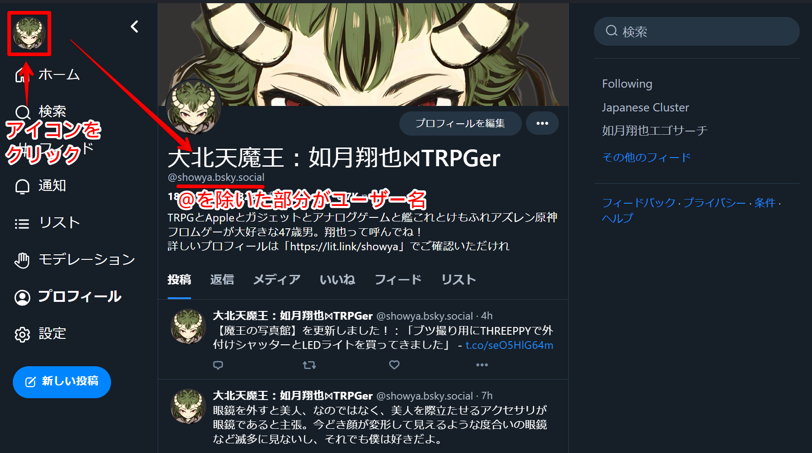
　これは後でGitHubに設定するのでメモっておいて下さい。

### BlueSkyのアプリパスワードを取得する
　次に、BlueSkyのアプリパスワードを取得します。
　BlueSky関係のアプリを使う場合、BlueSkyのパスワードそのものを使ってもいいのですが（駄目ですよ）、サードパーティのサービスにBlueSKyのパスワードを入力するとどこで流出するかわかりませんし危険なので、アプリごとにアプリパスワードを発行して使うのがBlueSkyの流儀なのです。

　アプリパスワードの発行方法は次の手順になります。
　まず、BlueSkyの画面を開き、画面左側「設定」を押して切り替わった右側を下にスクロールし、現れる「アプリパスワード」をクリックします。
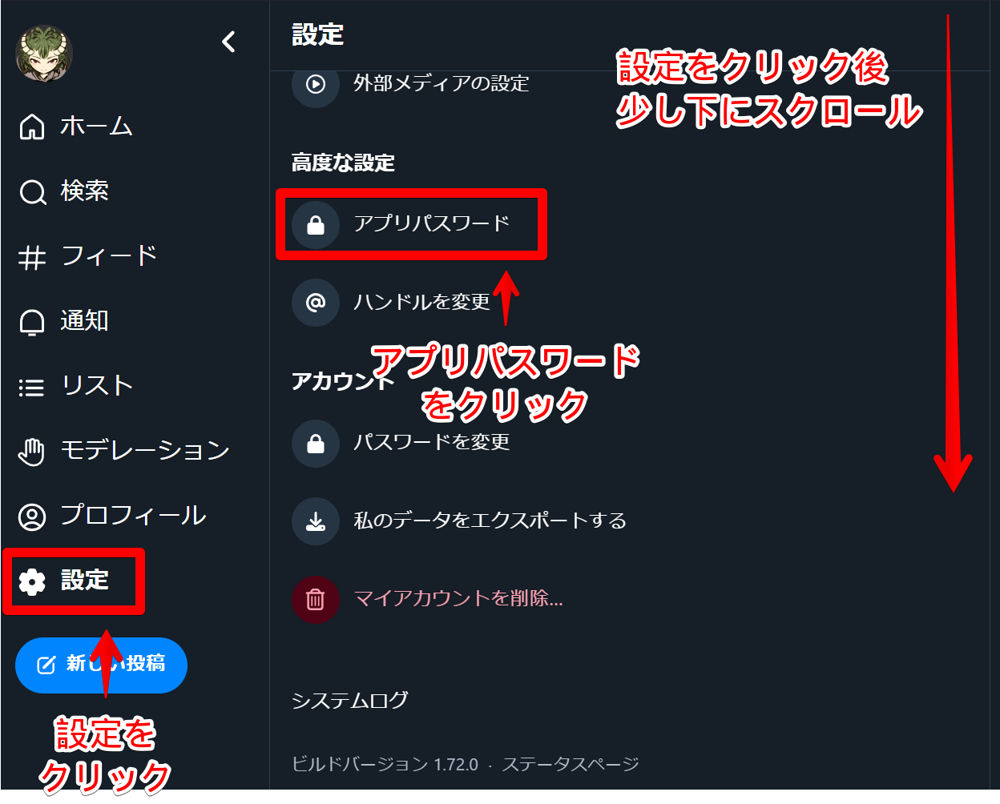
　アプリパスワードの画面が開いたら、下にスクロールできるならして（出来ない場合スクロールしなくても次のボタンがあると思います）、「アプリパスワードを追加」をクリックします。
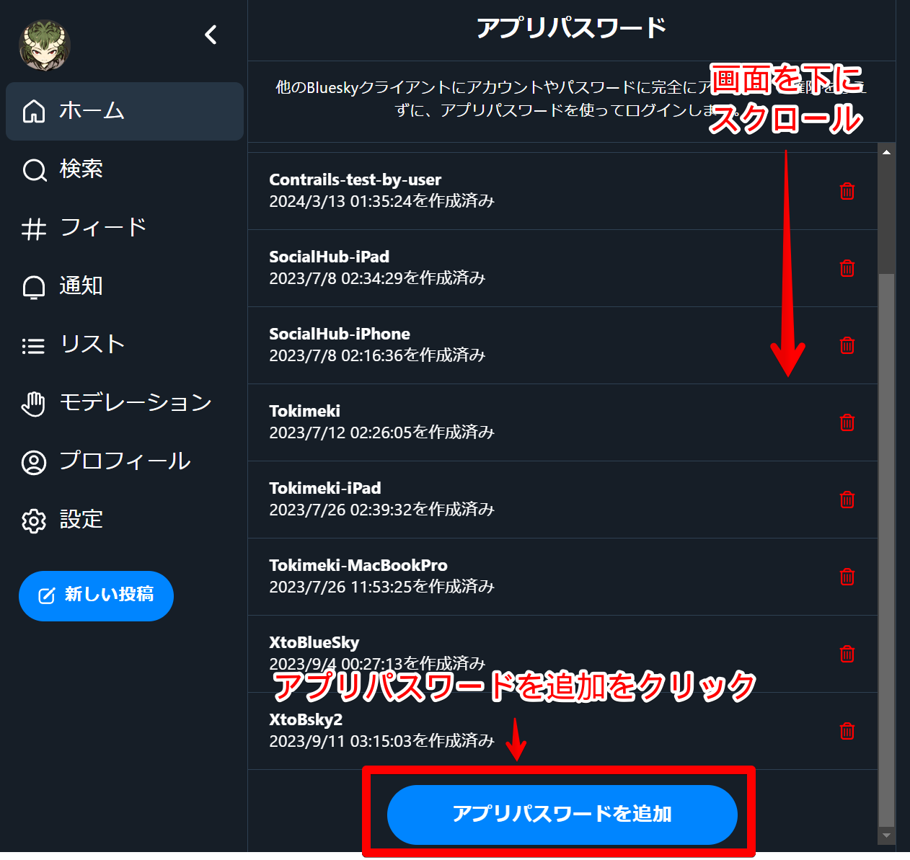
　そうするとアプリパスワードに名前をつける画面が表示されますので、素敵な名前をつけた後「アプリパスワードを作成」ボタンを押して下さい。アプリパスワードの名前は何にも使わないのでメモしなくていいです。
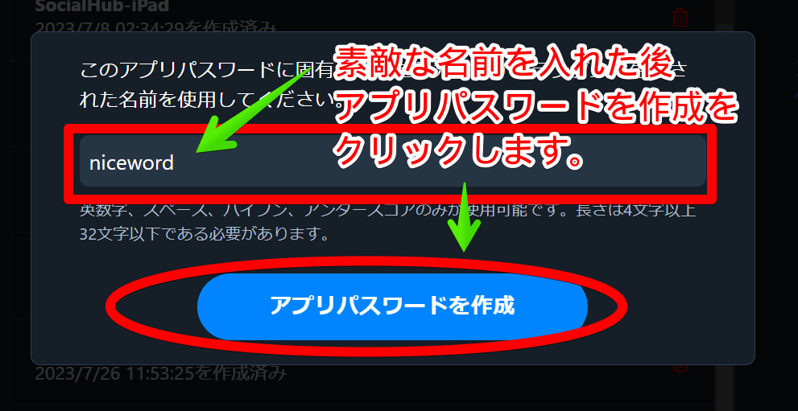
　ここで「アプリパスワードを作成」を押すと、画面が切り替わり4文字を4つハイフンでつないだアプリパスワードが表示されます。横にコピーボタンがあるのでコピーして、どこかに控えておいて下さい。これは後でGitHubに登録するものです。
　一度「完了」を押すと二度と内容は確認できないので、確実にコピーしてどこかに保管してから「完了」ボタンを押して下さい。
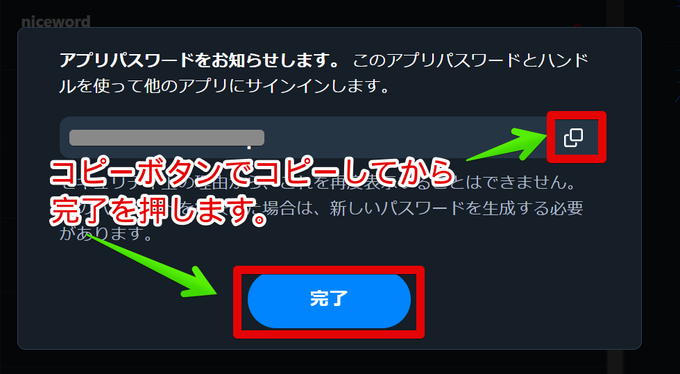
　これでBlueSky側の作業は完了しました。以下が揃っているのを確認してからBlueSkyの画面を閉じて下さい。

- BlueSkyのユーザー名：「username.bsky.social」
- BlueSkyのアプリパスワード：「xxxx-xxxx-xxxx-xxxx」

### CloudFlareに申し込む
　次に、CloudFlareというサービスに申し込みます。もう申し込んでいる人は飛ばしていいです。
　まず次のURLにアクセスします。→[https://www.cloudflare.com/ja-jp/](https://www.cloudflare.com/ja-jp/)
　そうすると画面右上に「サインアップ」の文字があるのでそこをクリックします。
　切り替わった画面、画面下に「Free」という項目があり、その下に「Webサイトを追加」という文字があるのでそこをクリックします。
　画面が切り替わりいきなり英語になりますが、「Get started with Cloudflare」というページになり、中に「Email」と「Password」の欄があるので、Emailには有効なメールアドレスを（後で認証に使います）、PasswordにはCloudFlareにログインする時に使いたいパスワードを入力し、必要があればReCapchaを通して「Sign Up」ボタンを押します。
　問題なくサインアップが終わると「Thank you for choosing Cloudflare」の画面になります。画面右上の「English」を変更して「日本語」にしましょう。画面が切り替わり「Cloudflare をご利用いただきありがとうございます。」の画面になります。これでCloudFlareへの申込みは終了です。
　次の作業に移ります。

### CloudFlareでWorkerを作りワーカー名を取得する
　今いる「Cloudflare をご利用いただきありがとうございます。」の画面、画面下の「Webサイトまたはアプリケーションを追加する」ボタンを押します。
　「Web サイトまたはアプリケーションを Cloudflare に追加する」という画面になりますが、これは無視して画面左側の「Workers & Pages」をクリックします。
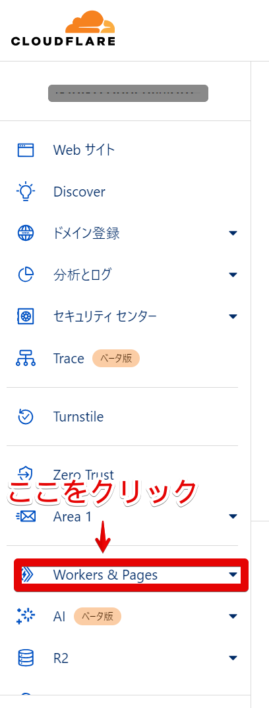
　すると「アカウントを確認」という画面が表示されるので、さきほど入力したメールアドレスを確認すると認証URLが届いているので認証URLをクリックして認証し、「アカウントを確認」の画面はOK的な文字をクリックして閉じると次に「Workers & Pages を始めましょう」のページに遷移します。
　この画面の中ほどにある「ワーカーの作成」をクリックします。
　すると画面が遷移して「"Hello World" スクリプト のデプロイ」のページに移動します。
　この画面の中、「名前」をワーカー名として使うので素敵な名前をつけて、画面右下の「デプロイ」を押します。ワーカー名は後でGitHubに設定するのでメモっておいて下さい。
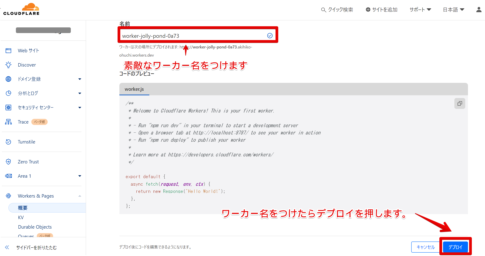
　すると「おめでとうございますワーカーはリージョンにデプロイされます: Earth」の画面になります。
　これでワーカー名は取得できました。

### CloudFlareでアカウントIDを確認する
　つづいてCloudFlareでアカウントIDを確認します。
　画面左側、「Workers & Pages」をクリックすると右画面が切り替わります。
　右側にアカウントIDが表示されており、コピーボタンがあるのでコピーしておきます。
　このアカウントIDは後でGitHubに登録するのでメモっておいて下さい。
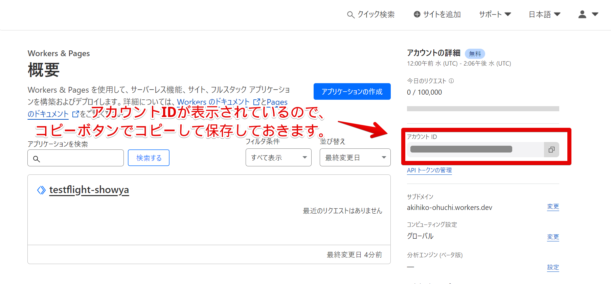
　これでアカウントIDは取得できました。

### CloudFlareでAPIトークンを確認する
　次はCloudFlareでは最後の作業になる、APIトークンを取得します。
　画面右上、人物アイコンをクリックすると「マイプロフィール」がありますのでそれを選択すると画面が切り替わります。
　切り替わった画面、左側に「APIトークン」の項目があるのでそれをクリックし、右側画面が切り替わるので「APIトークン」の横にある「トークンを作成する」ボタンを押します。
　切り替わった画面、「API トークン テンプレート」の画面は下に移動し、「Cloudflare Workersを編集する」の横の「テンプレートを編集する」を選択します。
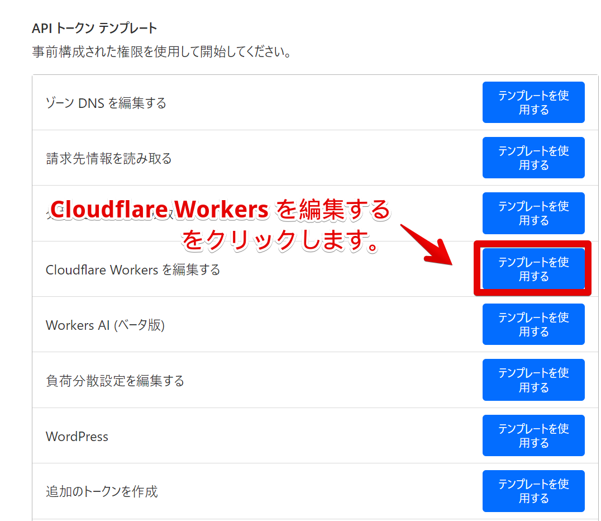
　切り替わった画面、「ユーザー API トークン」の画面になるので、少し下にスクロールして、「トークンを作成する」の一番下、「＋さらに追加する」をクリックします。
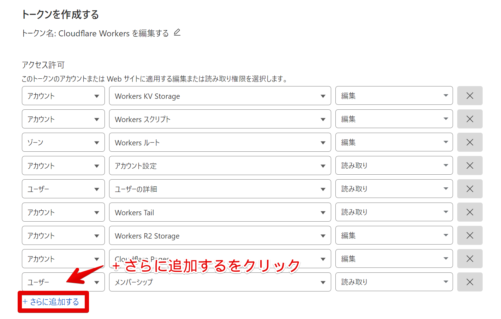
　すると新しく「アカウント」という項目が追加されるので、この項目を次のように変えます。

- 「アカウント」は「アカウント」のまま
- 「項目の選択」は「D1」に変更
- 「Select」は「編集」に変更

　こう変わっていれば大丈夫です。
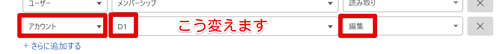
　さらにもう少し作業が必要です。
　今の画面をもう少し下までスクロールし、「アカウントリソース」と「ゾーンリソース」を変更します。
　アカウントリソースは「抱合」のまま、「Select」をクリックするとあなたのアカウントが表示されるのでそれを選びます。
　ゾーンリソースは「縫合」のまま、「アカウントにあるすべてのゾーン」を選び、「Select」をクリックするとあなたのアカウントが表示されるのでそれを選びます。
　こう変わっていれば大丈夫です。
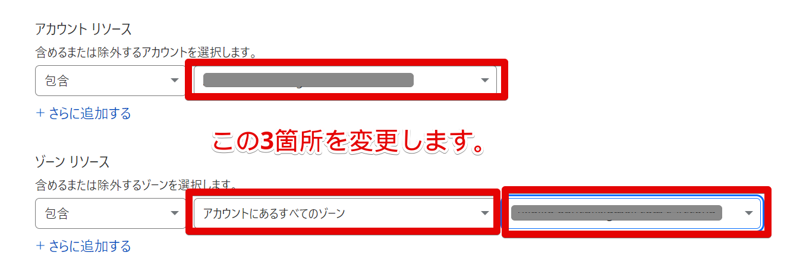
　そこまで進んだら、画面を一番下までスクロールして「概要に進む」ボタンを押します。
　画面が切り替わって「Cloudflare Workers を編集する API トークンの概要」の画面になるので、画面中程にある「トークンを作成する」をクリックします。
　切り替わった画面のテキストボックスにAPIトークンが表示され、Copyボタンがあるのでコピーして保存しておきます。
　このAPIトークンはGitHubに設定する情報なのでメモしておきます。
　これでCloudFlareでの作業は全て終わったので、CloudFlareの画面は消してしまって構いません。

### GitHubに申し込む
　ここからBlueSkyとCloudFlareで集めた情報を使って、GitHubを使ってフィードを発行する作業に移ります。そのためにはGitHubのアカウントが必要です。もうアカウントを持っている人はこのステップを飛ばして構いません。
　GitHubのアカウントを取得するために、最初に[https://github.co.jp/](https://github.co.jp/)にアクセスします。
　そうすると画面右上に「サインアップ」というボタンがあるのでそれをクリックします。
　「Welcome to GitHub! Let’s begin the adventure」という画面になり、「Enter your email*」という画面になるので、有効なメールアドレスを入力して「Continue」をクリックします。
　すると「Create a password*」という表示がでるので、GitHubで使うパスワードを入力して「Continue」をクリックします。
　次に「Enter a username*」という表示がでるので、GitHubで使うユーザー名を入力して「Continue」をクリックします。
　次に「Email preferences」という表示が出ますが、これは無視して「Continue」をクリックします。
　Recapchaが走った後、登録メールアドレス宛に認証コードが送られるので、Recapcha後の画面で送られてきた認証コードを入力し、切り替わった画面で「Just me」を選んで「Continue」を選びます。
　次の画面は何もチェックせずに画面を下にスクロールし、「Continue」を選びます。
　次の画面で「Where teams collaborate and ship.」と表示されますが、課金は必要ないので「Continue for free」をクリックします。
　これでダッシュボードに移動できたので、GitHubのアカウントが取れました。
　このまま次の作業に移行します。

### GitHubでゆーさんのContrailsをForkする
　今GitHubのダッシュボードにいるので、同じブラウザの別ウィンドを開いて「[https://github.com/usounds/Contrails](https://github.com/usounds/Contrails)」を開きます。これはゆーさんのForkしたリポジトリです。
　このForkのContrailsは問題なく動くので、ここからForkして自分用のフィードを作ります。
　今「https://github.com/usounds/Contrails」にいるのを確認し、画面左上の「Fork」をクリックします。
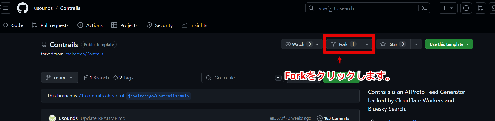
　すると画面が切り替わって「Create a new fork」の画面になるので、画面右下にある「Create fork」のボタンをクリックします。
　すると自分のダッシュボードに移動し、Contrailsが選択された状態になるので、Forkは終了です。
　後は集めた情報を設定して、そしてContrailsで作るフィードの設定をしてアクションすればカスタムフィードができます。

### GitHuBでSecretとValiableを設定する
　まず最初に、今まで集めた情報をGitHubのContrailsのForkに登録します。
　画面上の「Setting」をクリックし、切り替わった画面左側の「Secrets and variables」をクリックして展開し、「Actions」をクリックします。
　切り替わった画面、右側の下に「Repository secrets」があるので、その中の「new repository secret」をクリックします。
　まず1つ目に、「Name *」に「BLUESKY_APP_PASSWORD」を、「Secret *」には先程入手したアプリパスワードを入力して「Add secret」をクリックします。
　切り替わった画面、下にスクロールして「Repository secrets」の横にある「new repository secret」をクリックします。
　次は「Name *」に「CLOUDFLARE_API_TOKEN」を、「Secret *」には先程入手したCloudFlareのAPIトークンを入力して「Add secret」をクリックします。
　切り替わった画面、下にスクロールして「Repository secrets」の横にある「new repository secret」をクリックします。
　3つめは「Name *」に「CLOUDFLARE_D1_ID」を、「Secret *」には「DUMMY」を入力して「Add secret」をクリックします。

　これでSecretsは終了です。あとはvariableを設定します。
　今の画面、「Actions secrets and variables」になっていますが、よく見ると「Secrets」が有効になっていて「Variables」が有効になっていないので、「Variacbles」を有効にします。そこをクリックすればオーケーです。
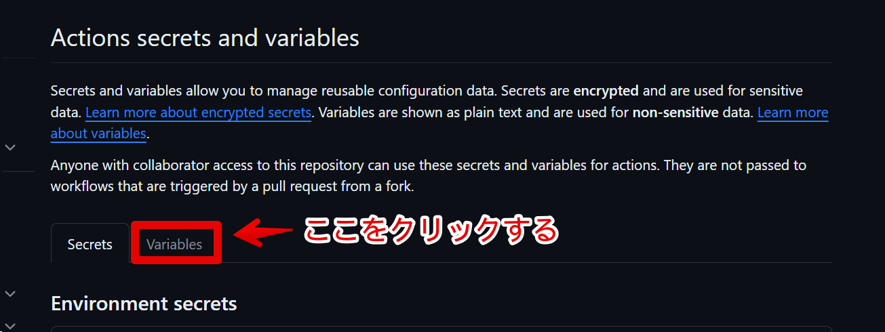

　切り替わった画面、下まで下がって「Repository variables」の中の「new repository variable」をクリックします。
　ここでは3つの項目を設定します。

　まず1つ目に、「Name *」に「BLUESKY_HANDLE」を、「Value *」にはBlueSkyのユーザー名を入力して「Add variable」をクリックします。
　切り替わった画面、下にスクロールして「Repository variables」の横にある「new repository variable」をクリックします。
　次に「Name *」に「CLOUDFLARE_ACCOUNT_ID」を、「Value *」には先程入手したCloudFlareのアカウントIDを入力して「Add variable」をクリックします。
　切り替わった画面、下にスクロールして「Repository variables」の横にある「new repository variable」をクリックします。
　3つめは「Name *」に「CLOUDFLARE_WORKER_NAME」を、「Value *」には先程入手したCloudFlareのワーカー名を入力して「Add variable」をクリックします。

　これで設定は完了です。
　後はContrailsで作るカスタムフィードの内容を作っていきます。

### GitHubでカスタムフィード作成用のCONFIG.mdを編集する
　ContrailsのカスタムフィードはCONFIG.mdを編集する事でカスタムフィードの設定を行います。
　まずCONFIG.mdを編集するためにコード画面に戻りましょう。
　画面左上の「ユーザー名 / Contrails」となっている部分のContrailsをクリックするとCode画面に戻ってきます。
　画面の中に「CONFIG.md」があるのでそれをクリックします。
　そうすると画面が開きますが、このままでは編集できないので画面左上にある鉛筆マークをクリックして編集モードにします。
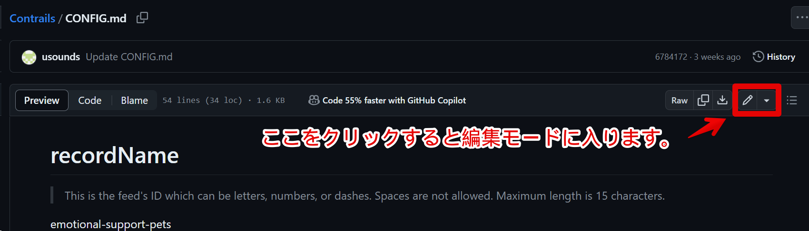
　今はグレーアウトしていますが、一文字でも書き換えたら「Commit Changes」ボタンで変更を反映できます。ボタンを押した後画面が出ますが画面右下の「Commit Changes」ボタンを押して画面を閉じて構いません。
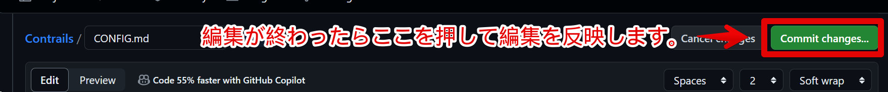

　CONFIG.mdを変更する前に、Contrailsでできる事をピックアップしておきます。
　後で実際に設定項目に紐づけるので、カスタムフィードをどう作るかをイメージして下さい。

- 内部的に15文字以内のレコードネームを付ける
- 人に見える名前として24文字以内のディスプレイネームをつける
- 人に見える内容としてFeedの概要を書く
- フィードで拾う設定として次が設定できる
     - 特定のキーワード。半角スペースを含んで指定したい場合""でくくって指定できる。「/」を挟む場合も"キーワード/キーワード"で挟んで記入する。
     - 特定のユーザーのポストを全て検索できる。指定によってリプライ、リポストも拾える。
     - 特定のユーザーの特定のポストを拾える。
     - 特定ユーザーのポストを除外する事ができる。
- フィードのアバターを指定できる

　では、CONFIG.mdの個々の設定方法について説明していきます。

#### # recordName
　内部的に使うレコードネームです。15文字以内、アルファベットと数字とハイフンだけで名前をつけます。
「emotional-support-pets」の行を消してレコードネームを付けて下さい。

#### # displayName
　フィードの表示名です。人に見られる名前なので注意して下さい。
　24文字以内で、日本語にも対応しています。
「Emotional Support Pets」の行を消して表示名を入力してください。

#### # description
　フィードの概要を書きます。人に見られる内容なので注意して下さい。
　一応文字指定はありませんが日本語は使えます。あまり長いとカットされる可能性があります。
「Cute animals feed」の行を消して概要を入力して下さい。

#### # searchTerms
　フィードの検索方法です。行頭に「- 」を書いた後に条件を書いていきます。

1. キーワードを検索。スペース込みで完全検索したい場合""で囲って下さい。「- "Hot Dog"」の場合Hot Dogの完全一致で検索します。内容に「/」を使う事はできません。
2. ユーザーのポストを拾う。BlueSkyのアプリからユーザーを検索してプロフィールを見るとURLが<!--!「https://bsky.app/profile/username.bsky.social」!-->形式になっているので、それを<!--!「- 'https://bsky.app/profile/username.bsky.social'」!-->と指定する。その人のリプライを含む'の前に場合半角を開けて「+replies」、その人のリポストを含む場合同じく'の前に半角を開けて「+reposts」と書いて'で閉じる。
  例：<!--!「- 'https://bsky.app/profile/showya.bsky.social +replies +reposts'」!-->
3. ユーザーの特定のポストを拾う。BlueSkyのアプリから特定のポストを開くとURLが<!--!「https://bsky.app/profile/username.bsky.social/post/xxxxxxxxxxxxx」!-->形式になっているので、<!--!「- 'https://bsky.app/profile/username.bsky.social/post/xxxxxxxxxxxxx'」!-->と指定する。
4. 特定のキーワードを除外する。あるキーワードを含む検索で、そこから特定キーワードを除外したい場合「- 含むキーワード -除外キーワード」の列を作る事で実現できる
5. OR検索は複数行にする必要がなく、(キーワード1|キーワード2|キーワード3)で指定できる※()と|は半角。これを利用すると(キーワード1|キーワード2|キーワード3) -除外ワード1 -除外ワード2と指定できる

　注意が必要なのですが、1行毎に検索を拾ってくるので、別の行で「- キーワード1」を指定し、また別の行で「- キーワード1 -除外ワード」を指定した場合、結果として「- キーワード1」の検索側で除外ワードを込みの検索結果を引っ張ってきますので、除外ワードを入れる場合キーワード単体の検索は入れないように注意してください。

　あとはこれに従って条件をどんどん追加していきます。
　もともと書いてある
<!--!「- https://bsky.app/profile/saddymayo.bsky.social/post/3jxju2wwap22e」!-->
「- cats」
「- dogs」
「- penguins」
「- red pandas」
「- quokkas」
　は消して、条件を追加しましょう。
　一点注意があり、このsearchTermsが7行を超えると、後で述べるsafemodeがTrueだと上から7件までしか処理されません。7件以上追加した場合、safemodeをfalseにする必要があります。
　ただ、4.と5.で示した通り、キーワードのOR検索は1行にまとめられるので、7行も使わないで作れると思います。

#### # denyList
　denylistは拒否リストです。
　検索結果から除外するユーザーを指定できます。
　didという識別子が調べられる人は「- did:plc:xxxx」形式で拒否できます。
（識別子の調べ方はユーザーのプロフィールに行き、プロフィール画像を「他タブで表示」すると画像URLの中にdid:pic:xxxx/という形式で書かれているので、did:から/の前までをコピーして使って下さい）。
　識別子が調べられない人、面倒な人はユーザー名で拒否できます。この場合、ユーザー名には「@」を含みますので、「- @username.bsky.social」形式で指定して下さい。
　確証はないんですが、おそらくdenylistも7件を超えるとSafemodeで7件以上が無視されるので、denylistが7行を超える人もsafemodeをfalseにする必要があります。
　denyListは消す部分がないのでいきなり書き始めてオーケーです。
　dnyListでは残念ながら除外ワードなどを指定する事ができません。

#### # safeMode
　safemodeはCloudFlareのAPI呼び出し数が限界を超えるとストップする機能のオンオフを指定します。
　trueでオン、falseでオフです。
　CloudFlareは1日で10万件処理しないと限界が来ないので、ほぼ限界は来ないですし、これがtrueだとsearchTermsとdenyListが上から7件しか処理されないので個人的にはfalseにする事をお勧めします。

「true」になっていますが、そのままでいい人はそのまま、falseにしたい人は「true」を消してfalseに書き換えて下さい。

#### # avatar
　フィードのアイコンを指定する事が出来ます。
　変更したい場合、GitHubに変更したいアイコンをアップロードし、
<!--!「」!-->のavater.pngの部分をアップしたファイル名に変えて下さい。
　または項目自体変更せずに、GitHubにavatar.pngという名前でアイコンをアップして下さい。

　これでCONFIG.mdの修正は完了です。「Commit Changes」ボタンで変更を反映して下さい。
　後はGitHubのAction機能を使ってフィードを発行するだけです。

### GitHubでActionを行いフィードを発行する
　では実際にGitHubのActionでフィードを発行します。
　ここでちょっと注意して欲しいんですが、Actionには番号が振られていますが、この順番で処理すると失敗します。
　正しい手順を案内しますので、この順で作業して下さい。

　まず、画面上の「Actions」を押してアクション画面を開きます。
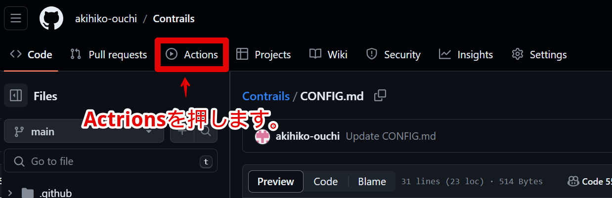
　「Workflows aren’t being run on this forked repository」の画面が出たら、「I understand my workflows, go ahead and enable them」ボタンを押します。
　画面が切り替わり、左に1.2.3.4と順番が振られているので順にやりたいんですが、これには正しい順序がありますので注意して下さい。

- まず最初に「1.Check Requirements」をクリックし、右側が切り替わるので「Run workflow」をクリックして展開し、中にある「Run workflow」をクリックします。
    設定が間違っていなければ最終的に緑のチェックマークに変わるはずです。
- 次は「4.Create D1 Schema」をクリックし、右側が切り替わるので「Run workflow」をクリックして展開し、中にある「Run workflow」をクリックします。
    設定が間違っていなければ最終的に緑のチェックマークに変わるはずです。
    緑のチェックマークに変わったら「Create D1 schema」をクリックし、切り替わった画面で「Create Schema and table」をクリックします。
    新しい画面、「Create D1 Schema」をクリックし、「Runnning Wrangler Command」の▶を開いて、中にある「database_id」の値をメモします。「"」は不要です。

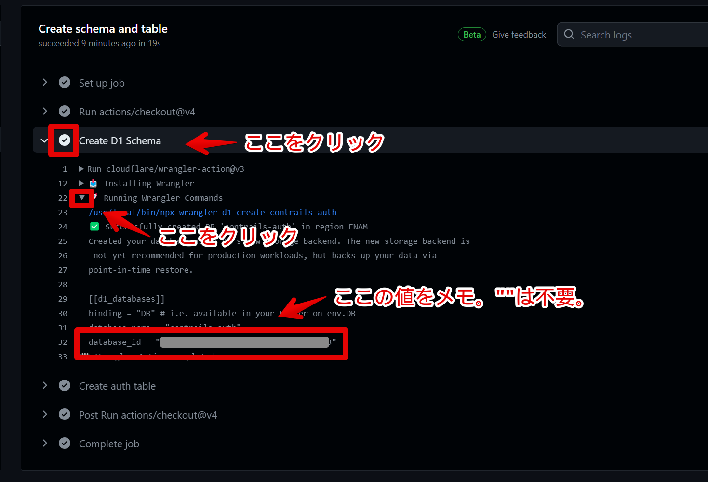

　D1 SchemaのデータベースIDを取得したら、前回DUMMYを入れたSecretsを書き換えます。
　画面上の「Setting」をクリック、切り替わった左画面の「Secrets and Variables」をクリックして展開、「Actions」を選んで「Actions secrets and variables」の画面を開きます。
　画面一番下に「CLOUDFLARE_D1_ID」の欄があり、横に鉛筆マークがあるので押しましょう。
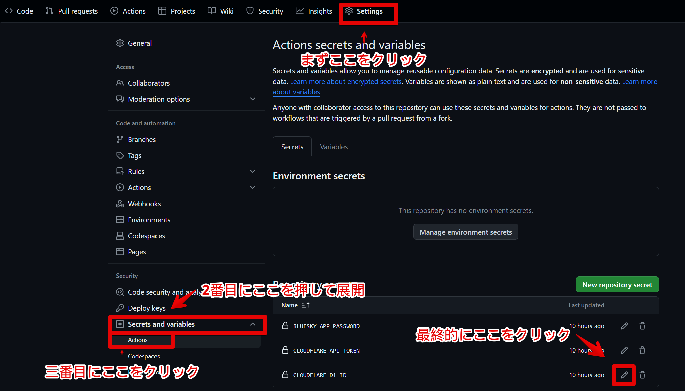

　ここでエラーが出る人は、恐らく以前にD1のIDを作っています。
　CloudFlareにログインすると「Workers & Pages」の中に「D1」の項目があり、それを開くと「contrails-auth」の項目の下にデータベースIDが表示されておりコピーボタンがあるのでそれでコピーすればオーケーです。

　すると「CLOUDFLARE_D1_ID」の入力画面が表示されるので、さっきメモしたdatabase_idを貼り付けます。「"」は不要なので注意して下さい。入力が終わったら「Update Secret」を押します。
　もしかすると認証画面がでるかも知れませんが、慌てずにGifHubのパスワードを入れて「Confirm」をクリックすれば大丈夫です。

　これで最後に必要になった情報も揃いましたので、フィードを発行していきます。
　画面上の「Actions」を押してアクション画面を開きます。

　左画面、1.2.3.4と番号が振られていますが、1.と4.は終わったので次は「2. Deploy to Cloudflare」を選択し、画面右側の「Run Workflow」を展開して「Run Workflow」をクリックします。
　ゆーさんのブログの解説によると、この段階で一回失敗するので、「Re-run jobs」から「Re-run all jobs」を選択すると次は成功するので次の段階に進む、と記載があるのですが、僕の環境ではエラーは起きずそのまま成功しました。

　最後に実際にフィードを発行します。
　左画面、Actionの「3. Publish Feed Generators」を選択し、画面右側の「Run Workflow」を展開して「Run Workflow」をクリックします。
　問題がなければ緑のチェックマークに変わりますので、そしたらBlueSkyのアプリから自分のプロフィールに飛んで、「フィード」の中に自分の作ったフィードがある事を確認して下さい。
　内容を書き換えて同じ名前でフィードを発行し直した場合などに「フィードが空です」という表示がされる事がありますが、その状態で再読み込みをかけるとフィード内容を読み込んでくれると思いますので焦らずに対応して下さい。
　あとはピンどめしたり拡散したりして自由にお使い下さい！

## 2個目以降のフィードを作りたい時
　2個目以降のフィードを作りたい時は、念の為今の「CONFIG.md」を全部コピーしてから別のファイルに内容を保存しておき、新しいフィードを今の「CONFIG.md」に作り直してからActionの1.2.3.の順で実行すればオーケーです。
　初回はデータベースのIDを取るのに1→4→2→3の手順でしたが、2回目からは1→2→3で大丈夫ですので、どんどんフィードを作っていって下さい！

## GitHubで作成したフィードを削除する方法
　作成したフィードは「Actions」から「Delete Feed Generator」で消せるんですが、注意点が1点あります。
　GitHubのAcrionから「Delete Feed Generator」を使えるんですが、これを実行する時にフィードの名前を聞かれます。
　これは「表示名」ではありません。実際にフィードを開いてURLを確認し、<!--!「https://bsky.app/profile/did:plc:xxxxxxxxxxxxxxxxxxxxxxxx/feed/Feed-name」!-->の形式になっているので、最後の「/」の後の「Feed-name」にあたる部分の名前を指定する事が必要です。
　そこだけ指定がしっかりしていれば間違いなくFeedは消せるので、安心してトライアンドエラーでFeedを作ったり消したりしてみて下さい。

## というわけで大長編になりましたが
　という訳で大長編になりましたが、新しいバージョンで「今動く」Contrailsについての記事でした。
　分かりづらい点や疑問なんかがありましたらお気軽にお寄せ頂ければと思います。
　ただ、僕が作ったものではないので、僕の能力を超える分には本来の作者さんのJerry Chen氏にネゴを取ったり、Fork版を作ってくださったゆーさんにネゴを取ったりしかできない可能性があるので、その点だけご承知おき頂ければ幸いです。
　素晴らしいツールを作ってくださったJerry Chen氏と、今動くフォークをメンテしてくれているゆーさんに最大限の感謝を示します。本当にありがとうございます。