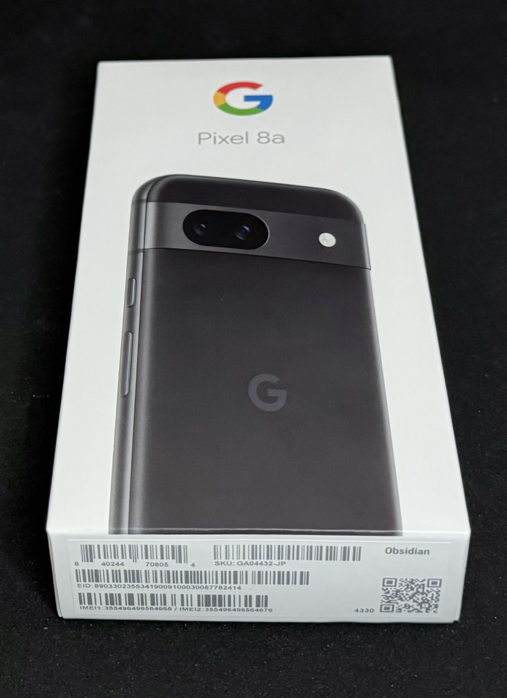
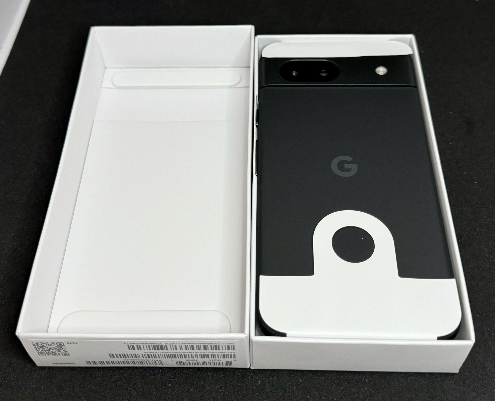
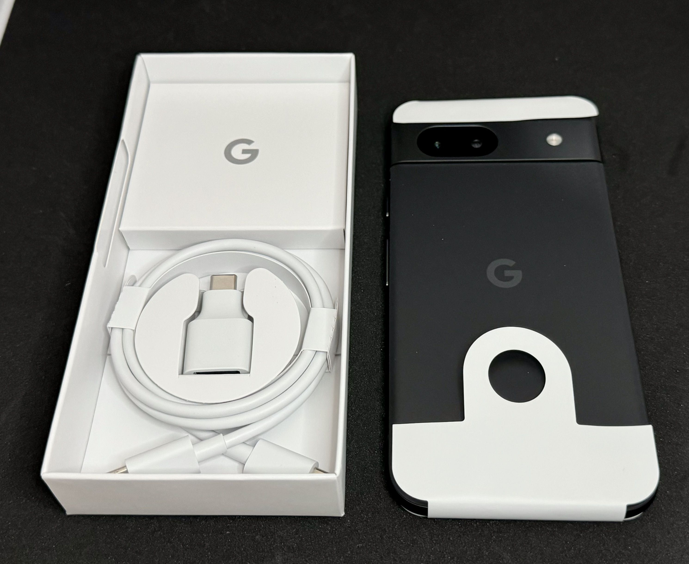
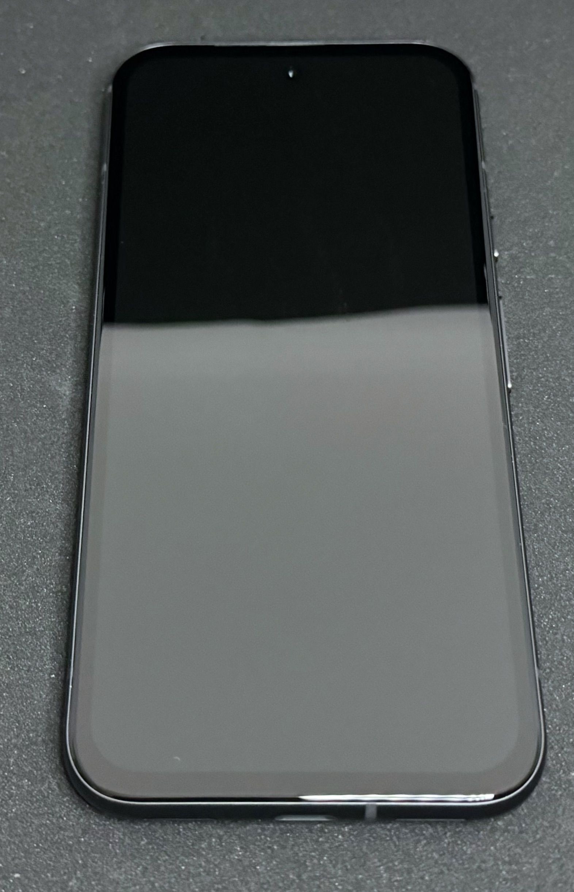

　こんにちは、如月翔也（[@showya_kiss](https://twitter.com/showya_kiss)）です。
　今日は最近発売されたばかりのPixelの新型廉価版ミドルハイスペックスマホであるPixel8aについて、早速購入したのでアンボクシングを含めてフォトレビューをお送りしたいと思います。
　まあ色々あって今は手元にないんですが（一回返品した）、性能には満足しているのでストアクレジットがついたらそのストアクレジットでもう一回同じものを買おうと思います。
　色々あって、というと含みがありそうですが、分割で買おうと思って分割で買ったつもりがカードに一括請求が来ており、一括だと処理しきれないのでGoogleさんに相談したところ返品してから買い直して下さい、という指示だったのです。

## Google Pixelシリーズとは

　Google Pixelシリーズとは、Googleの販売するプレーンなAndroidのシリーズ名を指します。
　普通AndroidというとXperiaとかAquosとかのイメージも強いと思うのですが、それらは搭載されているAndroidシステムがプレーンではなく、Androidそのものがアップデートされても使っている機種ごとにアップデートが来たりこなかったりするんですが、とりあえずPixelシリーズについてはAndroidを作っているGoogleがプレーンなAndroidで作っているのでアップデートを即座に受けられる点が大きなポイントとしてあげられます。
　また、Pixel8以降についてはアップデートが7年間確約されているので、まあそこまで同じ端末を使い続けるのも考えづらいんですが、とりあえず7年はアップデートが受けられるという事は2〜3年でアップデートがかからなくなって使えなくなるという事がないという事なので非常に良い選択なのです。
　特にPixelシリーズはGoogleの技術の集大成が搭載されているので、機能的に劣る事はほとんどないですし、使いやすいAndroid機という意味では一番に名が上がる機種なのです。

## Pixelのaシリーズとは

　PixelはPixelの後にシリーズ番号が来て、その後に何もこない一般機、ProがつくPro機、aがつく廉価機に分かれるのですが、今回購入したPixel8aはPixel8シリーズの廉価機です。
　廉価機とはいえミドルハイのスペックがあり、原神を適当に遊ぶ（ガッツリ遊ぶにはちょっと力不足かも）程度ならぜんぜん行けますし、崩壊3rdも行けました。多分今週発表される鳴潮もそれなりに遊べると思います。
　カメラも悪くないですしAI関係の技術が惜しげもなく投入されているので廉価機としてはかなり高レベルにまとままっており、その分ちょっとお値段も張るのです。
　GoogleStoreでは一般売りで128GBのPixel8aが72600円、Pixel7aが6万円台だった事を考えると1万円ほどお値段が上がっています。6万代を超えると廉価版というには若干苦しいんですが、今オトクなキャンペーンをしていて、キャンペーンを利用するとわりと安く入手できます。
　ちなみに発売当初はカタログに256GBモデルがある記載がありそれが欲しかったんですが、結局日本では128GBオンリーで行くらしくカタログの256GB記載が消されました。米国ではObsidianだけ256GBモデルがあるようですが、日本では買えないのと、米国で買っても下取りキャンペーンの対象にならないのと、あとコレは致命的なんですが米国で買っても技適マークがついていないので、それを一般用途で日本国内で使うと違法なので（旅行者が一時的に使うとかはオーケーなんですが）、256GBモデルは諦めましょう。

## Pixel8aのキャンペーン

　今GoogleStoreで行っているキャンペーンでは、Pixel7aやiPhoneSE3を下取りに出すと最大32800円払い戻しを受けられるので下取りを使うと差額39800円で購入可能、それに加えて今キャンペーンでPixel8aを購入するとGoogleStoreで使えるストアクレジットが20000円分貰えて、その分を差し引くと実質19800円で買える、というキャンペーンを行っているのです。
　ただ、ストアクレジットはGoogle Playでは使えないので、Google Storeでの買い物にしか使えないのに注意が必要です。
　ストアクレジットの使い方についてはちょうどPixelBudsProが本来28,200円のところを21500円に値引きしているので差額1500円で手に入れるか、あるいは最新版ではないんですがPixelWatch（2じゃなく初代）が39,800から25800円に値引きしているので、5800円の差額で購入する事ができるのでお勧めです。
　僕はPixelBudsProを購入して、AirPods第3世代（Proじゃない方）と入れ替えたんですが、ノイキャンの威力に恐れおののいていますし、音も十分で満足しています。
　なお、我慢できなくてPixelWatchも買ってしまって今手元にあるんですが連携する本体であるPixel8aを今返品中なので設定すらできないで箱も開けていません。
　このあたりは別途レビューできれば、と思います。

　と、いうわけで、僕はキャンペーンを利用してPixel7aを下取りに出してPixel8aを購入し、ついたポイントでPixelBudsProを入手したのです。

## ではまず外箱です。

　ではまず外箱の写真をお送りします。
　Pixel8aの箱はiPhoneの箱と違ってシールで密閉されておらず、箱の上面を持って持ち上げると下箱が下に下がって来る感じでした。まあ新品だと思うので気にしないのですが、Appleの場合箱に引っ張って切るシールが張ってあって「間違いなく開けてない代物ですよ」と主張してくるので、それに比べると主張がおとなしいな、と思います。

　マスクしていないので色々な情報が漏れていますが、残念ながらこのPixel8aは返品したので、もう僕のものではありません。この情報を追っても何の意味もありませんのであしからず。

## Pixel8aを開封します。

　では早速Pixel8aを開封します。
　箱を開けた状態ではこういう感じで収められています。

　そんなに感動感があるか、というと、僕は去年iPhone15ProMax（1TB）の30万円！と対峙した感動を覚えているので、そのまま買っても価格が1/4、実質19800円で買っているので1/15の価格ではそんなに感動感はなかったです。
　ただ、Androidって艦これアプリが使えますし、クロスOSで遊ぶゲームの場合iOSで初回購入アイテム倍増とGoogle Playで初回購入アイテム倍増を併用できたり、できなくとも基本Google Playの方が値段が安いですし、あとGoogleアンケートに真面目に答えていると月300円くらいになるのでたまに課金ができるのでAndroidを持っているのは便利ですし、あとiPhoneにだけ頼っているとなにかの事故でiPhoneが使えなくなると誰とも連絡が取れなくなるので、Androidでpovoを使って電話番号を持っておくのって意味があると思うんですよね。

## 本体を取り出してみました

　という理由で本体を箱から取り出してみました。
　悪くないです。Pixel7aの場合背面がツルツルした仕上げで指紋が目立ったり指が滑ったりしたんですが、Pixel8aは背面がマットな仕上げで、指紋も目立たないですし、指が滑らない感じがします。

　カメラ部分の出っ張りはPixel7aと変わらないんですが、前回はPixel7aを4万で買ったので裸運用（ガラスフィルムだけ装着）で使っていたのを、今回は総計7万超えのスマホなのでちゃんとしたケースとガラスフィルムを用意したので、カメラ部分の出っ張りは気にならない感じになりました。
　もともとPixel7aでもカメラ部分の出っ張りは気になっていなかったので（それを気にしていたらiPhone15ProMaxもiPad miniも使えない）プラスでもマイナスでもないにですが、そんなに主張するカメラではないです。

## 本体の表面です

　では最後に本体の表面です。画面が写っていないので情報量が全然ないんですが、見た目はこんな感じです。

　Pixel7aより若干ベゼルが広いか？という感じがあるのと、下部分だけベゼルがちょっと太いのでダサめな感じがするんですが、このスペックのスマホは性能を買っているのであってスタイリッシュさを求めるならもっと金を出せという話なので、僕は全然問題ないと思います。

## 肝心のスペックですが

　レビューとして言わなければならない部分としてスペックはどうなんだ、という点ですが、まずディスプレイは素晴らしいです。Pixel7aは最高リフレッシュレートが90hzでしたが、Pixel8aの最高リフレッシュレートは120Hzです。動的にリフレッシュレートは変わりますが、ウェブページを見ている範囲では引っかかりを感じる事はなかったです。ゲームでは120Hz出るんでしょうが僕は60Hz固定で「安定して動かす」方が大事なので120Hzは試していません。
　Tensor3の性能についてはそんなに「跳ね上がった」感じはないですが順当進化というか、Pixel7aより2割くらい体感で早くなったかな、という感じです。
　ストレージについてはもう128GBしか選択肢がないのでどうしようもなく、僕は今原神と崩壊3rdを入れているんですが、それにプラスして35GBの音楽データを流し込むと128GB中120GB使ってしまうので余力がまったくなく、話にならないので音楽データを消しました。
　本当はWindows/Mac/Linux/iOS/Androidで全部同じアプリを入れて何を使っても同じデータにアクセスできる環境が理想的なんですが、iOSはiPhone15ProMaxが1TB、iPad miniは256GBなので余裕があるんですけれど、Pixel8aはどうにもならないくらい余裕がないので、まあ基本ゲーム機として運用して、原神・崩壊3rd・鳴潮を入れて終了、という感じかな、と思います。一応NotionとUpNoteは入れる予定なんですけども。

## ただまあ、ミドルスペック以上はiPhoneでもそんなに変わらないんですよね

　ただまあ、これを言ってしまうと身も蓋もないんですが、「コレをする」という明確な目的を持っていないのであれば、ミドルスペック以上のスマホはiPhoneを買ってもPixelを買っても「できる事」には大差がないんですよね。
　もちろんPixelにしか搭載されない性能もあるんですが、これって時間経過とともにGoogleサービスに合体していってiPhoneでも（それどころかスマホですらなくパソコンでも）使えるようになって行きますし、MacとiPadを持っている人なら「連携」という意味でiPhoneを選ぶ意味もあるんでしょうが、持っていない人がiPhoneを持っていても「本来のエコシステムに寄って受けられる便利さ」の半分も享受できないので、iPhoneを使うのであればMacとiPadを使うべきですし、Pixelを使うのであればWindowsとAndroidタブを使うほうが便利なので、「どのセットを選ぶのか」を考えた方がいいかな、とは思います。

　僕はM3MacBookAir15インチとiPad miniとiPhone15ProMaxでエコシステムを1個確立していますし、それに加えてこの前Androidタブレットは手放しちゃったんですが、バリバリのゲーミングWindowsノートパソコンにPixel8aを持っているのでそっちの連携も十分できますし、あと個人的にUbuntuを使っているのでほぼすべてのOSを網羅して遊んでいるので「その場の気分」で好きなエコシステムに囲まれる事ができるんですが、予算に余裕がない場合（僕だってないですけどね）は「どのエコシステムに投資するのか」は考えたほうが良いと思いますよ。

　その上で、今Windowsを使っていてスマホはAndroidがいい、という人で、「データについてはクラウドでなんとかする／そんなにデータはいらない」人であればPixel8aはかなりアリな選択肢だと思います。
　個人的にはe-SIMプラスSIMスロットが1個あるなら、物理スロットをマイクロSDと互換にしてマイクロSDで容量を増やせるようにしてくれれば満点のプロダクトだったのになぁ、と思います。