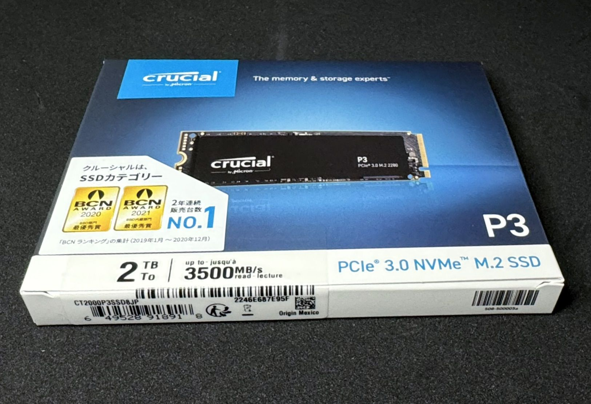
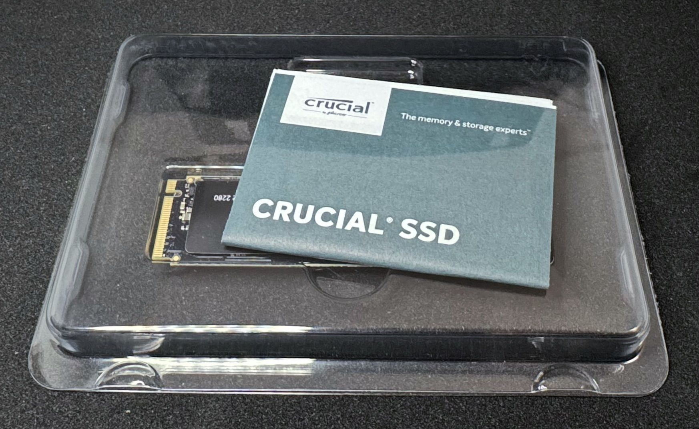
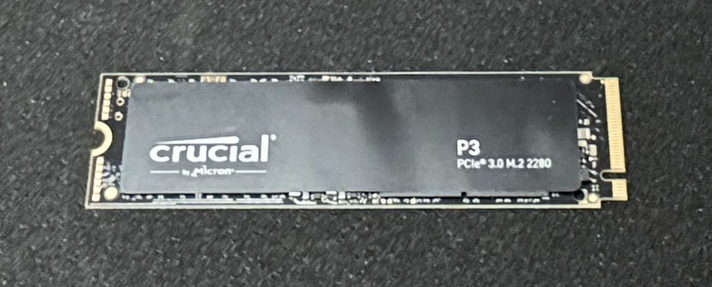
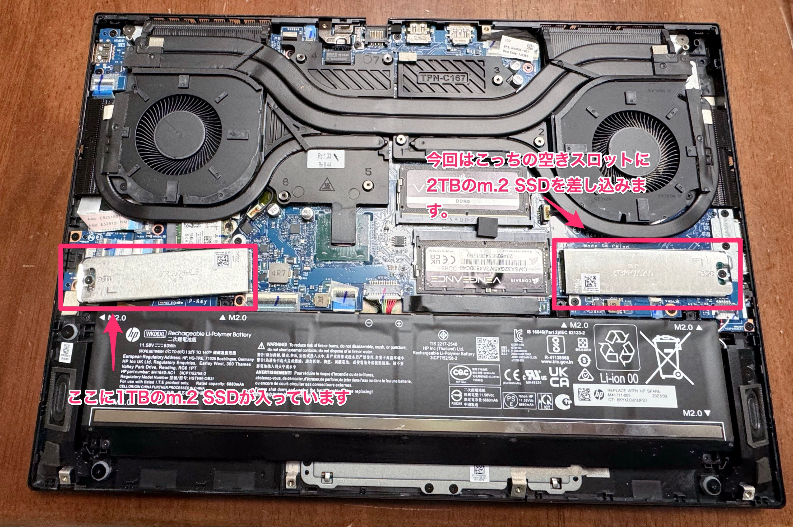

　こんにちは、如月翔也（[@showya_kiss](https://twitter.com/showya_kiss)）です。
　ちょっと前の事なんですが、使っているゲーミングノートPCに調子に乗ってゲームをインストールしまくっていたら搭載されているm2.SSDがのこり100GBを切ってしまいまして、いくらなんでも空きが10パーセントはSSDのヘルスにも良くないですし動作も悪くなる傾向があるので、持っているデータ（700GB）を別ドライブに押し出してCドライブはアプリやゲームを入れて300GB、DドライブはデータとiPhoneやiPadやAndroidのバックアップを入れて1TB、それで50パーセント以上の余裕をもたせる、という事を目標に、Crucialの2TBのm.2 SSDを購入しました。

## 買ったのはこれです。

　買ったm.2 SSDはこれです。

<!--! <!-- START MoshimoAffiliateEasyLink -->
リンク
<!-- MoshimoAffiliateEasyLink END --> !-->

　SSDとしてはそんなに激早い方ではなく3000Mbpsくらいですが、データを拾うためのドライブなのでCトライブのように酷使しないですし、Crucialなら安心のブランドですし2TBで17800円なら十分なお値段です。
　しかも今回、楽天リーベイツで買える店でいいのがないかな、と思って調べていたらJoshinでAmazonと同額で売っており、リーベイツ経由で買えるので1パーセントポイントバック、去年の阪神優勝セールでRyzen搭載のAspireを6万円で買ったのでその時のポイントが600円あり、そしてなぜかキャンペーンで100円のクーポンがついてきたので、実値引き700円プラス後日リーベイツで1パーセント返ってくるのでAmazonより安く購入できました。
　まあメインドライブを置き換えるには速度的には若干不安があるんですが（読み込み速度がボトルネックになってゲームが快適に動かない可能性がある）、データドライブなので別にいいかな、大事なのは性能のピーキーさではなく値段と性能のバランスだな、と判断して購入しました。

## 早速フォトレビューします。まず外装からです。

　というわけで早速フォトレビューします。まず外装からです。

　安物なので柔らかい箱に入って届けられ、見ての通り右下が箱潰れしています。
　まあリセールするものでもないので別にどうでもいいですし、ちゃんと動いてくれれば文句はありません。

## 外箱を開けるとこういう感じです。

　早速外箱をむしり取り中身を開けるとこんな感じです。

　説明書に隠れてしまっており肝心の本体が良く見えません。
　一応規格があっていますし取り付け例でも挙げられていた実物を買っているので繋がらない事はないと思うんですが、説明書で隠れていると一抹の不安がよぎるものです。

## 中身だけを抜き出しました

　というわけで邪魔なカバー、取扱説明書を取り除きm.2 SSD本体を出してきました。
　こんな感じです。

　見た限り大きな損傷もないようですし、問題なく動くと思います。
　今回はAmazonじゃなくてJoshinで購入したので返品が面倒なので初期不良は引きたくないところです。
　では、早速取り付けます。

## 自慢のOMEN16（2023年モデル）を開けました

　もう購入直後に16GBではメモリが足りないのは明白だったので、即座に32GBのメモリを買って換装しているので、OMEN16の裏蓋を開けるのは初めてではないのですが、OMEN16は裏蓋が開けづらく、吸盤を使って引き上げるか、あるいは目立たない傷がつきますが、LAN配線口のあたりにちょっとした段差があるのでそこをドライバーで押して隙間を開けて別のドライバーをねじ込んで内側の爪を外していく感じで外していけばオーケーです。
　開くとこんな感じです。

　まあこれだけ見ても何をどうするのかわからないと思うので文字で補足を入れます。

　画面左下、ちょっと左斜め下に傾いているm.2スロットはもうCドライブ用の1TBのm.2 SSDが入っているので無視します（逆にシステムドライブを拡張したい場合このSSDを大きなSSDにクローンしてこのスロットを入れ替えます）。
　僕は今回Dドライブの増設が目的だったので、画面右真ん中にあるm.2スロットはそのまま空きの状態なので、横のm.2を抑えるネジと、一瞬見落とすんですが抑えるために下部分にネジがあるので両方外し、スロットカバーに買ってきたCrucialのm.2 SSDを差し込んで（グラグラします）そのまま端子に斜めに差し込み、差し込んだSSDをゆっくり基盤に着地させつつスロットカバーをネジ穴の位置にスライドさせて合わせたネジ穴にネジをねじ込んで作業は終了です。
　後は外した裏蓋をはめ込み、8箇所あるネジを全部閉めてからWindowsを起動、ディスクマネージャから新しい領域を認識させてGPTフォーマットでフォーマットをかければDドライブが誕生します。

## 僕はこの際メンテしましたが

　この後、Cドライブにあるデータ部分をDドライブに移動する作業があるんですが、僕はこの際メンテをしようと思い、データ自体はUSBで刺さるスティックUSBに全部いれてあるので、Windowsを初期化し、設定をやりなおし、OneDriveの設定を変えてバインドするディレクトリを変えてから各種マイデータフォルダを全部Dドライブに作成したフォルダを指すように設定し、最後にOneDriveをアンインストールしてからバインドしたフォルダも消して無事増設とメンテが終了しました。
　現在Cドライブがアプリとゲームを入れて300GBくらい、Dドライブがデータを入れて700GBくらいなので、この調子で行けば5年は持ちそうです。
　GPUがRTX4060なので型遅れになる可能性があるんですが、まあここからいじるとしても将来的にメモリを64GBにするくらいで、それでも4〜5年は戦えるんじゃないんでしょうか。

## 一番の問題は

　一番の問題はこのOMEN16は「ゲームもする開発機」として購入したのに、ゲームしかしていないで全然開発をしていないところなのですが楽しいのでまあいいか、と思います。
　月末からは鳴潮をやりたいですし、来年にはモンスターハンターワイルズが控えているので（そのためPS5を嫁さんに取られるのでゲーミングノートPCを購入したのです）、ゲーム自体には困らない感じですね。

　このまま楽しく行きたいと思います。