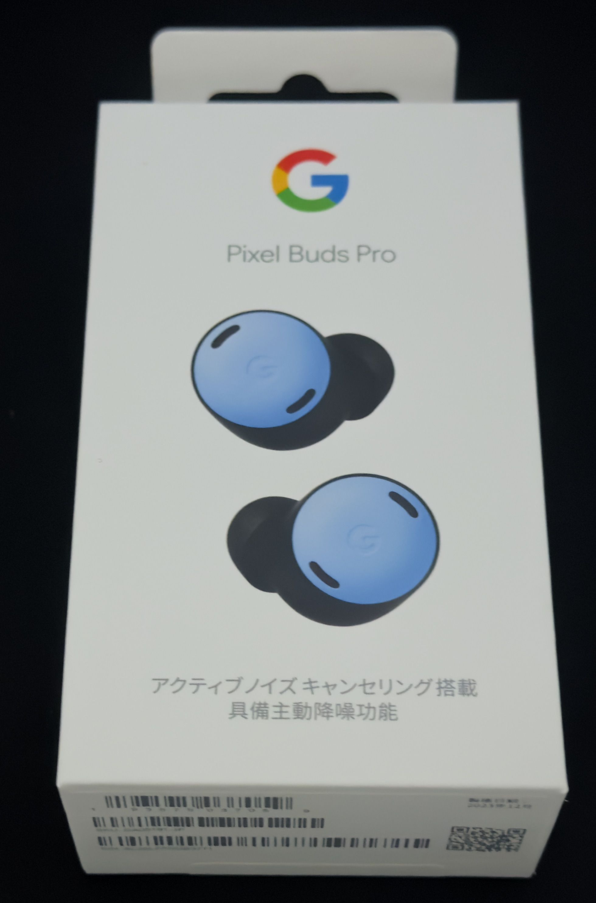
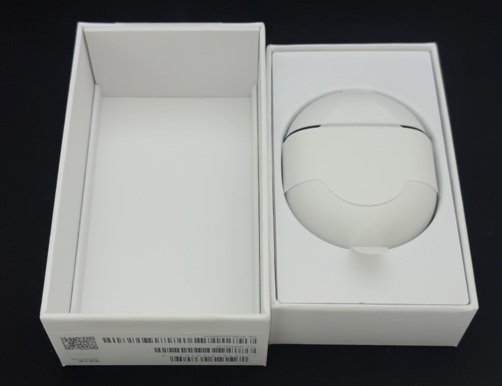
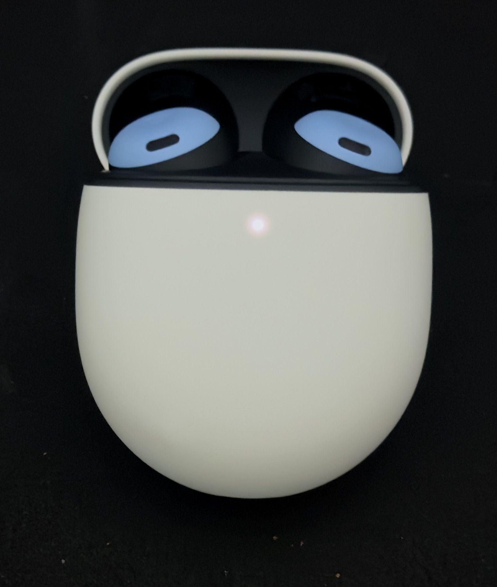

　こんにちは、如月翔也（[@showya_kiss](https://twitter.com/showya_kiss)）です。
　購入してからちょっと経過しているんですが、真面目に使ったのが今日が初めてなので、あくまでファーストインプレッションという意味でこの記事で取り上げようと思います。
　Googleのノイキャン機能付きカナル型無線イヤホンのGoogle PixekBudsProについてです。
　この製品はGoogle Pixel8aの購入キャンペーンで入手した20000ポイントに、1500円ほど追い銭して購入したものです。本来27800円くらいなんですが、キャンペーンで21500円になっていたので勢いで購入したのです。

## まず外箱です

　まず外箱です。Pixel8aの外箱は上箱と下箱を繋ぐテープがなく上箱を持つと下箱がずれて落ちてくる仕様だったんですが、なぜかGoogle PixelBudsProは上箱と下箱を繋ぐ引っ張って切るタイプのテープがついており無駄に新品を主張してきます。
　写真は上箱正面なのでテープは見えませんが、まあ約3万、実売2万の迫力がある箱か、と言われると首をひねらざるを得ません。まあ僕はこういうコンビニ感覚な箱も嫌いではないですが。

　僕は基本的に好きな色として「黒に近い濃紺」→「漆黒」→「青」の順で好きなので、PixelBudsProには漆黒と言える黒はなかったので、結果的にスカイブルーのPixelBudsProを選ぶ事となりました。でも悪い色ではないですし、好きな色の一つではあるので個人的には満足です。

## 外箱を開けました

　外箱を眺めていても仕方がないので外箱を開けました。中身はこういう感じです。

　箱の中はケースに収められた本体、説明書、以上。充電ケーブルすらない素朴な構成です。どうせCtoCケーブルなんか百均で死ぬほど持っていますし、なんならライトニング対応から画面出力対応から10本単位で色々なケーブルをもっているのでここで追加で貰っても嬉しくなく、別にいらんので何の問題もないです。
　ライバルのAirPodsはもっと横に長いですが、PixelBudsProは縦長です。

## 本体を見ると

　では箱から取り出して本体を見るとこんな感じです。

　見た目は非常に可愛らしいんですが、下半分何入っているの？というくらいイヤホン部分に対してケース部分の大きさが大きいです。
　多分「探す」に対応するGPSとか色々入っているんでしょうが、それでも「何入ってるの？」と突っ込まざるを得ない感じです。

　フォトレビューとしては以上です。

## Apple製品とは相性良くないですよね

　まあPixel BudsProは名前の通りPixelの相棒として設計されていると思うのでメインターゲットがAndroidなので仕方がないんですが、Apple製品とは相性が良くないです。
　例えばPixelBudsProには2台のデバイスを行ったり行きたりが簡単にできる機能があるんですが、これ、アプリで設定しないと使えなくて、そしてiPhoneにはアプリがないので設定できません。
　つまり、普段iPhoneで聞いていてたまにMacに移動する、は一々BLUETOOTH設定から起動しないといけないのです。ザラッと説明を英語で読んだ限りではPixelBudsProは8台までデバイスを記憶しており、それ以上に追加すると一番古い1個を忘れていく、という形式のようなので、一々「デバイスを削除」から「デバイスを登録」をする必要はないみたいなんですが、今Macで使っている範囲では、Macで認識させようとしたら一回MacのBLUETOOTH自体をオフにしてからオンにしなおさないと検索に出てこない感じでした。2回同じ挙動をしているのでもしかしたらこれずっとこうかもしれません。
　あと、これはBLUETOOTHの問題なのかもしれないんですが、Macからの場合、Apple Musicから音楽を聞いても、YouTubeMusicから音楽を聞いても、一瞬音が歪む時があります。歪むと言うか、一瞬音が遅れて次の瞬間に追いつくように音が詰まって聞こえてくる事があり、これは慣れの問題と言うか、使っているうちに直ってくるものなんでしょうかね……？
　一応、iPhoneからYouTubeMusicやApple Musicを聞いている時にはなかった問題なので、Mac固有か、Macで使っているWi-Fiの周波数と鑑賞しているのかもしれないです。
　まあMacを使う場合イヤホンで音楽を聞く事はほぼないので良いのですが、iPhoneでだけその問題がおきなければいいな、と思います。

## 実をいうと

　実をいうと、僕はPixel8aを持っている（厳密には今返品中なので手元にはないんですが、Pixel7aの下取り金額がストアクレジットに追加されたらもう一回買う）ので、音楽もPixel8aから聞けば良いんですが、Pixel8aって容量が128GBしかなくて、今僕が使っているアプリを全部入れて、かつローカルの音楽を35GB全部入れると128GB中120GB使っちゃうので駄目なんですよね。
　今日から鳴潮も入れる予定なので多分20GBくらいもっていかれるので音楽が入る余裕がどこにもなく、YouTubeMusicについてもPixe8aはサブ端末でpovo無料運用をしているので散歩の時に音楽を聴くには帯域が足りないのです。
　あと勢い余ってPixelWatch（初代の方）を買ってしまったのでPixelWatchはAndroidにしかペアリングできないのでPixel8aとペアリングするしかなく、音楽はどうしてもiPhone15ProMaxを使わないといけないんです。
　その点、iPhoneとの連携を全く考えていないPixelBudsProはちょっと使いづらいかな、と思います。

## 新機能のノイキャンについては

　新機能のノイキャンについては、めちゃくちゃ効きます。
　PixelBudsProとiPhoneで音楽をそれなりの音量で聞きながらiPadで雀魂をしていたんですが、BGMも音声も聞こえないな、僕消音にしてたっけ、と思ってPixelBudsProを外したら、PixelBudsProで聞いていた時くらいの音が出ていました。このレベルで聞こえなくなるとかなり凄いですね。
　今もMacで音楽を聞きながらHHKB Studioでキーボードを叩いているのですが、まあそもそもHHKB Studioは静音なので音も大きくないんですが、全く打鍵音が聞こえません。手に跳ね返ってくる打鍵感だけが打っている頼りで、この完全な静音はかなり気持ちがいいです。

　ただ、僕PixelBudsProは散歩用のお供に使う予定なので、ノイキャン効かせて音楽を聞きながら歩くと自電車や車に轢かれる、追いついてくる人の邪魔になる、というのが容易に予測できるので外ではノイキャンは使いませんし、家の中でも僕は一番外側に座っているので、家族が「振り向かずに喋った」場合ノイキャンだとほぼ100パーセント聞こえませんし、ウチの家族は自分がノイキャンで聞こえない時は「あ、ごめんね？」くらいの反応のくせに、僕が音楽に没頭して聞き逃したりノイキャンで聞こえないと罰ゲームが開催されるのでやはり嬉しくなく、ノイキャンは基本的には夜中一人の時しか使わない方向性で行こうかな、と思います。

## 製品としては

　個人的に、Apple信者かつWindowsとAndroidとLinux機は必ず持つ、という環境OSオタクでありかつガジェットオタクとして言うと、製品としては「3万出すならAppleのAirPods第3世代を買う」という選択肢に行きますが、値引きの結果21500円なら、Pixel8aを買った時にプラス1500円で手に入るのであれば、断然アリだと思います。
　僕の家族はみんなiPhone＋AirPodsなので、嫁さんがAirPodsProを無くしたので僕のAirPods第3世代を譲って今PixelBudsProを使っていますが、「そんなに大きな」不満はないです。
　音量は十分に出ますし、雑音は入らないですし、あと僕耳がそんなに特別良いわけではないので、PixelBudsProとAirPods第3世代のどちらが音が良いか、と言われると正直答えられません。ただ、ノイキャンの分確実に音楽に集中できるのは事実だと思うので、僕はしばらくPixelBudsProでいいかな、と思っています。

　Android派の人には良い買い物なんじゃないかと思うので、個人的にはお勧めです。