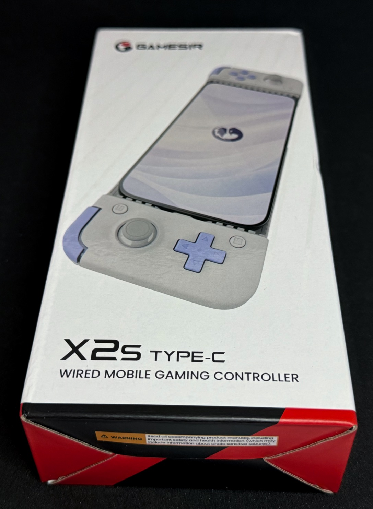
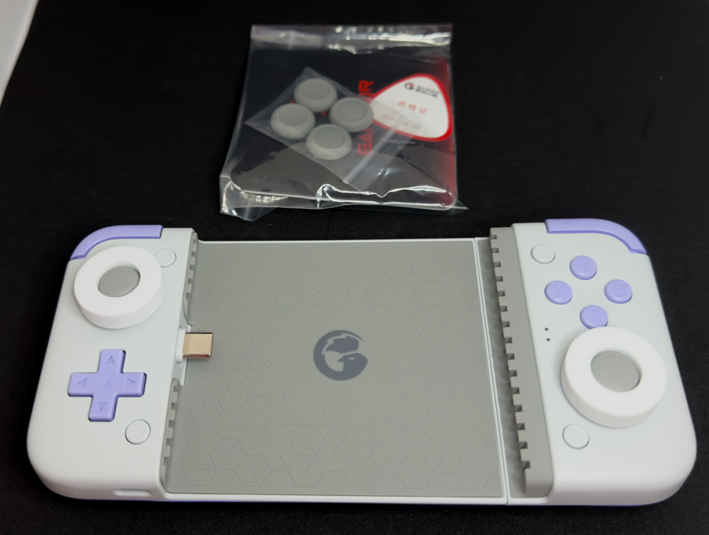
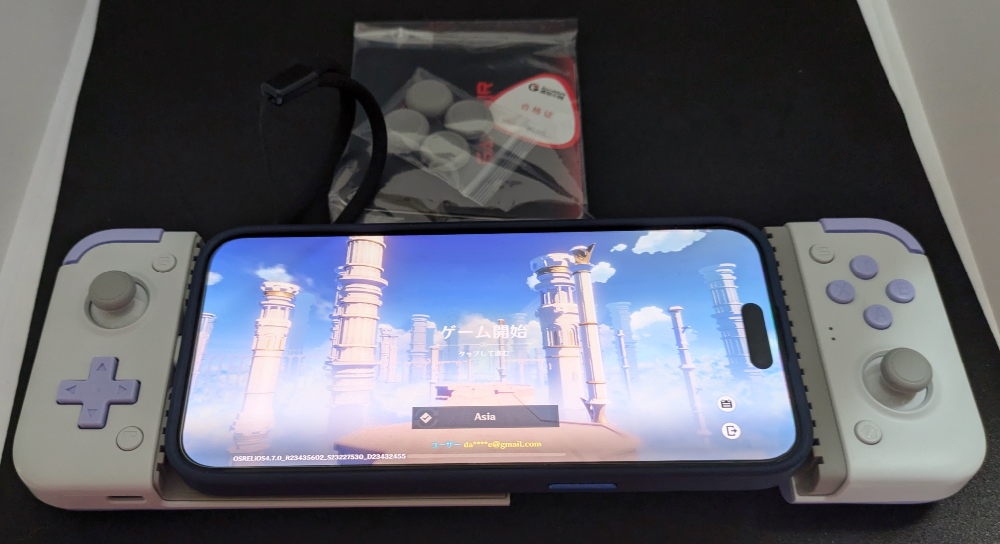

　こんにちは、如月翔也（[@showya_kiss](https://twitter.com/showya_kiss)）です。
　今日は最近PlayStation5の公式関連アイテムとして注目されている「スマホを挟んで携帯ゲーム機にするコントローラー」であるBACKBONE ONEに興味をそそられたのですが、これ系のガジェットに19800円も出していられない（公式製品にしても高すぎる）ので、個人的にこれ系のおもちゃなら5000円くらいがお試しに遊ぶには打倒な価格だと思い、色々調べたんですが、これ系のガジェットはわりと歴史が深く、調べている中で「GameSir」の「x2s」なら日本のamazonで6500円、楽天リーベイツを使ってのAliExpressでは公式サイトから5000円を切る金額で発売されており、x2s自体はかなり評判の良い製品だったので、AliExpressからだとちょっと配達が遅いんですがまあ良いか、と思って購入したのでレビューします。
　なお、本来7月1日に到着予定だったx2sなんですが、6月27日の時点で手元に届いており、全然早く到着していて値段も安く、後述しますが製品としてとても良く出来ているので良い買い物だったというのが最終的な結論です。
　ただ、僕の場合僕がガジェットオタクで色々はハイエンドなガジェットを持っていて、かつソシャゲをバンバン回すタイプなので「とても良い商品」ですが、そうじゃない人にとっては5000円の価値がない可能性があるので注意して下さい。
　ただ一つだけ言えるのは、スマホでアクションRPGをやる人であれば、指で画面が隠れなくて済むだけでゲームの面白さが段違いなので、スマホでアクションRPGを演る人には特にお勧めです。

　先にリンク貼っておきますね。

<!--! <!-- START MoshimoAffiliateEasyLink -->
リンク
<!-- MoshimoAffiliateEasyLink END --> !-->

## 先に僕の環境を説明しておきますね。

　僕は基本パソコン・スマホ・ガジェットオタクなので、パソコンはM3MacBookAir15インチ（16GB/512GB）とWindowsはHPのOMEN16の2023年モデル（Core i7-13700h/32GB/1TB+2TB/RTX4060）とUbuntuはAcerのAspire3（Ryzen4 7500/15GB/512GB/Ubuntu24.04LTS）を持っており、主にゲームは艦これと原神と崩壊3rdとBLUE PROTOCOLと鳴潮をやっています。今一番ホットなのは鳴潮です。
　スマホ環境についてはメインがiPhone15ProMax（1TB）でサブがPixel8a（128GB）を使っており、ウィンドウズでもかなりゲームが遊べるんですが、メインスマホはほぼどんなゲームでも動きますし、Pixel8aもミドルハイなので画質を調整すればほぼどんなゲームでも動きます。
　僕が今回スマホを携帯ゲーム機に変えるガジェットに興味を示した理由は、家族の都合によりわりと頻繁にパソコン前を追い出されるのでスマホでもソシャゲをやりたいんですが、スマホの画面コントローラーを使うと指で画面が隠れるのと、どうしても移動キーがアナログじゃないのて操作しづらく、パソコン前を追い出されている間スマホでコントローラーを使ってソシャゲをプレイしたいニーズだったのです。
　あと僕は個人的に病気を持っており布団から出られない事があるので、布団の中で遊べれば良いなー、と思うのと、あと遊んでいるゲームでスマホ版がないゲームはBLUE PROTOCOLだけなので、スマホ版でも遊べると便利でいいね、と思ったのです。

## というわけで購入しました。外箱からどうぞ。

　というわけで購入しました。外箱からどうぞ。
　本来AliExpressから届いたので貧相な紙パッケージで包まれているんですが写真を撮る価値を感じなかったのと、中にはいっていた梱包も写真を撮る価値を感じなかったのでいきなり梱包を剥がして外箱です。

　まあ見た目はチープではないですが決して高級感もなく、「おもちゃだよね」という外箱です。実際おもちゃなのでそういう外箱でいいですし、外箱にお金をかけられても困るので別にこれで良い気がします。

## 中身はこんな感じです。

　外箱を開けたら中身はこんな感じです。
　本来、説明書、アナログスティックにつけるスティック部分を大きくするリングなどが入っています。

　アナログスティックに白い大きなスチロールがついていますが保護用で、抜いてポイです。アナログスティック自体は僕はそのままのサイズで全然違和感を感じなかったです。
　大きさとしてはiPhone15ProMaxよりちょっとだけ大きいかな、程度のサイズなので、そんなに極大ではありません。出先に持っていく時にポケットにねじ込むのは無理がありますが、ボディバッグに忍ばせるのには苦労しないと思います。
　スイッチがラベンダー色で、背面もほとんど全部ラベンダー色です。グリップ部分だけ白いゴムになっており凹凸があるので握りやすくて使いやすくなっており割と気配りを感じさせられます。
　ちなみに、BACKBONE ONEと違ってUSB-C端子が左側についていますが、これはむしろ便利で、僕は持っていないんですがフォルダブルのスマホを持っている人はUSB-Cが右だとスマホを「開いた」時に画面が下に開くんですよね。しかしUSB-Cが左にあるとスマホを「開いた」時に画面が上に開くのでゲームプレイがしやすいという配慮になっています。
　あとスマホの適合サイズもかなり大きいのまで大丈夫で、左にUSB-Cがあって右側はスライドして引っ張って開けるので段差があり、この段差にスマホのカメラの出っ張りが格納されるのでガタガタしなくて非常に良いです。
　更にいうと壊すの覚悟で言うとスライド部分をガタガタ言わせると外れて、iPad miniサイズのタブレットが刺さって動作するようです。
　僕はiPad miniを持っていますが、iPhone15ProMaxの方が性能がいいですし、せっかくのおもちゃを壊すのは本意ではないので試していません。もちろん推奨もしないのでどうしても試したい人は自己責任でどうぞ。

## iPhone15ProMaxをつなげました

　眺めていても仕方がないので早速使おうと思い、iPhone15ProMaxを装着しました。よってこの写真だけPixel8aによる撮影です。

　はい、iPhone15ProMaxのサイズでも全く問題なく挟み込んで携帯ゲーム機化が可能です。
　写真ではケースを付けたまま挟んでいるんですが、残念ながらiPhone15ProMaxもPixel8aも、ケースを付けたままではUSB-Cの刺さりが足りなくてコントローラーとして認識しません。なので、遊ぶ場合はケースを外して裸にしてつなげて下さい。
　USB-C部分が上下に首を振る事ができるので、まず斜めにしたスマホをUSB-Cにさして、それから右側のスライド部分を引っ張ってスマホを挟んで下さい。
　そんなに難しいミッションではありません。

## ゲームの対応状況

　早速遊びたいゲームを色々試したんですが、こんな感じです。

- iPhone15ProMax
  - 原神　そのままコントローラーとして認識されるのでそのまま遊べる
  - 崩壊3rd　コントローラーとして認識するので戦闘場面はコントローラを使える。それ以外の場面は画面タッチで操作する。
  - 鳴潮　鳴潮はWindows版以外コントローラーに対応していないので使えない
- Pixel8a
  - 原神　Android版はコントローラー対応していないがGameSirアプリを入れればそれだけで対応する
  - 崩壊3rd　試していないのでわからないです。
  - 鳴潮　コントローラーに対応していないんですが、GameSirアプリを使ってバーチャルコントローラー設定をする事で画面にタッチインタラクション自体は表示されますが、ボタン操作ができます。

　本当はGameSirのiOSアプリが画面の乗っ取りに対応していればiPhone15ProMaxでもバーチャルコントローラー設定で遊べるはずなんですが、iOS13以降はそういうアプリは全滅なので、iPhone15ProMaxでコントローラーを使いたい場合は鳴潮運営に要望を上げ続けて対応して貰うしかなさそうですね。
　ただ、Pixel8aはミドルハイのわりには頑張っていて、鳴潮を普通に起動して処理落ちしないですし、デイリー処理はおろかボス周回でタイミングズレを起こさずにパーフェクト勝利が3回連続でできたので再現性があると思っており、画面の綺麗さは流石にWindows版には敵わないですが出先で遊ぶくらいの用途なら全然ありです。

## 買ってみての正直な感想

　買う時点でわりと投げ銭というか、「まあ1週間も遊べれば御の字でしょ」くらいの気持ち（もっというとブログのネタにできれば御の字くらいの気持ち）で購入したんですが、思った以上に製品のできが良く、ボタンもちょっと間が狭いですが操作できないほどではないですし、原神と比べるとわりとシビアな入力を求められる鳴潮でも全然問題なくゲームプレイが可能だったので、製品としては非常に満足度が高いと思います。
　USB-Cで有線接続なので技適が関係ないですし、本体にUSB-C給電ポートが付いているのでそこにUSB-Cをさせばスマホを充電しながらゲームができますし、本体にバッテリーを内蔵していないので軽いアンド劣化しないという大きなメリットがあり、結局これ系の「スマホを挟んで携帯ゲーム機に」という機械はコントローラー部分さえしっかりしていれば「重要なのはむしろ挟まれる側のスマホの性能」なので、良いスマホを持っている人であればあるほどこのたった5000円の投資の価値がかなり大きくなると思います。
　全部確認したわけではないですが、GameSirのx2sは普通にPlayStation5のリモートプレイ対応ですし、SteamのリモートプレイにもX-Boxのリモートプレイにも対応している（挟むスマホが対応していればですけどね）ので、まあ単純にUSB-Cで繋ぐただのコントローラーなので対応するしないは全然関係なく、スマホが対応するかどうかの問題なので、「ちょっとこれ系興味あるんだよね」という人は値段の安いこっちから試してみる事をおすすめします。
　もしかするとBACKBONE ONEにはそれだけにしかない便利さがあるのかも知れませんが、僕はこの製品のこの機能だけで十分に満足していますし、かなり良い買い物をしたと思っているのでみなさんにもおすすめします。
　ただ、ショボいスマホだどショボいゲーム機にしかならないので、それなりのスマホを挟む必要はありますよ……？