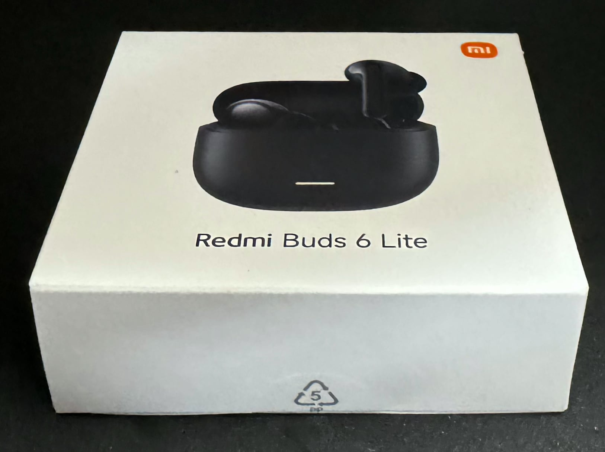
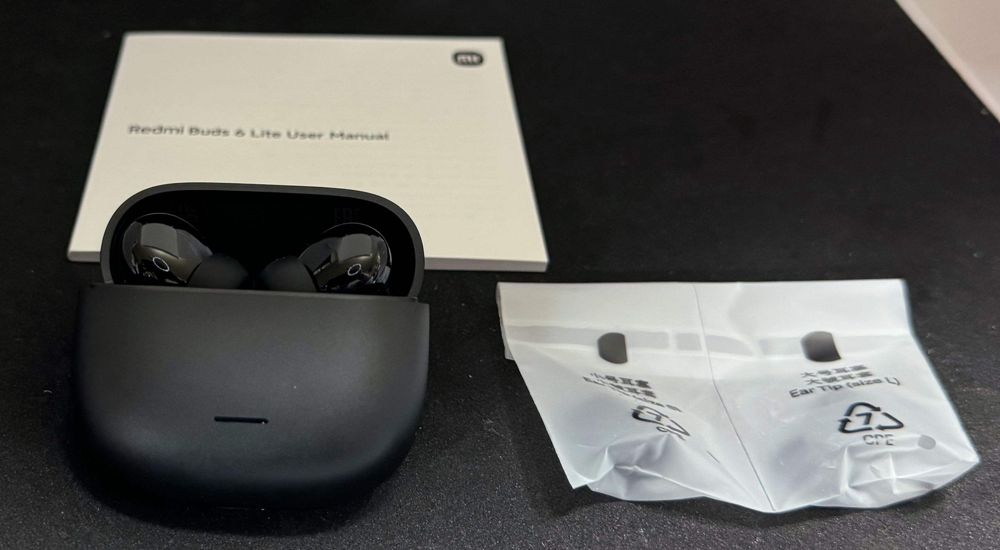
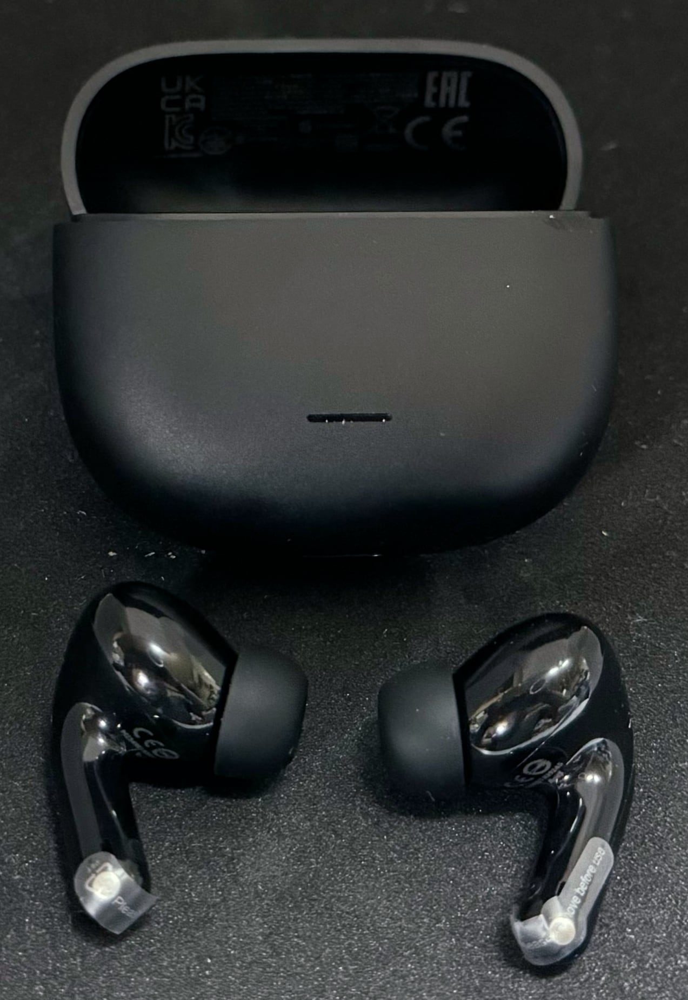

　こんにちは、如月翔也（[@showya_kiss](https://twitter.com/showya_kiss)）です。
　今日は、先日シャオミが電撃的に発表したRedmi Pad SE 8.7と同時に電撃発表されていたアクティブノイズキャンセリング機能付きカナル型インナーイヤホンで3000円を切る衝撃の商品である「Redmi Buds 6 Lite」を購入し、本日届いたのでアンボックスも含めてフォトレビューをお送りします。
　今回の比較対象はGoogleのPixel Buds Proを対象にしています。

## そもそも何故Redmi Buds 6 Liteを購入したか

　先に、比較対象であるGoogleのPixel Buds Proを持っているのに何故Redmi Buds 6 Liteを購入したかについて説明します。
　Pixel Buds Proは音域も良くアクティブノイズキャンセルも満足できる素晴らしい製品だったんですが、残念な事に僕の耳にフィットしなかったのです。カナル型なのでイヤーチップ変えれば？というご意見もあるかと思うんですが、そうではなく、外耳にフィットせず、イヤーチップをどう変えても、どうやって耳にねじ込んでも耳から浮いてきて最終的には歩いている最中に耳から転げ落ちるのです。これ、かなり致命的な問題で、座り仕事している間なら落ちても「よっこいしょ」で拾えますが、散歩中に落ちると車道に落ちたり下水溝に落ちたりがあり得るので、値段が値段の製品なので危なっかしくて使いづらかったんですよね。
　あとPixel Buds ProはもちろんPixelを冠する製品なのでAndroid向きで、逆に言うとiPhoneには向かないのです。その点で困っていて、一時期音楽はデータを全部Pixel8aに入れて、Pixel Buds ProでPixel8aから再生した音楽だけを聞いていたんですが、僕はYouTubePremiumに加入している都合上YTMusicが無料なのでAhamoで運用していてギガの余っているiPhoneから音楽を聞きたいニーズがあり、それが叶わなくて結構使いづらいな、と思っていたのです。
　そこにRedmiからRedmi Buds 6 Liteが出ると聞き、見た目がAirPodsに似ているので外耳に合わない可能性は低いだろう、アクティブノイズキャンセリングもシャオミなのでそれなりのレベルだろう、Android専用じゃないので恐らくiPhone用のアプリもあってそれで調整もできるはず、そしてお値段がなんと3000円を切るお値段（セールじゃなく定価が3000円を切っているんです）という事で、駄目なら諦めのつく金額だったので気軽に購入したのです。
　一応アフィ貼っておきますね。

<!--! <!-- START MoshimoAffiliateEasyLink -->
リンク
<!-- MoshimoAffiliateEasyLink END --> !-->

## では早速届いたのでフォトレビューです。

　では早速届いたのでフォトレビューをお送りします。

### 外箱

　まずは外箱をご紹介しましょう。Amazonで買ったので本体の20倍くらいでかい箱に入ってきたのですが、その箱には誰にもニーズがないと思いますのでいきなり外箱からです。

　はい、値段相応の箱です。3000円以下ならもうちょっとチャチい箱である事を予想していたんですが、まあシャオミブランドを汚さない最低限のレベルの箱ですよね。

### 中身

　中身についてはこんな感じです。本体と説明書、替えのイヤーチップだけです。

　充電はUSB-Cなんですが、USB-Cケーブルも充電器も入っていません。百均で買って来いという事ですね。というかイヤホンなんて1日20分も充電すれば常にマックスを維持できるので、他のデバイスを充電していない合間を見て充電すればいいので別に付属品には不満はありません。

### 本体をもうちょっと大きく

　本体をもうちょっと大きく見てみましょう。こんな感じです。

　見た目が黒いAirPodsなんですが、まあそういう製品なので怒られが発生して回収されなければ問題ないんじゃないでしょうか。

## 性能レビュー

　まず性能を確認するのに、僕の大好きな「Des-ROW」さんの「D.」というアルバムを通しで聞きました。「D.」はかなり腹に響く低音から相当な早口のラップ、かなり高い女性ボーカルの曲が網羅されており、そして僕はシャワーを浴びる時は必ずこのアルバムを聞くくらい好きなので、このアルバムを聞けば「音がどう違うか」は明らかです。
　では評価です。
・総合：3000円とは思えない高レベルにまとまっている
・高音：伸びが良く聞こえる。下手な1万円イヤホンより良いかもしれない。
・低音：かなり腹に響く音が聞こえる。下手な1万円イヤホンより良いかもしれない
・ノイキャン：ヤバい。オンにすると世界がほぼ無音になるので音楽に集中できるが、これをオンにして自転車に乗るのは自殺行為。なんならオンにして散歩していても車のクラクションや自転車の呼び鈴が聞こえないで轢かれる恐れがあるレベル
・お得度：お値段3000円を考えると相当なお得度。これで儲けがでているのか不安になるレベル。

## とりあえず、Pixel Buds Proは封印してしばらくこっちを使います。

　Pixel Buds Proが使いづらく耳から落ちるのもあり、そしてノイキャンのレベルと音声のレベルを考えるとRedmi Buds 6 Liteで乗り換えて全然問題なさそうな感じなので、僕はしばらくPixel Buds Proは封印してRedmi Buds 6 Liteを使ってみようと思います。
　もちろんこの記事はファーストインプレッションなので使っているうちに粗が見えたり使いづらい部分が見えてくる可能性はありますが、その場合はこの記事に追加するか別記事を立てますのでよろしくお願いします。
　とりえあず現状素晴らしい製品を入手できたと思っているので、気分良く使っていこうと思います。