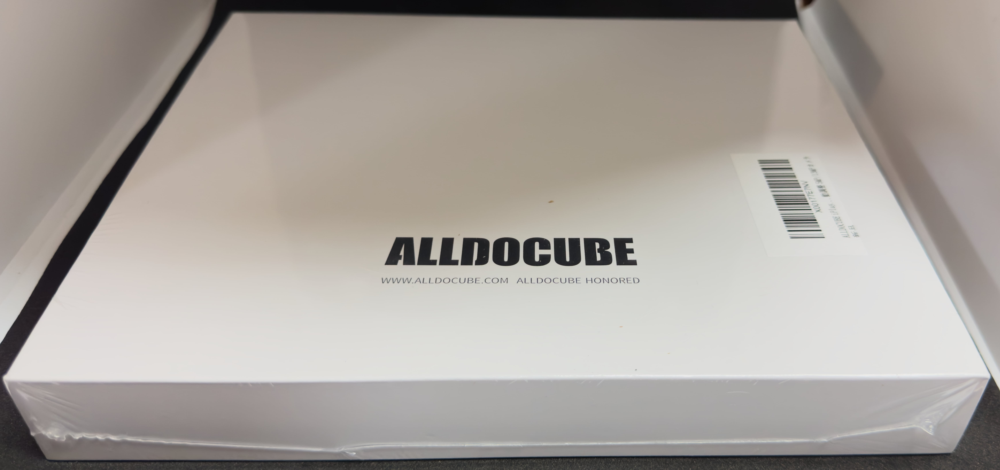
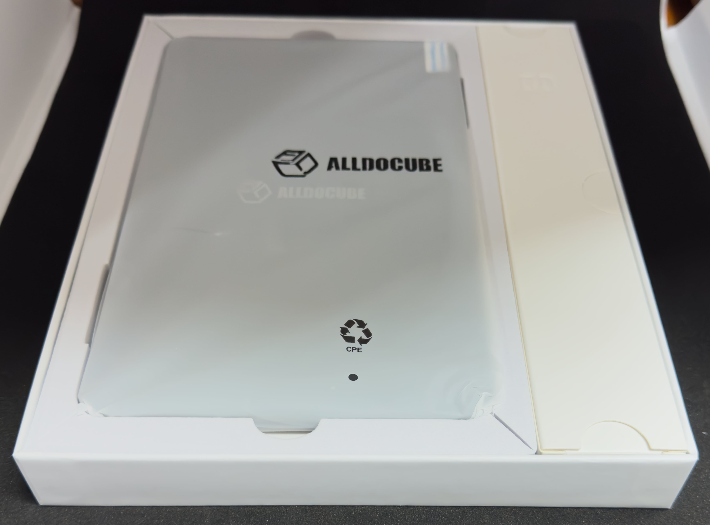
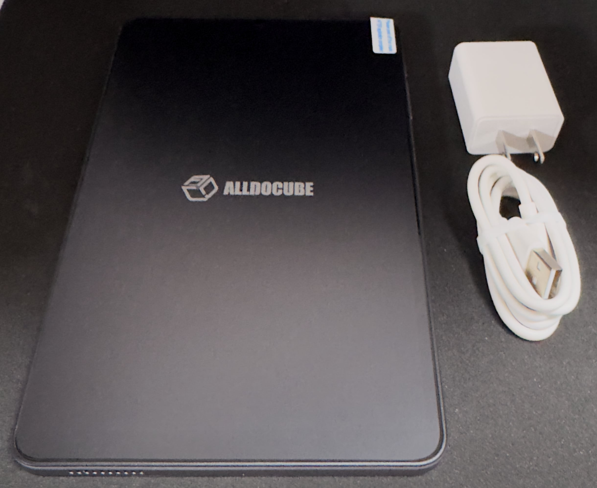

　こんにちは、如月翔也（[@showya_kiss](https://twitter.com/showya_kiss)）です。
　今日は先日堂々と「8インチサイズのタブレットを買うのは今はステイの判断がベストです！」と鼻息荒く宣言していたのに、AmazonのセールでALLDOCUBE iPlay 60 miniとキオクシアの512GBのマイクロSDカードがセール対象になっているのを見て即落ち2コマでほぼ条件反射で購入してしまったので、開き直ってアンボックスとファーストインプレッションをお送りしようと思います。

## ALLDOCUBE iPlay 60 miniとは

　ALLDOCUBE iPlay 60 miniとはALLDOCUBE社の販売する現行最新版の8インチタブレットを指し、性能でいうとSoCがHelioのG99、メモリが物理で8GBプラス仮想で8GBの合計16GB、本体SSDは128GBですがマイクロSDカードでの拡張に対応しておりマイクロSDカードは512GBまで認識可能、セルラー対応（4Gのみ）で電話としても使えるタブレットです。
　ALLDOCUBEは有名なメーカーではないんですが、中国製でシャオミとは比べ物にはなりませんが「産廃は出さない」程度の信頼性があり、そしてAndroidをちょっといじってALLDOCUBE OSとして出すので発売当初は結構バグがあるんですが、現状かなりバージョンが上がってバグが減り、まあ3万だとちょっと高く感じるんですが、今Amazonで21999円で売りに出されているのでその価格でいうと悪くないと言うか、iPad miniのように小さくてもパワフルで何でもできるスーパーミニタブレットを求めているのであれば選択の範囲外なんですが、小さくて「それなりの性能で」かつ「マイクロSDで大量のデータを持ち歩いて持ち歩いたデータをサクサク閲覧したい」ニーズであればかなり選択肢としては強い選択肢です。
　解像度も1920x1080のフルHDですし、WideVineもL1に対応しておりNetFlixなどの映像を一番綺麗な設定で見られるのでWi-Fi圏内で遊ぶならかなり遊べますし（逆に言うと外だと4Gなので速度が出ない）、外出先にはマイクロSDに格納したデータを持って行って楽しむのであれば全然問題のない端末なので、お値段を考えるとまあ1つくらい持っていても損はないと思うのです。
　ただ、ゲームに関しては実売22000円のタブレットなので、原神は動く事には動きますが最低画質かつ30FPS以下、鳴潮もゼンレスゾーンゼロも動かなくはないですが「決して」快適ではありません。下手したら戦闘中にアプリが落ちる覚悟が必要なので、そういうゲームを遊びたいなら良いiPhoneを買うかiPad mini第6世代を買うか、第7世代を待って買うべきですね。

　一応アフィ貼っておきますね。

<!--! <!-- START MoshimoAffiliateEasyLink -->
リンク
<!-- MoshimoAffiliateEasyLink END --> !-->

## キオクシアのマイクロSDとは

　キオクシアというメーカーには聞き覚えが無いかもしれませんが、キオクシアとは東芝がメモリ部門を切り離す時につけた社名で、要するにキオクシア＝東芝です。切り離しを行った事で今後技術の劣化が起きる可能性があるんですが、現時点では東芝の技術でマイクロSDカードを作っているので信頼性は群を抜いて高く、その割に他のメーカーに比べると値段がかなり安いのでお勧めです。
　Amazonでは普段売りで512GBのキオクシアのマイクロSDカードが5000円くらいなんですが、今セールで4200円まで値段が落ちており、これは価格比を考えるととんでもない出物なので、僕はこっちを見た瞬間に「マイクロSDカードを買う」→「それを使うALLDOCUBE iPlay 60 miniを買う」の順番で決めました。
　セールじゃないとALLDOCUBE iPlay 60 miniが28999円、キオクシアの512GBのマクロSDが5000円なので合わせて約34000円なんですが、セールで合わせて買うと25999円、およそ26000円です。
　もしあなたが8インチタブレットを使った事がなければ、この組み合わせて一回使ってみて下さい。物凄く使いやすいですし、恐らく次にはiPad mini第7世代を購入する事になります。

　一応アフィ貼っておきますね。

<!--! <!-- START MoshimoAffiliateEasyLink -->
リンク
<!-- MoshimoAffiliateEasyLink END --> !-->

## ALLDOCUBE iPlay mini アンボクシング

　ではせっかく届いたのでALLDOCUBE iPlay 60 miniのアンボクシングを行います。

### 外箱

　外箱は意外と綺麗なんですよね。この値段とは思えない高級そうな箱です。

　まあ箱を愛でるほどの高級品ではないのでビニールをバリバリっと剥がして、外箱をスライドして外します。

### 内箱

　内箱も結構綺麗というか、必要なものを必要な分上品にしまってある感じです。

　向かって左側が本体、右側は充電器とCtoCケーブルが入っています。

### 箱の中身

　箱の中身は「本体」「説明書」「充電器」「CtoCケーブル」です。
　ALLDOCUBE iPlay 60 miniはPD急速充電可能ですが、付属の充電器ではPD急速充電はできません。別途購入が必要です。

　本体に「ALLDOCUBE」のロゴのあるフィルムが貼られていますが、このフィルムを剥がした裏にもフィルムが貼られており、これは普段遣い用のフィルムなので剥がさずにそのまま使えます。ただ、質が良くないので気に入らない人は剥がしてしまって自分で新しいフィルムを貼ってもいいと思います。僕はあまり気にならなかったのでそのまま使っています。

## ALLDOCUBE iPlay 60 miniの使い方

　ALLDOCUBE iPlay 60 miniの「究極的な」使い方としては、iPad miniでは絶対にできない部分、「自分の持って歩きたいデータを全部マイクロSDに格納して持って歩き、いつでも好きなデータを閲覧する」という方法だと思います。
　僕はKindleで購入した本は全部ダウンロードしないと気がすまないタイプですし、あとKindleを使い始める前にScanSnapを使って1000冊くらい本をPDFにしてしまっていて、更に艦これのイベントは攻略部分は全部録画して保存しておりそれを見返して「あの時のキツかった思い」をリフレインしたいタイプなんですが、それをやるとデータ量がiPad miniの最大サイズである256GBを軽く超えて400GBくらいになってしまうので、それはALLDOCUBE iPlay 60 miniのマイクロSDに格納してメディアプレイヤーアプリを入れる事で常に持ち歩きいつでも見られる環境を作れるのです。これは控えめに言って最高です。
　まあ僕はiPad mini第6世代を持っており、Ahamoのデータプラスでスマホのギガ数を分け合っているので重いアプリや重いデータについてはiPad miniで動かせばいいし、ゲームもiPad mini、なんならiPhone15ProMax、家にいるならWindowsパソコンで遊べばいいのでそのあたりのニーズはないんですが、例えばニュースアプリを使いたいとか、天気予報を見たいとか、Notionだってちゃんと動きますし、UpNoteも若干動作が重いですが動きますし、ゲームを求めなければ動作に関しては問題になる部分はほぼないです。
　そういう意味ではかなり良いお買い物です。

## ただし

　ただし、これは僕は覚悟の上で買ったので問題ではないのですが、今ALLDOPCUBE iPlay 60 miniを買うにはリスクがあって、一応それを耳に入れておきます。
- 9月10日のAppleイベントでiPad mini第7世代が出る可能性がある
  - 値段を考えるとALLDOCUBE iPlay 60 miniを買っている場合ではない
  - iPad mini第7世代が不要でも、発売対抗措置としてiPlay 60 miniが値下げされる可能性がある
- 今ALLDOCUBEが中国でSnapDragon Gen6搭載の8インチタブレットを投入しており、これが近日中にグローバライズされてiPlay 70 miniとして発売される可能性がある
  - Helio G99に対してSnapDragon Gen6は明らかに1回り以上上のスペックなので、今買うと新しくて値段が変わらないのに性能が2周り違う新機種が出てiPlay 60 miniを愛せなくなる可能性がある

　この2点です。
　僕はiPad mini第7世代が出たら値段関係なくPaidyをブッパして購入予定ですし、もしiPlay 70が出ても「現iPad mini第6世代」にはかなわないし、よしんばiPad mini第7世代が出たら突き抜けて性能が良いはずなのでどっちにせよ8インチAndroidは「ストックしたデータを持ち歩いて閲覧する専用機」になるので愛せなくても問題ない、という判断からiPlay 60 miniを購入しました。

　逆に言うとそこまで覚悟決まっていない人はやっぱり今はステイした方が安定な機種なので、もしこの記事を読んで「ALLDOCUBE iPlay 60 mini……！」と思った方は、本当に後悔しないか考えてからズギャるのをお勧めします。一応言いますが、僕は止めましたからね。僕は買いましたけど。