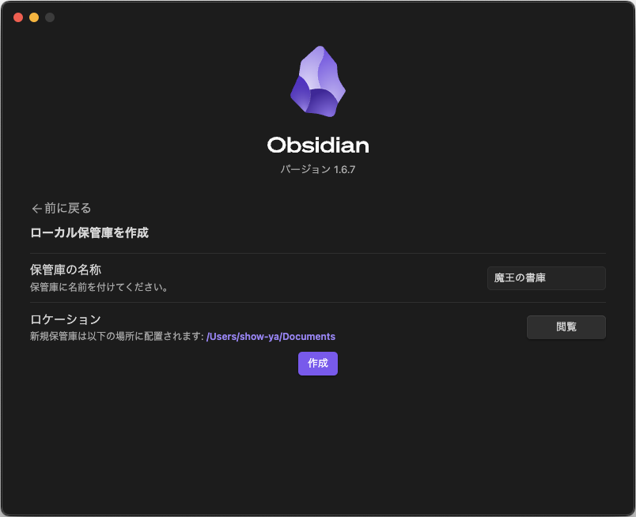

　こんにちは、如月翔也（[@showya_kiss](https://twitter.com/showya_kiss)）です。
　今日は結局色々遠回りした結果「Windows/Mac/Linux/iOS/Android」ではObsidian Syncを使わないとまともな同期ができないので無課金ではObsidianを使えない、と判断した経緯があるんですが、昨日色々調べている間に「Remotely Save」というコミュニティプラグインを発見し、「もしかしたらこれは……？」と思って試してみた結果うまく行き、前回のGitHubを使った方法だとiOSとAndroidで上手く以下なかったんですが「Remotely Save」だとiOSもAndroidも大丈夫、かつ保存クラウドとしてWebDAVに対応しており、さらに保存クラウドとしてOneDrive for Personalに対応しているので、OneDriveは悪さをするので殺していたんですが1TBの容量を丸々余しているのももったいないですし、それを使えるというのは素晴らしい効率かなので早速設定して色々確認しています。
　今使っている範囲では全く問題なく使えているので大変有用なプラグインだと思いますので、Obsidianとはなんぞや、という部分からちょっと詳しい設定方法までをできるだけ丁寧にお話していこうかと思いますので、よろしければ最後までお付き合い下さい。

## Obsidianとは

　Obsidianとは本来ナレッジマネジメントに使うアプリなのですが、形態が「様々なファイルを関連付けて保存する」「特にテキストの同期が早い」という特徴から、EvernoteやBear、Notionのような「テキスト同期サービス」として使われる事の多いアプリです。
　アプリそのものはクロスOS対応かつ個人使用であれば無料で、WindowsとMacとLinuxの場合サイトからダウンロード、iOSの場合App Storeからダウンロード、Androidの場合はGoogle Play Storeからダウンロードする事で入手可能です。
　Obsidianは一応フリーなんですが、商用利用だと有料になるのと、あと同期方法の一つとしてObsidian側で用意しているObsidian Syncを使うと月額料金が発生します。ただ、今回ご紹介する方法だと無料で同期ができるので商用でなければ無料で使えます。
　なお、Obsidianとは本来ナレッジマネジメントツールであり、バックリンク機能なんかを上手く利用して知識をコンボして行く事でとんでもなく有能なリレーショナルなテキスト群を作る事ができるので、もし同期が上手く行ったのであれば次はそれを上手く活用できる事を目的に使っていくと面白いかもしれません。
　また、EverNoteやNotionやBearと違い、ファイルはローカルに置かれるのが鉄則で、それを自分の選んだクラウドに同期してそこから他のデバイスに同期するという考えで作られているので、Obsidianを使うデバイスの中で一番ストレージが小さいものに合わせてデータを作る必要がありますのでその点注意して下さい。

## Obsidianのダウンロードから「Remotely Save」の設定まで

　この記事ではObsidianのダウンロードから「Remotely Save」を設定して複数デバイスでObsidianのデータを同期するところまでをガイドします。
　「そんなの知ってるよ」という人もいると思うのですが、一番リテラシーが低い人でもObsidianという素晴らしいツールの恩恵を受けられるようできるだけ平易に色々書いているので、面倒くさい人は斜め読みしながらでも設定できると思います。

### Obsidianのダウンロード

　まずObsidianをダウンロードしないと使えないのでそこからスタートです。
　ObsidianはiOSとAndroid以外は以下アドレスからダウンロード可能です。
　[https://obsidian.md/download](https://obsidian.md/download)
　iOSの方はApp Storeから、Androidの方はGoogle Play Storeから「Obsidian」を検索すると割と上位の場所に検索結果として表示されるのでそれを選んでダウンロードして下さい。
　「どれが正しいの？」という人ももちろんいると思うので、このアイコンのものです。

　ダウンロードできたら第1段階は終了です。

### Obsidianをインストールする

　iOS、Androidの人はダウンロード＝インストールが済んでいるので次の項目に進んで下さい。それ以外の方は次の手順でインストールして下さい。

- Windowsの人：ダウンロードしたファイルをダブルクリックするとインストールが始まるので順を追って設定する
- Macの人；ダウンロードしてきたDMGファイルをダブルクリックし、Obsidianのアイコンとフォルダアイコンが並んでいるのでObsidianのアイコンをフォルダアイコンにドラッグ・アンド・ドロップすると「アプリケーション」のフォルダにObsidianのアイコンが出来ているので、そのアイコンをダブルクリックすると「インターネットからダウンロードされたアプリケーションです。開いてもよろしいですか？」と聞かれるので「開く」と答えるとインストールが始まります。
- Linuxの人：AppImageを持ってきた人はFUSEが入っているのを確認した上で実行権限をつけてからダブルクリックでオーケーです。Ubuntuの人は「deb」というファイルを落としてきて右クリックから「ソフトウェアセンター」で開くとインストールされるので、そっちの方が便利かもしれません。（Linuxの人に対してはざっくりした書き方をしますが、Linuxはディストリビューションで色々ある上に初心者は使っていないだろうという考えからざっくり説明するにとどめています。）

### インストールが終わったら起動します

　Windowsの人、Macの人、Linuxの人はインストールが終わったらもうObsidianが起動していますのでこのまま先に進んで下さい。
　iOS、Androidの人はインストールが済んだだけでは起動していないので、さっき見たアイコンが画面に表示されているのでシングルタップして起動して下さい。
　これでみなさん起動しました。

### まずはObsidianを日本語化しましょう。

　Windowsの方、Macの方、Linuxの方は今開いている画面はこうなっていると思います。

　一番下の「English」の部分をクリックすると使用言語が選べるので、「日本語」を選ぶと画面がこう切り替わります。

　今回は新規インストールで保管庫を新規作成する必要性があるので、一番上の「保管庫を新規作成する」の横の「作成」ボタンを押します。
　これは同期する2台目以降のObsidianでも保管庫を作らないといけないので同じ作業が必要です。ボタンを押すと画面がこう切り替わります。

　ここで決めるのは「保管庫の名称」と「保管庫のローカルでの置き場所（ロケーション）」です。どちらも自由に決めて大丈夫です。もしかすると日本語はともかく記号類は駄目かも知れないので、できるだけアルファベットと日本語だけで構成すると良いでしょう。なお、後でGitHubと連携したい場合、日本語が使えないので全部設定し直しになるので（今している）、最初から全部英語が良いかもです。
　僕はこういう形で設定しました。

　この状態で「作成」を押すと保管庫が作成され、Obsidianの画面に移行します。
　ここから「Remotely Save」をインストールして設定するのですが、その前にiOS、Androidでの設定を先に説明します。不要な方は読み飛ばして下さい。

#### iOSでの日本語化について

　iOSで起動した場合、日本語を選択する画面がなくいきなり保管庫の設定の画面になります。しかし、慌てないで下さい。保管庫の設定が終わったら後で日本語化する事ができます。
　今起動したばかりの画面だとこの画面になっているはずです。

　この画面では落ち着いて「Create new vault」を押して下さい。次の画面に移行します。
　この項目では「Vault name」の項目が大事です。「Vault name」とはさっきWindows/Mac/Linuxで設定した「保管庫の名前」です。「Store in iCloud」は触らないで下さい。
　なので僕は「魔王の書庫」と入力した後「Create」ボタンを押しました。みなさんも好きな保管庫名を入力した後「Create」ボタンを押して下さい。次の画面に移行します。

　英語でシンプルに書かれているので「なんだこれ？」と思うと思うんですが、日本語化すればわかります。まず画面右上のこのボタンを押します。

　そうすると画面が切り替わるので、次は画面右上の歯車マークをタップします。
　すると「Setting」という画面が出てくるので、「General」という一番上の項目をタップすると画面が切り替わり、2行目に「Language」があるので、今「Enghish」になっているのをタップして「日本語」を選ぶと選択が「日本語」になり、横に「Relaunch」と出るのでそこをタップします。そうするとあっという間に日本語化が完了します。お疲れ様でした。

#### Androidでの日本語化について

　Androidでインストールした場合、まずAndroidの全ファイルへのアクセス権限を付けなければならない、という画面が出ます（以下画面）。
　管理権限をつけるために「Grant permission」を押して、切り替わった画面で「全ファイルの管理権を付与」のチェックをオンにして、画面右上の「←」矢印で画面を戻ると次の画面になります。

　この画面で行なうのは「保管庫の作成」なので、「Create ner vault」をタップして下さい。次の画面になります。

　ここで必要なのは「保管庫の名前（Vault name）」と「保管庫の場所（Vault location）」の2点です。保管庫の名前は自由ですが、保管庫の場所はAndroidのファイルシステムで都合の良い場所を選択します。マイクロSDで拡張しているならマイクロSDにフォルダを作ると便利ですし、拡張できない機種の場合Document内に作るのが妥当かと思います。
　僕が使っているAndroidタブレットはマイクロSDで拡張できるので、Vault nameは「魔王の書庫」、Vault locationはマイクロSDに「obsidian」というフォルダを作って選択しました。その状態で画面下に有る「Create」を押す事で保管庫が作成されます。
　しかし、保管庫にはファイルがなく、日本語化もされていないので英語で簡単に書かれた画面が表示されます。なのでまず日本語化しましょう。
　今はこの画面のはずです（タブレットはダークモードじゃないので画面が白いです）。

　ここで左上にあるマークをクリックして画面を切り替えます。
　説明が難しいアイコンなので画像で示します。

　そうすると画面が切り替わるので、次は画面右上の歯車マークをタップします。
　すると「Setting」という画面が出てくるので、「General」という一番上の項目をタップすると画面が切り替わり、2行目に「Language」があるので、今「Enghish」になっているのをタップして「日本語」を選ぶと選択が「日本語」になり、横に「Relaunch」と出るのでそこをタップします。そうするとあっという間に日本語化が完了します。お疲れ様でした。

## 「Remotely Save」のインストールを行う

　ようやくここまでたどり着いたのであと一息です。
　各種デバイスで同期が取れるよう、「Remotely Save」のインストールを行います。
　ここからの一環の動作はOSに限らず一緒なんですが、一緒なので全部のスクショを撮るのが無駄なので文字でお伝えしていきます。
　手順としては「コミュニティプラグインを有効にする」「コミュニティプラグインから『Remotely Save』をインストールする」「インストールした『Remotely Save』を有効化する」「有効化した『Remotely Save』にオプションから設定を行う」で完了です。
　Remotely Saveの操作方法については後述します。

### コミュニティプラグインを有効にする

　まず「Remotely Save」はコミュニティプラグインなので、コミュニティプラグインを有効にする必要があります。

#### Windows/Mac/Linuxの場合

　Windows/Mac/Linuxの場合、画面サイズがある程度あれば、画面の左下に保管庫名が出ており、その横に歯車マークが表示されていますのでそれをクリックします。
　切り替わった画面に「コミュニティプラグイン」の項目があるのでそこをクリックし、右画面が切り替わるので「コミュニティプラグインを有効化」を押します。右画面が切り替わりますが、後でここからコミュニティプラグインを検索しますので画面を閉じずに次の項目を読んで下さい。

#### iOSの場合

　iOSの場合、今は「ファイルが開かれていません」の画面になっていると思いますので、この画面を左にスワイプします。
　すると画面左上に保管庫名が表示されており、その横に歯車マークが表示されていますので、その歯車マークをタップします。
　さらに画面が切り替わり、「オプション」の一番下に「コミュニティプラグイン」の項目があるのでそこをタップします。
　切り替わった画面一番下に「コミュニティプラグインを有効化」という項目があるのでそれをタップします。
　ここで画面が切り替わりますが、あとでここからプラグインを検索しますので画面はそのままにして次の項目を読んで下さい。

#### Androidの場合

　Androidの場合、今は「ファイルが開かれていません」の画面になっていると思いますので、この画面を左にスワイプします。
　すると画面左上に保管庫名が表示されており、その横に歯車マークが表示されていますので、その歯車マークをタップします。
　さらに画面が切り替わり、「オプション」の一番下に「コミュニティプラグイン」の項目があるのでそこをタップします。
　切り替わった画面一番下に「コミュニティプラグインを有効化」という項目があるのでそれをタップします。
　ここで画面が切り替わりますが、あとでここからプラグインを検索しますので画面はそのままにして次の項目を読んで下さい。

### Remotely Saveを検索してインストールする

　次にコミュニティプラグインの「Remotely Save」を検索してインストールします。

#### Windows/Mac/Linuxの場合

　今開いている画面の右側に「コミュニティプラグイン」という項目があり「閲覧」のボタンがあるのでそれを押します。
　切り替わった画面でプラグインの検索窓がでますので、「Remotely Save」を入力すると該当する名前のプラグインが検索結果に出力されるので、それをクリックします。
　すると画面右側が切り替わり「インストール」の項目があるので「インストール」を押します。
　インストールが終わると「有効化」のボタンが表示されるので、それを押します。
　確認事項がポップアップするので2箇所にチェックを入れて「Agree」ボタンを押すとプラグインが有効化されます。
　この状態で、画面左の「Remotely Save」をクリックすると、画面左側に「オプション」の項目が表示されます。後でこのボタンから設定を行いますのでこの画面のまま次の項目を読んで下さい。

#### iOSの場合

　今表示されている画面の中ほどに「コミュニティプラグイン」の項目があり、「閲覧」ボタンがあるのでそれをタップします。
　するとコミュニティプラグインの検索画面が表示されるので、検索窓に「Remotely Save」を入力して下さい。
　正しく入力すると直下に「Remotely Save」が表示されているのでそこをタップします。
　画面が切り替わり「インストール」のボタンがあるので押します。
　インストールが終わると「インストール」の部分が「有効化」に代わりますので「有効化」をタップします。
確認事項がポップアップするので2箇所にチェックを入れて「Agree」ボタンを押すとプラグインが有効化されます。
　その後一回画面左上の「←」で画面を戻し、そうするとまだ「Remotely Save」が表示されているのでそこをタップします。
　そうすると「Remotely Save」の画面になり、「オプション」という項目が出ているので、それを確認して一旦手を止めて下さい。
　後でこのボタンから設定を行いますのでこの画面のまま次の項目を読んで下さい。

#### Androidの場合

　今表示されている画面の中ほどに「コミュニティプラグイン」の項目があり、「閲覧」ボタンがあるのでそれをタップします。
　するとコミュニティプラグインの検索画面が表示されるので、検索窓に「Remotely Save」を入力して下さい。
　正しく入力すると直下に「Remotely Save」が表示されているのでそこをタップします。
　画面が切り替わり「インストール」のボタンがあるので押します。
　インストールが終わると「インストール」の部分が「有効化」に代わりますので「有効化」をタップします。
確認事項がポップアップするので2箇所にチェックを入れて「Agree」ボタンを押すとプラグインが有効化されます。
　その後一回画面左上の「←」で画面を戻し、そうするとまだ「Remotely Save」が表示されているのでそこをタップします。
　そうすると「Remotely Save」の画面になり、「オプション」という項目が出ているので、それを確認して一旦手を止めて下さい。
　後でこのボタンから設定を行いますのでこの画面のまま次の項目を読んで下さい。

### Remotely Saveの設定を行う

　では、Remotely Saveのインストールと有効化が終わったので、設定を行って使えるようにします。
　今回の例では僕が余している「OneDrive for Personal」を使いますが、S3やDropbox、Webdavなんかも使えますので、適宜読み替えて対処して下さい。
　みなさんが止まっている画面の中に「オプション」があるので、それを押します。
　英語でずらずらと設定項目があるので面倒ですが、するのは2点だけです。
　「Choose a Remote Service」で「OneDrive for personal」を選ぶ、と、「Authボタンを押して表示されるURLをクリックし、マイクロソフトのアカウントとパスワードでログインし、権限を求められたら許可を出す」だけです。それが終わったらプラグインの画面はバツで閉じて構いません。もう設定完了です。

## Remotely Saveの使い方

　Remotely Saveの使い方はあくまで「手動同期」なので、「このタイミングの情報を同期しよう！」と思ってコマンドを叩く方法になります。
　まず最初に、デバイスでObsidianを起動した時、それがWindows/Mac/Linuxなら画面左側のコマンドパレットを開くボタンの下に「Remotely Save: syncing from manual」のボタンがあるのでそれを押します。そうする事で、クラウドにある情報がデバイスに同期されます。
　iOS、Androidの場合、「ファイルが開かれていません」の画面か、あるいはファイルを開いて編集する画面にスワイプして移動し、画面右下のハンバーガーメニュー（三のボタンです）を押すと「Remotely Save」という項目があるのでそれとタップします。そうする事で、クラウドにある情報がデバイスに同期されます。
　一度デバイスに同期した後、デバイス側で編集したものをクラウドに同期するには、コマンドパレットから「Remotely Save: start sync」を選択します。コマンドパレットの開き方はWindows/Mac/Linuxの場合画面左端に「コマンドパレットを開く」ボタンがありますし、iOS、Androidの場合、「ファイルが開かれていません」の画面か、あるいはファイルを開いて編集する画面にスワイプして移動し、画面右下のハンバーガーメニュー（三のボタンです）を押すと「コマンドパレットを開く」があるのでそこから選んで下さい。
　これでデバイス側からクラウド側に同期をかける事ができます。
　長い作業でしたがお疲れ様でした。

　次に暇があればObsidianの日本語周り、特に日本語限定の行頭字下げが上手く処理できないのをカスタムCSSスニペットで修正する方法（iOSは隠しファイルにアクセスできないんですがiOSのショートカットアプリでアクセスできるようにしてくれている素晴らしい人がいるのでスニペットを置けるのです）なんかについてお話できればいいな、と思いますのでよろしくお願いします。

　約1万文字、お疲れ様でした。