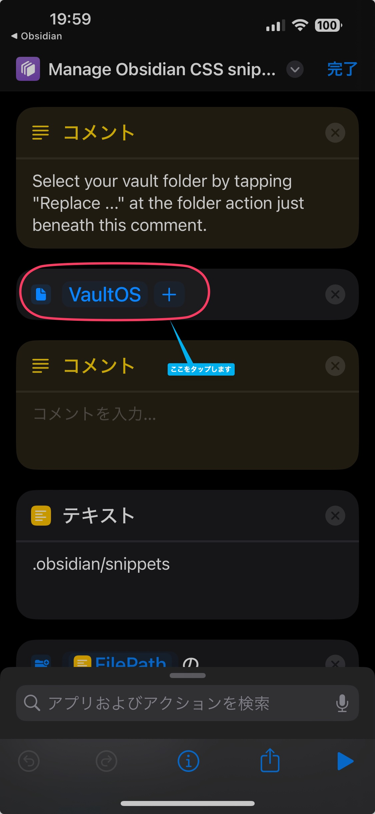
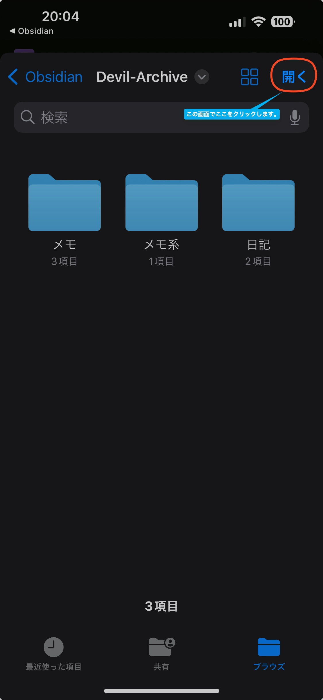
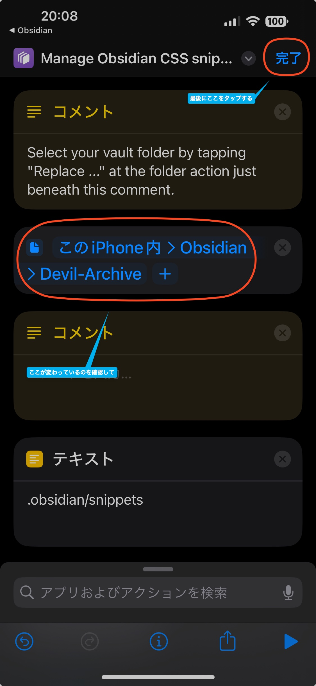

　こんにちは、如月翔也（[@showya_kiss](https://twitter.com/showya_kiss)）です。
　今日は昨日の続きというか、ObsidianについてのTIPSを書いていこうと思います。まあTIPSではあるんですが、特に日本語でObsidianを使う場合とても重要な内容なので良ければお目通し頂ければと思います。

## Obsidianで日本語インデントを正常に処理するためには

　Obsidianって欧米のソフトなので、欧米のソフトではインデントを下げる事で注目を集めるのが禁忌になっており、逆に行頭に字下げをしないといけない日本語ルールとバッティングして非常に面倒です。
　ちょっとでもObsidianを使った人であれば、まず行頭にスペースを入れて書き始めると、2行目に行った瞬間に2行目にもインデントが入り行頭スペースの意味がなくなって大変厳しいと思います。
　このあたりは正式なルールとしては「個々人でCSSを使って行頭スペースを処理してね」という事になっているんですが、これがまた大変面倒くさいのです。
　Obsidianで日本語インデントを正常に処理したい場合、「CSSスニペット」の機能を使って、以下のコードを入力してCSSファイルとして保存すればオーケーです。

```css
/* 段落のインデント */
.cm-line:not(:has(.cm-list-1, .cm-list-2, .cm-list-3)) {
text-indent: 0 !important;
padding-inline-start: 0 !important;
}
```

　ですが、CSSスニペットとは何でしょう？何をどうやれば処理できるでしょう？

### CSSスニペットとは

　CSSスニペットとは、ObsidianにCSSを適用するための機能で、歯車マークの設定から「外観」をクリックすると一番下に「CSSスニペット」という項目があると思います。
　本来ここから使うスニペットをオン・オフするんですが、Windows/Mac/Linuxの場合スニペットを作るのは簡単なんですが、iOSとAndroidではちょっと難しいので作り方を個別に説明していきます。

#### Windows/Linux/Macの場合

　まずCSSスニペットを保存するフォルダを作ります。
　自分の使っている保管庫のフォルダを開き、「不可視ファイルを表示」すると「.obsidian」というフォルダが現れるのでそれを開き、開いたフォルダの中に「snippets」というフォルダを掘ります。
　その「snippets」のフォルダの中に好きな名前でcssファイルを作り（拡張子は.cssにして下さいね）先程のコードを貼り付けて保存します。
　その後先程の「CSSスニペット」の横に更新ボタンがあるのでそれを押すと、「CSSスニペット」の下に自分でつけたCSSの名前と、その横にオンオフのスイッチがあるのでそれをオンにします。
　これで日本語のインデント周りが正常に動くようになりました。

#### Androidの場合

　Androidの場合、「不可視ファイルを表示」の設定が大変なので、通常のAndroidについてくる「Files」での操作で説明していきます。
　まずFilesを起動したら、左上のハンバーガーメニュー（三の表示です）を押して画面左側を切り替え、中にある「設定」を押します。
　画面が設定画面に切り替わるので、「見る」の項目内にある「非表示のファイルを表示する」をオンにしてから画面左上の「←」で画面を戻り、FILESから自分の作った保管庫を開きます。
　画面右下にある「＋」ボタンを押すと「新しいフォルダ」という項目が開きフォルダ名を入力できるので、「snippets」と入力して「フォルダを作成」を選んでフォルダを作ります。
　「Files」アプリではテキストは作れないので、一旦この画面はしまって（後で使うので消さないで下さい）、代わりにObsidianでCSSを作ってしまいましょう。
　タイトルにCSS名を入れ、内容は先程のCSSを入れます。
　そしてFilesを開くと、「CSS名.md」というファイルが出来ているのでその横にある三点メニューを開き、「名前を変更」を選び、好きな名前のCSSにします。「ファイル名を変更」を押すとポップアップが出ますがOKで構いません。
　名前を変更したら再度ファイルを選択し、三点メニューから「移動」を選んで保管庫の中の「.obsidian」の中の「snippets」に移動します。
　そうしたらFilesは閉じてしまって、Obsidianを起動し、歯車マークから設定を開いて「外観」を開き、「CSSスニペット」の横に更新ボタンがあるのでそれを押すと、「CSSスニペット」の下に自分でつけたCSSの名前と、その横にオンオフのスイッチがあるのでそれをオンにします。
　これで日本語のインデント周りが正常に動くようになりました。

#### iOSの場合

　iOSの場合が一番難しいんですが、それを物凄く簡単にしてくれている人がいるのでブログを紹介します。
　[めモらンだム・ヤード](https://sorashima.hatenablog.com/entry/ManegeObsidianCSSsnippets)さんです。
　このブログの記事の以下URLに使いたいiOSデバイスでアクセスして、ショートカットをダウンロードしてきます（ショートカットを追加、という項目をタップします）。
　[ショートカットのダウンロード](https://www.icloud.com/shortcuts/30069fec2e324d5385b094b9bc384acd)
　ダウンロードしてきたショートカットが表示されますが、そのままでは使えないので、内容を修正します。
　「Manage Obsidian CSS snippets 2」というショートカットの右上に3点メニュー（･･･）があるのでそれをタップします。
　画面が切り替わって青文字で「VaultOS +」という項目がありますのでそこをタップします。
　そうするとフォルダ選択の画面が現れますので、自分の保管庫の場所はわからないと思うので、「Obsidian」「自分の作った保管庫」を開き、Obsidianで作ったフォルダやメモが表示されている画面で画面右上の「開く」を選びます。

　最終的にこの画面になるので「完了」をタップします。

　完了すると最初のショートカットの画面に戻ってきますので、「Manage Obsidian CSS snippets 2」のショートカットをタップします。
　もしかするとアクセス許可を求められるかもしれませんが許可して構いません。
　すると「どれですか」という画面がでるので、「Create a new CSS snippet」を選びます。
　すると入力窓が表示されますので先程のCSSを貼り付け、画面右下の「完了」を押します。
　次に「Save as(Without ext)」の入力窓がでますので、CSSの名前を入れます。この時拡張子の「.css」は「入れないで」入力し、「完了」を押して下さい。
　そうすると知らん顔で「どれですか」にもどるので、画面の選択肢以外の部分をタップすると終了するので終了します。
　それからObsidianを起動し、歯車マークから設定を開いて「外観」を開き、「CSSスニペット」の横に更新ボタンがあるのでそれを押すと、「CSSスニペット」の下に自分でつけたCSSの名前と、その横にオンオフのスイッチがあるのでそれをオンにします。
　これで日本語のインデント周りが正常に動くようになりました。
　ショートカットの扱いが面倒くさいですが、慣れれば一番楽かもしれません。

## GitHubを使ってObsidianの内容をバックアップする

　以前の記事で「Git」というプラグインを使ってGitHubにリポジトリを作ってGitHubとGitを使ってObsidianを同期する方法についてガイドしていましたが、あの方法には致命的な欠陥があり、iOSとAndroidからクラウド方向に同期がかけられなかったのです。
　しかしGitHubは分散して同期するという意味では意味がありますので、普段は「Remotely Save」で同期をとっておき、たまにパソコンでプラグインなしでGitHubに同期しておくととても便利なので方法について簡単に説明します。

### GitHubでObsidianの内容をバックアップする方法

　概要だけですが、こんな感じでオーケーです。

1. Obsidianの保管庫データをコピーしておく（念の為）
2. GitHubでアカウントをとり、Obsidian用のPrivateリポジトリを作る
3. GitHubDeskTopを使ってGitHubに作ったリポジトリをローカルにクローンする
4. クローンしたディレクトリにObsidianの保管庫データを貼り付ける
5. Obsidianをアンインストールし、再度インストールする
6. インストール時、「保管庫を新規作成する」ではなく「保管庫としてフォルダを開く」でクローンしたディレクトリを開く
7. 「Remotely Save」の設定、日本語のCSSスニペットの処理を行う
8. 完成。必要に応じてGithubDeskTopからPull、Pushを行えば良い

　概要だけで言うとこんな感じです。
　ここで注意が必要なのは、GitHubにリポジトリを作る都合上、保管庫の名前は日本語ではいけません。必ず英数字である必要があります。
　そして、GitHubとだけ連携するならそのデバイスだけ保管庫名を英数にすれば良いんですが、「Remotly Save」を使って同期するには保管庫の名前が一致していないと駄目なので、前回記事を読んで保管庫名を日本語にしてしまった人は、保管庫名を変更するしかないのです。
　方法としては先にフォルダを掘ってGitHubと連携しておき、英語の保管庫を作ってから内容を丸々コピーして、画面最下段左に表示されている保管庫名をクリックして「Magane Vaults」を選んで保管庫メニューを開き、「保管庫としてフォルダを開く」でクローンしたディレクトリを開く方法で行けると思います。
　僕は面倒なので全部アンインストールしてインストールし直して設定も終わらせましたが、まあ早い方を使うのが良いと思います。

## という訳で

　という訳で、機能「Remotely Save」のプラグインを知って色々設定しだしてからまだ48時間経っていないんですが、色々調べて試してみるとObsidianは相当色々出来そうなポテンシャルを持っているのがよく分かる感じだったので、これからガンガン使っていこうと思います。