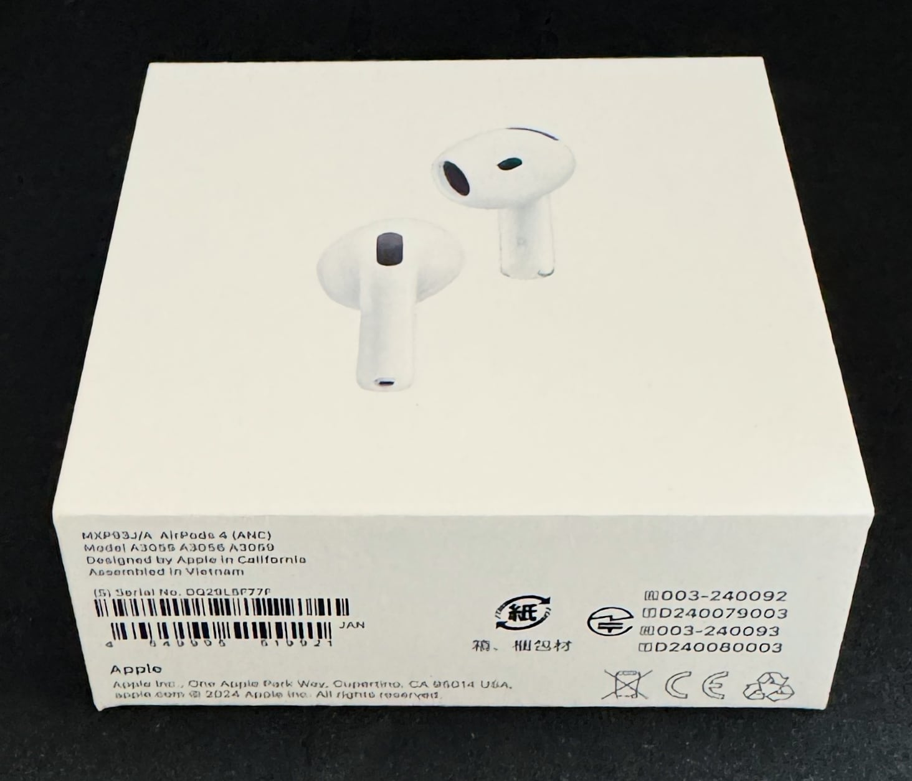
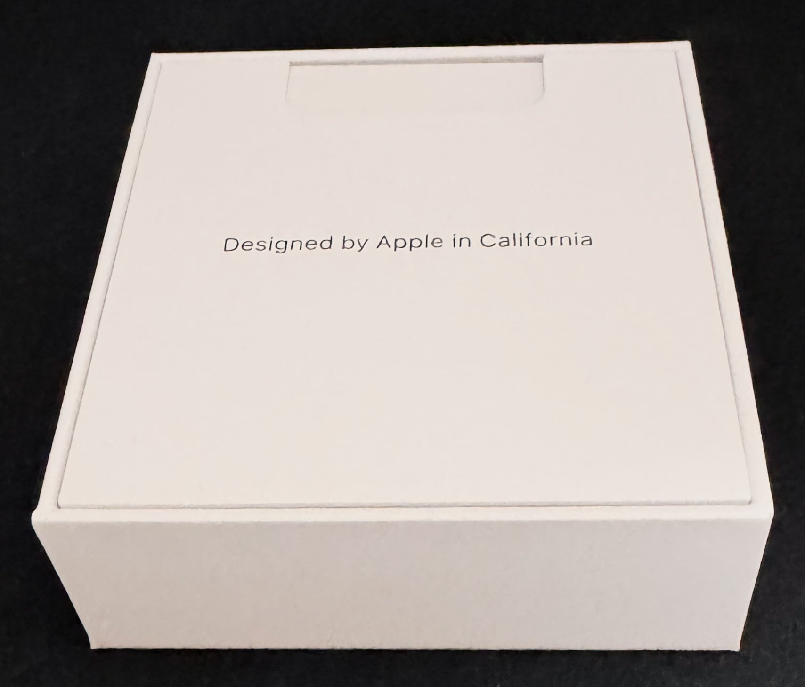
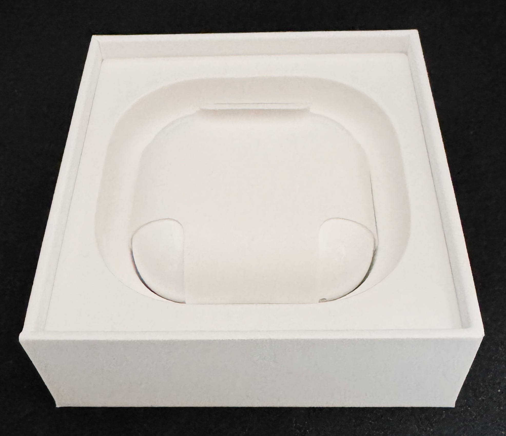
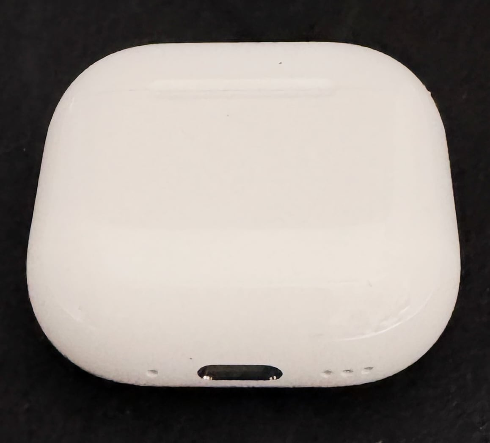
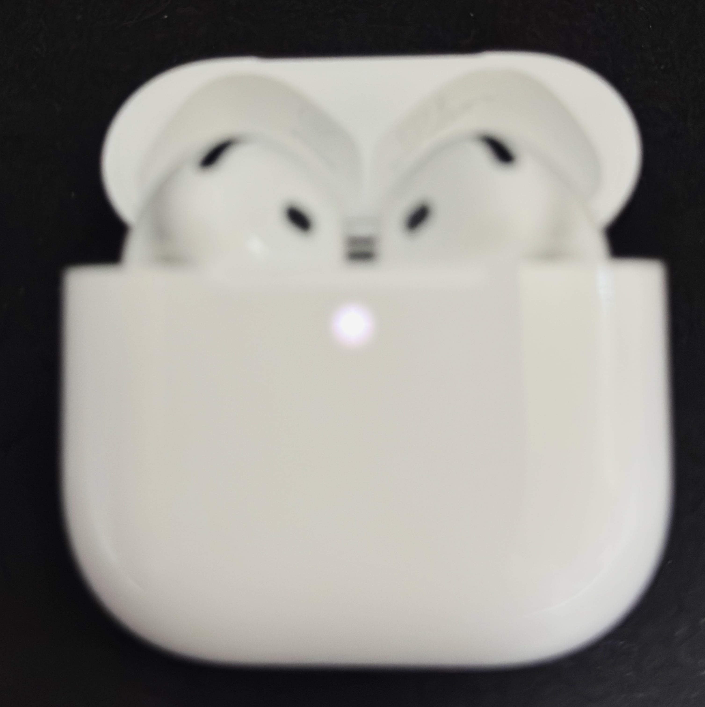
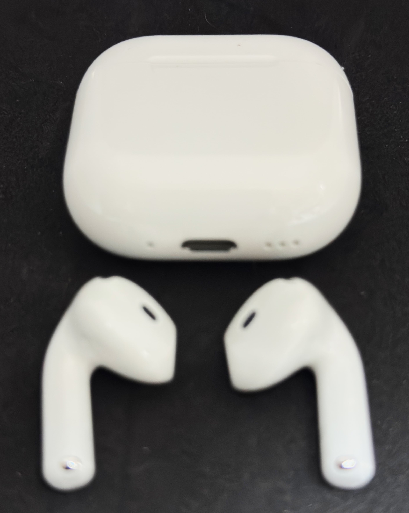

　こんにちは、如月翔也（[@showya_kiss](https://twitter.com/showya_kiss)）です。
　今日はそう、9月20日、AirPods4の発売日です。
　今回は争奪戦が起きなかったと言うか、わりと遅めに予約しても発売日当日に入手できたんですが、数が多く用意されていたのか人気がなかったのかは僕には判断できないんですが、とにかく最短で入手できて狂喜乱舞しています。
　今回僕はAirPods4のノイズキャンセリング機能付きモデルを購入しました。
　ので、さっそくアンボクシングとファーストレビューをお送りします。

## AirPods4 ノイズキャンセリングモデルとは

　AirPods4 ノイズキャンセリングモデルとは、Appleの製造・販売するワイヤレスイヤホンであるAirPodsの第4世代、かつノイズキャンセリング機能搭載モデルを指します。
　今までAirPodsは開放型の無印とカナル型のProがあり、ノイズキャンセリングはProの専売特許だったのですが、今回AirPods4にはノイズキャンセリング機能搭載タイプがあり（ないタイプもあります）、カナル型は得意じゃないけどノイズキャンセリングが欲しい人にとってはかなり有力な選択肢になっているのです。
　ではまず写真から行きます。

### 外箱

　外箱はこういう感じです。従来モデルより一回り小さいですよね。

### 外箱を開けると

　外箱を開けるとまずは説明書がコンニチワします。いつものですね。

　Designed by Apple in Californiaの文字を見ると落ち着きます

### では中身です

　では説明書を取り除いて中身を見ましょう。いつものです。

　いつも通りに丁寧にラッピングされて鎮座しています。
　おもむろに取り出してラッピングを剥ぎ取ります。

### 充電ケース

　取り出した充電ケースはこんな感じです。AirPods3よりもちょっと横に狭い気もするんですが、比較対象を嫁さんが持って行ってしまったので気のせいかもしれません。

　Appleの「探す」に対応しており、ケース自体からも音が出るのでケースにスピーカー穴がついていますね。左側のポチ1個はなんでしょう？リセット穴かな？説明書には何も記載がなかったです。でもリセット方法は別みたいなのでリセット穴じゃないっぽいですね。

### 本体 - 蓋を開けます

　では本体を見るために蓋を開けます。

　\#写真下手くそ部
　はい、めっちゃピントが合っていません。かなり頑張ったんですがこれが僕の写真の腕前の限界っぽいです。
　やっぱり、AirPods3と比べると横に狭い感じがします。
　なくしたり家族のと混ざったり落としたりする前にカラビナ付きのケースが欲しいです……。

### 本体 − 外に出しました

　実際の本体をしっかり見るために本体をケースから出しました。

　\#写真下手くそ部
　ピントがあっていません。
　AirPods3と比べると耳に入る部分が多少角ばっていて、見比べれば世代ははっきりわかるので良いと思います。

## AirPods4 ノイズキャンセリングモデルファーストインプレッション

　では早速AirPods4 ノイズキャンセリングモデルのファーストインプレッションです。
　まず最初に、サイズ感はベストです。ケースに無駄と思われる大きさがなく、ミニマムに抑えたな、という感じがします。
　本体の見た目は今までの無印AirPodsに比べて耳に入る部分が横長と言うか多少角張った感じを受けるのですが、耳に入れた時の感触はソフトです。固くて痛い感じではありません。
　そして第一関門である音については、AirPods3に比べて明らかに良く仕上がっています。高い音の抜けが良く、低音がしっかり聞こえます。まあ僕はバカ耳なので1万円以上の音響設備は違いがわからないんですが、少なくともAirPods3で聞いていた音楽よりも高い音が聞こえ、低い音が聞こえ、そして音楽が「大きなスピーカーで聞いた時に近い」感じがします。これを高い評価と取るかどうかは人によるかもしれませんが、僕は「いやーいいイヤホン買っちゃったな！良かったな！支払い頑張ろう！」と思います。
　次に第二関門であるノイズキャンセル機能についてですが、おおよそAirPodsPro第1世代に相当するレベルでノイズキャンセルが効きます。
　長男の持っている第2世代のノイズキャンセルほどは効いていない感じがしますが（あれは本当に無音に聞こえるので）、ほぼ雑踏や生活音は全て消えます。十分すぎる機能だと思います。音楽を集中して聞く、音楽を聞きながら何かを集中してするのであればこのレベルのノイキャンがあれば十分でしょう。僕は大満足しています。
　ついでに言うと「外部音取り込みモード」は「あれ、僕イヤホンしてたっけ？」っていうレベルで外部音が入ってきます。外部音取り込みモードをオンにしていれば散歩中でも車の音が聞こえなくて轢かれる恐れはそんなに心配しなくて良いんじゃないでしょうか。

　また、ここ最近AirPods以外のイヤホンを使っていたので（Google Pixel Buds/Xiaomiの2400円ANCイヤホン）、AirPodsに乗り換える事でデバイスの移動が非常に楽になり、使い勝手が非常に上がっています。

　もともとAirPodsって無印で35800円だった記憶があるんですが（ANCもなければ音もそんなに良くなかった）、それに比べて今はここまで音が良くてノイズキャンセルが使えて29800円、なんならApple Careをつけても無印初代と値段が変わらないと考えると、時代は進化したなぁ、と思います。

## 個人的な評価は

　 AirPods4 ノイズキャンセリングモデルの個人的な評価としては、5段階評価で5点、☆5です。
　好きな音楽が更に深く楽しめますし、持ち歩きも楽、長時間使えて非常に使いやすいのでとても満足しています。
　ただ一つ問題なのはMacの方のSiriが阿呆なのでライブラリに入っている曲を探せない、存在しないと言い張る部分で、ここだけ直ってくれればいいな、と思いつつ、でも僕は持っている全曲をシャッフルして聞くタイプなのであんまり関係なかったりします。

　でも今回は良い買い物が出来たと思うので満足です。