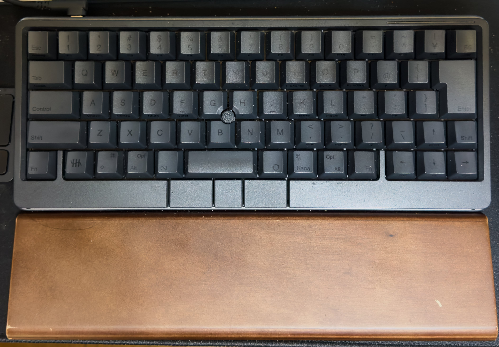
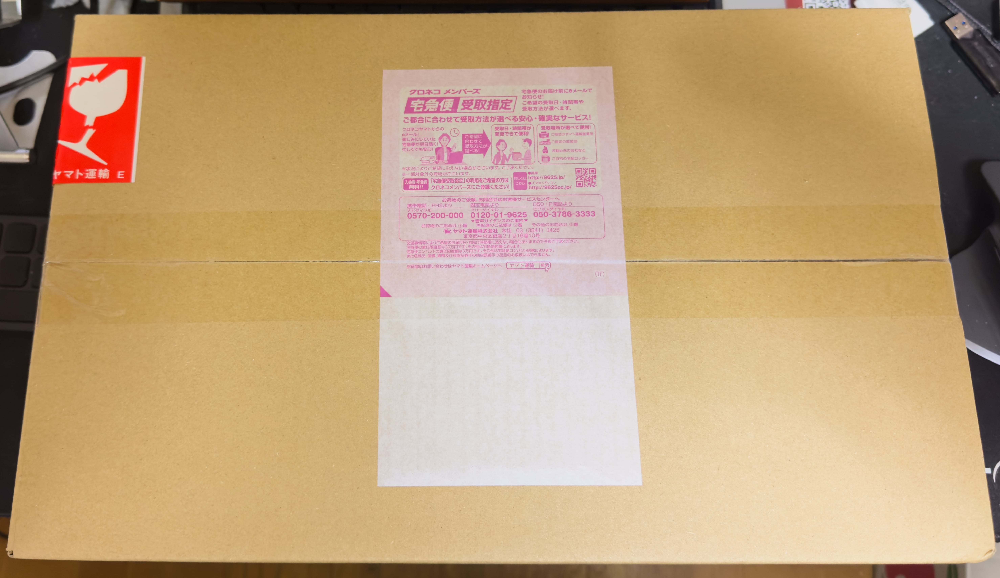
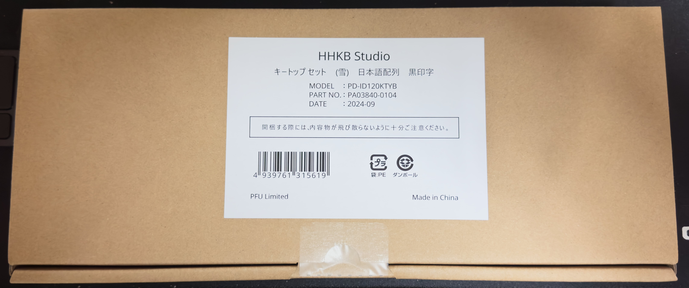
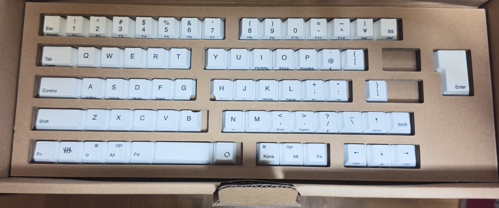
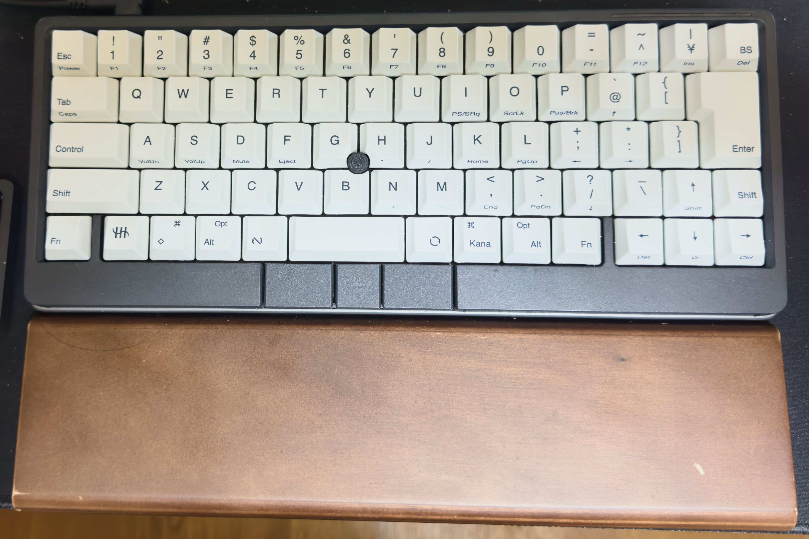

　こんにちは、如月翔也（[@showya_kiss](https://twitter.com/showya_kiss)）です。
　今日は一昨日PFUさんから発売告知があった「HHKB Studio日本語配列」用の追加キートップ、「雪」タイプの「黒刻印」モデルを昨日購入し、今日早速届いたのでアンボックスと装着した写真を中心にお送りしたいと思います。
　現状HHKB Studio自体に「雪」モデルがでている状態ですが、今「キートップ」を検討しているユーザーはほぼ全員「墨」モデルユーザーだと思うので、「墨」のフレームに「雪・黒刻印」をつけるとどう見えるかを中心に見て頂けるとよいかと思います。
　僕個人の感想でいうと、見た目は悪くない、指が覚えないレベルでしか使わないキーコンボが「見える」ようになった事で実際に使えるようになった点が大きいと思っています。

## HHKB Studioとは

　HHKB StudioとはPFUさんで製造・販売しているマニア向けのキーボードであるHHKB(Happy Hacking Keyboard)の新機軸であり、キーボードの半ばにポインティングスティックが設置されてフレーム下にはマウスボタン、左右側面と左右底面にスライダが設置されて無接点容量形式からメカニカルキーボード（ただし恐ろしく静音）に変えられた製品です。
　色々な部分で変わっているのですが、HHKBの思想の根っこである「可能な限りキーボードから手を離さないでタッチタイピングで作業を効率的に済ます」という点では突き抜けて原点に忠実な製品であり、慣れるともうこのキーボード以外考えられないほどの素晴らしい出来なのです。
　ただ一点問題があって、つい一昨日までHHKB Studioは日本語配列だろうが英語配列だろうが黒キートップに黒刻印の「墨」モデルしか存在せず、「墨」モデルってキートップの刻印が読めるかどうかギリギリ、キー側面に書かれているコンボキーでの機能については影になってしまってまず見えない製品になっていたので、基本的にタッチタイピングが出来て、キーコンボを一々頭にしまいながら使っていくしかなかったのです。

## HHKB Studio/雪モデルとは

　それに対して新しく一昨日発表されて昨日から買えるようになった「HHKB Studio/雪」モデルは墨に対して正反対、真っ白なキートップに灰色の刻印がなされており、モデルによっては刻印無しの真っ白キーボードも選べる製品になっているのです。
　時を同じくしてHHKS Studio用のキートップとして「雪」モデルが追加され、「全体真っ白」「灰色刻印」「黒刻印」のキートップが発売されたのです。
　僕は思う所あって「雪」モデルの「黒刻印」を速攻で注文し、今日届いたので早速キートップ入れ替えを行いました。
　では、入れ替え前のHHKB Stuidio日本語配列/墨から届いた箱、アンボックス、キートップを入れ替えたHHKB Studio日本語配列/墨まで一気にご紹介しましょう。

## 写真レビュー

　では一気に写真をお送りします。

### キートップ交換前のHHKB Studio日本語配列/墨

　パームレスト込ですが、見た目は十分格好いいですよね。
　キートップもギリギリ読めるんですが、キートップの下に書かれているコンボキーの文字が「まるで」読めません。スマホでライト当てないと読めません。

### まずは届いた箱をどうぞ

　かなり厳重に梱包されて届きました。
　結構なお値段がする製品なので雑に梱包されても困るんですが、キートップってこんなに大事にされるものだっけ？という気もします。

### 送られてきた箱を開けて外箱を出します

　格好いい箱です。かなりな高級感を感じるので、持っている事に大きな喜びを感じます。しかし用があるのは中身なのでさっさと箱を開けてしまいます。

### アンボックス

　中身はこちらです。本当に真っ白で、そして中央に明確な黒でしっかりとキー内容が記載されています。黒ポチは白にはならない感じで、マウスキーも交換キートップはありませんでした。
　では、早速付属のキープラーでキーを抜いて交換していきます。
　キーの活きが良く抜くと足の間をすり抜けて床に落下するので非常に面倒くさかったです。もし介護用のスタイ（よだれかけ）を持っているのであれば、スタイをつけてスタイの上にキーボードを置いてキープラーで抜くとスタイの上に飛び出したキートップが着地するので相当楽に作業できると思います。
　では、交換した結果について写真でお送りします。

### キートップ交換後のHHKS Studio日本語配列/墨

　パームレスト込みの写真ですが、こんな感じに仕上がります。
　ツギハギのフランケン感が出るかな、と思ったんですが、全然そんなことはなく、モノクロームのキーボードで普通に格好いいです。
　「墨」だと「俺はタッチタイピングができるんだよねー」という主張があるんですが、「雪」にはそれがなく、代わりにただ美しいです。
　僕は基本的なタッチタイピングはできるのですが、今までキーが読めなかったのでfnキーとのコラボであるHome・End・PageUp・PageDown何かが使えていなかったんですが、これからははっきり見えるので指を覚えさせていこうと思います。
　全部のキーとコラボキーを覚えたらまた「墨」のキートップに戻すのか、今のまま「雪」モデルで行くのかはまだ決めていませんが、今の時点でかなり美しいですし使い勝手も素晴らしく良くなっているので個人的には大満足しています。

　というわけでアフィ張ります。

<!--! <!-- START MoshimoAffiliateEasyLink -->
リンク
<!-- MoshimoAffiliateEasyLink END --> !-->

## 個人的な感想としては

　個人的な感想としては、今まで見えていなかったコラボキーが見える部分と、予想していた100倍美しい仕上がりで、キートップだけの交換なのでキーのフィールも変わらないですし、大満足しています。
　来月ちょっと請求厳しいんですが（もし今月iPad mini第7世代が出たら厳しいどころか火を吹きます）、ちょっと頑張って買って良かったな、と思っています。
　長く使ってもとを取っていこうと思います！