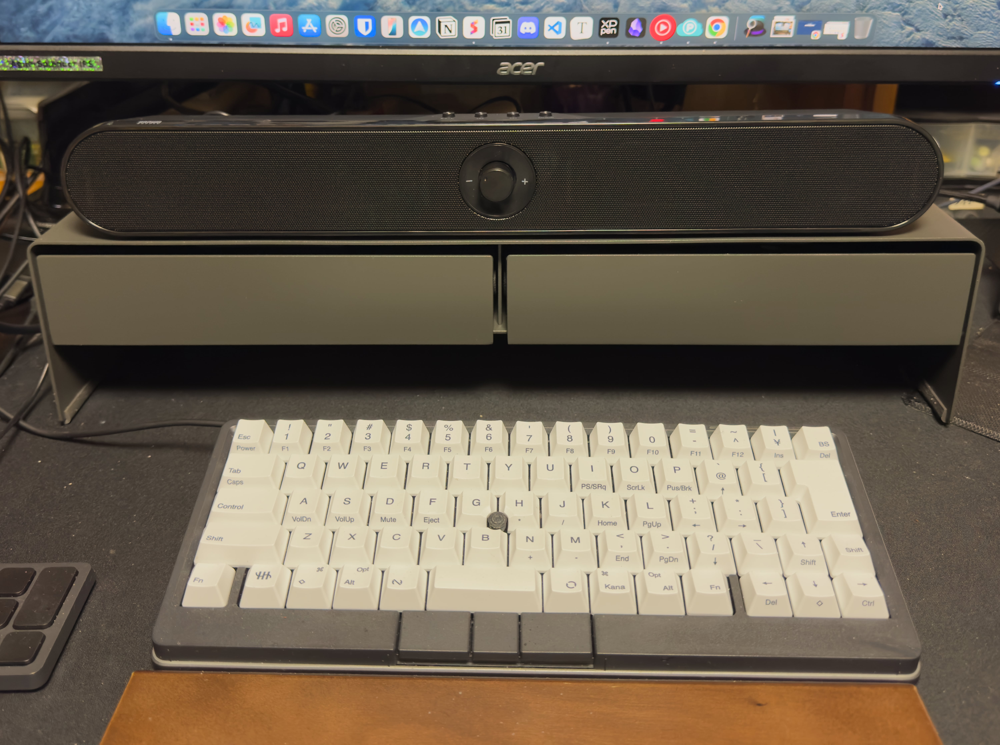

　こんにちは、如月翔也（[@showya_kiss](https://twitter.com/showya_kiss)）です。
　今日はPC周りの雑貨で衝動買いしてしまった物が2つあるのでそれをご紹介しようと思います。
　普段は3000文字を意識してブログを書くのですが、今日はネタが薄いので短めにまとめてしまおうと思います。
　今回購入したのは2点、どちらもモニタ下に設置するアイテムです。

## そもそもなぜモニタ下が空いたのかと言うと

　そもそも僕のデスクのモニタ下にはM3MacBookAir15インチとWindowsのHPのOMEN16、それにUbuntuを入れたAcerのAspire3が縦積みになっており、必要に応じて電源を入れてモニタ入力を切り替えて使っていたのです。しかし、この運用には以下の点で問題がありました。

- 縦積みしているので熱がこもる
- 下のパソコンの電源を入れるのが大変
- デスクは広いのにノートPCを平置きするためスペースが狭くなる

　これらの問題に対処するため、僕は2つのアイテムをAmazonさんから貰いました。製品紹介してしまうとルール違反になるので詳しくは書けないんですが、以下の2つです。

- パソコン2台まで縦置きできるスタンド
- デスク外にクランプで固定してパソコン1台を外に縦置きできるスタンド

　この2つを使う事で、MacBookとOMENをデスク端に2台縦置きし、その外側にAspireをクランプで付ける事でデスクの横にパソコンを全部移動してしまい、電源を入れやすくすると同時にデスクのスペースを開けたのです。

## モニタ下が空いたタイミングで一目惚れした商品がありまして

　僕の家の近くには生協があるんですが、その中に無印良品が入っているんですよね。そこでパソコン関係の棚を見ていたら（パソコン関係の棚は1つだけで扱いが非常に小さいんですが）パソコンを抜いて空いた穴を塞ぐのに丁度良い「スチールモニタースタンド」を見つけてしまったんです。
　ガンメタルで収納スペースは2分割、下にはキーボードをしまい込めるスペースが有り、何より格好いい。そして今ぐちゃぐちゃっとしまっているガジェット小物をしまうイメージがしっかりでき、完全に一目惚れでお値段が6490円と全然お安くないんですが一目惚れなのでその場で買ってしまったのです。
　アフィじゃないですけど商品リンク張っておきますね。
「[スチールモニタースタンド 引出付・ワイド・ダークグレー](https://www.muji.com/jp/ja/store/cmdty/detail/4550583767136)」

## 設置してみるとモニタ前が若干寂しかったので

　買ってきたスチールモニタースタンドですが、設置してみると案外主張が激しくなく、モニタ前が若干寂しかったので、前から購入を考えてはいたサウンドバーを導入することにしました。
　スチールモニタースタンドの上に置いて、置いたサウンドバーよりちょっと後ろにモニタを置く調整をする事で見た目も寂しくないですし、なによりモニタの2Wのスピーカーに比べると今回購入したサウンドバーは20Wあるので音が違うんですよね。
　では早速写真をお送りします。

　決して悪くないと思います。
　音楽を聞く事については僕はAIrPods4ノイキャンモデルと、LenovoのX370を持っているのでそれで良いんですが、イヤホンやヘッドホンは耳が痛くなったり蒸れたりするのでできればサウンドバーも欲しく、サウンドバーは主にゲームを遊ぶ時に使いたいのと、今モニタで使うパソコンを切り替えているんですが、モニタには3.5mmジャックがあり、サウンドバーの3.5mmジャックに挿せばモニタがつけているパソコンの音がなるのでパソコンを切り替えるたびにBLUETOOTHやUSBを切り替えなくて良いので楽だと思って導入したんですよね。
　サウンドバーについてはAmazonで正式に購入したものなので堂々とアフィリます。

<!--! <!-- START MoshimoAffiliateEasyLink -->
リンク
<!-- MoshimoAffiliateEasyLink END --> !-->

## では導入してみてどうだったかと言うと

　では導入してみてどうだったかと言うと、衝動買いとついで買いした割には非常に満足度が高いです。
　ストレージは結構サイズがあるので大きめのガジェットもしまえますし、百均で内部に仕切りを作る形で入れ物を入れると更に便利かもしれません。見た目もかなりクールなので満足度が高いですし、何より一目惚れしたものを手元に置いて愛でられるのは最高ですよね。
　サウンドバーについては普通のサウンドバーで1万切りって珍しいんですが、3980円なのに当初想定していたよりかなり良い音が出ます。さすがサンワダイレクトさんです。ゲームのプレイには十分ですし、PC作業中にPCから流す音楽を聞いている分には引っかかる部分はありません。もちろん安いサウンドバーなのでAirPods4とかには敵わないんですが、低温部分ではかなり頑張っている音質で、音楽鑑賞自体はヘッドホンかイヤホンを使ってすべきですが、音楽が「添え物」である段階ではこのレベルで全然問題ないと思います。僕はこの音で満足しています。

## という訳で予定外の1万ちょっとの支出がありましたが

　という訳で予定外の1万ちょっとの支出がありましたが、PCデスク周りがかなり良くなったので個人的には満足しています。
　また、スチールモニタースタンドの下にキーボードがしまえるので、キーボードをしまうとちょっとした小物を接写する作業スペースが作れるのでこれから小物ガジェットを入手した時は便利かな、と思います。
　まあ小物ガジェットについては色々な事情があってブログ上でレビューできない物が多かったり（Amazonで僕のレビューがご覧頂けます）するのでそんなに回数使うわけでもないとは思うんですが、自分が欲しいと思ったガジェットについてはお金を出して購入して正々堂々と紹介してアフィる予定なのでよろしくお付き合いいただければと思います。

　という訳で結局3000文字行った気もするんですが、最近一目惚れして購入したスチールモニタースタンドと、ついでに購入したサウンドバーについてのお話でした。皆さんのお買い物の参考になれば幸いです。