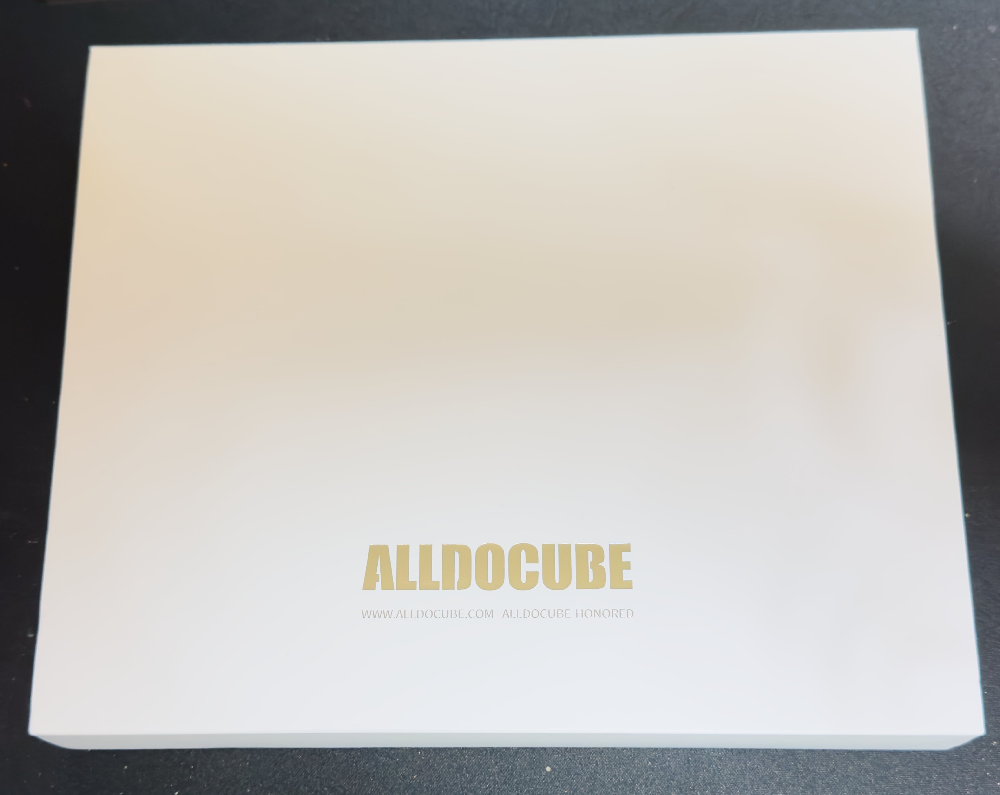
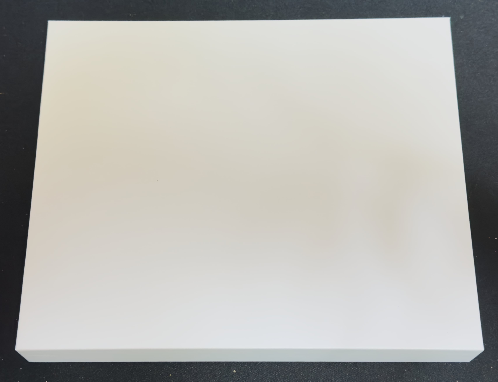
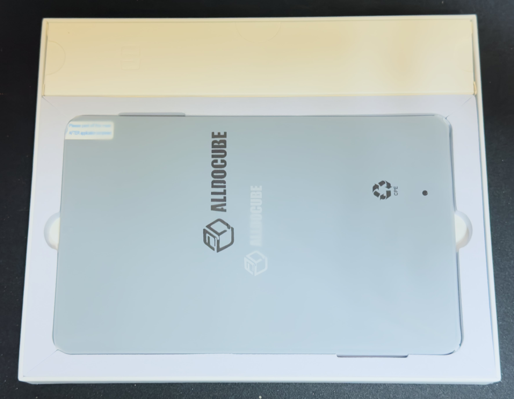
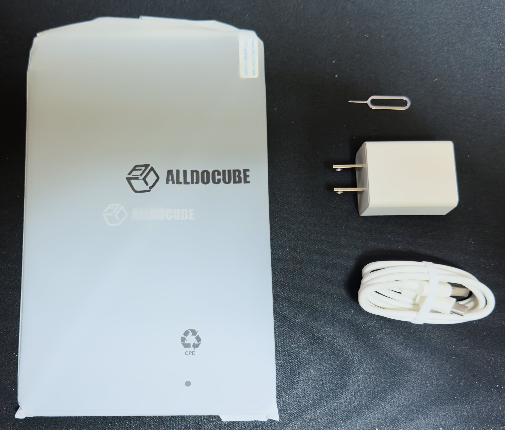
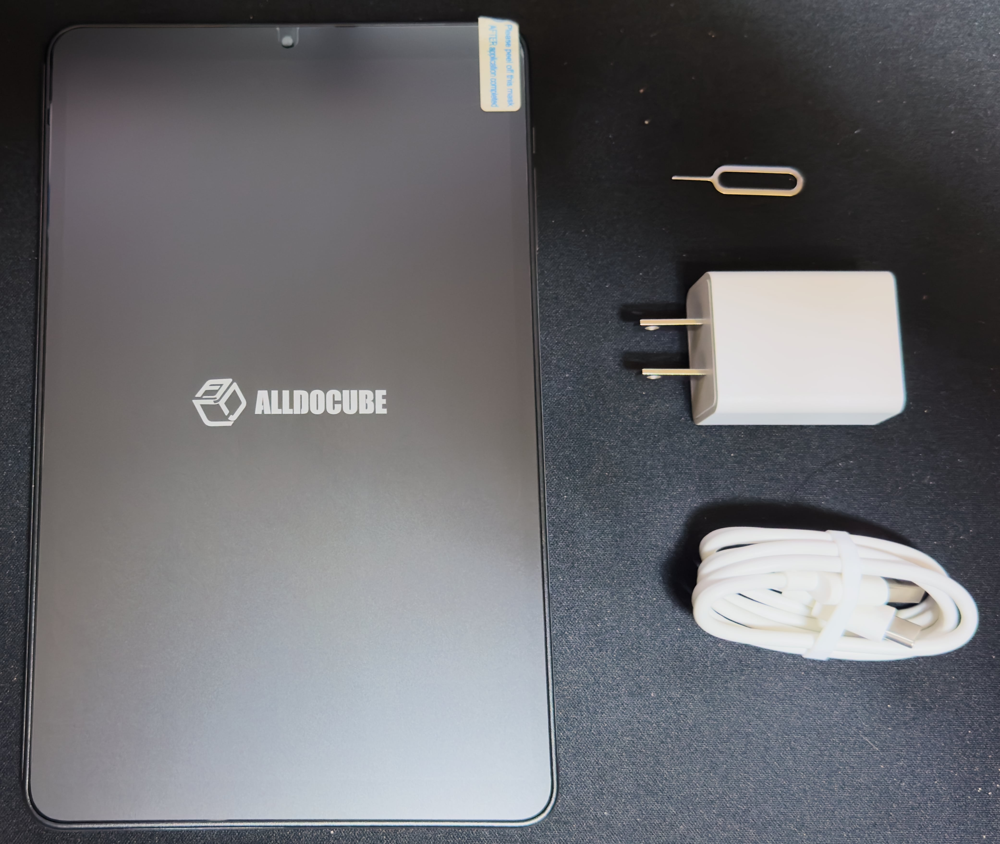

　こんにちは、如月翔也（[@showya_kiss](https://twitter.com/showya_kiss)）です。
　昨日はみなさんお待ちかね、iPad mini（A17 Pro）の発売日でしたね。続々と購入報告が上がっており界隈も盛り上がっています。
　僕のところにも昨日届きました。ALLDOCUBEのiPlay 60 mini Turboがです。僕はiPad mini（A17 Pro）が発売したのに気づくのに3時間くらいかかった結果到着が11月以降なのです。
　その腹いせに、という理由では決してないのですが、Amazonのプライム感謝セールで本来約4万のiPlay 60 mini Turnoが26000円くらいになっており、1TBのSSDカードも6000円くらい（この製品は怪しいので届いたらチェック予定）で買える感じだったので、SnapDragon6 Gen1の能力を見せて貰おうと思って購入したのです。
　なので今日はアンボックスと、ALLDOCUBEの前のタブレットであるiPlay 60 mini proとどう違うのかを比較していこうと思います。
　まずはアンボックスです。

## 外箱

　外箱はこんな感じです。

　記憶違いだったら申し訳ないんですが、iPlay 60 mini proの箱って「ALLDOCUBE」が銀色〜黒だった印象なんですが、iPlay 60 mini Turboのはこの「ALLDOCUBE」の刻印は金色です。ちょっとだけ高級感がマシています。

## 外箱を外すと

　これは情報ノイズですが、外箱は横にずらして中箱を出す形になっています。全面真っ白な箱なので情報量はゼロなんですが、一応写真を載せておきます。

　本当に情報量ゼロです。

## 中箱を外すと

　実際のアンボックスとして意味のある部分ですが、中箱を外すと本体と、あと「充電器プラスケーブル」の入った箱がお目見えします。

　上が充電器プラスケーブルの箱、下が本体です。

## 中身を取り出します

　では中箱にも用はないので中身を取り出します。
　中身はシンプルに本体とケーブル、充電器、SIMピンではなくマイクロSDピンです。iPlay 60 mini Turboは18Wの高速充電対応ですが、付属の充電器は18W高速充電に対応していないので高速充電したい人は18Wの高速充電対応の充電器を用意する必要があります。手っ取り早い方法としては2000円ちょっと握りしめてセブンイレブンに行きAnkerの充電器を買ってくる事でしょう。

　このあたりは見栄えがしないですね。

## では本体とご対面します

　袋に入った本体を見ていても仕方がないので袋から中身を出します。
　本体にはすでに保護フィルムが張っており、「ALLDOCUBE」の印刷があるフィルムを剥がすとその下に保護フィルムがちゃんと張っているので、気に入らない場合を除きそのまま使い始められます。

　ちなみに、見た目も形も大きさも重さもサイズもなにもかもiPlay 60 mini proと一緒です。なので保護フィルムはmini pro用を購入すればいいですし、ケースもmini pro用を購入すれば良いです。
　ぶっちゃけ見た目では区別がつかない（Turboの文字すら印刷されていない）ので、混ざってしまったらSIMピンを指してSIMに対応しているかで確認するか、mini proにSIMが入っているなら画面をオンにしてセルラーの電波が入っているかで確認するしかなさそうです。

## iPlay 60 mini proとiPlay 60 mini Turboの違い

　では売値で15000円違うiPlay 60 mini proとiPlay 60 mini Turboの違いについて説明していきます。
　iPlay 60 mini TurboはiPlay 60 mini proの単純なアッパーバージョンではなく、SoCは明らかにアッパーバージョンなんですが、その他の機能ではiPlay 60 mini proにちょこちょこ負けている部分があるので、勝っている点・負けている点でお話します。

### iPlay 60 mini TurboがiPlay 60 mni proに勝っている部分

　勝っている部分は以下です。

- SoC：Helio G99からSnapDragon6 Gen1にアップグレード。これにより原神が「かろうじて動く」から「画質：中で普通に遊べる」ゲーム機レベルにアップ。崩壊3rd、鳴潮、ゼンレスゾーンゼロも普通に動く。
- 対応マイクロSDカード：512GB対応から1TB対応に拡大。更にデータを詰め込めるようになった。
- コネクタがUSB-Cの3.1に対応。転送速度が上がった。

### iPlay 60 mini TurboがiPlay 60 mni proに負けている部分

　負けている部分は以下です。

- SIM非対応。単体通信ができないのでテザリング必須。
- GPS非搭載。GPSゲームが遊べない。
- 顔認証が廃止。生体認証が使えない。
- BLUETOOTHのバージョンが5.2→5.0に退化
- バッテリーが6050mAh→5500mAhに減少
- 重量が310g→323gに増量

　これだけ見ると退化の方が激しいのでちょっと判断に困ると思うんですが、SnapDragon6 Gen1搭載により処理速度の向上とともに消費電力の低下が図られているのであればバッテリーの減少はカバー可能ですし、BLUETOOTHはバージョン5.2じゃないと困る場面はなかなかなく、顔認証は使う人は使いますがPINでいいですよね、と考えるとマイナス部分はそんなに厳しくないと考えられるかも知れません。

## 使ってみた範囲でいうと

　とりあえずのファーストインプレッションですが、iPlay 60 mini Turboはmini proのアッパーバージョンと言うよりも、60 miniの中の「ゲーム機より」の立ち位置なんじゃないかと思います。
　SnapDragon6 Gen1のお陰で動作がサクサクしていますし、原神も起動時は「画質：低」ですが設定で「画質：中」にしてもデバイスの負担が重くなるという表示になるだけで普通に動きます。エフェクト多めの戦闘画面でも目に見えてFPSが落ちる感じはなかったのでゲーム機としては十分なんじゃないでしょうか。
　同じく崩壊3rd、鳴潮、ゼンレスゾーンゼロもそこまで重い感じはしないので普通に遊べると思いますし、まあ普段売りの約5万は高いですが、セールで26000円になった事実は消えないので、次のセールがあればまた26000円が狙えると思います。
　また持って歩きたいデータが512GBで収まらない場合、1TBのマイクロSDに対応しているので倍のデータを持って歩けますし、ものとしては決して悪くないと思います。

　というわけでアフィ張ります。
<!--! <!-- START MoshimoAffiliateEasyLink -->
リンク
<!-- MoshimoAffiliateEasyLink END --> !-->

　個人的にはかなり気に入ったタブレットなので色々使ってみようと思います。