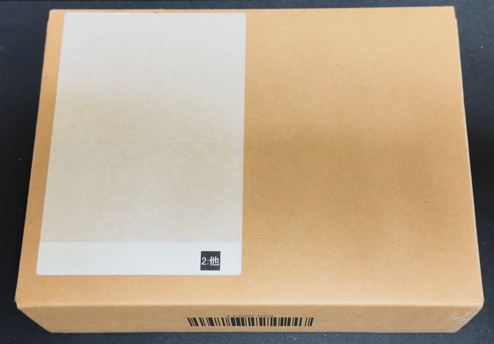
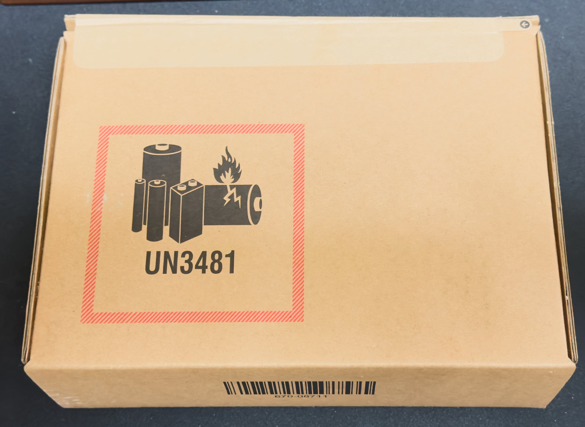
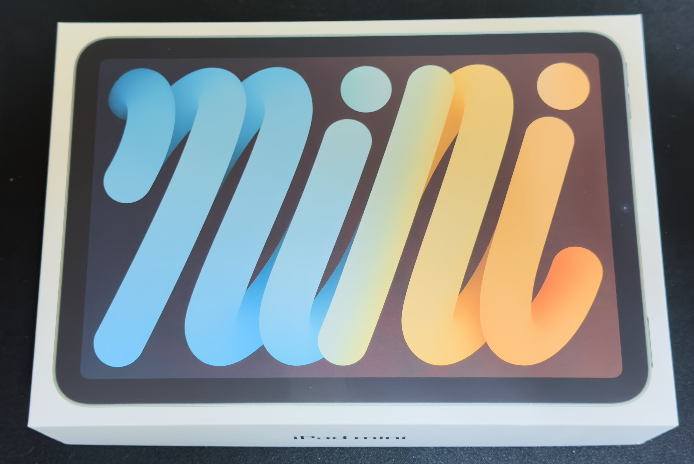
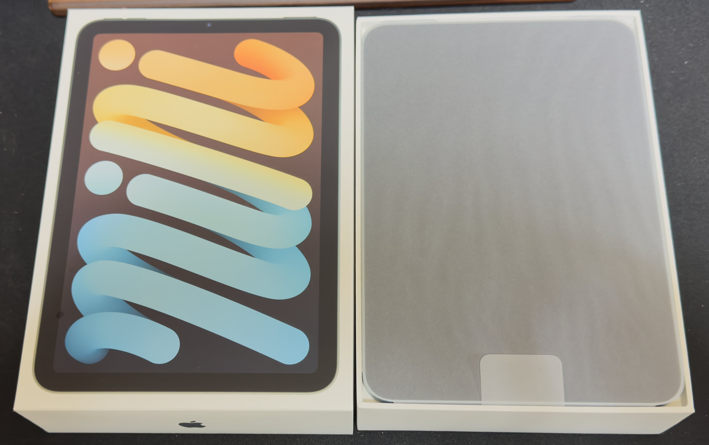
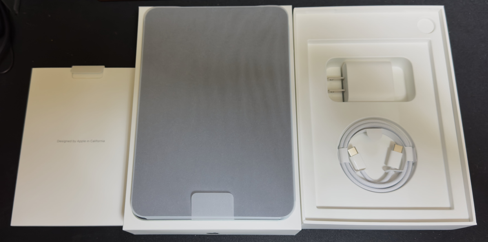
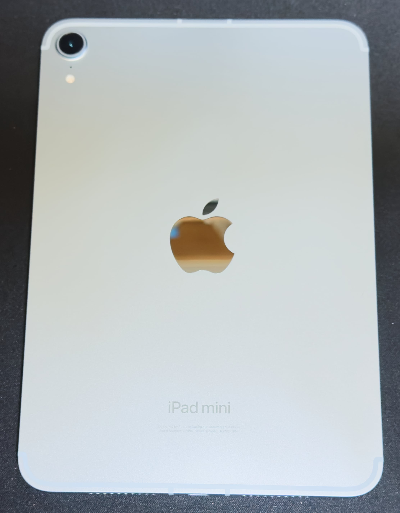
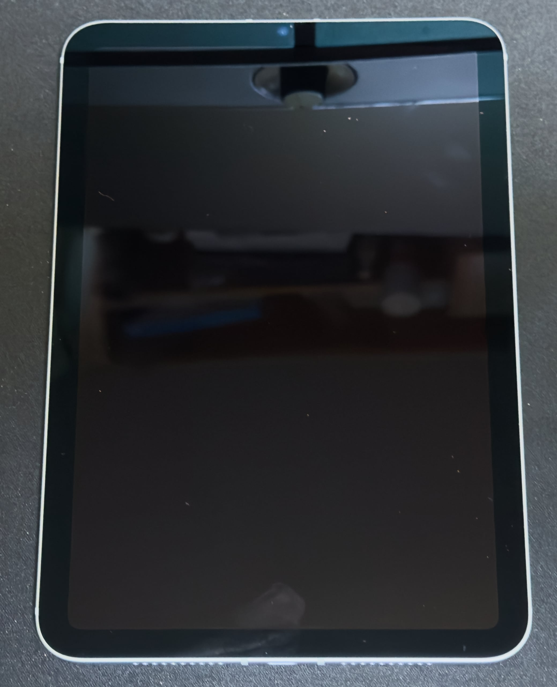

　こんにちは、如月翔也（[@showya_kiss](https://twitter.com/showya_kiss)）です。
　今日は本来iPad mini(A17 Pro)の争奪戦に破れて（というか発表されているのに気づくのに3時間以上かかったので）予約したものの到着予定が11月1日〜9日と表示されてベコベコに凹んでいたのですが、昨日の夜「明日到着するよ」と連絡が来て、今日本当に到着したので大喜びで受け取ったところです。
　先代のiPad mini第6世代はデータ移行をさっと済ませて今買い取り金額プラス20%をやっているGEOに行って売ってきて、40000円プラス20％で48000円になったので今月の支払いも大丈夫そうです。
　という訳で、恒例の開封フォトレビューとファーストインプレッションをしたいと思います。

## iPad mini(A17 Pro)とは

　iPad mini(A17 Pro)とはiPad miniの新しいモデルで、第6世代に比べてSoCがA15からA17Proになり、今後広まっていく予定のApple Intelligenceに対応予定のiPadとなっています。
　外見的にはほぼ何も変わらず、iPad mini第6世代のガラスフィルムやケースがそのまま流用できますが、そろそろ皆さんのアイテムもくたびれてきていると思うのでこれを機に本体の色を変えサプライの色も変える事をお勧めします。

## iPad mini(A17 Pro)開封レビュー

　では早速開封レビューに移ります。
　アンボックスを写真にするだけなので情報量はスカスカです。

### 届いた外箱

　Appleさんから届いた外箱はこんな感じです。

　シールの下半分には住所と名前の書かれたシールが貼られていたのですが、隠すわけでもないですが堂々と晒すものでもないので剥がしておきました。
　必要以上に大きくないサイズの梱包なので良いんですよね。

### 外箱の表面

　届いた外箱の表面はこれです。いつもの奴なんですが格好いいんですよね。

　ですが大事なのは中身なので箱を開けて中身を取り出します。

### 本体の中箱

　本体の中箱はこんな感じです。第6世代と見た目は変わらない気がしますが、前回はパープルを選んだんですが今回はブルーを選んだのでこの色合いが違います。

　良い箱ですよね。持っていて気分が良いです。

### 中箱の中身

　中箱の中身はこうなっています。

　まず本体が紙に包まれて納められています。嫌が奥にもテンションが上ります。さらに本体を取り出して中身をお見せします。

### 中箱の中身・本体の下

　中箱の一番上の本体をどけると説明書が入っていますが、それもどけるとこうなっています。

　説明書の下には20Wの充電器とUSB-CtoUSB-Cのケーブルです。
　このあたりiPhoneより中身がいいですよね。
　では本体をご覧に入れましょう。

### 本体・裏面

　本体の色が一番見られるのは裏面なのでまずは裏面をお見せします。
　こんな感じです。かなり綺麗でしょう？

　非常に美しいです。そしてiPad mini第6世代と違って裏面には「iPad mini」の刻印があります。地味に今までは「iPad」だけの刻印だったんですよね。
　では続いて表面です。

### 本体・表面

　本体の表面はこんな感じです。縁取りの問題から、表面からでも選んだ色の枠線が見えるんですよね。第6世代の時のパープルの時は気にならなかったんですが、今回は「あ、色が見える」と気づきました。

　ちょっとゴミが浮いたり指紋がついていますが、すぐにウェットシートで拭ってドライシートで拭ってガラスフィルムを張りました。ゴミが2〜3箇所入りましたがシート貼りにも慣れてきたので慌てず騒がずフィルムを浮かせてゴミ部分に弱粘着テープを張ってゴミを取って完璧に張り直しました。最終的な仕上がりとしては大満足です。

## iPad mini(A17 Pro)のファーストレビュー

　本来iPad mini(A17 Pro)についてはゼロからセットアップして試すつもりだったんですが、iPad mini第6世代で使っているSIMをe-SIMに変換して移動する必要があったのと、今日中にiPad mini第6世代を換金したいニーズがあったので「データ移行」でデータを移行してしまい、さっさとiPad mini第6世代を換金してきました。
　では引っ越したiPad mini(A17 Pro)はどうかというと、物凄くヌルサクです。
　インターネット回線も上り下り共に700Mbps近く出ていますし、操作時の遅延もほぼないです。
　またゲームについても原神、崩壊3rd、鳴潮、ゼンレスゾーンゼロ、雀魂を試しましたが全て高品質でヌルサクで動き、エフェクトが多めな場面でも画面表示は安定していたので素晴らしいと思います。
　同時に購入したApple Pencil Proについては現状Duolingoの回答時にペンで書き込むのにしか使っていないんですが使い勝手は変わらないです。これを機にProCreateを使って絵を再開しようかな、と思っているんですが、ヘタなものを放流するのは好きじゃないんですが、ヘタでも発表し続ける事で腕が上がっていくものらしいので（この辺文章でも一緒ですよね）恥ずかしがってないで描いて流せや、という話な気もします。
　iPad mini(A17 Pro)は性能に関してはかなり頑張っているというか、iPadラインナップの中ではハイよりのミドルなのでこれくらい余裕でできてもらわないと困る、みたいな思いもあるんですが、予想以上にサクサク動くので個人的には満足しています。
　どうやらUTM SEというフリーミアムのアプリを使うとiPad mini(A17 Pro)にLinuxが入れられるっぽいので、UTM SEでLinuxを入れて更に中にSidekickでも入れてやろうかな、と思っていますが、上手く行くかは不明です。

　これまで3年間iPad mini第6世代が常に身近にある相棒だったようにこれからの5年間はiPad mini(A17 Pro)を長く相棒として使っていこうと思いますので、どんどん色々な使い方をしていこうと思います。