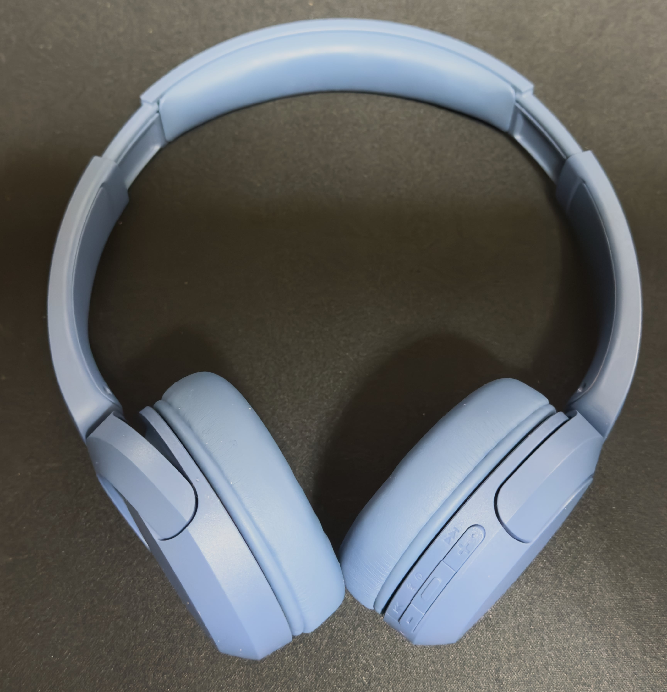

　こんにちは、如月翔也（[@showya_kiss](https://twitter.com/showya_kiss)）です。
　今日はこっそり買ってそのまま使ってレビューする気がなかったのですが、届いてみて使ってみたら目からウロコが落ちるほど良かったので予定を変更してレビューする事にしました。
　レビューする製品はSonyのWH-CH520というヘッドホンです。

## WH-CH520とは

　WH-CH520とはSonyの販売するヘッドホンで、エントリーレベルの位置づけの製品だと思うのですが、アプリで音の調整が出来たり、360度立体音響を楽しめたり、単体のBLUETOOTH接続ではなく2台までBLUETOOTH接続が可能だったりとエントリーにしてはなかなか性能に秀でている製品です。
　本来8000円くらいの製品なんですが、今お値引きしていて6300円くらいで購入できます。

## WH-CH520を購入した経緯について

　僕は基本的に音楽はイヤホンで聞くよりパソコンから流したりサウンドバーから流したりするのが好きで、イヤホンだと長く聞いていると耳が痛くなってくるんですよね。音量的な問題ではなく物理的に接触する都合上。
　そういう訳で外出先ではAIrPods4ノイキャンモデルを使っているんですが、家では長時間使えないのでサンワサプライの4000円くらいのサウンドバーで音楽を流して満足していたんです。やはりMacBookAirはノートPCにしては音が良いとは言ってもサウンドバーの方が明らかに良い音が出ますし、それはそれで満足していたんです。
　それはそれとして、僕は青春時代週刊少年ジャンプでシャーマンキングが連載されていた世代なので、主人公の麻倉葉が大きなオーバーヘッドホンを首にかけているビジュアルがとても格好良く思えていて、ヘッドホンにはずーっと憧れがあったんですよね。ただ、僕は頭が大きくてヘッドホンが装着しづらいと言うか付けていると頭が痛くなるのと、ヘッドホンの耳当てが耳とメガネの間を押し込んで耳が痛くなる問題があって耳当てが相当大きいヘッドホンでないと使えなかったんですが、そういうヘッドホンってあまり質が良くないと言うか、音で満足できるヘッドホンがなかったのでヘッドホンはずっと使ってこなかったのです。
　しかし先日temuで色々あって5000円のポイントと20%オフのクーポンを貰ったのであまり有名どころではないんですがDellのX370という耳当ての大きなヘッドホンを入手し、これは耳が痛くならない上にそれなりに音が良かったので満足していたんですが、折しもタイミング悪く長男の使っているヘッドホンが壊れまして、「パパ、ヘッドホンない？」と聞いてきたので、別に無料で貰ったものだしまあ良いか、と思って長男に譲ったんですよね。そのため最近はヘッドホンがない状態だったんです。
　ですがいつもRSSリーダーで周回しているガジェット系のサイトさんで「SonyのWH-CH520が値引きしている」という情報を見つけまして、そして興味本位で覗きに行ったところ値段が6300円、カードの限度額に届かない金額で、しかも僕はSonyは音が良いとは聞き及んでいたんですが今までの人生でSonyの音楽製品は持った事がなかったので（PlayStation5とかは持ってますよ）、どんなに音が良いんだろう、小さめサイズに見えるけど装着できるだろうか、と思いながら、とりあえず好きな色であるブルーをポチったのです。
　月曜の夜にポチってAmazonでは「土曜日に配送」となっていたので油断したんですが、木曜に届きました。

## ではまず写真を見て下さい。

　ではまず本体の写真を見て下さい。
　レビューを上げるつもりはなかったのでアンボクシングの写真は取っていませんでしたので、いきなり本体です。

　結構格好いいんですよ。

## Sony WH-CH520を使ってみての感想

　届いたWH-CH520を見ての第一印象は「ちっちゃ……」でした。正直デカ頭の僕には装着不可能ではないかと思ったのですが、試すだけ試すか、と思って調整部分を調整して装着したところ、頭が締め付けられる事もなく良好な装着感だったのです。それでいて頭を動かしてもヘッドホンがブレないのでかなり良いフィールでした。
　次に心配していた耳当てがきつくあたって耳とメガネが挟まって痛くなる問題は、締付けがほぼないので発生せず、結構長い時間装着していても耳が痛くなる事はありませんでした。
　耳当て自体はそんなに大きくなく、耳全体を覆う感じではなく耳の上に載せる感じで音楽を聞く形になるのですが、圧迫感や痛みはなく、非常に装着しやすいものでした。
　そして、肝心の音についてです。
　先に宣言しておきますが僕は耳が悪く、どちらかというと馬鹿耳なのでそこまで信頼性のある話には聞こえないかも知れないんですが、一つ感動した事がありました。
　僕は音楽デバイスを入手した時は試しにDes-Rowさんの「D.」というアルバムを聞きます。これは昔音ゲ戦士をしていた時のお気に入りのゲームであったPop'n Musicの素晴らしいアーティストさんのアルバムです。
　Pop'n Musicでアホほど叩きましたし、アルバムについても風呂に入る・シャワーを浴びる時はスマホを風呂場に持ち込んでこのアルバムを必ず聞くので（長風呂が心臓に悪いので時間を意識するために同じアルバムの同じ曲で風呂から上がれるよう気をつけている）それはもう何十回では効かないレベルで聴き込んでいるアルバムなのですが、WH-CH520でこのアルバムを聞いた時、「今まで知らなかったノーツ」が聞こえました。今まで色々なデバイスで聞いてきて、知らない事がないくらいに思っていたアルバムで、聞き落としていた音をWH-CH520は聞かせてくれたのです。
　デバイスの特性としてイヤホンよりも低音がガッツリ聞こえるのは予想の範囲内でしたし、聞こえる低音が不快感のない自然な音であるのは素晴らしいと思いましたが、ここまで「聞こえる」ものだとは思っていませんでした。
　「どんなもんかな」という軽い気持ちで購入したのに、僕はたった6300円のイヤホンでパラダイムシフトを体験したのです。
　これ、普通売りでも8000円くらいなんですが、一応マイクも内蔵していますし、フル充電なら50時間使えるのでTRPGのオンセとかにも使える感じなので、かなりの掘り出し物な気がします。
　そしてSonyというか、Boseとかも含めて音楽界隈は音の好き嫌いが結構はっきり出る界隈なので苦手な人は苦手なのだろうと思いますが、僕は非常に気に入りました。それこそ買って使っておしまい、とする予定だったのが急遽レビューをする程度には衝撃を受けましたし、かなり気に入っています。
　一応この記事を見て欲しいと思う人がいるかも知れないのでアフィを貼っておきますね。

<!--! <!-- START MoshimoAffiliateEasyLink -->

リンク

<!-- MoshimoAffiliateEasyLink END --> !-->

　Amazonでは色によって値段が違うので注意して下さい。でも数百円の違いなので、身につけていて気分の良い好きな色を選ぶのが良いと思います。

## というわけで

　というわけで、「ためしに買ってみるか」レベルで購入して大して期待もしていなかったのでアンボクシングすら写真を取らなかった製品なのに、使ってみてぶん殴られるような衝撃を受けたのでこれは紹介するしかあるまい、と思ってブログにしています。
　もし今ヘッドホンをお持ちではなく、Sonyに興味があり、6000円くらいなら出してもいいかな、という人は是非試してみて欲しいと思います。