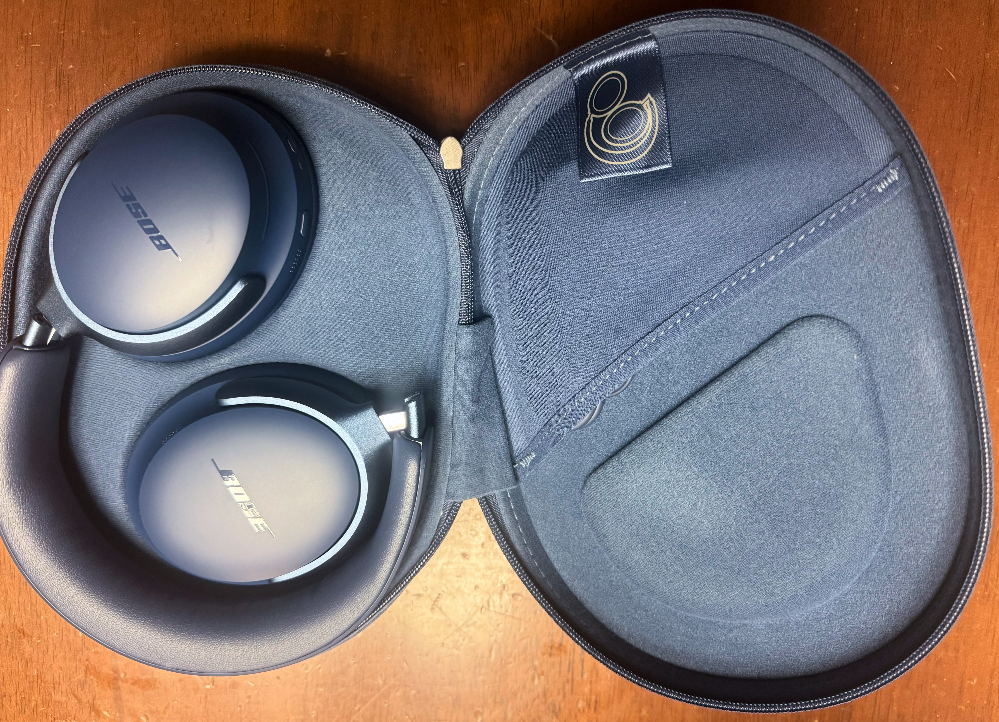

　こんにちは、如月翔也（[@showya_kiss](https://twitter.com/showya_kiss)）です。
　本日は以前Sonyのヘッドホン、WH-CH520を購入した時から強いあこがれを持っていたBose QuietComfort Ultra Headphones LEのルナブルーを購入しましたので、早速アンボクシングとファーストインプレッションをお送りします。

## Bose QuietComfort Ultra Headphones LEとは

　Bose QuietComfort Ultra Headphones LEとは音響メーカーのBoseの販売する最高級ヘッドホンであるBose QuietComfort Ultra Headphonesの限定エディション、僕はルナブルーを購入しました。
　公式サイトを見て頂くとおわかり頂けるんですが、Boseの「ヘッドホン」の中では最高級、「最高のサウンドを届けてくれる」製品として位置づけられており、僕はそれまで耳がそんなに良くなかったのでヘッドホンに興味はなかったんですが、SonyのWH-CH520を使った時に頭を殴られたような衝撃を受け、このレベルのヘッドホンでこれだけの衝撃であれば音響メーカーとして超一流であるBoseの最高級ヘッドホンはどれだけのものなのか、というあこがれを持っていたのです。
　資金繰りで色々あり、うまくお金を浮かせる事ができ、そして折よく15パーセントオフで販売されていたのでこれを機に購入してしまう事にしました。LEにしたのは僕がルナブルーが好きだからです。Web上の表記ではLEは2.5mm・3.5mmジャックがないような記載のされ方をしていますが、ちゃんと調べれば2.5mmジャック・3.5mmジャックもついてきますしケーブルもついてきます。ただ、ジャックを使うとヘッドホンの実力の100パーセントは発揮できないので可能な限りBLUETOOTHでの接続が良いと思います。
　製品については先にアフィっておきますね。

<!-- START MoshimoAffiliateEasyLink -->
リンク
<!-- MoshimoAffiliateEasyLink END -->

## Bose QuietComfort Ultra Headphones LEアンボクシング

　では早速アンボクシングをお送りします。写真が下手なので興味のない方、下手な写真を見たくない方はファーストインプレッションをご覧いただければと思います。

### 外箱

　外箱はこんな感じです。

　格好いいです。

### 外箱の裏面

　外箱の裏面はこんな感じになっています。

　日本語が載っていません。いっそ潔いです。ちなみに後でわかりますが、この製品説明書すら入っていない潔さです。使い方を知りたければ検索して調べろというスタンスです。

### 中箱の中身

　中箱自体は白いただの箱なのでスキップして、中箱の中身をご覧いただきます。とはいえ中身が紙に包まれているんでまだ本体とはご対面できません。

　相変わらず日本語が一切ありません。シリカゲルが入っていますね。

### ヘッドホンケース

　本体を包む紙を剥がすとヘッドホンケースとご対面です。
　ルナブルーはかなり良い色なんじゃないかと期待していたんですが、期待以上に良い色です。

　シンプルにBoseのロゴだけというのが格好いいですね。

### ヘッドホンケースの中身

　ではヘッドホンケースを開けて中身とご対面です。

　ちょっと思っていたしまわれ方と違ったんですが、ちゃんと収まっていますししっかりガードしてくれそうです。そして中身がやっぱり格好いいです……！

### Bose QuietComfort Ultra Headphones LE本体

　ではお待ちかねのBose QuietComfort Ultra Headphones LE本体とのご対面です。正直見た目だけでテンションがブチ上がるほど格好いいです。

　色で音は変わらないんですが、好きな色を身にまとう事で気分が上がり、気分が上がると同じ曲を聞いても「音楽の楽しさ」が違うので、好きな色を選べて本当に良かったと思います。

## ファーストインプレッション

　早速手に入れた最高級のヘッドホンを試そうと、音楽関係のアイテムを買った時は必ず最初に聞くDes-RAWさんの「D.」を試し聞きしました。
　ここで「あれっ！？」と思ったんですが、SonyのヘッドホンWH-CH520を使って初めて「D.」を聞いた時は今まで聞いた事のないノーツが聞こえて物凄く驚いたのですが、Bose QuietComfort Ultra Headphones LEで「D.」を聞いた時には初めて聞くノーツはなかったのです。
　そして僕はバカ耳というか、そんなに耳が良くないのでWH-CH520との「大きな違い」というのは正直感じられなかったんですよね。
　しかし、別の形で大きな違いを感じる瞬間がありました。
　我が家では僕と嫁さんと長男がモンスターハンターが大好きで、もちろん今回発売されたモンスターハンターワイルズも購入して、嫁さんがPS5、僕と長男がWindowsでSteamを使って遊んでいるんですが、嫁さんが茶の間、僕がダイニングで遊んでいる関係上音が交じるので僕が遊ぶ時はサウンドバーではなくヘッドホンを使うのですが、Bose QuietComfort Ultra Headphones LEを使ってモンスターハンターワイルズを開始した時、それまで何度も起動して音を聞いていたのに気づいていなかった水音、鳥の声が聞こえたんです。
　そこで気づいて色々聴き比べてみたんですが、WH-CH520って音にパンチがあるというか、味付けが濃いめというか、ロックを聞くのに向いていると感じたんですよね。逆にBose QuietComfort Ultra Headphones LEについては全ての音がバランス良く聞けて、そして小さい音も聞き逃さないように聞かせてくれるんです。
　恐らくなんですがよりアーティストさんが「聞いて欲しい」味付けで音を聞かせてくれるのはBose QuietComfort Ultra Headphones LEだな、と思いまして、実は非常によいものだ、という事に気づきました。
　またイヤーパッドがWH-CH520と違って縦長でちょっと前向きに装着すると耳をすっぽり覆う形で装着できるので耳が疲れない・痛くならないで済みますし、ノイキャンもガッツリ聞くので「今聞いている音」にしっかり集中できます。
　僕はヤマト運輸のイヤホン5年保証プランに加入したのでこのBose QuietComfort Ultra Headphones LEで5年間ガッツリ色々な音を聞かせて貰おうと思います。

## 購入した感想

　Bose QuietComfort Ultra Headphones LEについてはファーストインプレッションでの衝撃こそなかったものの、しっかり聞いていくと「これは音が良いぞ」「これはプレーンな味付けでどんな音楽でも聞ける」「聞こえなかった音が聞こえる」という事で非常に満足しており、まあこの値段のヘッドホンを購入して「大した事なかった」だと怒りに満ちた1万文字近い恨みのレビューをぶちまける結果になっていた可能性もあるんですが、そうはならず、「これは良い製品です」「予算が足りるならぜひ購入すべきです」と紹介できるのは僕にとってもみなさんにとっても良かったな、と思います。
　正直、お勧めですよ。
