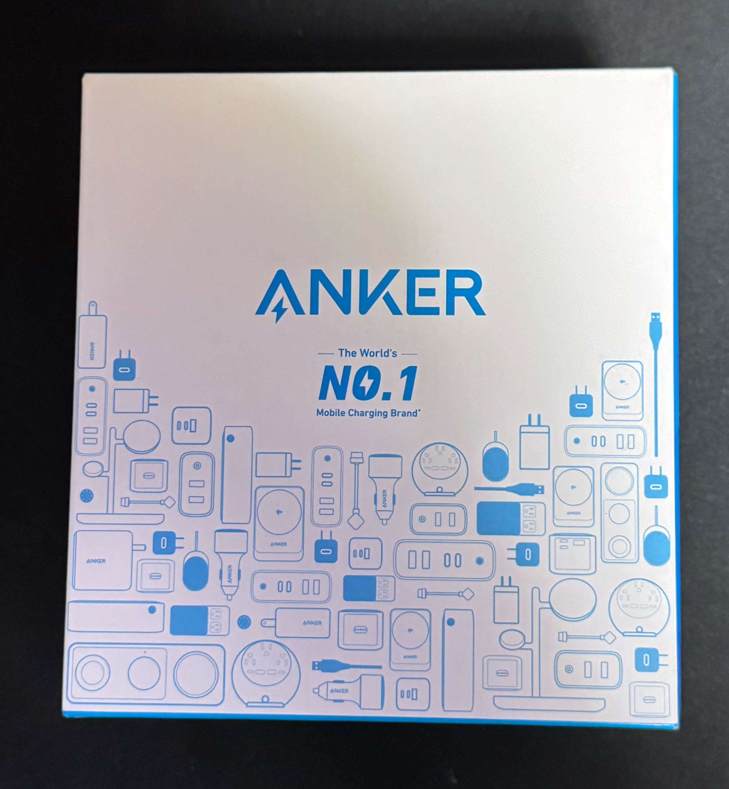
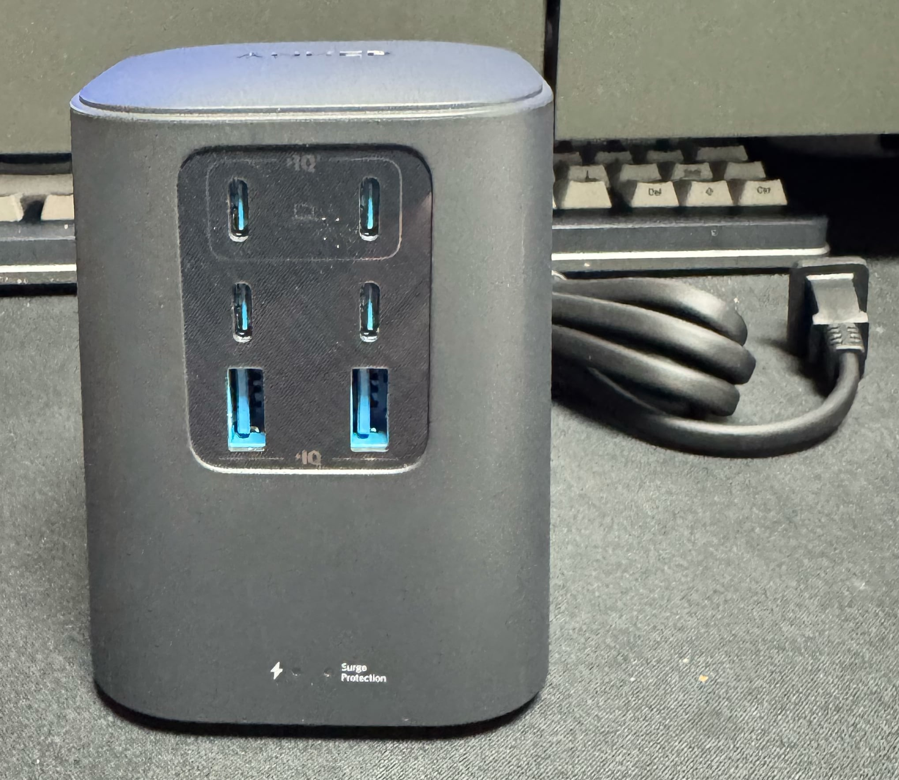
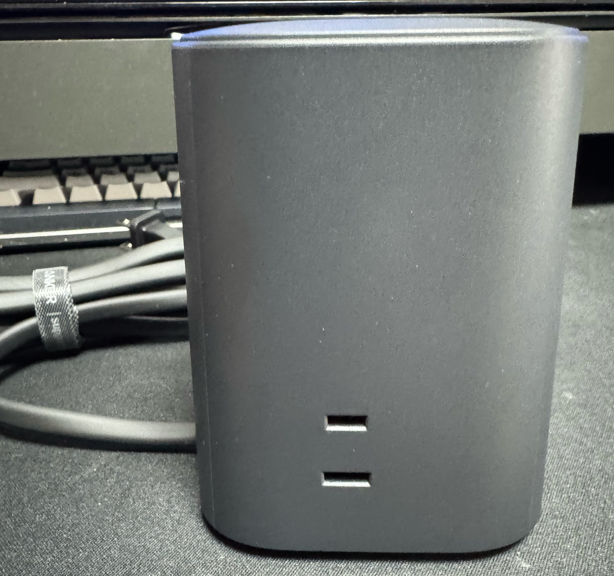

　こんにちは、如月翔也（[@showya_kiss](https://twitter.com/showya_kiss)）です。
　今日は必要に駆られて購入したAnkerのCharging Station(9-in-1,100W)について製品のレビューをしようと思います。
　基本的には充電器の塊なので6000円近くの価格がするのは結構高い印象もあるんですが、今ではちょっと凝った電源タップが3000円くらいするのを考えるとむしろ妥当を通り越してやすいんじゃないかと思っています。
　後でもアフィリエイトを入れますが、先にアフィリエイトを入れておきます。

<!--!

  <a href="https://amzn.to/4lhp5nh" target="_blank" rel="noreferrer noopener nofollow" style="text-decoration: none; color: inherit;">
    
    
Anker Charging Station

    
6,990 円

    
Amazonで購入

  </a>

!-->

## Anker Charging Station（9-in-1,100W）を購入した経緯

　僕は電動昇降式のパソコンデスクを使ってパソコン作業をしているのですが、一応開発者の端くれとしてMacだけではなくWindowsも（ゲーム機として遊ぶためについでに高性能なものを）Ubuntuも用意しており、3台ともノートパソコンで、それに対して全てクラムシェルの設定を行って27インチのゲーミングディスプレイを2台ディスプレイアームで浮かせて使っているんですが、それに加えてスイッチ2を片方のディスプレイに繋げたり、ヘッドホンを吊るして充電したり、検証用のiPhoneやiPad miniやGalaxy z Fold6を常に充電せねばならず、デスクに置いてある充電を要するデバイスが異様に多いんですよね。
　しかしパソコンデスクについているコンセントは2つしかなく、各種デバイスはデスク自体が電動昇降するので他の配線から電気を取るとデスクを上げた時にケーブルが抜けたりデスクをおろした時にケーブルを噛んだりするので基本的に全部のデバイスをデスク上の2個のコンセントから取らなければならなかったのです。
　そこでケーブル付きの電源タップで電源を増設すると場所を取る上に余計なケーブルが増える事で絡まるリスクがあるため、ケーブルのない三又タップを合体させて電源を取っていたのですが、百均で買った安物だったのが悪かったのか、無理なタコ足配線を行ったのが原因か、とにかく繋げチエル電源タップの2箇所でコンセント部分で焦げが発生し、これは放置すると近々火事になるので配線をちゃんとする必要があったのです。
　理想を言うとコンセントに刺すのはほとんどUSBケーブルでデバイスを給電するためのUSB電源なので、これをすっきりさせてかつ3つくらいコンセントがあれば十分だな、という考えに至った結果、Anker Charging Station（9-in-1,100W）がUSB-Cが4ポート、USB-Aが2ポート、コンセントが3つあり、かなり理想に近い製品だと考えたので導入したのです。

## 外観

　せっかく購入したのでボックスから実物まで一応写真を取っております。ただし、私は「#写真下手くそ部」なので魅力を伝えきれない写真で申し訳ないです。

　Ankerさんは昔はあんまり有名じゃなかったんですが、今は本当に垢抜けて洗練されて一流メーカーとして素敵な製品を出していますし、箱も綺麗ですよね。

　汚い写真で申し訳ないです。正面にはUSB-C急速充電対応が2ポート、USB-Cが2ポート、USB-Aが2ポートあり、USBだけで6ポートあります。
　かなり便利です。今僕の家にあるデバイスはまだUSB-Aのものが多いんですが、USB-Cに変換するケーブルを使えば問題ありません。
　ただ、恐らくなんですが安価に入手できる「USB-AtoUSB-Cドングル」は横は干渉しないと思うんですが多分縦は干渉するので、ドングルに寄る変換ではなくケーブルレベルで変換する方が良さそうに思います。

　一側面だけ見せれば十分だと思いますので、左側面だけ写真をお送りします。このようにシンプルにコンセントが右側面・後ろ・左側面の3つあります。

## Anker Charging Station（9-in1,100W）の良い点

　Anker Charging Station（9-in1,100W）の良い点は、まずUSBが6口あるので、USBによる充電が必要なアイテムが相当数充電できる点です。
　その気になればMacBookAirレベルは充電できますし、それは別で充電するとしても、iPhone・iPad・Apple Watch・USB充電のAndroid・USB充電のヘッドホン・ディスプレイ前に置くサウンドバーへの給電が表一面ででき、これだけあれば基本的にデバイスへの給電で困る心配がありません。
　また、右側面・裏・左側面にあるコンセントについても、写真を見て頂くとわかるんですが「横向き」についているんですね。これが縦向きについていると何らかのACアダプタを差した場合下方向にケーブルを出せないのでケーブルが上向きに生える結果になり美しくない上に結局そこから曲げて下に戻してまとめる必要が発生するのでその点非常に考えられており、また使うACアダプタが縦に長いタイプでもコンセントが横向きであるため右側面は裏にはみ出させ、裏は左側面にはみ出させ、左側面は表にはみ出させれば全く干渉しないので非常に使い勝手が良いです。

## Anker Charging Station（9-in1,100W）の悪い点

　Anker Charging Station（9-in1,100W）については悪い点と言うか、結局これはケーブル付きタップの親玉なので、先に書いた「ケーブル付きタップはケーブルが1本増えて絡むので面倒臭い」という点は完全に解消しないです。
　ただ、今まであちこちから生えていたUSBケーブルが一方向にまとめて伸びてこれは絡む事がないので、ケーブルが1本増える事で他のケーブルが勝手に整理されるので、そういう意味ではケーブル自体は増えているのですが問題にはならないかな、とは思います。
　他に問題になるとしたら、ケーブル付きタップと違って高さがある製品なので、うまく置く場所がないと困るな、という点です。僕はデスクのコンセントの周囲には浮かせたディスプレイしかないので、その場所にAnker Charging Station（9-in1,100W）を設置して使っていますが、もう1個増やそうと思った時には置く場所がないのでその点は結構キツいと思うんですが、デスクの上にAnker Charging Station（9-in1,100W）が2つ必要という環境は相当な極めし者だと思うので、そういう人でもなければ特に問題ないんじゃないかと思います。

## 個人的な満足度

　結局延長ケーブル付きタップの親玉なのであって便利、なくて不便を感じる製品ではないので恩恵を感じづらいんですが、ケーブルの整理やコンセントの管理、特にコンセントに焦げができるような配線を使っているのであればこれに乗り換える事で安全が買えますし、結局使ってみると今までケーブルの取り回しで結構毎日イライラしていたのが解消したので、手に入れた瞬間「便利！」「最高！」という製品ではないんですが、持っていて地味に嫌な思いをしなくて済んでいるので、個人的にはかなり満足しています。

## こういうタイプの人にはお勧めです

　パソコンデスクで作業する時間が長く、デスクでいろいろなデバイスを充電しなければいけないのにコンセントが少なくて難儀している人にはとてもお勧めです。
　同じ機能と言うか、USBポート6つとコンセント3個は百均のアイテムを組み合わせれば同じ機能を持った構成を組める事は組めますし、その方が恐らく安く済むんですが、Anker Charging Station（9-in1,100W）のようにスマートで場所を取らない形ではなく、タコ足配線の上にスパゲッティ状態のコードがのってどこかでコンセント口が焦げて最終的にはいつか火事になるとてもおすすめできない違法建築（比喩ですよ）になるので、安全とスペースを考えると値段としては妥当というか、むしろAnkerさんお得意の本来の価値より幾分安く売ってくれる戦略な感じなので、今デスク周りの整理の必要性を感じている人にはお勧めです。

## レビューの点数としては

　個人的には手に入れた時点では5段階評価で4かな、と思っていたんですが、使っていてじわじわと良さを感じてきており、今評価するなら5段階評価で5で間違いないです。素晴らしい製品だと思います。
　ですので、皆さんにもお勧めします。

　という訳でもう一度アフィリエイトを貼ります。
<!--!

  <a href="https://amzn.to/4lhp5nh" target="_blank" rel="noreferrer noopener nofollow" style="text-decoration: none; color: inherit;">
    
    
Anker Charging Station

    
6,990 円

    
Amazonで購入

  </a>

!-->

　非常に良い製品なのでお勧めです。